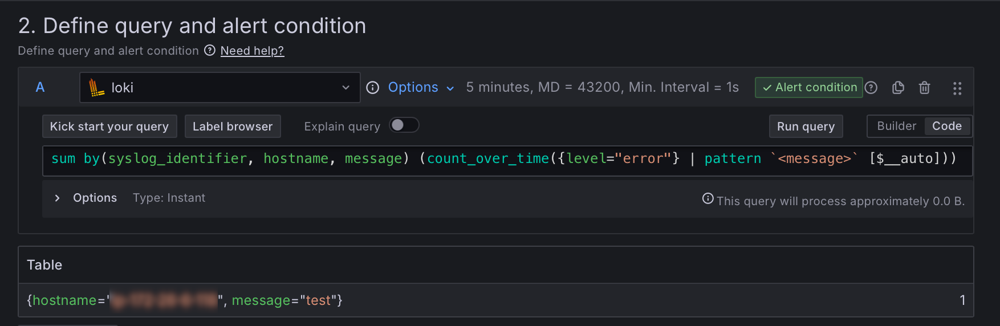
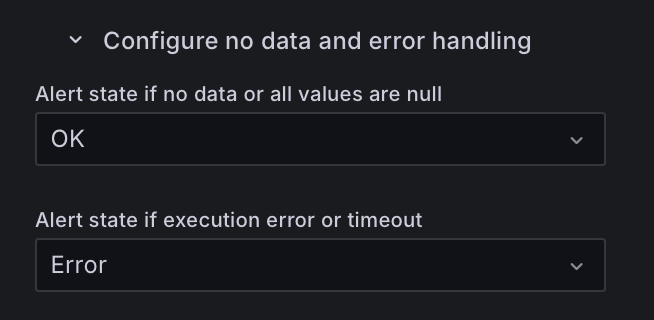
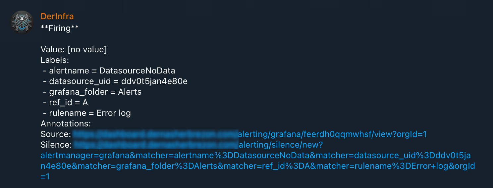
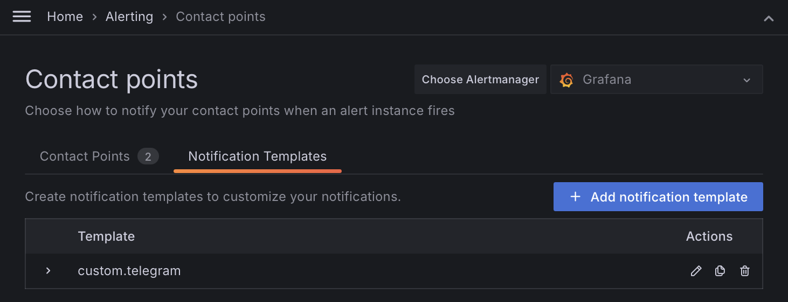
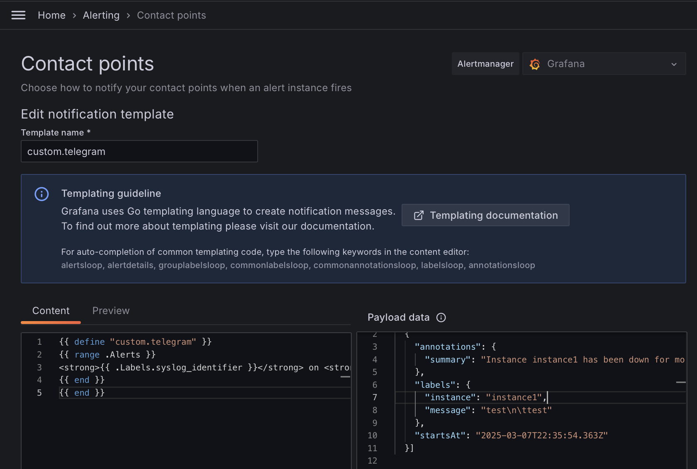
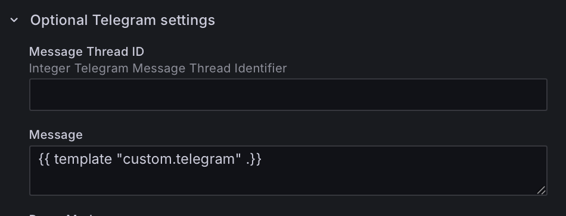
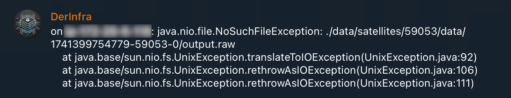

В [прошлой статье]() я настроил отправку логов в Loki и отображение в Grafana. Интеграция работает отлично, и следующим логичным шагом будет отправка ошибок на телефон. Из-за того, что все мои сервисы отправляют ошибки только в случае реальных ошибок, таких нотификаций не должно быть много и можно попробовать отправлять напрямую без дополнительных фильтров.

## Настройка Grafana

Оповещения в Grafana работают по следующему принципу: необходимо сконфигурировать запрос к datasource, который должен вернуть число. В противном случае будет ошибка:

```
[sse.readDataError] [A] got error: input data must be a wide series but got type long (input refid)
```

Если для метрик такое поведение вполне логичное, то вот для того, чтобы вернуть лог придётся постараться:

```
sum by(syslog_identifier, hostname, message) (count_over_time({level="error"} | pattern `<message>` [$__auto]))
```

Это птичий язык запросов, который используется в Loki. В нём выбираются все записи, у которых level=error. После этого всё сообщение целиком матчится паттерном и записывается в capturing group - message. В результате эта capturing группа попадает в атрибуты. А далее идёт подсчёт таких сообщений за единицу времени и группировка по нужным полям. Это сделано для того, чтобы не отправлять несколько одинаковых ошибок.



Помимо запроса, нужно задать:

 * Папку, в которой это правило будет лежать. Это обязательное поле. Наверное, полезно при большом количестве правил
 * Как часто запрос нужно выполнять. В моём простом случае достаточно пяти минут.
 * Что делать, если данных нет или datasource недоступен.
 
Последний пункт достаточно важный, потому что Grafana будет генерировать событие DatasourceNoData, когда нет данных. В моём случае данные есть всегда, но почему-то я получал это событие несколько раз в день.




Далее нужно сконфигурировать "Contact point". Это канал, в который будут отправляться сообщения по определённому фильтру. Для больших организаций имеет смысл настроить разные контакты для разных приложений. Для простых случаев достаточно сконфигурировать один.

## Telegram

На момент написания статьи Grafana могла отправлять сообщения в 20 различных систем, включая email. Но email - это уже прошлый век. Да и надёжность доставки у него так себе. Из всего этого списка у меня есть только Telegram, поэтому я использую его.

В документации есть [отличная статья](https://grafana.com/docs/grafana/latest/alerting/configure-notifications/manage-contact-points/integrations/configure-telegram/) как настроить Telegram. Инструкция достаточно длинная, но рабочая. Я бы хотел немного остановится на шаблоне сообщения.



По-умолчанию, сообщение содержит много бесполезной информации: какие-то ссылки, ненужные атрибуты и очевидные вещи вроде "**Firing**". Для того, чтобы поменять шаблон нужно его сначала создать в разделе "Contact points":



Шаблон пишется на языке [text/template](https://pkg.go.dev/text/template) с небольшим [расширением команд](https://grafana.com/docs/grafana/latest/alerting/configure-notifications/template-notifications/reference/), специфичных для Grafana. Это достаточно популярный язык шаблонов go, который используется, например, в hugo. 

В Grafana есть удобный редактор, который позволяет посмотреть результат после применения шаблона к тестовому сообщению.



Я создал минималистичную версию сообщения, в которой есть информация о том, на каком сервере произошла ошибка, в каком приложении и, собственно, текст ошибки:

```go
{{ define "custom.telegram" }}
{{ range .Alerts }}
<strong>{{ .Labels.syslog_identifier }}</strong> on <strong>{{ .Labels.hostname }}</strong>: {{ .Labels.message | reReplaceAll "\\\\n" "\n" | reReplaceAll "\\\\t" "    " }}
{{ end }}
{{ end }}
```

Из интересного: 

 * Grafana группирует несколько ошибок в одно сообщение, поэтому шаблон получает на вход список Alerts.
 * Поддержка многострочных ошибок

После того, как шаблон готов, его можно использовать в настройках Telegram:



## Тонкая настройка

Чем больше всего происходит на серверах, тем больше вероятность того, что потребуется более тонкая настройка. В какой-то момент мне стало приходить по 12 сообщений за ночь. Это примерно на 12 сообщений больше, чем я получал в обычные дни. Надо быть готовым к тому, что потребуется несколько дней, чтобы почистить ложные срабатывания. Например, мне часто приходили ошибки следующего вида:

```
error: kex_exchange_identification: client sent invalid protocol identifier "MGLNDD_xx.xx.xx.xx_22"
```

Или

```
error: kex_exchange_identification: Connection closed by remote host
```

Если к серверу нет доступа извне, то это явные ошибки, которые нужно исследовать. В моём же случае - это, скорей всего, сканер портов и попытки взломать сервер по ssh. Поскольку это обычное дело, то уровень логирования должен быть INFO, а не ERROR. Это можно поправить в настройках fluent-bit:

```
[FILTER]
    Name modify
    Match host.ssh.service
    Condition Key_value_matches message kex_exchange_identification
    Set level info
```

## Результаты

В результате мне начали приходить вот такие симпатичные сообщения:

