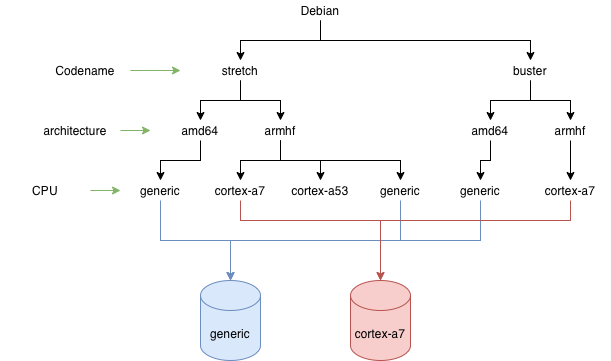
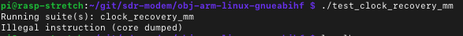

Interesting fact - all applications located in the standard Debian or Ubuntu repositories are compiled with default options. This leads to interesting consequences. For example, programmers do not use SIMD instructions and rely on the compiler. The compiler cannot always optimize the code for a specific processor. As a result, all the super-fast capabilities of processors and incredible SIMD operations are not used.

Debian developers explain this feature by stating that [enabling support for extended registers does not provide significant acceleration](https://wiki.debian.org/ArmHardFloatPort/VfpComparison#NEON). And often, this is true. Developers will not write assembly code to optimize applications for a specific processor. Moreover, not many applications need it. And even if you write more optimized code, it's unclear how to deliver it to the user. It becomes a vicious circle: operating systems have no incentive to maintain binary package infrastructure to improve performance by 5-10%. And developers will not write optimized code because there is no infrastructure.

Nevertheless, there are separate libraries that are optimized specifically for different processor versions and make the most of their capabilities. For example, [volk](https://www.libvolk.org) provides a set of functions optimized for digital signal processing. If the processor supports an optimized implementation and such an implementation is written, volk chooses it. If not, a simple C implementation is used. So, there is no need to write code for each type of processor. This is good, but there remains another problem - the distribution of such libraries.

I solved this problem last week. However, before moving on to the solution, it is necessary to understand "how does the distribution of APT packages work?"

## APT Repositories


I will try to describe the Debian repository scheme, but this works exactly the same for Ubuntu. So, each distribution has a code name. This code name is given to different versions of the operating system. In the context of compilation, this means that different versions will have different versions of GCC and different versions of libc. This often implies that a package compiled in one version of the operating system may not work in another. Sometimes this is not the case, but generally, it is advisable to build the package for each OS version.

Each OS version has a list of architectures it supports. In the diagram above, I only listed two: armhf and amd64. In reality, Debian supports many more. The architecture in the context of application compilation is an averaged processor type. For example, amd64 includes all 64-bit processors, not just those from AMD. The same goes for armhf. armhf is a "regular" 32-bit processor on the ARM architecture.

To have binary applications for each processor, you need to go even further and add another level.


Separate repositories can be created for different versions of ARM processors: cortex-a7, cortex-a53, etc. You also need to have some common "generic" version. This is in case the CPU is not supported. Each package must be built for different processors and with default parameters for the "generic" version. On the client side, connecting a CPU-specific repository could be done like this (pseudocode):

```
deb http://s3.amazonaws.com/r2cloud/cpu-$(lscpu model or generic if not supported) $(lsb_release --codename --short) main
```

Unfortunately, standard APT repositories do not support such detailed logical separation, so it can be done at the physical level. It's enough to create several different repositories under different URLs. It could look like this:



So, there are several physical repositories, each of which contains:

 * several OS versions
 * several architectures
 * only one type of processor
 
The good news is that there are not so many types of processors. The doubly good news is that there are not so many applications optimized for multiple processors. It turns out that such repositories would be relatively small.

## GCC Flags

In [my previous article](), I described the compilation options for the very first Raspberry Pi, which has the ARM arm1176jzf-s processor. However, other versions of Raspberry Pi contain different processors. That's why code compiled for one processor will not run on another:



By the way, compilation flags for ARM processors must be specified because GCC does not include support for NEON extended registers by default. However, for Intel x86_64, it's not necessary to include them because they are available by default. Here is a list of flags that need to be included for different versions of Raspberry Pi.

<table>
	<thead>
		<tr>
			<th>Raspberry pi</th>
			<th>Flags</th>
		</tr>
	</thead>
	<tbody>
		<tr>
			<td>Raspberry pi 1B</td>
			<td>-mcpu=arm1176jzf-s -mfpu=vfp -mfloat-abi=hard</td>
		</tr>
		<tr>
			<td>Raspberry pi 2 model B</td>
			<td>-mcpu=cortex-a7 -mfpu=neon-vfpv4 -mfloat-abi=hard</td>
		</tr>
		<tr>
			<td>Raspberry pi 3</td>
			<td>-mcpu=cortex-a53 -mfpu=neon-fp-armv8 -mfloat-abi=hard</td>
		</tr>
		<tr>
			<td>Raspberry pi 4</td>
			<td>-mcpu=cortex-a72 -mfpu=neon-fp-armv8 -mfloat-abi=hard</td>
		</tr>
	</tbody>
</table>

## Implementation

After figuring out how to build and distribute binaries across different repositories, the next step was to implement it. For different APT repositories, I created several S3 buckets. Each of them contains only binaries specific to a particular processor. As a result, the [r2cloud](https://leosatdata.com/apt) project now has two types of repositories:

 * http://s3.amazonaws.com/r2cloud - contains applications that are not critical to the processor type. There is still a division into armhf and amd64.
 * http://s3.amazonaws.com/r2cloud/cpu-* - these repositories contain applications compiled for specific processors.
 
To build applications for a specific processor type, I wrote a small bash script. In it, the processor architecture is determined (armhf or amd64):

```bash
CURRENT_ARCH=$(dpkg --print-architecture)
```

After that, the list of supported processors:

```bash
if [ "${CURRENT_ARCH}" = "armhf" ]; then
	supported_cores="arm1176jzf-s cortex-a53 cortex-a7 cortex-a72 generic"
elif [ "${CURRENT_ARCH}" = "amd64" ]; then
	supported_cores="generic"
else
	echo "unknown arch: ${CURRENT_ARCH}"
	exit 1
fi
```

If the application needs to be built depending on the processor (all), the build is started for each of the processors. If not (one), the application is built for the standard repository:

```bash
if [ "${CORE_BUILD}" = "all" ]; then
	for i in ${supported_cores}; do
		build_core $i
	done
elif [ "${CORE_BUILD}" = "one" ]; then
	build_core
else
	echo "unknown core_build: ${CORE_BUILD}"
	exit 1
fi
```

## Results

As a result, the build process takes a little more time. To scale further, something more serious than a regular bash script is needed. This is sufficient for my needs and allows for a significant simplification and acceleration of applications on the Raspberry Pi. The board itself is not very fast, so such optimization is extremely important.

Now I have infrastructure for delivering applications depending on the processor. Potentially I can extends this even further to support such exotic things GPU. Raspberry Pi contains VideoCore IV graphics core, which can multiply matrices and vectors very quickly. And this is extremely useful for digital signal processing.
