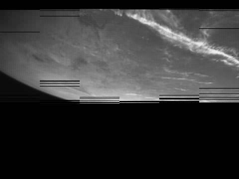
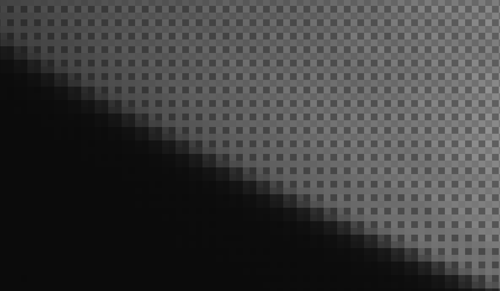
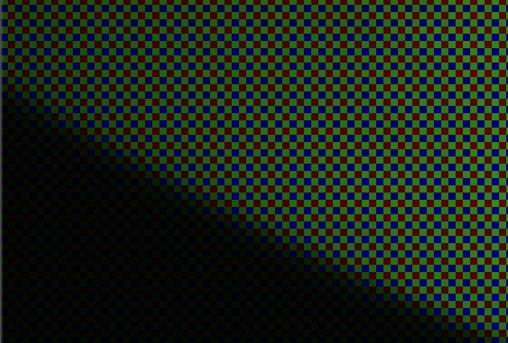
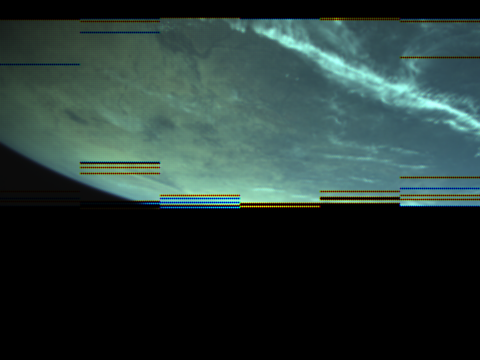

## Введение

Недавно я обнаружил, что спутник [RoseyCubesat-1](https://db.satnogs.org/satellite/LLCB-4532-4867-8038-3417) отправляет изображения из космоса и, конечно же, мне захотелось их декодировать. К сожалению, официального описания формата я не нашёл. Зато нашёл вполне [работающий декодер на GitHub](https://github.com/radio-satellites/RoseyCubesat-1-tools/tree/main). Пакеты с камеры имеют тип 0xA40C и отлично встраиваются в уже существующий декодер: [RoseyCubesatBeacon](https://github.com/dernasherbrezon/jradio/blob/9c51c5113ff2c719eb480ddf5df12e9c2fad0404/src/main/java/ru/r2cloud/jradio/roseycub/RoseyCubesatBeacon.java#L9).

Каждый пакет со спутника содержит:

<table>
	<thead>
	<tr>
		<th style="width: 20%">Название</th>
		<th style="width: 20%">Размер (байт)</th>
		<th>Описание</th>
	</tr>
	</thead>
	<tbody>
		<tr>
			<td>sequenceId</td>
			<td>2</td>
			<td>Всегда 0. Можно игнорировать</td>
		</tr>
		<tr>
			<td>isPreview</td>
			<td>1</td>
			<td>Позволяет понять изображение - это небольшое превью размером 48х36 или полноценное - 480х360</td>
		</tr>
		<tr>
			<td>elementId</td>
			<td>2</td>
			<td>Порядковый номер пакета в изображении</td>
		</tr>
		<tr>
			<td>data</td>
			<td>80</td>
			<td>Массив байт с данными изображения. Каждый байт - это пиксель</td>
		</tr>
	</tbody>
</table>

Конечно, протокол не такой совершенный, как [ssdv](), но он и не настолько примитивный, как в [1kuns-pf](). Благодаря передаче пикселей "как есть", возможно восстановление изображения, даже если потеряно один или несколько пакетов. Это особенно важно для кубсатов со слабым сигналом.

Если получить несколько пакетов, отсортировать по порядковому номеру, то получится вполне неплохой результат:

Однако, если присмотреться поближе, то можно увидеть странные артефакты:

Так выглядит результат работы [фильтра Байера](https://ru.wikipedia.org/wiki/Фильтр_Байера). 

## Фильтр Байера

Фильтр Байера используется для того, чтобы уменьшить размер изображения, не сильно ухудшая его восприятие. Идея заключается в том, что для каждого пикселя можно передавать не 3 байта (RGB), а только один определённого цвета. Какой именно цвет передавать зависит от специального шаблона. Изображение разделяется на небольшие области 2х2 пикселя. Далее в зависимости от положения пикселя и выбранного шаблона выбирается нужный цвет. Бывает 4 шаблона:



Вопрос со звёздочкой: Почему зелёного в два раза больше, чем красного и синего? 

Если восстановить цвет согласно положению пикселя в шаблоне, то получится следующее:

Значительно лучше! Можно отчётливо видеть разные цвета и переходы. Изображение явно не чёрно-белое. При увеличении видно, что пиксели просто раскрашены согласно шаблону с разной интенсивностью:

Следующим этапом будет интерполяция цветов. Вместо того, чтобы брать только зелёный согласно шаблону, можно посчитать значение красного и синего для этого же пикселя как среднее между соседними пикселями этого же цвета. Например, для шаблона BGGR:



Если применить интерполяцию, то получится отличный результат:

Кстати, если попробовать другой шаблон, то всё изображение приобретёт другой оттенок.

## Высококачественная интерполяция

[Группа исследователей](https://stanford.edu/class/ee367/reading/Demosaicing_ICASSP04.pdf) предположила, что интенсивность каждого пикселя может зависить не только от соседних пикселей того же цвета, но и от цвета других. И в качестве региона для интерполяции  предложила использовать область 5х5 пикселей. Помимо этого каждый пиксель нужно брать с определённым коэффициентом.



То ли лыжи не едут, то ли я неправильно что-то закодил, но разницы особо не видно.



В итоге я решил остановится на простой интерполяции, так как она даёт более гладкий градиент между соседними пикселями.

## Результат

[Декодер изображения](https://github.com/dernasherbrezon/jradio/blob/9c51c5113ff2c719eb480ddf5df12e9c2fad0404/src/main/java/ru/r2cloud/jradio/roseycub/RoseyPictureDecoder.java) получился достаточно простой, без лишних зависимостей вроде OpenCV и делает то, что надо. Из того, что можно улучшить и добавить:

 * альфа-канал. Пропущенные пакеты неплохо было бы делать прозрачными
 * протестировать на превью-изображениях. Я долго искал подобные изображения в данных из Satnogs, но ничего не нашёл
