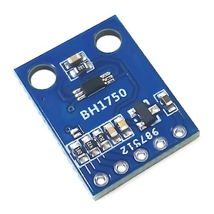
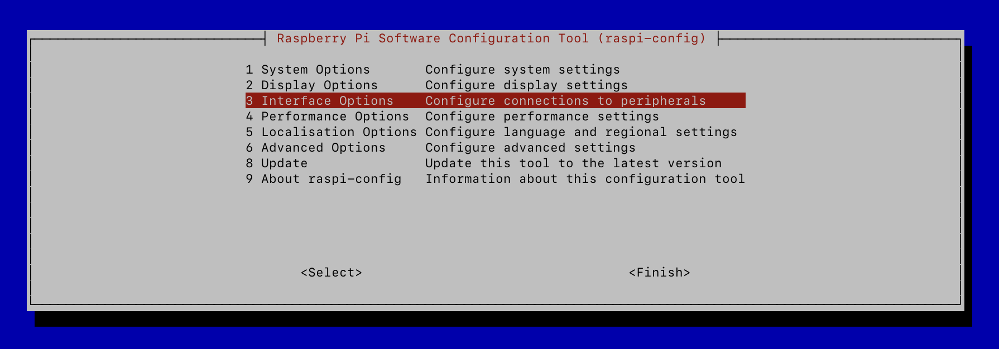
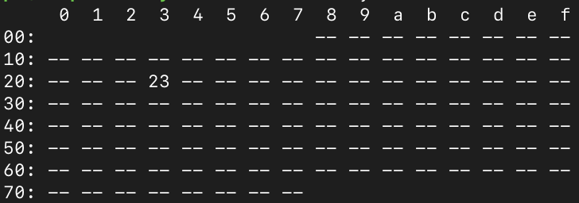

## Введение

Анализируя графики моей солнечной панели, я обнаружил, что мощность иногда падает практически до нуля. В попытках разобраться в чём же дело, я придумал несколько гипотез. Одна из гипотез заключалась в том, что облако пролетает над солнечной панелью и вызывает резкие изменения в показаниях. Для того, чтобы доказать эту гипотезу, я решил поставить датчик освещённости и в течении дня собирать данные. Если это действительно облако, то освещённость будет падать.

В качестве датчика освещённости я выбрал крайне распространённый BH1750.



Под рукой у меня оказался raspberrypi и я решил подключить его обычными проводами.

## Конфигурирование raspberrypi

Внутри датчика есть АЦП, который преобразует освещённость в цифровое значение в люксах и может отдавать по протоколу [I2C](https://en.wikipedia.org/wiki/I²C). В raspberrypi необходимо включить поддержку I2C в системном меню:

```
sudo raspi-config
```

Далее выбрать ```Interface Options -> I2C -> Enable```.



Если всё прошло успешно и датчик подключён правильно, то можно проверить состояние командой:

```
i2cdetect -y 1
```



Если такой программы нет, то её можно установить:

```
sudo apt-get install -y i2c-tools
```

На скриншоте выше видно, что датчик подключен корректно и доступен по стандартному адресу 0x23. По I2C можно подключить несколько разных устройств паралелльно и у каждого будет свой адрес.

## Считывание данных

Если поискать в Интернет программы для работы с таким датчиком, то почти все результаты будут для Arduino. Мне удалось [найти программу](https://github.com/adafruit/Adafruit_CircuitPython_BH1750) написаннную на разновидности Python - CircuitPython. После небольших приседаний мне удалось заставить её работать, но это же Python! Хочется чего-нибудь более легковесного. 

Спустя некоторое время мне удалось найти [драйвер для этого датчика](https://github.com/torvalds/linux/blob/master/drivers/iio/light/bh1750.c) в ядре Linux! Но по-умолчанию, этот драйвер не включен в raspberrypi, а значит придётся пересобирать модуль для ядра и вручную его подгружать. Не очень приятная процедура.

Именно поэтому я решил разобраться, а как же работает I2C, прочитать спецификацию на датчик и самому считывать данные.

## Работа с I2C в Linux

Оказывается работать с I2C в Linux достаточно просто. Для этого есть специальный I2C адаптер-драйвер, который создаёт устройство ```/dev/i2c-1```. С этим устройством можно работать напрямую из userspace. Доступ будет разграничен и синхронизирован. Крайне удобно. В документации к Linux kernel есть [отличный туториал](https://www.kernel.org/doc/html/latest/i2c/dev-interface.html). Основная идея заключается в том, что все I2C-специфичные команды уже реализованы в библиотеке i2c и вызываются вот так:

```c
i2c_smbus_write_word_data(file, reg, 0x6543);
```

Или 

```c
res = i2c_smbus_read_word_data(file, reg);
```

## Чтение спецификации

При реализации своей программы я подглядывал в ядро линукс и в реализацию от Adafruit. Удивительно, но обе реализации неполностью используют возможности датчика!

BH1750 позволяет получать данные в двух режимах:

* одноразовое получение. Алгоритм следующий:
  * отправить команду выбора режима
  * подождать заданное время
  * прочитать данные
  * датчик автоматически отключит питание и перейдёт в спящий режим
* При постоянном получении можно считывать данные следующим образом:
  * отправить команду выбора режима
  * подождать заданное время
  * прочитать данные
  * подождать заданное время
  * прочитать данные

При этом датчик не переходит в выключенное состояние. Чтобы его выключить, необходимо послать специальную POWER_DOWN команду.

Для каждого из этих способов есть 3 способа измерения освещённости:

* низкое разрешение. Достаточно подождать примерно 20мс, чтобы получить данные. Погрешность 4 люкс
* высокое разрешение. Тут уже надо ждать 120-180мс, но данные будут более точные. Погрешность 1 люкс
* высокое разрешение 2. Если честно, то я так и не понял, чем этот режим отличается от "высокое разрешение", кроме того, что этот режим позволяет измерять в 2 раза более точно. Погрешность 0.5 люкс

Идея такого разделения достаточно проста - если ожидается яркий свет, то лучше выбрать низкое разрешение. Ведь в 16 бит поместится больше данных. Если ожидаются сумерки или не очень освещённое помещение, где важна точность, то лучше выбрать высокое разрешение.

Но можно шагнуть ещё дальше. Можно настроить время экспонирования датчика. Если важна точность, то можно увеличить время эспонирования, но при этом получить ещё более точные данные. Например, в режиме "высокое разрешение 2" можно получить погрешность 0.11 люкс. Почти в 5 раз меньше!

## Реализация

Собрав всю эту информацию воедино, я сделал:

[https://github.com/dernasherbrezon/bh1750](https://github.com/dernasherbrezon/bh1750)

Этот репозиторий содержит основные файлы bh1750.c и bh1750.h, которые можно смело копировать в собственные проекты. А также небольшую тестовую программу в main.c.

## Сравнение с аналогами

Сравнивать потребление CPU бессмысленно, потому что само измерение занимает вечность - 180мс. А вот потребление памяти оказалось интересным:

```
PID USER      PR  NI    VIRT    RES    SHR S  %CPU  %MEM     TIME+ COMMAND
1342 pi        20   0   15772   8196   5104 S   0.0   0.9   0:00.23 python3
1315 pi        20   0    1964    380    312 S   0.0   0.0   0:00.01 bh1750
```

Версия на питоне занимает в 20 раз больше памяти!

Ещё я попробовал сравнить потребление электричества, но цифры оказались приблизительно одинаковыми. 

Теоретически датчик должен потреблять больше энергии в режиме постоянного получения данных. Но из-за того, что он потребляет примерно 7 мА, то его влияние сложно оценить на фоне больших скачков от 270 до 300 мА raspberrypi. Возможно, подключив его к Arduino или esp32 в режиме Deep sleep, можно ощутить разницу.