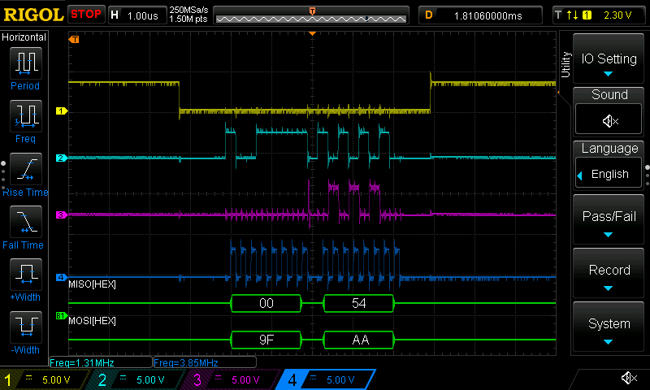

Основное назначение чипа sx127x - это приём и передача данных с помощью протокола LoRa. Однако, помимо этого он может использовать FSK модуляцию. Это сделано для того, чтобы быть совместимым с Европейской [регуляцией частот EU868-870](https://www.thethingsnetwork.org/forum/t/sx127x-rfm9x-supports-fsk-is-it-ever-used/15034/5). Насколько я понял, устройства в сети LoRaWAN могут увеличивать скорость передачи данных в зависимости от различных условий. FSK позволяет передавать на гораздо большей скорости, чем LoRa, но при этом менее надёжно. В любом случае, раз уж такой режим есть, то неплохо было бы добавить его в [sx127x](https://github.com/dernasherbrezon/sx127x).

## Описание проблемы

Конфигурация FSK достаточно сильно отличается от LoRa. И в какой-то момент во время тестирования я заметил, что приёмник получает неправильные данные. Я бы не удивился, если бы приёмник вообще ничего не получал. Но в моём случае устройства находились на расстоянии 10см и передавали сообщение длиной 10байт с контрольной суммой. Спустя несколько недель безуспешных попыток разобраться в проблеме, я выдвинул гипотезу о том, что проблема была не в радио, а в SPI шине. На частоте 8Мгц сигнал искажается, и ESP32 получает неправильные данные.

Как только ко мне в руки попал [ds1054z](), то мне сразу же захотелось посмотреть в чём там дело. И вот, что удалось увидеть:



Жёлтый сигнал MISO сначала передаётся в состоянии "1", но ближе к концу переходит в состояние "0" на половине следующего такта (такт начинается с уровня "0"). ESP32 думает, что уже пошёл следующий бит, и поэтому вместо 0xFF00 считывает 0xFE00.

## Поиск причин

Моя гипотеза подтвердилась и использование пониженной частоты SPI должно помочь. Однако, мне хотелось узнать, а что же происходит при других параметрах. Возможно, я смогу каким-то образом компенсировать проблему и использовать 8Мгц.

### Изменение частоты

Для начала нужно понять насколько сильно частота влияет на ошибку, поэтому я измерил работу на частоте 4Мгц:



А потом на частоте 2Мгц:



Как видно, чем меньше частота, тем меньше ошибка. При 4Мгц данные принимаются без ошибок, но видно, что небольшая задержка, случайный всплеск, и всё может измениться.

### LoRa модуляция

Далее я решил посмотреть на передачу абсолютно тех же данных, но с помощью LoRa:



Как видно, никакой задержки нет и впомине. При 4Мгц абсолютно такая же картина:



Тут могут быть два объяснения: 

 * либо FIFO очередь в FSK режиме работает медленнее,
 * либо в FSK режиме используется какой-то более медленный блок работы с SPI.

Всё это указывает на проблему в самом чипе.

### Передача других данных

Ещё одной интересной особенностью стало то, что другие данные, например 0xAA00, передаются без ошибок.



Несмотря на то, что сигнал немного запаздывает, данные принимаются корректно. Вот тут у меня закончились идеи. Я бы понял, если бы приём 0xAA был лучше, чем 0xFF - в таком случае какой-нибудь внутренний бит-синхронайзер бы не успевал. Но почему передача данных влияет?

Обычно в таких случаях используют [скремблирование](https://ru.wikipedia.org/wiki/Скремблер) данных, чтобы избежать длинных последовательностей "0" и "1". Однако, [моя библиотека](https://github.com/dernasherbrezon/sx127x) работает на уровне ниже и не может модифицировать данные.

### RaspberryPI

Следующей идеей было посмотреть на работу шины с помощью совершенно другого софтверного стека и другого железа. Для этого я [взял модуль RA-02]() и подключил к Raspberry PI:



Этот график требует небольшого пояснения. В Linux передача идёт с помощью двух транзакций. Сначала транзакция регистра, с которого будет происходить чтение - это одиночное включение частоты слева. Потом уже чтение данных из sx127x. И, судя по графику, Linux или firmware [BCM2711](https://datasheets.raspberrypi.com/bcm2711/bcm2711-peripherals.pdf) добавляют задержку после каждого байта. Этой задержки хватает, чтобы чип поспевал переключиться. С одной стороны - это позволяет надёжно получать 0xFF00, а с другой непонятно сработает ли она на других данных. Например, 0xFE00. Я не стал дальше исследовать, потому что это никак не поможет решить проблему в ESP32.

### Другое

Помимо всего этого, в FSK режиме есть странные всплески при передачи данных от sx127x к мастеру. Это хорошо видно на скриншоте внизу на сигнале номер 3 (малиновый). После того, как мастер передал 0x9F, чип пытается передать что-то, но быстро затухает.

## Выводы

Все мои эксперименты показали, что проблема скорей всего в железе. Внутри [ESP-IDF](https://github.com/espressif/esp-idf) нет параметров, которые бы смогли добавить искусственную задержку. Поэтому решить эту проблему можно следующими способами:

 * уменьшить частоту SPI шины, либо
 * передать скрэмблированные данные