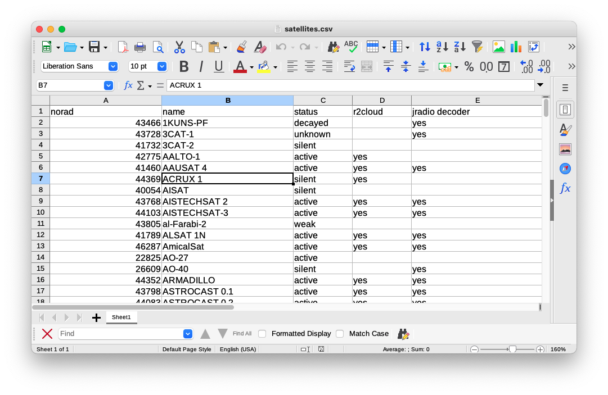
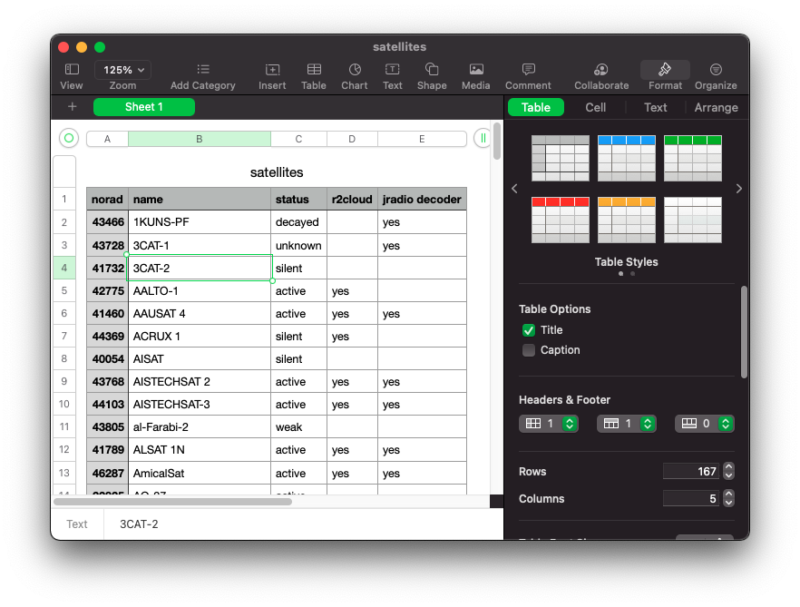
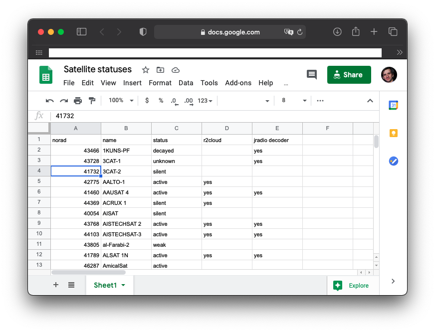
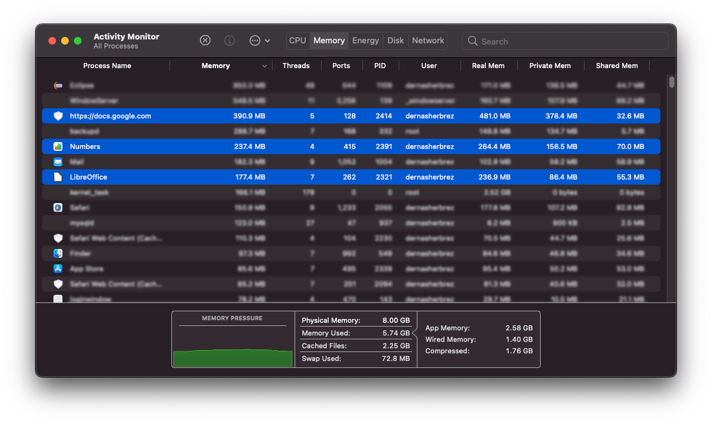
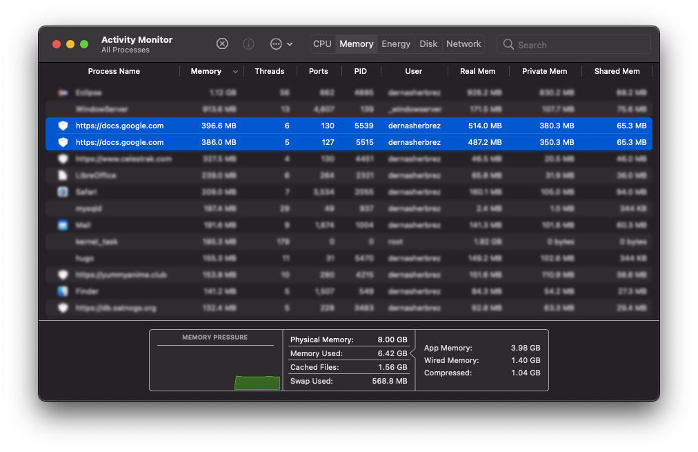

Совершенно неожиданно даже для себя самого я решил сравнить программы для работы с электронными таблицами. Всё началось с того, что мне захотелось проанализировать какие спутники поддерживает [r2cloud](https://github.com/dernasherbrezon/r2cloud), какие можно декодировать с помощью [jradio](https://github.com/dernasherbrezon/jradio), а какие из них активные. Для этого я по-старинке открыл Libre Office и быстренько накидал табличку. После этого, мне захотелось поделиться ею с нашим небольшим сообществом ловцов спутников в twitter. Я её расшарил в [google docs](https://docs.google.com/spreadsheets/d/1II__l9f3wBlXVOt0_3tr06v33V7ORqOQOErSycXabz4), но тут же задумался: а зачем мне нужен Libre Office, если google docs вполне работает?

При этом во всей этой истории меня больше всего заинтересовало потребление памяти. С одной стороны отдельно запускающееся приложение должно загружать все необходимые библиотеки в память и занимать больше, чем страничка в браузере. А с другой стороны, часть этих библиотек может быть shared и уже загружена в память.

## Libre Office

Libre Office как будто пришёл из 90-х. Выглядит старомодно и явно не тянет на родное MacOS приложение. Чего только стоят кривые шрифты, на которые нельзя смотреть без боли и слёз.

Чтобы хоть как-то исправить ситуацию, я решил добавить в сравнение [Numbers](https://www.apple.com/numbers/).

## Numbers

Обычный .csv файл раскрашивается, добавляются нескучные стили и становится сразу понятно - это настоящее MacOS приложение со свистелками. Не очень понятно, как это использовать, но выглядит красиво.

Ну и представитель "нового" мира - Google Docs.

## Google docs

Максимально близко похож на Microsoft Excel. В Safari выглядит хорошо, работает быстро и без ошибок.

## Microsoft Excel 

А как же без самого главного приложения для электронных таблиц? Оно платное, и покупать его для отображения простого .csv как то рука не поворачивается.

## Сравнение потребляемой памяти

Сравнить потребление памяти достаточно просто - нужно лишь запустить Activity Monitor. И вот тут-то меня и ждал сюрприз.

Во-первых, с огромным отрывом победил Libre Office. 177Мб против 237Мб Numbers и 390Мб Google Docs. Несмотря на то, что приложение неродное для MacOS, оно работает достаточно быстро и потребляет минимальное количество памяти.

Во-вторых, Shared memory в Numbers больше всех. 70Мб против 55Мб Libre Office и 32Мб Google Docs. Здесь явно видно, что ребята из Apple действительно переиспользовали очень много стандартных библиотек и оптимизировали их загрузку. Тем не менее, этого не хватило, чтобы само приложение было лёгким.

В-третьих, я крайне разочарован результатом Google Docs. Я ожидал, что Safari уже загрузил 99% необходимых библиотек и для отображения ещё одной странички Google Docs он будет использовать совсем чуть-чуть памяти. Однако, на практике одна только страница Google Docs занимает почти 400Мб.

Я попробовал запустить ещё одну вкладку с Google Docs в надежде получить чуть больше переиспользования уже загруженной памяти. Но Google docs по-прежнему отъедает стабильные 400Мб памяти.

## Выводы

Не стоит судить о приложении по его обложке.