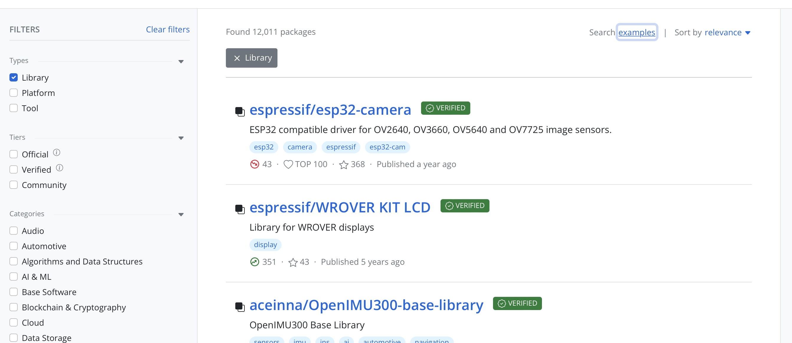
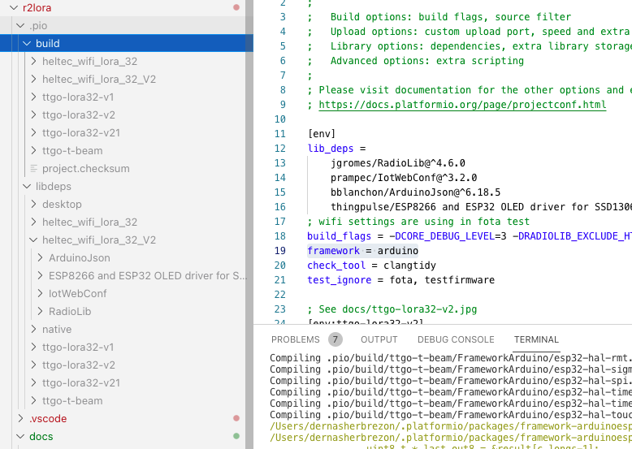
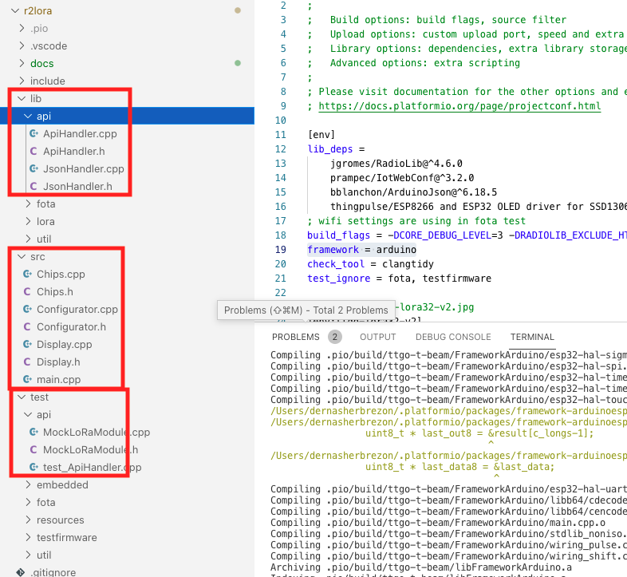
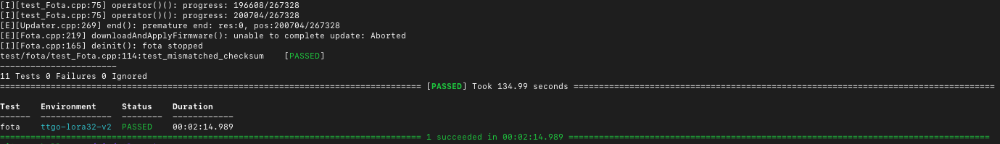

In the [previous post]() I described the general design of r2lora and selected tools for development. Now we can focus on configuring the project and breaking it down into individual modules. [PlatformIO](https://platformio.org) integrates well with a variety of different tools and allows you to do complex things almost as easily as in Java.

## Dependency Management

A challenge in every C/C++ project is dependency management. There is no standard way to handle this in the language and ecosystem. Everyone does it in their own way. The well-known tool in certain circles is [Conan](), but it lacks a wide range of libraries. Operating systems have libraries, but they are not suitable for microcontrollers, and their versions are determined by the operating systems, not the applications.

PlatformIO has its own library repository, which is conveniently integrated into the platform.



Here, you can filter libraries by microcontroller type, framework, purpose, and many other parameters. This is incredibly useful because there are a great variety of microcontrollers, all of which are different. Different architectures, different sets of registers, different memory sizes. The fact that PlatformIO takes this into account from the start allows you to somehow deal with the chaos.

To add a dependency to the project, you need to write the following:

```
[env]
lib_deps = 
	jgromes/RadioLib@^4.6.0
	prampec/IotWebConf@^3.2.0
	bblanchon/ArduinoJson@^6.18.5
	thingpulse/ESP8266 and ESP32 OLED driver for SSD1306 displays@^4.2.1
```

This adds 4 libraries:

 * [jgromes/RadioLib](https://github.com/jgromes/RadioLib) - a library for working with the LoRa chip. It provides a universal interface for sending and receiving data and hides some of the implementation details of the chips.
 * [prampec/IotWebConf](https://github.com/prampec/IotWebConf) - a library for configuration. It sets up an access point, stores system configuration in non-volatile memory, and handles the initial configuration of the system.
 * [bblanchon/ArduinoJson](https://github.com/bblanchon/ArduinoJson) - JSON serialization and deserialization.
 * [thingpulse/ESP8266 and ESP32 OLED driver for SSD1306 displays](https://github.com/ThingPulse/esp8266-oled-ssd1306) - a convenient library for working with the built-in display.

All dependencies are simply downloaded from the git repository and placed in a special folder inside the project. Essentially, this is very similar to working with dependencies in npm. These dependencies are compiled as part of the project into a single binary - firmware.bin, which is then flashed to the microcontroller. If certain library functions are not used, they do not end up in the final distribution. This is especially relevant for microcontrollers, as their memory size is usually small. For example, the [TTGO LoRa32-OLED V2](https://docs.platformio.org/en/latest/boards/espressif32/ttgo-lora32-v2.html) board has only 4MB of built-in flash memory and 320KB of RAM. And this is considered quite a lot.

## Boards

When it comes to boards, PlatformIO has a special entity - "board." Each board is characterized by the type of processor, clock frequency, RAM size, and many other parameters. If the project plans to support different boards, you just need to declare them in the configuration, and PlatformIO will then build a separate firmware for each of them.

```
[env:ttgo-lora32-v2]
platform = espressif32
board = ttgo-lora32-v2
build_flags = 
    ${env.build_flags}
	-DPIN_CS=18
	-DPIN_DI0=26
	-DPIN_RST=23
	-DPIN_OLED_SDA=21
	-DPIN_OLED_SCL=22
```

In the example above, I declared a configuration ```ttgo-lora32-v2``` that should be used to build the application for the ttgo-lora32-v2 board with additional compilation flags. ```${env.build_flags}``` inherits the common ```build_flags``` configuration from the ```env``` declaration. The other parameters are specific to the particular board. Because each board has fixed pin numbers, they can be declared directly in the configuration.

r2lora supports all boards that use the LoRa chip:

 * [ttgo-lora32-v2](https://docs.platformio.org/en/latest/boards/espressif32/ttgo-lora32-v2.html)
 * [ttgo-lora32-v1](https://docs.platformio.org/en/latest/boards/espressif32/ttgo-lora32-v1.html)
 * [ttgo-lora32-v21](https://docs.platformio.org/en/latest/boards/espressif32/ttgo-lora32-v21.html)
 * [heltec_wifi_lora_32](https://docs.platformio.org/en/latest/boards/espressif32/heltec_wifi_lora_32.html)
 * [heltec_wifi_lora_32_V2](https://docs.platformio.org/en/latest/boards/espressif32/heltec_wifi_lora_32_V2.html)
 * [ttgo-t-beam](https://docs.platformio.org/en/latest/boards/espressif32/ttgo-t-beam.html)
 
Nothing prevents you from manually attaching a [LoRa chip](https://www.amazon.co.uk/SX1278-DRF1278F-Arduino-wireless-module/dp/B079QZXP5D) to the board. In this case, it is sufficient to declare a new environment and specify each of the pins.

Each board can have its own set of libraries and its own build folder:



## Platform and Framework

In addition to boards, PlatformIO has the concepts of platform and framework. The platform usually corresponds to the type of microcontroller. In the case of ESP32, it is espressif32. Sometimes a microcontroller may support different architectures, in which case each of them has its own platform ID. The closest analogy is arm64 or armhf, except that the platform describes a specific chip. I attempted something similar when compiling applications [for specific processors]().

All boards that contain LoRa chips are based on ESP32, so ```platform = espressif32```.

The framework is something like an SDK, usually provided by the microcontroller manufacturer. Typically, with one SDK, you can develop for different models of microcontrollers. Sometimes there are universal SDKs. For ESP32, you can develop using ```framework = espidf``` or ```framework = arduino```.I chose arduino because many libraries are written using the Arduino API. Despite the fact that ESP32 is not directly compatible with Arduino, there is an intermediate layer ```framework-arduinoespressif32``` that converts Arduino API calls into ESP32 calls. It's a bit suboptimal, but ESP32 is powerful enough, and not many people are concerned about it.

## Project Structure

When using ```framework = arduino```, the project should be structured as follows:



Inside the ```src``` folder are the source files and the entry point into the program. Usually, this is the ```main``` with the methods ```void loop()``` and ```void setup()```. You can program in C or C++. However, if some libraries are written in C++ and do not support inclusion from C, you will have to write in C++ (sigh!).

There is also a ```lib```. folder. It should contain small components of the application that need to be tested. It looks like this:

 * PlatformIO will take each subfolder inside ```lib``` and compile it.
 * Link it with the tests.
 * Build firmware.bin.
 * Flash it to the board and get the test results.
 
## Project Testing

PlatformIO allows you to run tests directly on the microcontroller! Tests can be divided into separate test suites, and within each, you can create several unit tests. Each test suite is a separate firmware with a single entry point and is uploaded to the microcontroller in the standard way.

In the screenshot above, I created several test suites:

 * api - testing the REST API interface.
 * embedded (lora) - testing the LoRa module. It's sufficient to start reception and stop it. It checks for the correct pin configuration and chip usage.
 * fota - testing [Firmware-Over-The-Air (FOTA)](https://en.wikipedia.org/wiki/Over-the-air_update). A relatively complex test that is not launched by default. It downloads a new firmware from S3 and applies it.
 * util - testing a small utility class.
 
I didn't bother achieving 80% code coverage with tests (it's not easy to calculate it just like that!), so I tried to test the code as much as possible. Whatever didn't work, well, it didn't work.
 
Each test suite contains several unit tests. To write unit tests, the [unity](https://github.com/ThrowTheSwitch/Unity). library is used. Since a unit test should run only once, the  ```loop``` method should not do anything useful. For example, it can blink an LED:

```c++
void loop() {
  digitalWrite(13, HIGH);
  delay(100);
  digitalWrite(13, LOW);
  delay(500);
}
```

All the logic should be in the ```setup``` method:

```c++
void setup() {
  // NOTE!!! Wait for >2 secs
  // if board doesn't support software reset via Serial.DTR/RTS
  delay(2000);

  UNITY_BEGIN();
  RUN_TEST(test_success_start);
  RUN_TEST(test_no_request);
  RUN_TEST(test_invalid_json);
  RUN_TEST(test_begin_failed);
  RUN_TEST(test_success_stop_even_if_not_running);
  RUN_TEST(test_pull);
  RUN_TEST(test_frames_after_stop);
  RUN_TEST(test_cant_tx_during_receive);
  RUN_TEST(test_invalid_tx_request);
  RUN_TEST(test_empty_tx_request);
  RUN_TEST(test_invalid_lora_tx_code);
  RUN_TEST(test_invalid_tx_data_request);
  RUN_TEST(test_success_tx);
  UNITY_END();
}
```

In the example above, I added several unit tests to the test suite. Each unit test is a separate function:

```c++
void test_success_start(void) {
  ApiHandler handler(&web, &mock, NULL, NULL);
  String output;
  int code = handler.handleStart(VALID_RX_REQUEST, &output);
  TEST_ASSERT_EQUAL_INT(200, code);
  assertStatus(&output, "SUCCESS");
}
```

There shouldn't be anything unexpected here. It's a standard test that you might encounter even in a Java project.

You can run either individual test suites or all of them together.

```bash
pio test --test-port /dev/ttyACM0 -e ttgo-lora32-v2 -f fota
```

As a result, PlatformIO will display various statistics on the screen:



More detailed documentation can be found on the project's website: [unit testing](https://docs.platformio.org/en/latest//plus/unit-testing.html).

## Next Steps

After understanding the project structure well enough, you can proceed directly to the implementation.