## Введение

Все началось с того, что я решил подчистить неиспользуемый код в [jradio](https://github.com/dernasherbrezon/jradio). Оказалось, спутники семейства funcube шлют дополнительные 200 байт в пакете. В зависимости от спутника, там могут содержаться более детальная телеметрия или просто текстовые сообщения с земли. После небольшого исследования выяснилось, что спутник jy1sat использует их, чтобы передавать картинку! Это мгновенно заинтересовало меня, и в следующие несколько недель я не смог спать, думая о том, как её декодировать.
 
Дэниэл в своем блоге [описал](https://destevez.net/2019/04/decoding-ssdv-from-jy1sat/) формат, в котором передаётся эта картинка. Этот формат основан на протоколе [ssdv](https://ukhas.org.uk/guides:ssdv#packet_format) (Slow Scan Digital Video). Если вкратце, то формат позволяет передавать небольшие картинки с помощью пакетной передачи данных. Картинка (в jpeg формате) разбивается на небольшие кусочки, которые передаются друг за другом.

Структура обоих пакетов выглядит следующим образом.

### Funcube пакет

<table>
	<thead>
		<tr>
			<th style="width: 20%">Размер (байт)</th>
			<th>Описание</th>
		</tr>
	</thead>
	<tbody>
		<tr>	
			<td>2</td>
			<td>Заголовок. Содержит id спутника</td>
		</tr>
		<tr>	
			<td>54</td>
			<td>Текущая телеметрия. Различные показатели спутника в текущий момент</td>
		</tr>
		<tr>	
			<td>200</td>
			<td>Полезные данные. В случае jy1sat передаётся SSDV пакет</td>
		</tr>
	</tbody>
</table>

### SSDV пакет

Формат SSDV хорошо описан в [официальной документации](https://ukhas.org.uk/guides:ssdv#packet_format).

<table>
	<thead>
		<tr>
			<th style="width: 20%">Название</th>
			<th style="width: 20%">Размер (байт)</th>
			<th>Описание</th>
		</tr>
	</thead>
	<tbody>
		<tr>	
			<td>Sync Byte</td>
			<td>1</td>
			<td>Байт синхронизации. Может присутствовать для синхронизации потока бит. Непонятно зачем есть в полезных данных jy1sat. Итак, ясно, что jy1sat передаёт картинку и полезные данные уже извлечены из внешнего funcube пакета. Можно было бы сэкономить этот байт</td>
		</tr>
		<tr>	
			<td>Packet Type</td>
			<td>1</td>
			<td>Тип пакета. Используется для определения коррекции ошибок. Если 0x67, то последних 32х байт кода Рида-Соломона нет. Так как funcube пакет уже прошёл коррекцию ошибок, то слать их ещё раз, но в SSDV пакете смысла нет. Тут авторы молодцы - они не шлют их, а также не шлют контрольную сумму. Так как такого типа пакета нет, то они заполняют его значением 0x68</td>
		</tr>
		<tr>	
			<td>Callsign</td>
			<td>4</td>
			<td>Позывной в формате Base40. Опять же, полезное поле для получения SSDV пакетов напрямую с демодулятора. Однако, в данном случае ясно, что это за пакет, поэтому создатели jy1sat не отправляют это поле и экономят 4 байта.</td>
		</tr>
		<tr>	
			<td>Image ID</td>
			<td>1</td>
			<td>ID картинки. Крайне необходимое поле для того, чтобы понять, когда закончилась одна картинка и началась другая</td>
		</tr>		
		<tr>	
			<td>Packet ID</td>
			<td>2</td>
			<td>ID пакета внутри картинки. Используется для того, чтобы понять были ли потеряны пакеты. Если пакет был потерян, то можно вместо него нарисовать чёрный прямоугольник</td>
		</tr>		
		<tr>	
			<td>Width</td>
			<td>1</td>
			<td>Ширина картинки. Измеряется в количестве MCU. Один MCU в SSDV равен 16х16 пикселей. Размеры картинок заранее неизвестны, поэтому их необходимо передавать в каждом пакете</td>
		</tr>		
		<tr>	
			<td>Height</td>
			<td>1</td>
			<td>Высота картинки. Измеряется в количестве MCU</td>
		</tr>		
		<tr>	
			<td>Flags</td>
			<td>1</td>
			<td>Крайне важные флаги. Задают: качество jpeg картинки, флаг последнего пакета в картинке, цветовую субдискретизацию. Об этом более подробно ниже в разделе декодирования</td>
		</tr>
		<tr>	
			<td>MCU offset</td>
			<td>1</td>
			<td>Смещение первого MCU от начала данных. Так как MCU в jpeg может занимать разное количество байт, то некоторые байты могут не поместиться в один пакет и должны будут переехать в следующий. Однако, если один из пакетов потерян, то необходимо знать, где начинается первый MCU и какой у него индекс</td>
		</tr>
		<tr>	
			<td>MCU index</td>
			<td>2</td>
			<td>Индекс первого MCU в этом пакете в общем списке MCU всей картинки. Крайне важен, чтобы определить сколько MCU было пропущено и где начать рисовать текущий</td>
		</tr>
		<tr>	
			<td>Payload</td>
			<td>205 / 237</td>
			<td>Непосредственно данные jpeg. Закодированные последовательно MCU. В случае jy1sat размер 189 байт, так как в funcube пакете полезные данные только 200 байт</td>
		</tr>
		<tr>	
			<td>Checksum</td>
			<td>4</td>
			<td>Контрольная сумма. В jy1sat не передаётся</td>
		</tr>
		<tr>	
			<td>FEC</td>
			<td>32</td>
			<td>Коды Рида-Соломона. В jy1sat не передаётся</td>
		</tr>
	</tbody>
</table>

В принципе, формат пакета достаточно простой и хорошо продуманный. Данных должно как раз хватить на то, чтобы успешно обрабатывать потерянные пакеты, и при этом не передаётся ничего лишнего.

Главное отличие, например, от формата [LRPT](https://en.wikipedia.org/wiki/Low-rate_picture_transmission) - тут нет промежуточного пакета, который бы содержал фиксированное количество MCU. Однако, здесь это и не нужно, так как размер картинки известен в отличие от LRPT.

### Формат картинки

Картинка - это [abbreviated jpeg](). Только, в отличие от классического abbreviated jpeg, здесь есть следующие особенности. Во-первых, совсем нет заголовка и всех таблиц. Для SSDV таблицы квантования и хаффмана заранее зафиксированы в протоколе. Во-вторых, первый MCU в каждом пакете должен быть выровнен по байту. Это прежде всего из-за того, что MCU offset обозначает количество байт. В-третьих, DC значение в первом MCU каждого пакета должно кодироваться относительно нуля. Это сделано опять же из-за того, что пакет может потеряться и, тогда потеряется смещение и нельзя будет восстановить данные.

Я взял таблицы jpeg из [одной реализации](https://github.com/daniestevez/ssdv/blob/master/ssdv.c). Как выяснилось, таблицы Хаффмана стандартные, поэтому я взял их [из Java](https://docs.oracle.com/javase/9/docs/api/javax/imageio/plugins/jpeg/JPEGHuffmanTable.html). Я был сильно удивлён, что они вот так вот объявлены в Java классах. Насколько я понял, JDK использует нативный код, чтобы декодировать/кодировать jpeg.

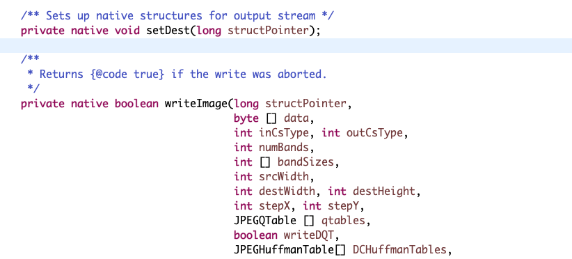

## Декодирование

### Склейка пакетов
 
Прежде, чем декодировать MCU, необходимо склеить пакеты. Как я уже писал, часть последнего MCU в пакете, может быть перенесена в следующий. Но следующий пакет может быть потерян. Всё это нужно учитывать в алгоритме склейки. У меня он получился следующим:

 1. Получение списка SSDV пакетов.
 2. Взять SSDV пакет.
 3. Определение того, был ли пакет потерян. Если да, то необходимо заполнить потерянные MCU чёрным цветом.
 4. Определение того, принадлежит ли текущий пакет к новой картинке. Если да, то нужно завершить текущую и, если не хватает пакетов, заполнить чёрным.
 5. Считывать DU (data unit) до тех пор, пока не завершиться текущий MCU. Количество DU зависит от цветовой субдискретизации. Об этом ниже.
 6. Как только завершился MCU, его можно конвертировать из YCbCr в RGB и добавлять в BufferedImage.
 7. Вернуться на шаг 2.
 
Я постарался разбить весь код декодирования на логические классы, которые соответствуют спецификации jpeg. Это очень сильно упрощает понимание процесса декодирования jpeg и его отличие от процесса склейки пакетов.

Прежде, чем переходить к декодированию jpeg, я хотел бы описать [цветовую субдискретизацию](https://ru.wikipedia.org/wiki/Цветовая_субдискретизация) и то, как она влияет на алгоритм. [Вот тут](https://www.impulseadventure.com/photo/jpeg-decoder.html) Calvin Hass привёл отличную картинку о том, как это всё работает:

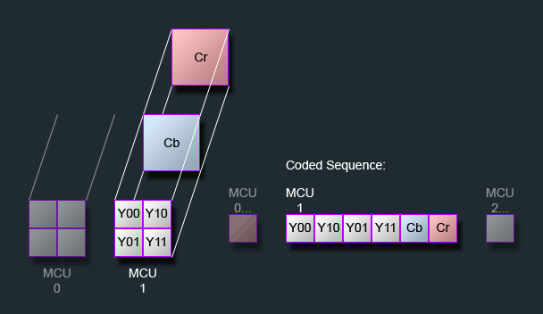

Каждый MCU состоит из всех трёх цветов. Каждый из этих цветов образует блок DU, которые идут друг за другом. При этом, Cb и Cr компоненты на практике не сильно влияют на восприятие картинки, поэтому их можно задать разными хитрыми способами относительно Y компонента. На картинке выше для пикселей в квадрате 2x2, значения Cb и Cr усредняются и выдаётся только одно. Итого получается, что блок Y имеет 4 блока DU каждый по 8х8 пикселей, а блоки Cb и Cr имеют только 1 блок DU по 8x8 пикселей. В таком случае цветовая субдискретизация задана как 2:1 и передаётся в поле Flags пакета SSDV. Чтобы сделать из 6 блоков DU один MCU 16x16 пикселей, я написал такой код:

```java
for (int row = 0; row < DataUnitDecoder.PIXELS_PER_DU; row++) {
	for (int col = 0; col < DataUnitDecoder.PIXELS_PER_DU; col++) {
		int cbCrSourceIndex = row * DataUnitDecoder.PIXELS_PER_DU + col;
		for (int subRow = 0; subRow < yComponent.getMaxRows(); subRow++) {
			for (int subCol = 0; subCol < yComponent.getMaxCols(); subCol++) {
				int ySourceIndex = row * DataUnitDecoder.PIXELS_PER_DU * yComponent.getMaxCols() * yComponent.getMaxRows() + subRow * DataUnitDecoder.PIXELS_PER_DU * yComponent.getMaxCols() + col * yComponent.getMaxCols() + subCol;
				rgb[ySourceIndex] = convertToRgb(yComponent.getBuffer()[ySourceIndex], cbComponent.getBuffer()[cbCrSourceIndex], crComponent.getBuffer()[cbCrSourceIndex]);
			}
		}
	}
}
```

В данном примере ```rgb[ySourceIndex]``` - это массив 16x16 с RGB пикселами. Хорошая, кстати, алгоритмическая задачка для собеседования.

### Декодирование jpeg

Тут никаких особенностей нет. Чтобы получить DU, необходимо:

 - прочитать DC коэффициент
 - потом AC коэффициенты
 - выполнить zigzag преобразование
 - умножить на таблицу квантования
 - выполнить обратное дискретное косинусное преобразование
 
Единственное, что стоит учитывать, так это то, что данных может не хватить из-за окончания пакета. Поэтому не полностью прочитанный DU необходимо прочитать ещё раз, когда новые данные будут доступны после склейки пакетов.

## Результат

Пару дней на обдумывание и реализацию, и вот код готов. Можно взять тестовые данные и попробовать получить картинку.

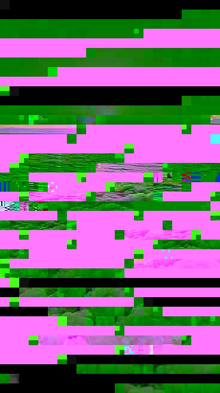

Что-то пошло не так. Явно видно, что проблемы в склейке пакетов и в том, как цвета определяются. Я попробовал убрать Cb и Cr каналы, чтобы лучше увидеть ошибку.

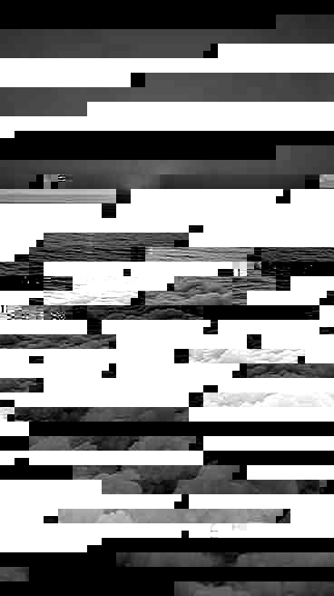

Первый пакет потерян, и я хорошо обрабатываю эту ситуацию. Начало картинки чёрное. Потом идёт блок и какой-то белый блок. Явно проблема в склейке пакетов. Я попробовал дебажить и нашёл ошибку в том, как выравнивается по байту первый MCU.

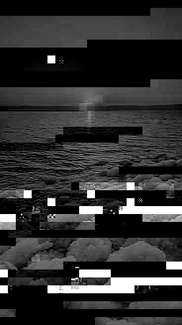

Далее, методом пристального вглядывания, я обнаружил, что предыдущие DC значения для каждого из компонент должны быть свои. У меня же было одно значение на все Y, Cb, Cr.

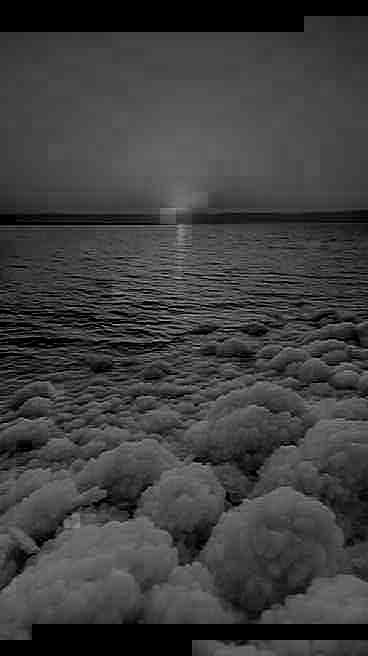

Чёрт. Эта картинка из космоса, но не космоса. Тем не менее Y канал выглядит вполне сносно и можно добавить цвета.

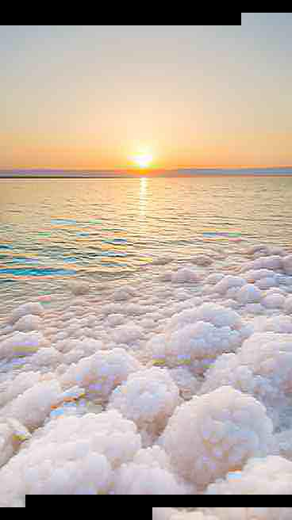

Выглядит офигенно! Ещё бы не эти артефакты.

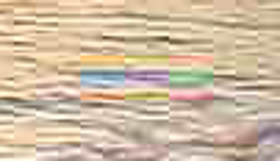

Это явно проблема декодировщика. Y канал выглядел сносно, но что, если взглянуть только на Cb и Cr.

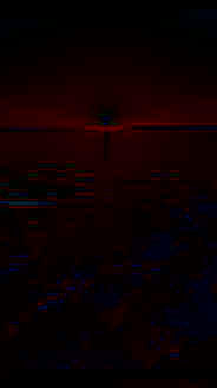

Здесь артефакты выглядят отчётливее. Если увеличить, то они выглядят так.

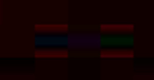

Соседние MCU закрашены равномерно. В то время, как проблемные MCU имеют странные коэффициенты сверху и снизу.

### Прошла неделя

Всю неделю я пытался понять и отдебажить код. С одной стороны, если бы проблема была в склейке пакетов, то падали бы ошибки как раньше. Но их нет. Это значит, что склейка работает и биты правильно поступают в DU. С другой стороны, если бы проблема была в DC коэффициентах, то картинка бы выглядела совсем плохо. Но Y канал выглядел более или менее. Значит DC коэффициенты не при чём. Оставались AC коэффициенты, но там не чему было ломаться.

Так я и ходил кругами, пока не решил запустить программу [jpegsnoop](https://www.impulseadventure.com/photo/jpeg-snoop.html) из под Windows виртуалки. В этой программе я открыл файл, который получил с помощью [другой реализации](https://github.com/daniestevez/ssdv) SSDV. И включил максимально подробный вывод декодирования.

Спустя какой-то час я нашёл в чём была причина. Дело в том, что я взял таблицу квантования "как есть". Однако, коэффициенты в этой таблице были записаны в zigzag порядке! Достаточно было изменить:

```java
for (int i = 0; i < zigzagDct.length; i++) {
	dct[i] = zigzagDct[ZIGZAG_INDEXES[i]] * getDqt(isYComponent)[i];
}
```

На

```java
for (int i = 0; i < zigzagDct.length; i++) {
	dct[i] = zigzagDct[ZIGZAG_INDEXES[i]] * getDqt(isYComponent)[ZIGZAG_INDEXES[i]];
}
```

И получить финальный результат.

## Финальный Результат
 
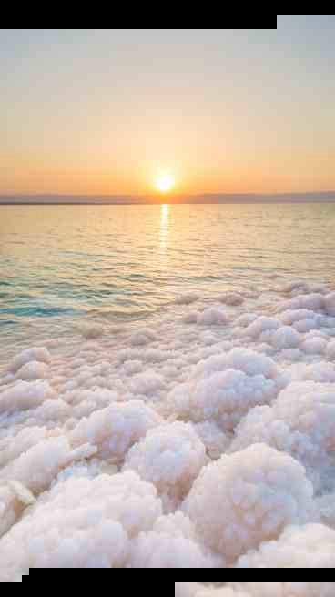
 
## Послесловие
 
Жаль, что из космоса я получил вполне земную картинку. Тем не менее, декодер полезен не только для того, чтобы декодировать jy1sat. Оказывается, около-лунный DSLWP-B тоже передавал в формате SSDV! А это значит, что мой декодер можно использовать, чтобы получить настоящие фотографии с орбиты луны. Как например эту.
 
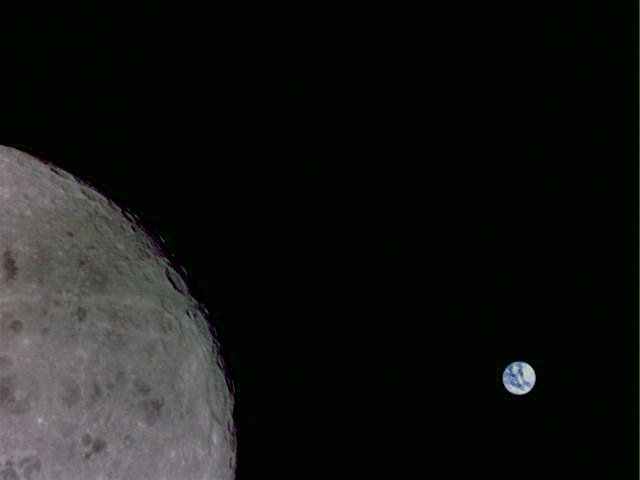
 
Декодеры SSDV [уже есть](https://github.com/daniestevez/ssdv). Однако, я считаю, что [мой](https://github.com/dernasherbrezon/ssdv4j) лучше по нескольким причинам:

 1. Понятный код. Вместо простыни на 1600 строчек, мой декодер разбит на логические классы и содержит комментарии. Это очень важно для того, чтобы можно было вносить изменения и фиксить баги.
 2. В нём нет специфики пакетов спутников. Вместо этого, можно конвертировать пакеты спутников в стандартные SSDV пакеты и обработать их стандартным способом.
 3. Он написан на Java под лицензией Apache 2.0. А это значит, что его можно использовать в [моём проекте r2cloud](https://github.com/dernasherbrezon/r2cloud) или встраивать в закрытые коммерческие решения.
 4. Он позволяет получить количество декодированных MCU. По этой метрике можно оценивать качество принятого сигнала.
 5. Он позволяет сохранять картинку в любом другом формате, а не только в jpeg. Например, можно сохранить в png с альфа каналом и вместо пропущенных кусков сделать прозрачные области.