## Введение

В ноябре 2018 года команда конференции JPoint [объявила](https://habr.com/ru/company/jugru/blog/429814/) о конкурсе докладов для будущей конференции. Я очень воодушевился и решил подать свою заявку. В своём докладе я хотел рассказать о том, как я декодировал сигнал со спутника Meteor-M 2. В декабре мне позвонили организаторы и мы немножко поговорили про меня и мой доклад. Он им показался интересным и они попросили меня набросать презентацию и текст.

На январских праздниках я засел за презентацию и сделал, как мне кажется, неплохой доклад. Парням из организации конференции он очень понравился. К сожалению, дальше меня отсеяли и я не попал на конференцию. Они посоветовали мне попробовать попасть на Joker 2019, и вот недавно мой доклад опять не приняли.

Я потратил очень много усилий, чтобы его сделать, поэтому выложу его сюда, в мой блог.

## Описание слайдов

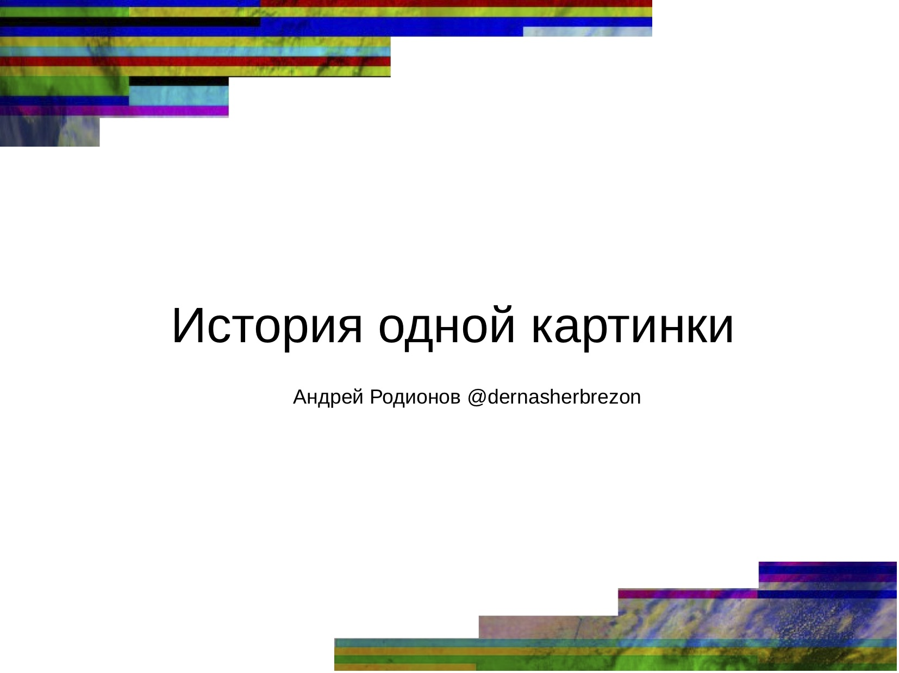

Итак, история началась несколько лет назад, когда я вдохновленный успехами частной космонавтики и г-на Маска решил сам прикоснуться к космосу. На глаза мне попалась статья об rtl-sdr о приёме сигналов со спутников. В тот момент я понял. Это оно. 

Конечно, спутников много и непонятно с чего начать, какая антенна нужна, какой софт. Поэтому я решил начать с чего-то, что можно потрогать и увидеть. С метео-снимков. На орбите сейчас летает множество метео-спутников, но самые доступные - это NOAA и наш Meteor. Я посмотрел на картинки в интернете и мне понравились снимки Meteor. Они большего разрешения, цифровые и выглядят лучше.

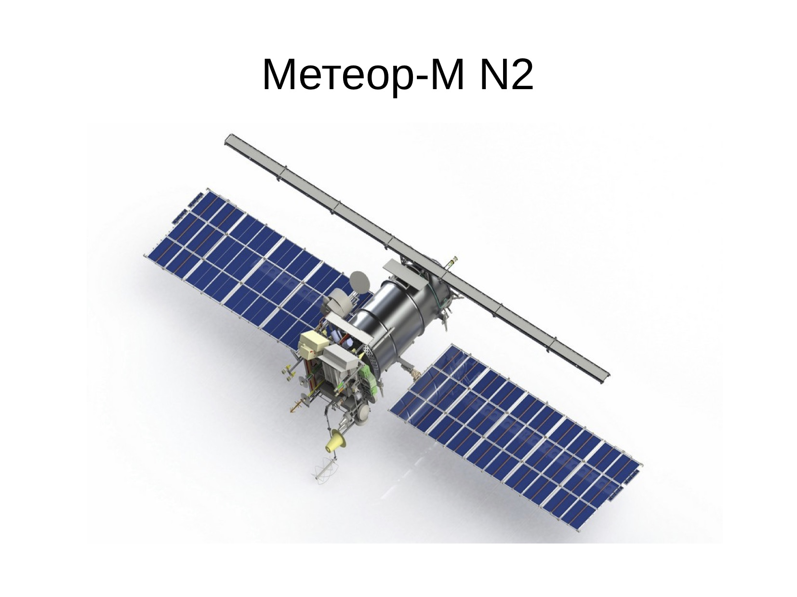

Метеор-М снимает землю 24 на 7 с 2014 года. 

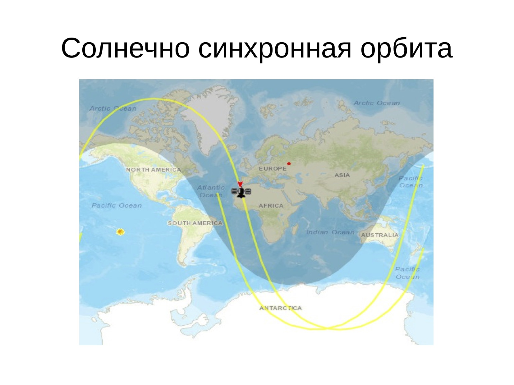

Он движется по солнечно-синхронной орбите. Что значит солнечно-синхронная? Это значит спутник пролетает над каждым участком земли в одно и то же локальное время. Прямо над нами он пролетал с утра и будет пролетать еще раз вечером через Х часов. Как же он снимает землю? 

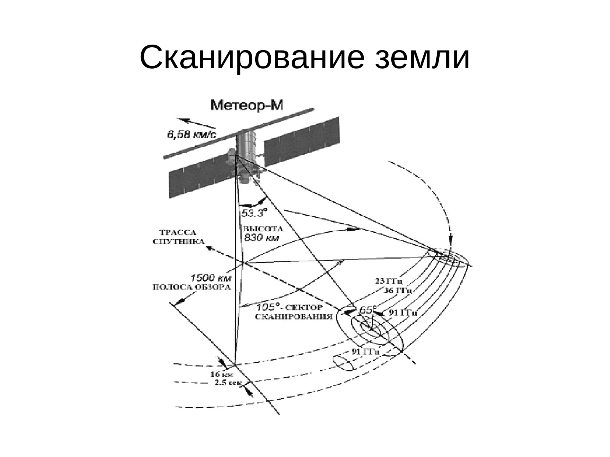

По сути метео-спутник - это такой большой сканер. Те кто видел зеленую полоску сканера, теперь чуть лучше представляют работу спутника. 

Спутник сканирует одну полосу картинки и сразу же передает её на землю. Никакого FTP. Все, кто смог принять сигнал, принимают одну и ту же полосу.

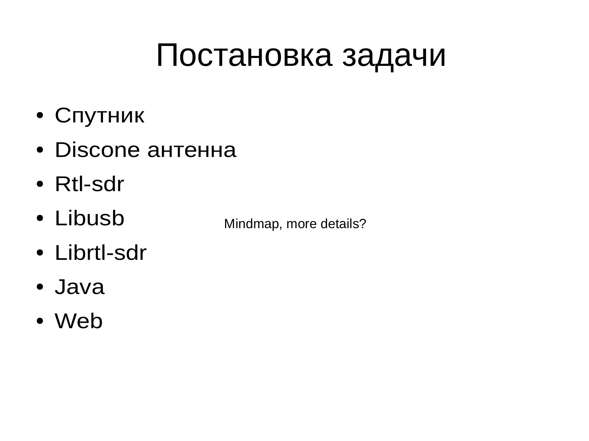

Что же нужно, чтобы получить этот сигнал? Нужен спутник, антенна, rtl-sdr, компьютер (raspberrypi вполне хватит) и java. Тут нужно немного рассказать, что каждый компонент делает. Итак:

 1. Спутник шлёт нам отсканированную полосу
 2. По радио
 3. На нашу антенну. Антенна - это очень важно. На простой кусок проволки вы вряд ли сможете принять сигнал со спутника. Я использую discone антенну. Это не самая эффективная антенна, зато всенаправленная и позволяет получать сигналы со множества спутников на разных частотах. Вообще для меня выбор антенны был самым сложным. Их великое множество, но какую выбрать? Для того, кто не разбирается в теории электромагнитных волн, задача непростая. Кто-то пишет на форуме, что у него отлично ловится на эту антенну, кто-то пишет что наоборот худшая антенна. Мне пришлось вслепую выбрать её и попробовать.
 4. rtl-sdr. Этот usb-стик преобразует аналоговый сигнал в цифровой и усиливает. На выходе получается поток байт. Плохую антенну я решил компенсировать хорошей электроникой. Я использую более продвинутый rtl-sdr v3 с экранированием и помехоустойчивостью.
 5. raspberrypi. Кто-нибудь слышал про него? Я думаю большинство если не попробовало, то хотя бы слышало. Как показывает практика, мощности этого компьютера вполне хватит, чтобы получать картинку со спутника.
 6. Чтобы получить доступ к этому потоку байтов в user space необходимо воспользоваться libusb + librtlsdr. Эта связка правильно инициализирует usb соединение, выставляет нужные регистры на usb-стике и шлёт поток байт пользователю. Звучит просто? Вроде бы. Но есть сложность: у usb стика нет внутренней памяти. Если приложение немножко подтормозило, то данные просто потеряются. Этот участок наиболее критичный к задержкам и скорости. Подтормаживать может как и наш любимый GC, так и сама операционная система. Поэтому имеет смысл записать данные во время пролета спутника в файл и потом уже спокойно обработать в офлайн. Именно поэтому Java отлично подходит. Это не задача реального времени.
 7. Демодуляция/Декодирование/Создание картинки.
 8. Вэб сервер, который будет раздавать картинки.

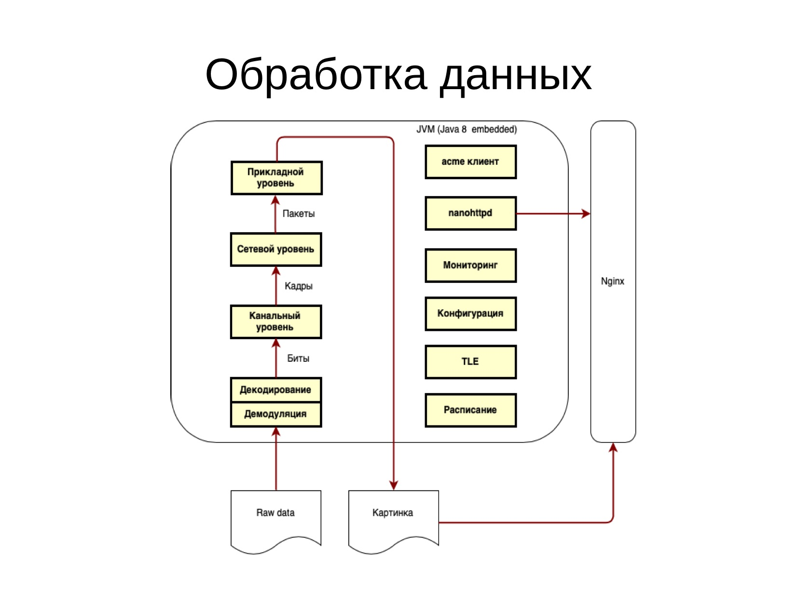

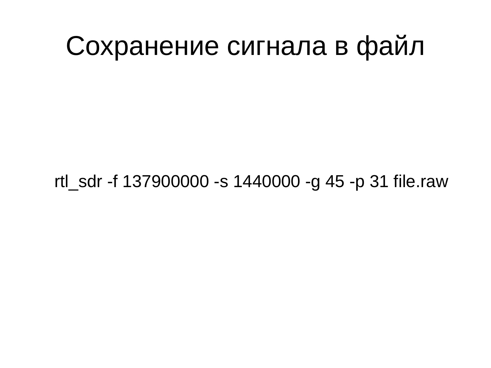

Сохранение raw сигнала в файл можно сделать одной командой в баше
 
Читать данные из USB не имеет смысла на Java. Их нужно быстро писать в файл без задержек. Если учесть, что сам raspberrypi работает не быстро, то лучше старого доброго С сложно придумать.

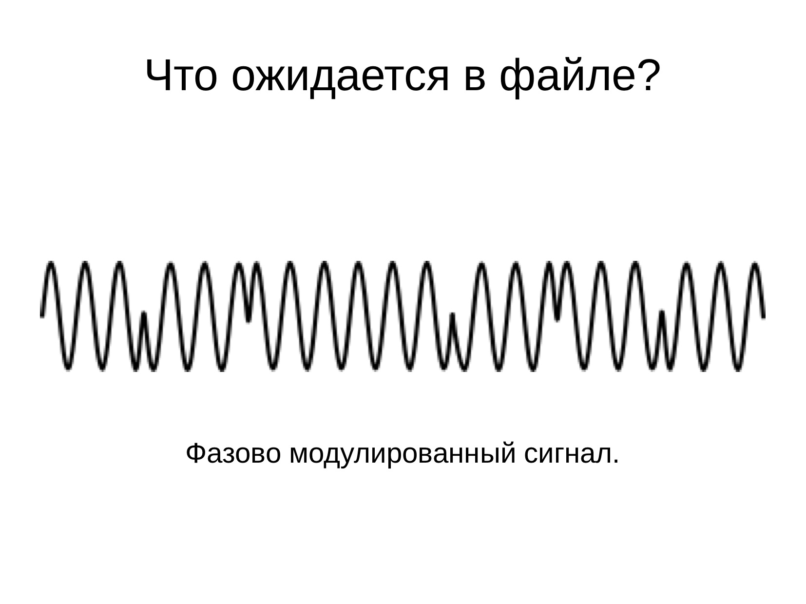

Итак, спутник пролетел, я записал файл. Можно смело выдохнуть и начать экспериментировать. В документации на Метеор-М написано, что сигнал фазово-модулированный.

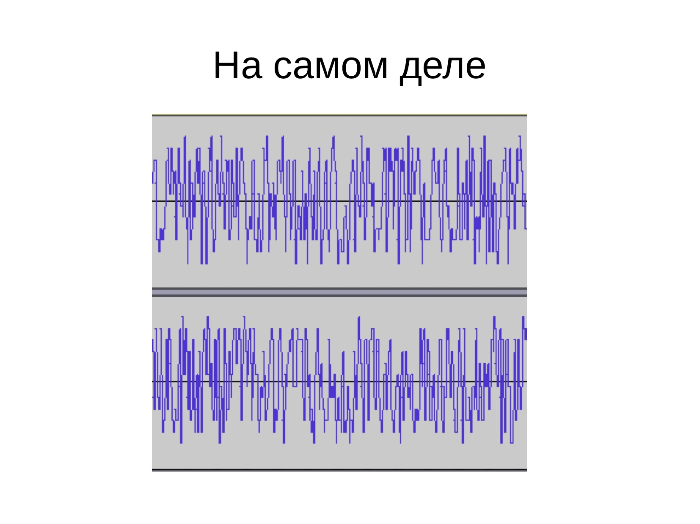

На самом деле нет. Вот так выглядит реальный сигнал. Кто-нибудь видит здесь реки и моря? Или хотя бы какую то структуру? Что это вообще такое? Моему разочарованию не было предела. Мало того, что я не понимал записан ли сигнал, так ещё непонятно что делать дальше.

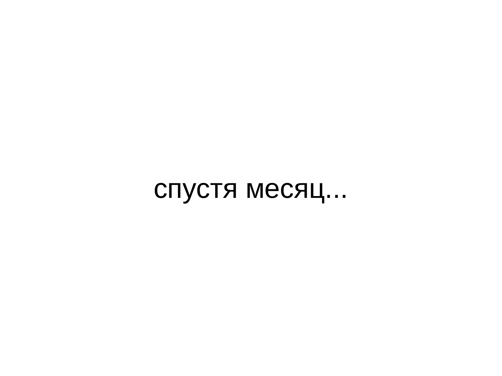

Я засел за теорию. Записался на курс обработки сигналов на курсере, забросил его, начал читать новую книжку, нашел старую pdf-ку от Nasa, вдохновился Вояджерами и продолжил.

Это были помехи и мой первый урок вне enterprise. Физический мир не такой, как нам рисуют на картинках в интернете. Помехи бывают очень разнообразные: соседская антенна, шумящие комплектующие самого raspberrypi, которые по USB передают высокочастотный электромагнитный сигнал прямо в rtl-sdr, холм вдалеке, пролетающий самолет и тд. Я просто принял это к сведению и начал двигаться дальше к цели. Очевидно помехи будут сильнее, когда спутник будет показываться над горизонтом. Однако, я рассчитывал получить хороший сигнал, когда спутник будет точно над головой. Я нашел хорошее описание QPSK демодулятора в GNURadio и решил двигаться дальше.

Итак, что же такое QPSK? Это вид модуляции, при которой меняется фаза. Вот видите этот кончик в центре? В этот момент фаза поменялась.

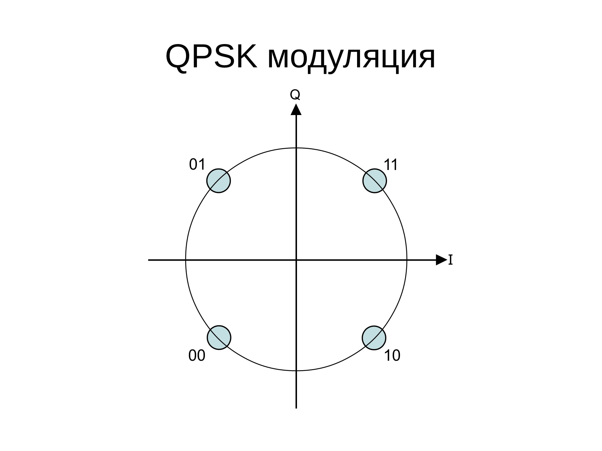

При QPSK модуляции есть 4 позиции, где может меняться фаза. Положение фазы определяет биты.

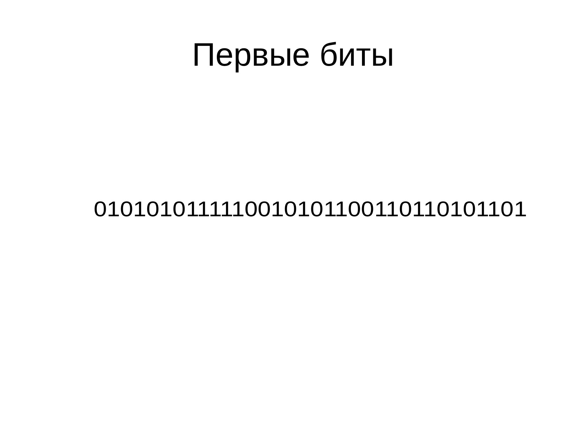

После демодуляции у меня получился поток бит. Вот оно, подумал я и расчехлил спецификацию на формат данных Метеора. Рано. Это ещё не данные. Для надёжной передачи данных используются алгоритмы коррекции ошибок и в протоколе их целых 3. Первый алгоритм - алгоритм декодирования Витерби. 

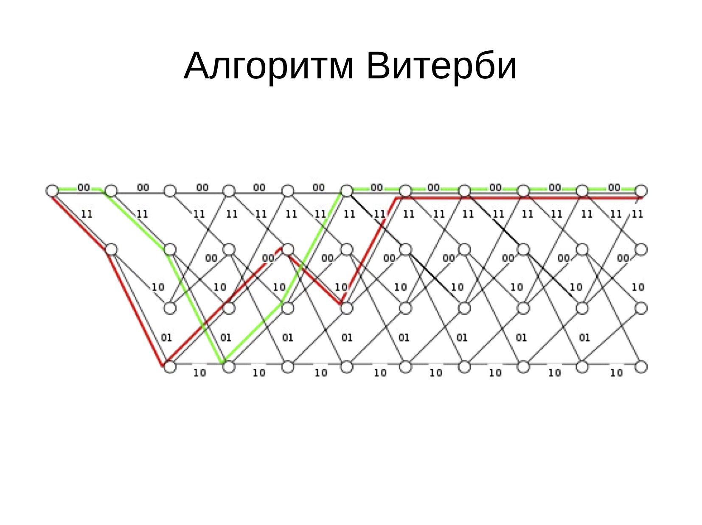

Он позволяет декодировать свёрточное кодирование и исправлять некоторое количество ошибок. Для начала наверное нужно рассказать, что такое свёрточное кодирование.

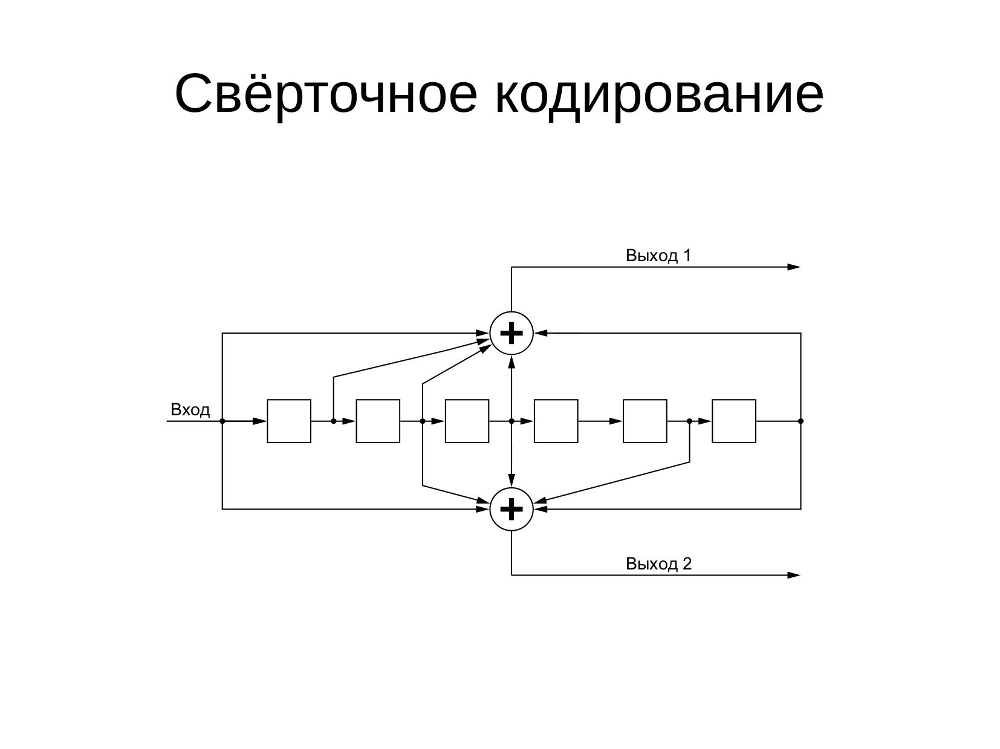
 
Свёрточное кодирование берёт на вход поток бит и для каждого входного бита выдает 2 бита. Причём формула генерации этих бит может зависеть от предыдущих бит. Я написал пару тестов для кодирования и декодирования. Знаете, их писать просто прелестно. Чистая математика, понятные результаты. Не то, что тестирование покупок в интернет-магазине с помощью Селениума.

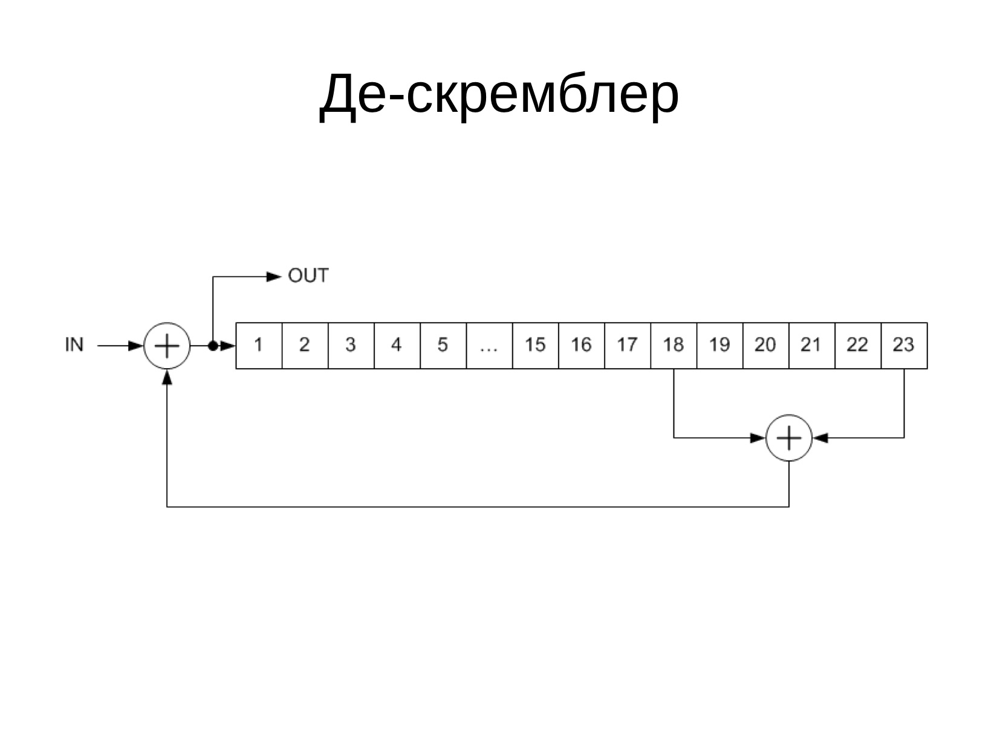

Следующим этапом коррекции биты необходимо пропустить через де-скремблер. Вообще скремблирование - это процесс преобразования одних битов в другие. Это прежде всего нужно для того, чтобы получить последовательность бит близкую к нормальному распределению. Чем более случайное распределение 0 и 1 в последовательности, тем легче распознать 0 от 1 при демодуляции. Знаете, задаешь себе вопрос "А почему хорошо нормальное распределение?" и уже через пару часов обнаруживаешь себя читающим pdf от Nasa 70-х годов, где они обосновывают достаточно формальной математикой выбор полинома для скремблирования. Но меня прежде всего интересовал результат. Поэтому я просто принял к сведению и начал реализовывать.

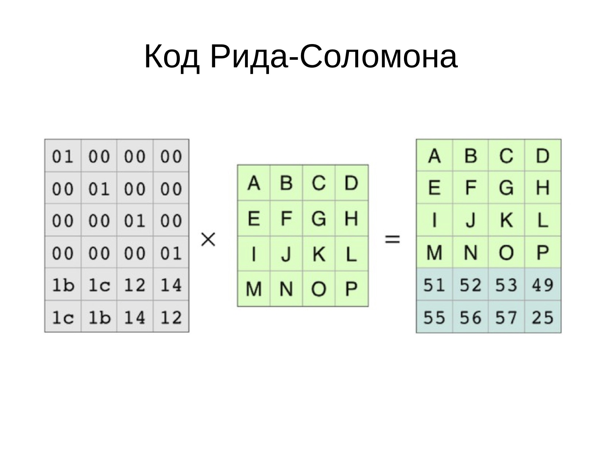

Последним шагом коррекции ошибок, необходимо вычислить коды рида-соломона и попробовать исправить потенциальные ошибки передачи данных. Сейчас я постараюсь в общих словах описать алгоритм. Он основан на теории полей. Поля - это определенная группа чисел обладающих определенными свойствами. Перемножая определенную матрицу с данными, мы получаем те же самые данные и биты чётности. Эти биты вместе с данными позволяют определить в каком бите ошибка и, что не мало важно, какое же значение бита должно быть. Тут я хочу сделать небольшое признание. Я не понял, как работает алгоритм. Вот совсем. 2 недели были потрачены почти впустую. Поэтому я просто взял имплементацию на С от Phil Karn и переписал на Java. Видимо, сказывалось отсутствие серьёзного математического образования. Я применил своё хорошее инженерное образование и просто выделил алгоритм в отдельный модуль с понятным интерфейсом.

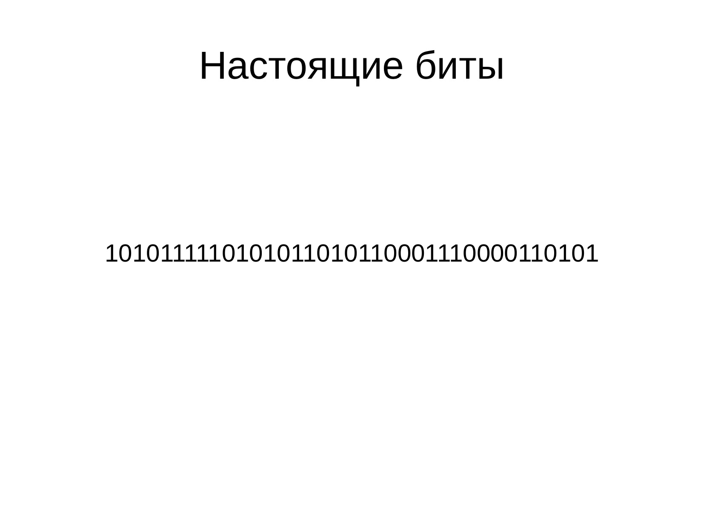

Настоящие биты. Смотрите, вот они. Ну не восхитительно ли? Между прочим эти 3 алгоритма так же используются для связи с Вояджерами. Так что, если у вас на даче есть 70-ти метровая тарелка, то Вы сможете попросить Вояджер помигать лампочкой.

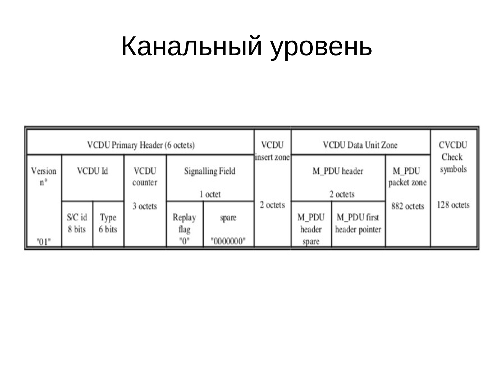

Итак, у нас есть набор бит, теперь можно из них собрать кадры канального уровня. Для тех, кто помнит модель OSI сюрпризов быть не должно. В универе мне нравился предмет сетевые технологии. Мы разбирали протокол HDLC. Прямо с тех лекций я помню что кадр - это структура фиксированной длины. У него есть заголовок и пользовательские данные. Пользовательские данные в данном случае - это пакеты сетевого уровня. Первое практическое применение знаний за последние 10 лет.

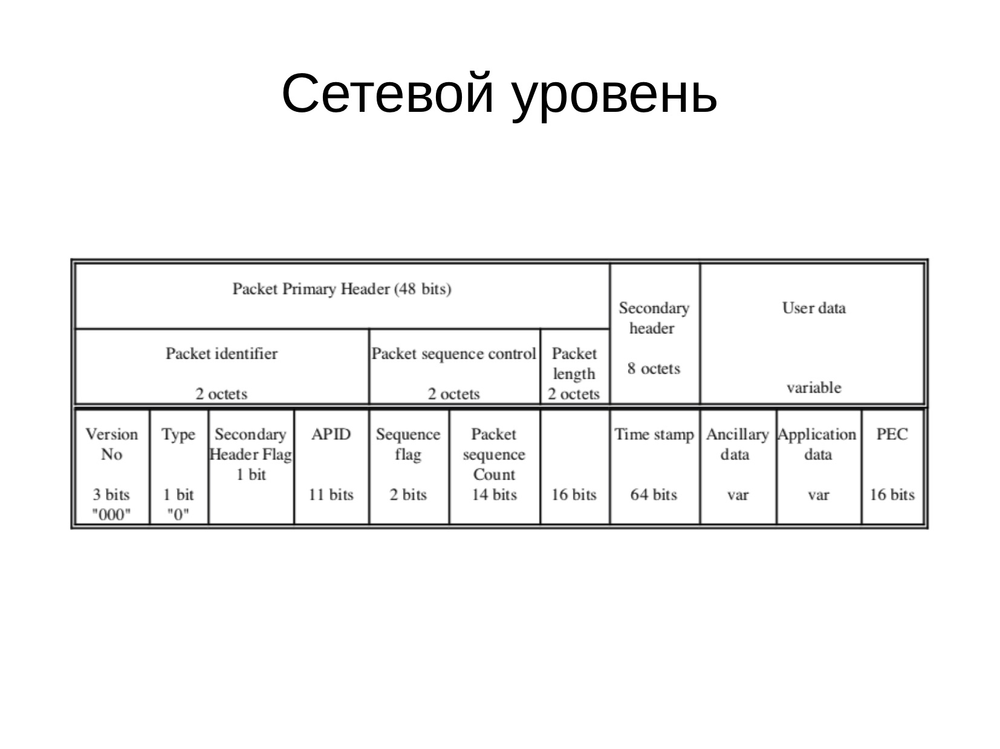

Пакеты сетевого уровня уже могут быть произвольной длины и частично не попадать в один кадр.

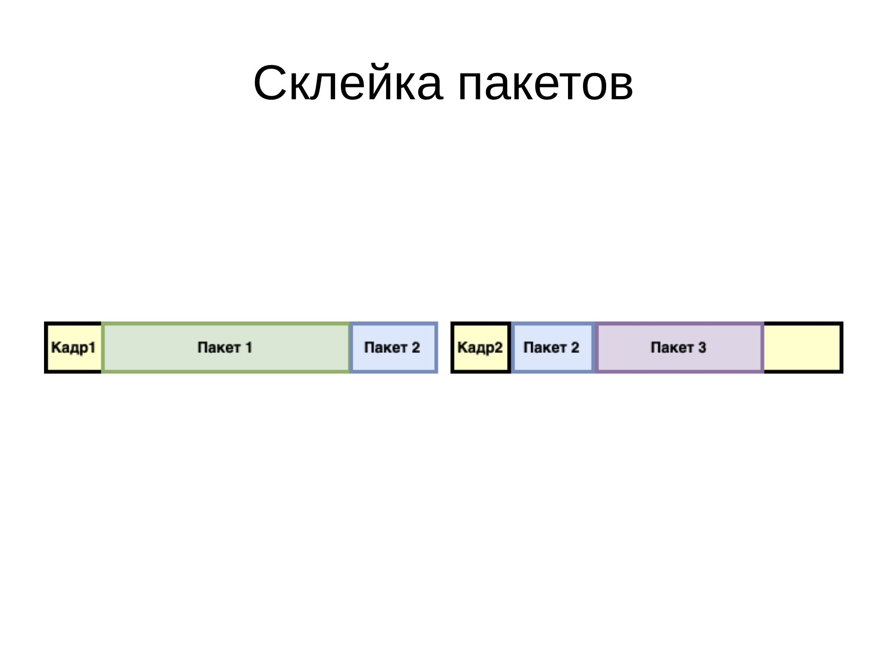

После склейки пакетов, можно начать переходить на прикладной уровень. Вот он. Вот где происходит формирование картинки. Уже близко. Итак, пакеты бывают 4-х типов. R, G, B и административный. Они содержат в себе закодированные с помощью jpeg кусочки полосы сканирования R, G, B каналов. Но тут Засада. Нельзя просто так взять и сохранить байты в файл, назвать его картинка\_из\_космоса.jpg и хвастаться друзьям. Это же полоса сканирования. А значит у неё нет шапки, нет описания таблиц jpeg. Это одна бесконечная jpeg картинка. 

Дело было значит весной. Спрашиваю я своего друга:

 - А ты знаешь как декодировать jpeg? 
 - Ну там просто. По алгоритму Хаффмана применить обратное преобразование фурье и получится матрица 8*8 значений пикселов. Ну а дальше их надо склеить подряд и получится картинка.
  
А потом я прочитал несколько статей о декодировании... В общем я хочу рассказать лишь о структурах данных, которые приходят со спутника. Преобразование битов в матрицу 8*8 я, пожалуй, оставлю для любознательных.

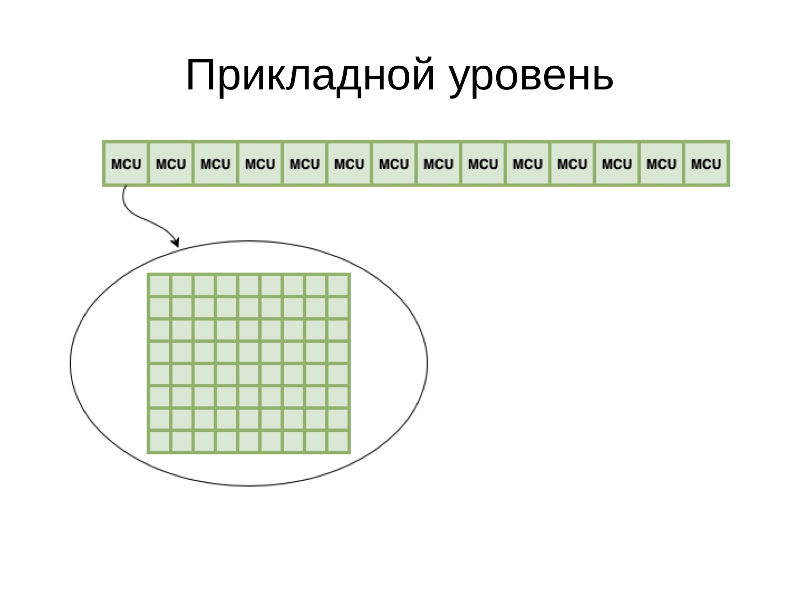

Итак, каждый пакет содержит 14 MCU. В терминологии jpeg - это Minimum Coding Unit. Матрица пикселей 8*8.

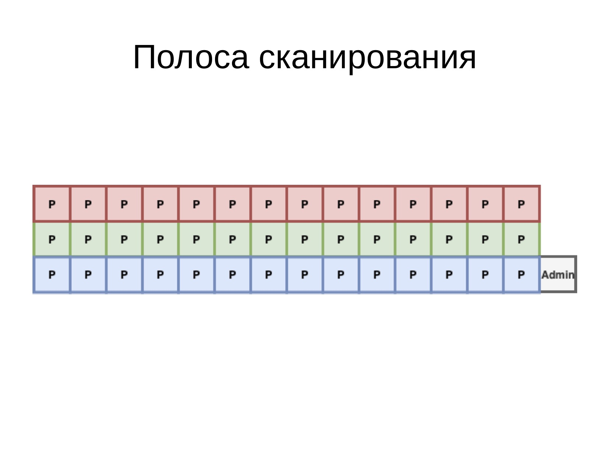

Метеор-М передает 14 пакетов одного цвета, потом 14 пакетов другого цвета, потом 14 пакетов третьего цвета и в конце 1 административный пакет. Всё вместе это даёт одну полосу сканирования. 14 пакетов на 14 MCU на 8 пикселей дают картинку шириной 1568 пикселей. Неплохо.

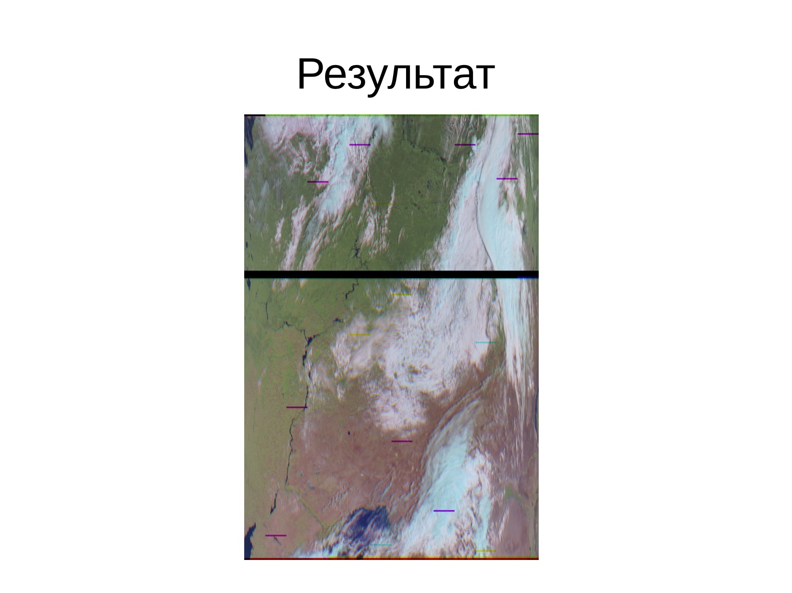

После того как получены непосредственные пикселы, остаётся дело техники и ImageIO. Вот оно. Бессонные ночи анализа QPSK сигнала, тщетные поиски таблицы AC для декодирования jpeg и наконец первый результат. И ценность этой картинки не в том, что я теперь умею видеть погоду на небе. Ценность в том, что вся эта связка из железа, Java, кучи алгоритмов - работает. Что за 100 долларов можно собрать станцию, которая действительно работает. Спустя несколько месяцев работы и бессонных ночей я увидел что-то не похожее на бесконечные биты и потоки. Настоящие реки и моря.

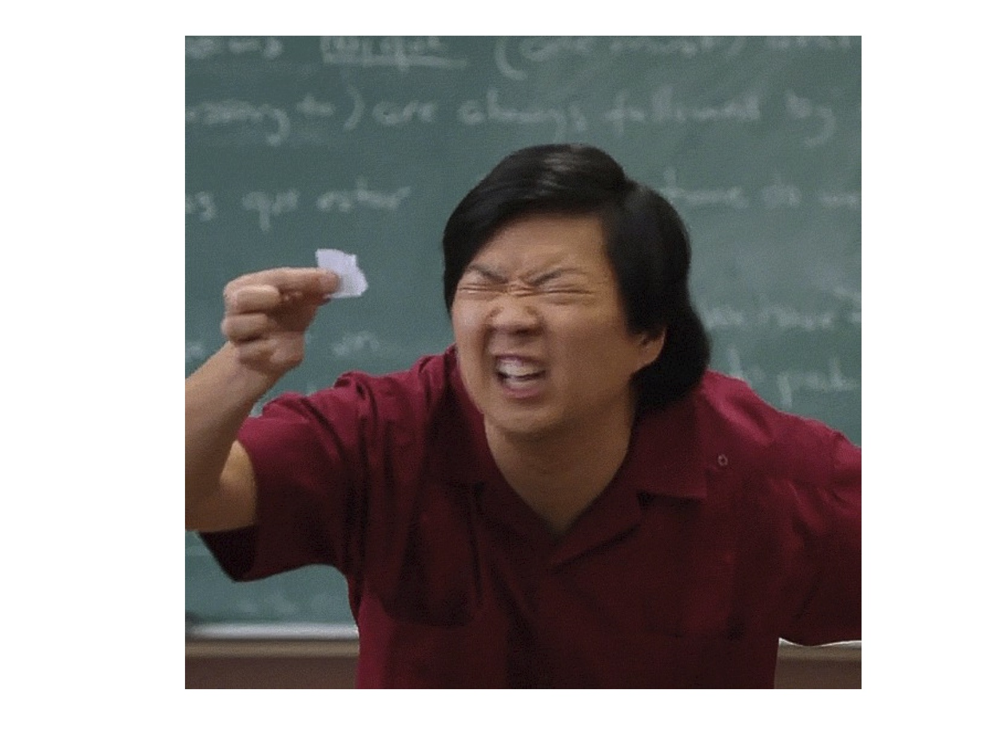

Внутренний enterprise-перфекционист начинает бухтеть. Хочется большего. Хочется убедиться, что результат действительно финальный.

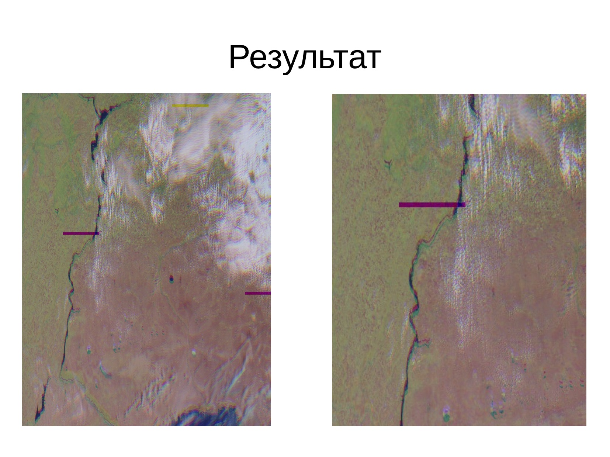

Так и знал. Баг. Важный урок. Даже если алгоритмы отработали верно, никогда не знаешь наверняка, где бага. Когда есть картинка, где можно увидеть багу - это хорошо. В данном случае понятно, что неправильно наложены каналы. Видимо, красный канал смещён на одну строчку выше. Как такое могло произойти? Всё очень просто. Помните я говорил, что полоса сканирования - это идущие друг за другом пакеты одного канала? А что будет, если один кадр пропущен? Например, из-за помех. Нужно правильно высчитать индекс следующего пакета из следующего кадра и пропустить нужно количество пикселей в картинке.

Так-то лучше. Что ещё можно сделать? Меня смущает эта одинокая полоса. Видимо был пропущен один пакет. Опять же, непонятно из-за помех или из-за баги в коде. Скорее всего из-за кода. Если бы были помехи, то и другие пакеты были бы пропущены. 

Баг склейки пакетов в разных фреймах. Проявлялся только тогда, когда пакет не влазил в один фрейм и нужно было перенести в следующий.

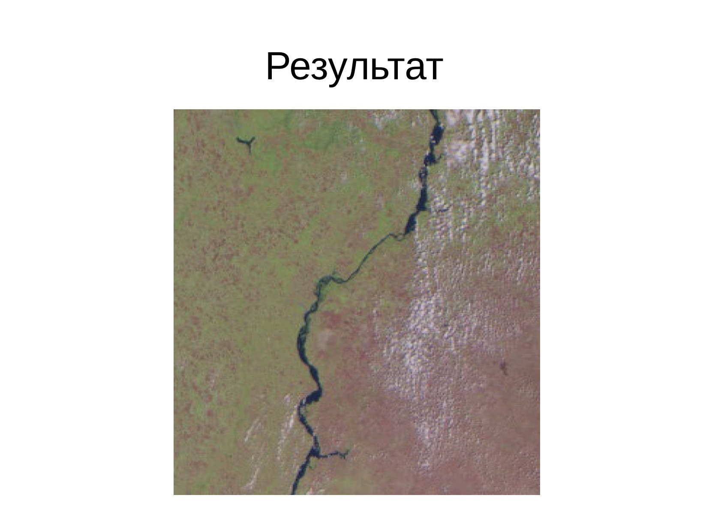

Результат достаточно приличный. 

Меня только бесит эта черная полоса в середине картинки. Края у нее резкие, фон черный. Может быть действительно помехи? Например, когда спутник пролетает точно над антенной, свет с венеры отразился от верхних слоёв атмосферы и вызвал помеху?

Нет, похоже бага в самом спутнике. 

<pre>
Уважаемые форумчане! Отвечу на часть вопросов по приёму с Метеора №2 в метрах. 
ИК каналы сегодня начали работу: по запросу разработчика включали очистку радиационного холодильника. 
Дыра при приёме в метровом диапазоне обусловлена переполнением буфера БИС-МВ и никуда не денется, только если уменьшим поток. 
Т.е. будут работать не три камеры в видимом диапазоне, а только две. 
Это косяк разработчика. Хотели повысить качество сжатия картинки. 
Поэтому при нормальном освещении каждые 6 мин 23 сек идет белая полоса. 
Сегодня зависал формирователь цифровых потоков. При приеме в метрах шла "джинса". 
Перезапустили в районе 11-ти часов.
</pre>

А что если ещё немножко подкрутить ручки демодулятора?

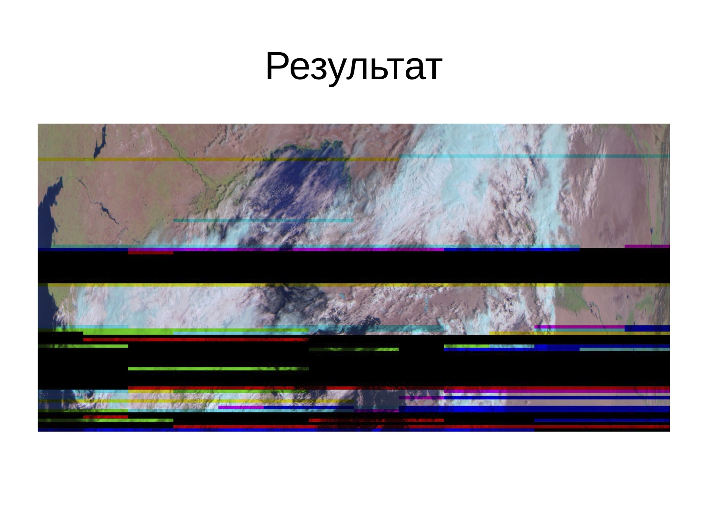

Теперь в районе Каспия появились дополнительные кусочки снимка. Теперь наверное уже всё. 

Вот она эта картинка. И это была её история. 
