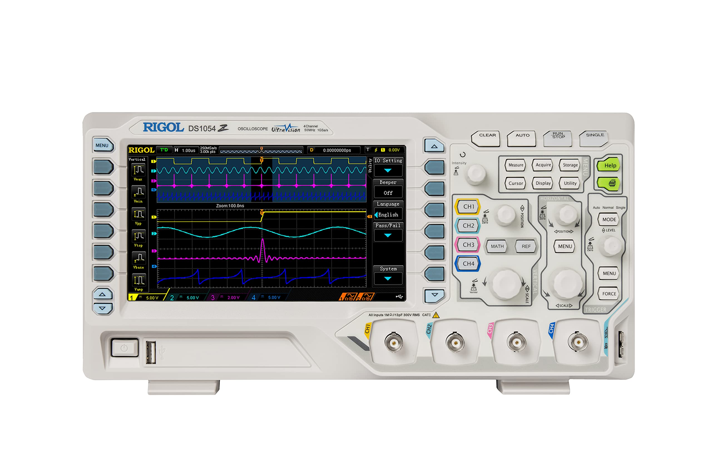
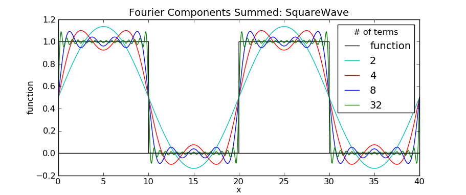
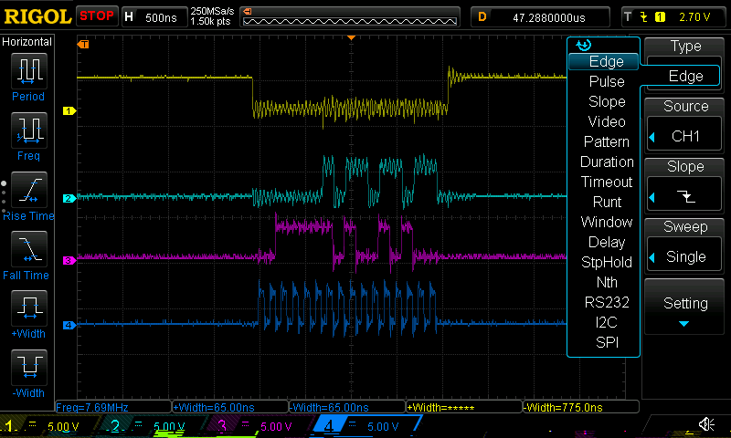
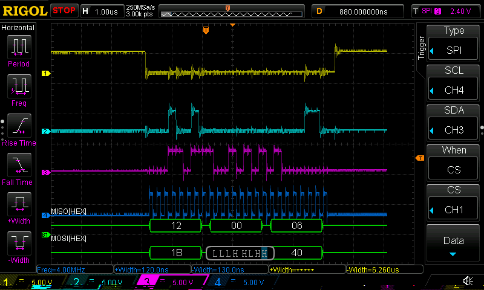
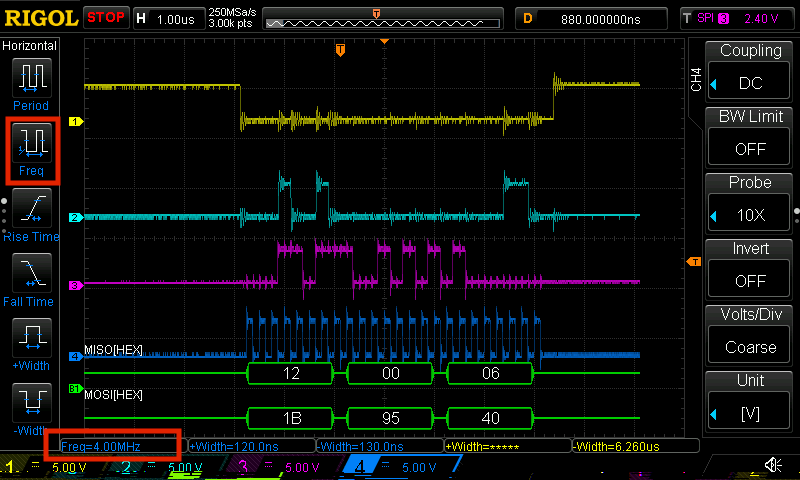
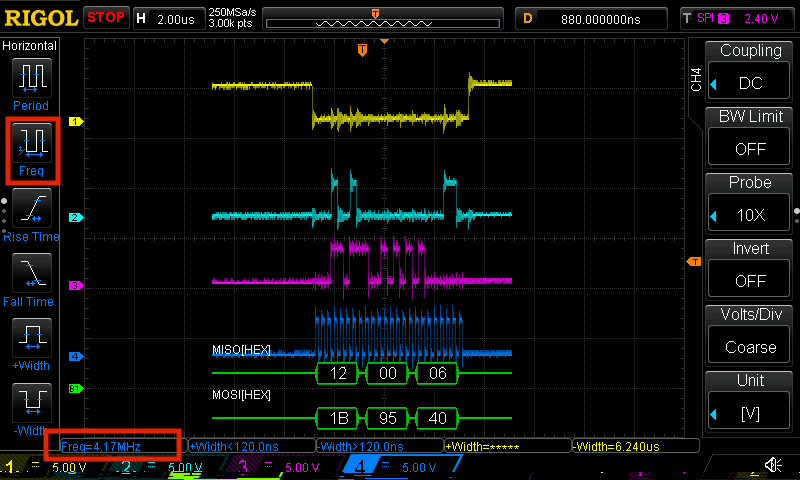
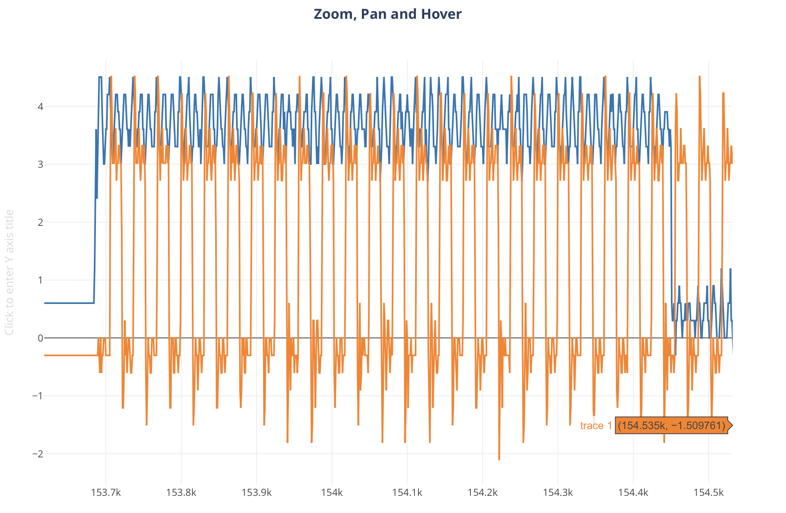

Недавно у меня появился цифровой осциллограф ds1054z. Смотрите какой красавец!



Помимо того, что он классно смотрится на рабочем столе, он умеет делать много интересного! Например, с помощью него я собираюсь проанализировать [багу в чипе sx1276](https://github.com/dernasherbrezon/sx127x/issues/11#issuecomment-2027332684) и понять как её исправить. Но прежде всего нужно разобраться в том, как он работает.

## Немного теории

Последний раз я видел осциллограф вживую 20 лет назад: у него была электронно-лучевая трубка, какие-то зелёные линии, много ручек и переключателей. С тех пор мир шагнул вперёд и многое поменялось. Теперь вместо аналоговой обработки сигнала, осциллографы сначала оцифровывают сигнал, а потом позволяют его проанализировать. Именно поэтому ключевыми параметрами стали bandwidth и sampling rate. Несмотря на то, что в теории обработки сигналов - это взаимозаменяемые панятия, в осциллографах они обозначают разное. Чтобы разобраться, нужно представить схему работы:



"Front End" - это аналоговый компонент, который усиливает или ослабляет сигнал. Он выполняет роль фильтра низких частот и определяет диапазон частот, которые попадают на вход АЦП (ADC). "bandwidth" как раз и есть этот диапазон частот. "Sampling rate" - это скорость работы АЦП. Согласно [теореме Найквиста—Шеннона—Котельникова](https://ru.wikipedia.org/wiki/Теорема_Котельникова), чтобы увидеть частоту bandwidth=50Мгц, нужно оцифровывать с sampling rate=100Мсэмплов/сек. Однако, ds1054z может оцифровывать со скоростью 1Гсэмпл/сек. Зачем так много?

Во-первых, АЦП всего один и используется для всех входов. Если подключен один щуп, то скорость будет 1Гсэмпл/сек. А если подключены 4, то скорость будет уже 250Мсэмпл/сек - это особенность именно моей модели.

Во-вторых, осциллограф используется в основном для анализа цифровых сигналов - это прямоугольные сигналы, которые резко меняются от 0 вольт (логический ноль), до какого-то высокого значения (логическая единица). Прямоугольные сигналы можно аппроксимировать только бесконечным количеством синусоид. 



Если, например, взять цифровой сигнал с частотой 50Мгц, то его можно аппроксимировать частотами 50Мгц, 51Мгц, 52Мгц и тд. Получается, что сэмплировать надо будет уже со скоростью 100Мсэмплов/сек, 102Мсэмпла/сек, 104Мсэмпла/сек и тд. На практике сэмплирование определяется погрешностью, с которой производится измерение и формой цифрового сигнала. Производитель осциллографов Keysight [выпустил небольшую заметку](https://www.keysight.com/us/en/assets/7018-01455/application-notes/5989-5733.pdf) о том, как подбирать bandwidth и sampling rate. В среднем, скорость сэмплирования должна быть в 5 раз больше частоты. То есть, для bandwidth=50Мгц, скорость должна быть 250Мсэмплов/сек.

## Триггеры

Поскольку все сигналы, которые измеряются осциллографом, протекают очень быстро, их невозможно увидеть невооружённым взглядом. Для того, чтобы увидеть сигнал, нужно настроить параметры триггера. Как только триггер сработает, осциллограф запишет состояние в память и останавит измерение. Это состояние можно неспеша подвигать влево-вправо, проанализировать или сохранить в компьютер.

Самый простой триггер - это Edge. Он срабатывает, когда значение на одном из щупов станет меньше или больше некоего порога. 



В примере выше имеет смысл остановить измерение, если CH1 - самый верхний сигнал - переходит в состояние "0". В этот момент начинается передача данных.

Если уменьшить зум осциллографа в режиме поиска сигнала, то триггер захватит не только первое сообщение, но и несколько последующих:


Для анализа протокола SPI, можно использовать SPI триггер. Он позволяет остановить наблюдение, когда увидит определённую последовательность бит в данных. Для этого нужно настроить частоту (SCL), шину данных (SDA) и chip select (CS). После этого внизу появится маленькое окошко. Изменяя значения на "L" (0) и  "H" (1), можно выставить нужную последовательность бит. В примере ниже, я сконфигурировал триггер на сообщении 0b00011011 (0x1b):



Крайне удобно, если по шине ходит много данных, а при этом нужно найти только одно специальное сообщение.

## Анализ сигнала

Справа у ds1054z есть ряд кнопок, которые позволяют проанализировать сигнал. Например, можно выбрать щуп CH4 и измерить тактовую частоту сигнала:



ds1054z измеряет сигнал, который прямо сейчас отображается на экране. Именно поэтому, если сигнал немного не в фокусе или слишком уменьшен, то могут быть погрешности.



В ds1054z есть 22 различных анализа. Например, можно померить скорость передачи данных, если померить время, когда CS линия в состоянии "0":


## Декодирование SPI

Помимо анализа сигнала, ds1054z может декодировать наиболее распространённые протоколы. Например, он может декодировать SPI протокол и показать данные прямо напротив сигнала! Для этого нужно нажать кнопку "Math" -> "Decode 1". Выбрать Decoder=SPI. И указать какой сигнал соответствует какому щупу.


## Получение данных через USB

Всё это, конечно, хорошо, но хотелось бы ещё сравнивать сигналы между собой. Для этих целей проще скачать данные на компьютер, прогнать несколько наблюдений и свести всё в один график. Для этого в ds1054z есть два разъёма: USB и RJ45 (Ethernet). По USB данные можно забрать с помощью [протокола USBTMC](https://www.usb.org/document-library/test-measurement-class-specification). Это текстовый протокол, который очень похож на AT. Клиент посылает команды в текстовом виде, а получает ответы либо в текстовом, либо в бинарном виде.

Помимо USBTMC, есть абстрактный API - [VISA](https://www.ni.com/docs/en-US/bundle/ni-visa/page/ni-visa-overview.html), который позволяет взаимодействовать с инструментами не только через USB, но и через Ethernet. 

Я попробовал [ds1054z](https://github.com/pklaus/ds1054z), но он не смог запуститься в MacOS из-за ошибок zeroconf. Я попробовал [sigrok](https://sigrok.org/wiki/Main_Page), но он не запустился на М1 и не смог найти Qt5, чтобы скомпилироваться. В итоге я нашёл небольшой скрипт на python - [rigol-grab](https://github.com/rdpoor/rigol-grab), который с помощью [pyvisa](https://pyvisa.readthedocs.io/en/latest/) может сохранить экран в png. 

Используя [официальную документацию](https://telonic.co.uk/jg/wp-content/uploads/2021/05/Rigol-DS1000Z-ProgrammingGuide.pdf), я смог адаптировать скрипт, чтобы сохранять данные в csv файл.

Сначала необходимо инициализировать подключение и настроить формат получаемых данных:

```python
import pyvisa

_resource_manager = pyvisa.ResourceManager()
_rigol = _resource_manager.open_resource('USB0::0x1AB1::0x04CE::DS1ZA253502774::INSTR', write_termination='\n', read_termination='\n')
_rigol.write(':WAV:MODE RAW')
_rigol.write(':WAV:FORM ASCii')

stats = _rigol.query(':WAVeform:PREamble?')
total_number_of_points = int(stats.split(',')[2])
print('total number of points: ' + str(total_number_of_points) + ' s: ' + str(stats.split(',')[4]))
max_in_batch = 15625
```

В текстовом режиме ds1054z может передавать максимум 15625 точек. Далее для каждого канала (сигнала) нужно пройтись и небольшими кусочками скачать данные:

```python
for cur_channel in ["2", "4"]:
    _rigol.write(":WAV:SOUR CHAN" + cur_channel)
    start_of_batch = 1
    with open("lora_8e6_chan" + cur_channel + ".csv", "w") as f:
        while start_of_batch < total_number_of_points:
            cur_batch_to_read = min(total_number_of_points - start_of_batch, max_in_batch)
            _rigol.write(":WAV:STOP " + str(start_of_batch + cur_batch_to_read))
            _rigol.write(":WAV:STAR " + str(start_of_batch))
            print('reading data from: ' + str(start_of_batch) + ' to ' + str(start_of_batch + cur_batch_to_read) + ' batch size: ' + str(cur_batch_to_read))
            chan1 = _rigol.query(':WAV:DATA?')

            start_of_batch += cur_batch_to_read

            val = chan1[11:].split(',')
            for cur_value in val:
                try:
                    int_cur_value = float(cur_value)
                    if int_cur_value > -5 and int_cur_value < 5:
                        f.write(cur_value)
                        f.write('\n')
                    else:
                        f.write('0\n')
                except ValueError:
                    f.write('0\n')
                    continue
                    # do nothing
```

Скрипт можно улучшить и, например, скачивать только те данные, которые отображаются на экране. 

## Анализ данных

Следующим шагом будет анализ данных. Для начала их необходимо где-то отобразить, чтобы найти интересующий регион. Просто так в Excel (LibreOffice) их не получится запихать, так как данных очень много. Да и графики там статичные. Тут должна подойти какая-нибудь javascript библиотека для отображения графиков, которая позволяла бы двигать график и увеличивать нужные участки. Немного поискав в Интернете, я нашёл [chart-studio.plotly.com](https://chart-studio.plotly.com). Туда можно загрузить .csv файл и локально в браузере поисследовать данные:



После того, как нужный участок найден, данные можно усреднить и записать в другой файл. Для этого я написал небольшую программу на java.

## Итого

ds1054z - это вещь. Теперь, зная как работает осциллограф, я попытаюсь разобраться с багой в sx1276.