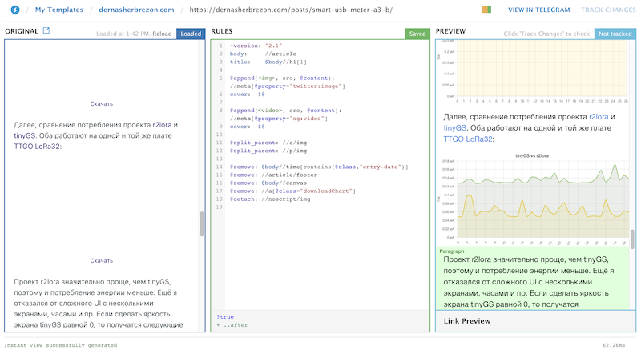
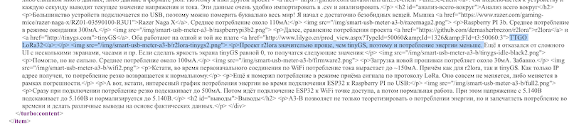

У Вас никогда не было желания подвигать мышкой на графике в интернете? Вот есть какой-нибудь график, и прям хочется навести курсор на минимальное значение или максимальное? Или посмотреть, как быстро менялось значение по времени просто сравнив начало и конец? У меня постоянно. Проблема в том, что большинство графиков в интернете - это картинки. Картинки, которые сгенерированы в Excel, да ещё и в ужасном разрешении.

Да, что говорить - я сам создаю такие графики. Вот взять, например, мой последний [пост про USB тестер]():


График хороший: в нём есть заголовок, оси, подписаны единицы измерения. Формально им можно пользоваться и, наверное, делать какие-то выводы. Но вот смотришь на него и возникает какое-то чувство ущербности и неполноценности.

Хочется добавить прозрачности, какого-то динамизма. [Как в магазинах Apple](https://www.businessinsider.com/apple-changes-angle-of-laptop-screen-displayed-in-stores-to-76-degrees-2015-8?r=US&IR=T): поставить ноутбук так, чтобы его хотелось открыть и повертеть в руках.

## Требования

Несмотря на то, что мой блог статический и сгенерирован с помощью [Hugo](https://gohugo.io), в него вполне можно добавить динамизма с помощью javascript. Что же хочется?

 * динамический график. При наведении курсора на график, должны отображаться значения по оси Х и У.
 * данные должны хранится отдельно от статьи. Некоторые графики могут содержать достаточно большое количество точек и мне не хотелось бы "как-есть" копировать данные прямо в Markdown файл. Это только засорит статью и её будет сложно редактировать. Поэтому данные необходимо хранить в отдельных файлах.
 * включение поддержки графиков должно быть явным. Большинство статей без графиков, поэтому загружать дополнительный javascript на них не имеет смысла.
 * возможность задать график через конфигурацию, ну или с минимальным количеством javascript.
 
По-умолчанию Hugo не поддерживает такие вещи. Но всё это можно сделать самому! Для этого я взял:

 * [Hugo shortcodes](https://gohugo.io/content-management/shortcodes/)
 * [chartjs](https://www.chartjs.org)
 * немного терпения
 
## Hugo shortcodes

Hugo shortcodes - это, по сути, обычные теги. Такие, например, есть в [JSP]() или во [VueJS](). Я создал shortcode [chartjs](https://github.com/dernasherbrezon/dernasherbrezon.github.io/blob/master/hugo/layouts/shortcodes/chartjs.html) со следующими параметрами:

 * "url" - локально лежащий json файл с данными.
 * "id" - уникальный id графика. Используется в html тэгах и названиях javascript объектах.
 * "title" - заголовок графика.
 * "datasource" - поле в json объекте, которое будет использоваться в качестве значений по оси Y.
 * "datasourceLabel" - человеко-читаемое название данных.
 * "datasource2" - на случай, если нужно отобразить два графика. Необязательное поле.
 * "datasource2Label" - человеко-читаемое название данных для второго графика. Необязательное поле.
 * "yAxisLabel" - название оси Y
 * "yAxisUnit" - единицы измерения по оси Y. Ох, сколько же графиков не имеют этих базовых параметров.
 * "xAxis" - оле в json объекте, которое будет использоваться в качестве значений по оси X. Необязательное поле. По-умолчанию будет браться индекс объекта json.
 * "xAxisLabel" - человеко-читаемое значение оси Х. Необязательное поле.
 * "xAxisUnit" - единица измерения.
 * "staticSrc" - график отрендеренный в статичную картинку. Об этом чуть далее.
 
Самое сложное было - это разобраться с синтаксисом движка шаблонов Hugo. Как Вам такое:

```
{{ $dataC := getJSON $url }}
```

Или такое:

```
{{ $id | safeJS }}
```

Сам компонент достаточно простой. Он выводит необходимые html теги и настраивает chartjs согласно документации. От себя я лишь добавил шаблонизацию, какие-то стили отображения графика и кнопку "Скачать". Если на неё кликнуть, то можно скачать график в виде картинки.

В результате в посте нужно написать следующее:

```

```

Чтобы получилась вот такая красота:



Сама библиотека chartjs подключается один в раз в заголовочной файле ```head/extra.html```:

```
{{- if eq .Params.chartjs true -}}
<script src="{{ print "/js/chart.min.js" | relURL }}"></script>
{{- end -}}
```

А для того, чтобы добавлять её только в те посты, где графики нужны, необходимо указать в параметрах поста:

```
chartjs: true
```

## Telegram

И вся эта красота не работает в [Telegram instant view](https://instantview.telegram.org). Это такой специальный сервис Telegram, который берёт исходную страницу, парсит html и конвертирует в специальный внутренний формат, чтобы выводить прямо в клиенте. Это позволяет открыть и прочитать статью без загрузки с сайта. Поскольку мой блог некоммерческий, мне хочется, чтобы читатели смогли получить доступ к информации быстро и просто. Однако, очевидно, что Telegram не поддерживает javascript ни в каком виде. Да и обычные html теги не все поддерживаются. 

Можно просто удалить все графики:

```
@remove: $body//canvas
```

Но тогда статья просто потеряет смысл.

Вместо этого я придумал следующее:

 * удалить canvas из instant view. Он всё равно не поддерживается.
 * добавить параметр "staticSrc" к компоненту chartjs, который будет рендерится в обычную картинку внутри тега ```<noscript>```. Если в браузере отключён javascript или он не поддерживается по каким-либо причинам, то вместо ```<noscript>``` будет отображаться его содержимое.
 * в instant view сделать правило, которое удалит родительский ```<noscript>``` и покажет всё то, что есть внутри.
 
В итоге правила преобразования html поста в instant view стали содержать следующее (очередной птичий язык):

```
@remove: $body//canvas
@remove: //a[@class="downloadChart"]
@detach: //noscript/img
```

 

## RSS

Да, мой блог ещё доступен по RSS. Например, Яндекс использует RSS, чтобы делать свои [турбо-страницы](https://yandex.ru/dev/turbo/). По сути - это такие же специальные страницы, как и Telegram instant view, только для Яндекса. Если ничего специального не сделать, то в RSS попадёт портянка javascript, который просто не будет работать. 

Для того чтобы починить RSS, нужно сделать следующее:

 * убедиться, что страницы Hugo ещё можно рендерить в RSS. Для этого в config.toml должна быть строчка ```page = ['HTML', 'RSS']```
 * Создать shortcode, специфичный для конкретного формата. В моём примере - это ```chartjs.rss.xml```. В нём необходимо выводить статичный график, который уже был сконфигурирован для Telegram.

```
{{ $staticSrc := .Get "staticSrc" }}

```

После всех этих манипуляций, RSS будет содержать статичные картинки:



После всех этих манипуляций блог стал выглядеть чуть более приятным. Хотя бы для меня самого. А это уже неплохо!

 
 


