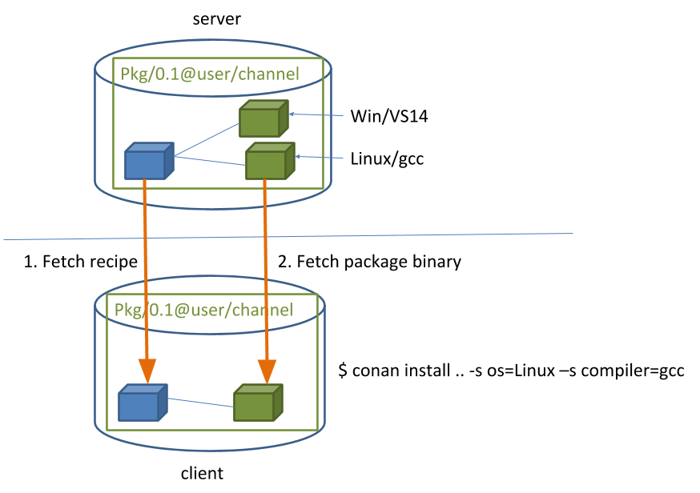

This article is more of a summary of what I learned in the last week about dynamic libraries, RPATH, and Conan.

## Introduction

No one in their right mind would start learning how libraries are linked in MacOS. So, first, I'll try to outline the problem I was trying to solve.

So, back in the old days when computer hard drives were small, computer memory was scarce, people came up with the idea of reusing libraries. How does it work? Suppose we have 2 applications:

 - A calculator depending on libraries:
   - math
   - ncurses
 - A task scheduler depending on libraries:
   - pthread
   - ncurses

Upon launch of these two applications, the operating system would load the necessary libraries into memory. However, since the ```ncurses``` library would be loaded once, the operating system wouldn't load it again. Instead, the "task scheduler" application would get a reference to the memory of the already loaded library. This is safe enough because the library cannot change (I intentionally simplify the situation with global variables and thread-safe guarantees). So application loaded two libraries, but operating system loaded only one (Resident memory vs Shared memory). The more applications use the same libraries, the faster the application startup and the lower the memory consumption.

In addition to saving memory, such reuse improved the maintainability of the operating system. Suppose a vulnerability is found in one of the libraries (ncurses). To fix it, you only need to update the library in one place. All applications using that library would automatically receive the security update. This is particularly important if some applications (e.g., "task scheduler") are infrequently updated or abandoned by their creators.

An alternative to this approach is thick distributions. I've already written about the pros and cons of [thin and fat distributions]() for Java. In general, for C/C++, the arguments are quite similar. However, historically, operating system applications have been thin distributions. [Many operating systems](https://fedoraproject.org/wiki/Bundled_Libraries?rd=Packaging:Bundled_Libraries) still [require applications to be delivered](https://www.debian.org/doc/debian-policy/ch-source.html#s-embeddedfiles) as thin distributions.

Most arguments for and against thin distributions made sense 20 years ago. Now, when memory and disk size are not as critical, new arguments against thin distributions are emerging:

 - The number of libraries and applications has become so large that maintainers of popular systems are no longer able to deliver packages with the latest library versions. Often they freeze a stable version and release small security updates.
 - Again, due to the number of libraries and dependencies between them, it has become more difficult to find a list of versions that would suit most applications. If the calculator uses ncurses version 1.0, and the "task scheduler" uses ncurses version 2.0, it's unclear which version of ncurses to install. apt, rpm, yum allow installing only one version of a library. You can't install versions 1.0 and 2.0 simultaneously. If these versions are incompatible, you'll have to choose which application to include in the operating system.
 - Constantly updating the version of the entire operating system is necessary. After all, new versions of libraries will not appear. And writing code, half of which is adorned with ```#if NCURSES = 1.0 ... #else if NCURSES = 2.0 ... #endif```  is not something anyone wants.

All of this flashed through my mind in a matter of seconds when I was thinking about how to fix "[Compiling issue - rtlsdr_set_bias_tee](https://github.com/dernasherbrezon/sdr-server/issues/3)" in sdr-server.

## [Conan](https://conan.io)

Weighing all the pros and cons, I decided to go the route of thick distributions. For this, I decided to delve into the trendy technology that everyone is talking about - [Conan](https://conan.io) by JFrog.



The main idea of the project is that the compiled libraries are already on a central server. To use them, you just need to connect them to the project. Conan will download them and correctly substitute the paths. This is done with a small config:

```
[requires]
rtlsdr/0.6.4
volk/2.4.1

[build_requires]
check/0.15.2@r2cloud/stable

[generators]
cmake
```

After that, include Conan in CMakeLists.txt:

```
include(${CMAKE_BINARY_DIR}/conanbuildinfo.cmake)
conan_basic_setup()
```

Then, in the ```build``` Then, in the ```install``` command:

```
#: conan install ..
```

This command will download dependencies, put them in the local repository, and generate a CMake config that includes all dependent libraries. After that, all that remains is to link these libraries to the executable file:

```
target_link_libraries(sdr_server ${CONAN_LIBS})
```

And build the project:

```
cmake ..
```

That was all in theory. In practice, everything is completely different.

## Practice

In practice, there are very few libraries in [conan-center](https://conan.io/center/) Moreover, those that exist are, for some reason, [incorrectly built](https://github.com/conan-io/conan-center-index/pull/4582). I was, in general, prepared for this, so I gathered my thoughts and began to delve into all the nuances of linking libraries, their distribution, and how it is implemented in Conan.

So, to understand how to correctly build a library, it is necessary to understand how it is linked with the program. To do this, you need to take a couple of steps back.

In CMake, there are two completely different concepts: build and install. I even drew a picture to reinforce this important knowledge:



During the "build" phase, the application is compiled, and artifacts are generated from it. During the "install" phase, these artifacts are copied to the correct location within the operating system. There is a very important thing here: the separation into two phases is quite conditional. It's not Maven, where there are clear rules for when and what should be executed. In most cases, the build folder after compilation is a dump of various files scattered across folders. Some libraries even [tidy up](https://github.com/gnuradio/volk/blob/master/CMakeLists.txt#L283) public header files and libraries only during the "install" phase. Despite such disorder during the "build" phase, any developer expects that the application can be run on success. This is a very important point to understand the correct linking of dynamic libraries.

Next, I will try to describe how Conan embeds dependencies in different phases.

### Compilation

The simplest step. Conan uses paths from the local cache and passes them to the compiler:

```
[ 37%] Building C object CMakeFiles/perf_xlating.dir/test/perf_xlating.c.o
/Library/Developer/CommandLineTools/usr/bin/cc \
 -I/Users/dernasherbrezon/.conan/data/check/0.15.2/r2cloud/stable/package/6a83d7f783e7ee89a83cf2fe72b5f5f67538e2a6/include \
 -I/Users/dernasherbrezon/.conan/data/rtlsdr/0.6.4/_/_/package/6a83d7f783e7ee89a83cf2fe72b5f5f67538e2a6/include \
 -I/Users/dernasherbrezon/.conan/data/volk/2.4.1/_/_/package/6a83d7f783e7ee89a83cf2fe72b5f5f67538e2a6/include \
 -I/usr/local/include -std=c99 -O3 -DNDEBUG  -isysroot /Library/Developer/CommandLineTools/SDKs/MacOSX11.0.sdk -std=gnu99 -o CMakeFiles/perf_xlating.dir/test/perf_xlating.c.o -c /Users/dernasherbrezon/git/sdr-server/test/perf_xlating.c
```

In this case, the cache is located at ```/Users/dernasherbrezon/.conan/data/``` and the libraries ```rtlsdr, volk & check``` are used.

### Linking

Linking is the same: paths from the local cache are used during linking.

```
[ 40%] Linking C executable bin/perf_xlating
/usr/local/Cellar/cmake/3.19.4/bin/cmake -E cmake_link_script CMakeFiles/perf_xlating.dir/link.txt --verbose=1
/Library/Developer/CommandLineTools/usr/bin/cc -std=c99 -O3 -DNDEBUG  -isysroot /Library/Developer/CommandLineTools/SDKs/MacOSX11.0.sdk -Wl,-search_paths_first -Wl,-headerpad_max_install_names CMakeFiles/perf_xlating.dir/test/perf_xlating.c.o -o bin/perf_xlating  \
 -L/Users/dernasherbrezon/.conan/data/check/0.15.2/r2cloud/stable/package/6a83d7f783e7ee89a83cf2fe72b5f5f67538e2a6/lib \
 -L/Users/dernasherbrezon/.conan/data/rtlsdr/0.6.4/_/_/package/6a83d7f783e7ee89a83cf2fe72b5f5f67538e2a6/lib \
 -L/Users/dernasherbrezon/.conan/data/volk/2.4.1/_/_/package/6a83d7f783e7ee89a83cf2fe72b5f5f67538e2a6/lib \
 lib/libsdr_serverLib.a \
 -lcheck -lrtlsdr -lvolk /Library/Developer/CommandLineTools/SDKs/MacOSX11.0.sdk/usr/lib/libz.tbd /usr/local/lib/libconfig.dylib -lpthread -lm 
```

### Running after build

The application will run without any problems, but here, a surprise awaits: absolute paths to dependent libraries. During linking, paths to libraries are specified in the executable file.

```
otool -l bin/perf_xlating|grep -B 2 volk
          cmd LC_LOAD_DYLIB
      cmdsize 152
         name /Users/dernasherbrezon/.conan/data/volk/2.4.1/_/_/package/6a83d7f783e7ee89a83cf2fe72b5f5f67538e2a6/lib/libvolk.2.4.dylib (offset 24)
```

Such programs simply won't work on another computer due to absolute paths.

### Running after install

The application simply won't run. To make it run, you need to place all dependent libraries next to the binary. In Conan, this is done easily. Just add the following to the  ```conanfile.txt``` file:

```
[imports]
bin, *.dll -> ./bin 
lib, *.dylib* -> ./lib
lib, *.so* -> ./lib
```

This section will be executed during the ```conan import ..``` command and will copy all libraries from the local cache to the application directory. For example, ```/Users/dernasherbrezon/.conan/data/volk/2.4.1/_/_/package/6a83d7f783e7ee89a83cf2fe72b5f5f67538e2a6/lib/libvolk.2.4.dylib``` -> ```sdr-server/build/lib/libvolk.2.4.dylib```.

The next step is to change absolute paths to relative ones inside the executable file. And here is where RPATH comes into play. This is a special section in the executable file that contains directories in which to search for dynamic libraries. In this section, you can place a value with a special variable ```@executable_path``` to make the linker start searching for libraries relative to the executable file. The algorithm will be as follows:

 1. Load the executable file.
 2. For each library name, take its path. If it contains the keyword @rpath, then
 3. Find the RPATH section in the executable file. If it exists, then
 4. Check the value of the section. If it contains @executable_path, then substitute the current path to the binary
 5. In the obtained path, look for the library.

In MacOS, things are a bit more complicated. The library contains inside it the path where it is located:

```
otool -l /Users/dernasherbrezon/.conan/data/volk/2.4.1/_/_/package/6a83d7f783e7ee89a83cf2fe72b5f5f67538e2a6/lib/libvolk.2.4.dylib|grep -A 2 LC_ID_DYLIB
          cmd LC_ID_DYLIB
      cmdsize 152
         name /Users/dernasherbrezon/.conan/data/volk/2.4.1/_/_/package/6a83d7f783e7ee89a83cf2fe72b5f5f67538e2a6/lib/libvolk.2.4.dylib (offset 24)
```

This looks very strange. Apparently, during linking, this path is copied from the library to the executable file. Of course, in such libraries, you also need to replace absolute paths with relative ones. This can be done with a special program:

```
install_name_tool -id @rpath/libvolk.2.4.dylib /Users/dernasherbrezon/.conan/data/volk/2.4.1/_/_/package/6a83d7f783e7ee89a83cf2fe72b5f5f67538e2a6/lib/libvolk.2.4.dylib
```

Now the path contains the special label @rpath:

```
otool -l /Users/dernasherbrezon/.conan/data/volk/2.4.1/_/_/package/6a83d7f783e7ee89a83cf2fe72b5f5f67538e2a6/lib/libvolk.2.4.dylib|grep -A 2 LC_ID_DYLIB
          cmd LC_ID_DYLIB
      cmdsize 56
         name @rpath/libvolk.2.4.dylib (offset 24)
```

This label will be substituted from the RPATH section of the executable file. Now the dependencies look like this:

```
otool -L bin/perf_xlating 
bin/perf_xlating:
	@rpath/libcheck.0.dylib (compatibility version 0.0.0, current version 0.15.2)
	@rpath/librtlsdr.0.dylib (compatibility version 0.0.0, current version 0.6.4)
	@rpath/libvolk.2.4.dylib (compatibility version 2.4.0, current version 0.0.0)
```

The last step is to set the RPATH section to start using relative paths to libraries.

```
install_name_tool -add_rpath @executable_path/../lib bin/perf_xlating
```

After all these manipulations, you can check the result. Since library search occurs at runtime, to find out the resulting paths, you need to run the program:

```
DYLD_PRINT_LIBRARIES=YES bin/perf_xlating 
dyld: loaded: <7AB49406-C965-3CD7-99E5-398BC69A6567> /<edited>/sdr-server/build/bin/perf_xlating
dyld: loaded: <26F34288-9251-3468-9ED9-10A595F04DED> /<edited>/sdr-server/build/bin/../lib/libcheck.0.dylib
dyld: loaded: <C8BA4B0A-EE3A-3322-9B14-1C68CFCF977B> /<edited>/sdr-server/build/bin/../lib/librtlsdr.0.dylib
dyld: loaded: <24DC8413-C299-3CD5-ADDD-5785C39B6084> /<edited>/sdr-server/build/bin/../lib/libvolk.2.4.dylib
...
```

Perfect.

For Linux, the steps are roughly the same, just simpler. You don't need to specify paths inside the libraries themselves.

A few words about CMake. The ```install_name_tool``` program can be replaced with CMake commands. Unfortunately, CMake has a dozen different parameters that implicitly affect the result.

```
CMAKE_INSTALL_RPATH
CMAKE_BUILD_WITH_INSTALL_RPATH
CMAKE_INSTALL_RPATH_USE_LINK_PATH
CMAKE_BUILD_RPATH
CMAKE_SKIP_BUILD_RPATH
INSTALL_RPATH
BUILD_RPATH
```

I couldn't get CMake to set the correct RPATH in the executable file. Perhaps Conan [implicitly overwrites](https://docs.conan.io/en/latest/howtos/manage_shared_libraries/rpaths.html) certain variables, thereby breaking the algorithm.

## Conclusion

Spending a week on learning, creating a pull request in Conan, volk, and libcheck, I ultimately decided to do everything the old-fashioned way. The idea of thick distributions is good, but the infrastructure is not ready for it yet. Whether the infrastructure for C/C++ projects with its CMake, Make, pkgconf, autotools, Conan will ever be ready is a big question. 