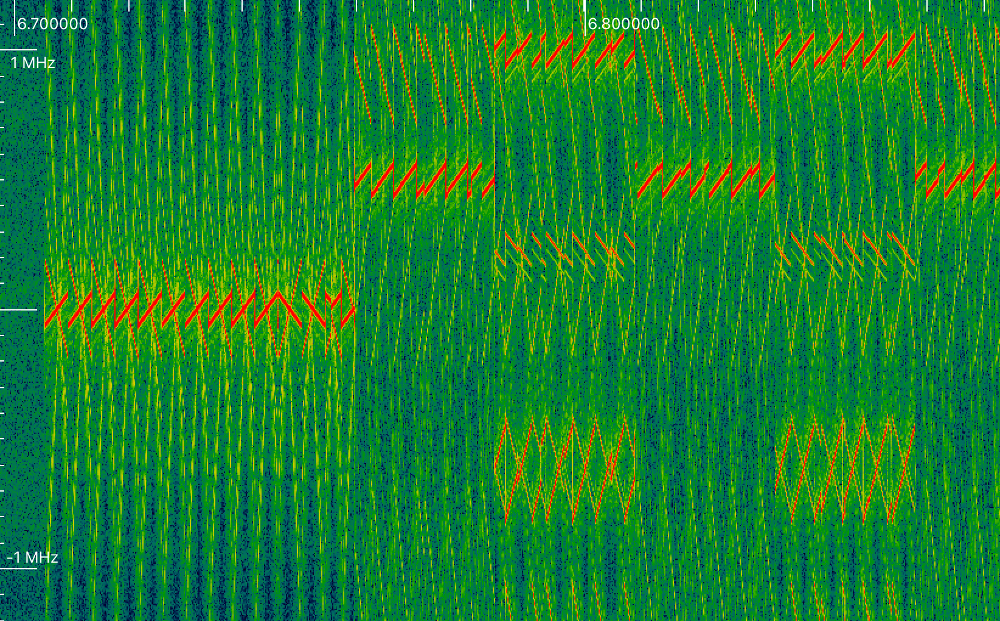

Недавно [появилась новость](https://echostarmobile.com/news/dryad-networks-selects-echostar-mobile-satellite-iot-solution-for-fire-prevention-service/) о том, что спутники компании EchoStar будут использовать метод LR-FHSS для передачи данных. Меня это сразу же заинтересовало. Во-первых, я разработал библиотку [sx127x](https://github.com/dernasherbrezon/sx127x) для работы с чипами LoRa. Во-вторых, эта библиотка используется для получения данных со спутников в [r2cloud](https://github.com/dernasherbrezon/r2cloud).

[LR-FHSS](https://blog.semtech.com/lorawan-protocol-expands-network-capacity-with-new-long-range-frequency-hopping-spread-spectrum-technology) - это [метод передачи сигнала](https://ru.wikipedia.org/wiki/Псевдослучайная_перестройка_рабочей_частоты), при котором приёмник и передатчик одновременно перепрыгивают на разные частоты с определённым интервалом. Это позволяет большему количеству устройств использовать один и тот же спектр частот.

Как оказалось, [FHSS в sx127x](https://semtech.my.salesforce.com/sfc/p/E0000000JelG/a/2R0000001Rbr/6EfVZUorrpoKFfvaF_Fkpgp5kzjiNyiAbqcpqh9qSjE) совсем не то же самое, что [LR-FHSS в sx126x](https://arxiv.org/html/2312.13981v1). Это совершенно другой протокол, который, в принципе, [может эмулироваться](https://github.com/Lora-net/SWDM001/blob/master/lib/sx126x_driver/src/lr_fhss_mac.c), но в общем случае несовместим с FHSS.

Тем не менее я решил добавить [поддержку FHSS](https://github.com/dernasherbrezon/sx127x/commit/138570279f996f2bced7aa9e945264cf4c5a6446) в sx127x.

Принцип работы следующий:

 * Передатчик через фиксированный период времени меняет частоту, на которой передаёт сообщение
 * Список частот можно либо сгенерировать заранее (не так эффективно), либо сгенерировать на основе первых байт входящего кусочка сообщения
 * Приёмник и передатчик используют один и тот же алгоритм
 
Библиотка по прерыванию ```SX127x_IRQ_FLAG_FHSSCHANGECHANNEL``` выбирает и устанавливает новую частоту. Конфигурация выглядит следующим образом:

```c
uint64_t frequencies[] = {437700000, 438200000, 437200012};
sx127x_lora_set_frequency_hopping(5, frequencies, sizeof(frequencies) / sizeof(uint64_t), &device)
```

В результате передатчик будет по очереди переключаться между тремя частотами и на спектограмме это будет выглядеть вот так:



Сигнал очень сильный, поэтому помимо основного сигнала видны его 2 и 3 гармоники.