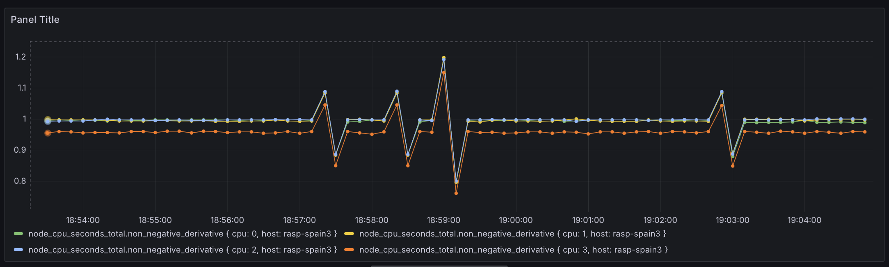
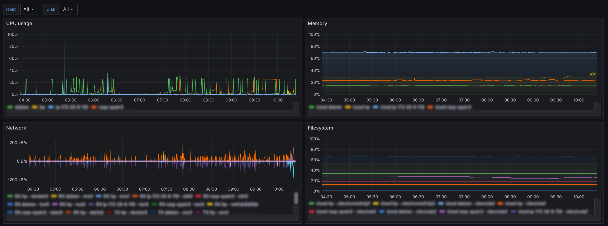

При обсуждении систем мониторинга всё чаще упоминается связка Prometheus и Grafana как стандартное решение. Она, вероятно, приобрела популярность за счёт простоты сбора метрик. Prometheus придумали простой [HTTP проткол](https://prometheus.io/docs/instrumenting/writing_exporters/), который позволяет получать метрики с различных систем. Но мне Prometheus не совсем подходит, и вот почему:

 * [Счётчики]() в нём работают не так, как хотелось бы. Есть даже [известная проблема](https://github.com/prometheus/prometheus/issues/3746), которую закрыли с пометкой "won't fix".
 * Использование pull-модели для получения данных. Несмотря на преимущества такого подхода, он менее удобен для отправки метрик с краткосрочных процессов. 
 * Нужно запускать отдельный процесс для сбора метрик.
 
## InfluxDB

Чтобы обойти эти проблемы, я решил использовать InfluxDB. Она не так популярна, как Prometheus, но у неё есть бесплатная [OSS-версия](https://github.com/influxdata/influxdb), которую легко поставить. Вот как это делается на Debian:

```bash
# Add the InfluxData key to verify downloads and add the repository
curl --silent --location -O \
https://repos.influxdata.com/influxdata-archive.key
echo "943666881a1b8d9b849b74caebf02d3465d6beb716510d86a39f6c8e8dac7515  influxdata-archive.key" \
| sha256sum --check - && cat influxdata-archive.key \
| gpg --dearmor \
| sudo tee /etc/apt/trusted.gpg.d/influxdata-archive.gpg > /dev/null \
&& echo 'deb [signed-by=/etc/apt/trusted.gpg.d/influxdata-archive.gpg] https://repos.influxdata.com/debian stable main' \
| sudo tee /etc/apt/sources.list.d/influxdata.list
# Install influxdb
sudo apt-get update && sudo apt-get install influxdb2
```

InfluxDB можно запускать как в распределённом режиме, так и одиночном. Для домашней сети одной ноды вполне достаточно. База данных совместима с push- и pull-моделями, причём pull-модель поддерживает протокол [экспортера Prometheus](https://prometheus.io/docs/instrumenting/writing_exporters/), что позволяет использовать существующие агенты.

## Сбор метрик

Для отправки данных в InfluxDB часто используется отдельный процесс - [Telegraf](https://github.com/influxdata/telegraf). Он периодически собирает системные метрики и передаёт их в базу. Есть даже [готовый дашборд](https://grafana.com/grafana/dashboards/928-telegraf-system-dashboard/) в Grafana, который может красиво визуализировать эти метрики. Всю эту цепочку можно достаточно легко настроить в несколько кликов, но у неё есть один недостаток - нужено устанавливать ещё один агент. В моей сети есть несколько Raspberry PI, где оперативной памяти не так много, поэтому хотелось бы переиспользовать уже запущенный fluent-bit.

Как оказалось, он может собирать метрики в своём собственном формате, в формате Prometheus, в формате OpenTelemetry, работать как proxy других экспортёров и многое другое. Я решил получше исследовать возможности, чтобы съэкономить память. Вот, например, сравнение потребления памяти между основными конкурентами:

<table>
<thead>
<tr>
<th>Агент</th>
<th>Версия</th>
<th>Память</th>
</tr>
</thead>
<tbody>
<tr>
<td>fluent-bit</td>
<td>3.2.8</td>
<td>32 Мб</td>
</tr>
<tr>
<td>node_exporter</td>
<td>1.9.0</td>
<td>15 Мб</td>
</tr>
<tr>
<td>telegraf</td>
<td>1.34.0</td>
<td>123 Мб</td>
</tr>
</tbody>
</table>

Пример конфигурации сбора метрик аналогичных [node_exporter](https://github.com/prometheus/node_exporter):

```yaml
inputs:
  - name: node_exporter_metrics
    tag: metrics.node_metrics
    scrape_interval: 10
    metrics: meminfo,filesystem,netdev
    processors:
      metrics:
        - name: labels
          insert: hostname ${HOSTNAME}
outputs:
  - name: influxdb
    match: metrics.*
    host: host
    database: fluentbit
    org: dernasherbrezon
    http_user: user
    http_passwd: password
    tag_keys: hostname
```

В этой конфигурации fluent-bit собирает метрики каждые 10 секунд и отправляет их в InfluxDB. Тут стоит обратить внимание на несколько вещей:

 * Переменная ```${HOSTNAME}``` автоматически заменяется именем хоста (поддерживаются [переменные среды](https://docs.fluentbit.io/manual/administration/configuring-fluent-bit/classic-mode/variables)).
 * Для добавления метаданных (например, имени хоста) используется секция ```processors```, так как стандартные фильтры не применяются к метрикам.
 * Cекция ```processors``` поддерживается только в yaml конфигурации, которая была добавлена в версии 3.2.

Согласно формату node_exporter метрика node_cpu_seconds_total измеряется не в процентах, а в секундах, которые процессор провёл в том или ином режиме. Это крайне плохое решение, так как из-за задержек сети она будет плавать. Вот, например, как это будет выглядеть на графике:



Для решения этой проблемы я использовал модуль [cpu](https://docs.fluentbit.io/manual/pipeline/inputs/cpu-metrics):

```yaml
inputs:
  - name: cpu
    tag: metrics.cpu
    Interval_Sec: 10
filters:
  - name: record_modifier
    match: metrics.*
    record: hostname ${HOSTNAME}
```

## Grafana

Когда дело доходит до создания дашбордов, то начинается вкусовщина. Для меня важна простота и понятность, поэтому я создал дашборд только с основными показателями системы:



Вот примеры запросов, которые использовались для создания графиков:

```
// CPU
SELECT last("cpu_p") FROM "metrics.cpu" WHERE ("hostname"::tag =~ /^$host$/) AND $timeFilter GROUP BY time($__interval), "hostname"::tag
// Memory
SELECT 100 - 100 * last("MemAvailable_bytes")/last("MemTotal_bytes") FROM "node_memory" WHERE ("hostname"::tag =~ /^$host$/) AND $timeFilter GROUP BY time($__interval), "hostname"::tag fill(null)
// Network RX
SELECT non_negative_derivative(last("receive_bytes_total"), 1s) FROM "node_network" WHERE ("hostname"::tag =~ /^$host$/ AND "device"::tag != 'lo') AND $timeFilter GROUP BY time($__interval), "hostname"::tag, "device"::tag
// Network TX
SELECT -non_negative_derivative(last("transmit_bytes_total"), 1s) FROM "node_network" WHERE ("hostname"::tag =~ /^$host$/) and ("device"::tag != 'lo') AND $timeFilter GROUP BY time($__interval), "hostname"::tag, "device"::tag
// Filesystem
SELECT 100 - 100 * last(avail_bytes) / last(size_bytes) FROM "node_filesystem" WHERE ("hostname"::tag =~ /^$host$/) and ("device"::tag =~ /^$disk$/) and  ("device"::tag != 'tmpfs') and  ("device"::tag != 'lxcfs') AND $timeFilter GROUP BY time($__interval), "hostname"::tag, "device"::tag
```
