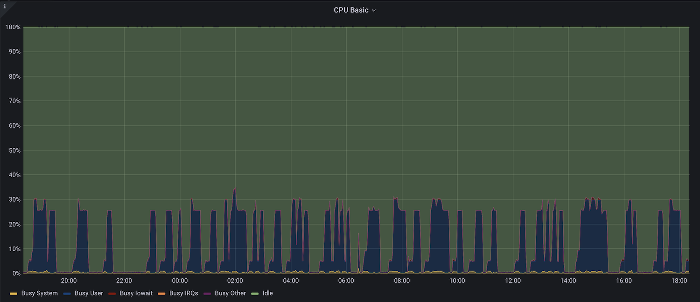
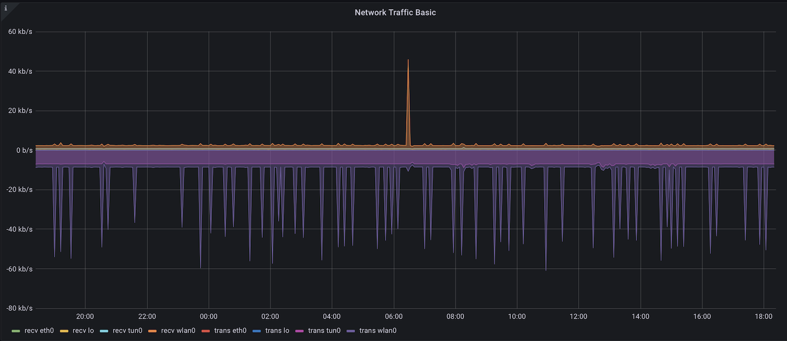
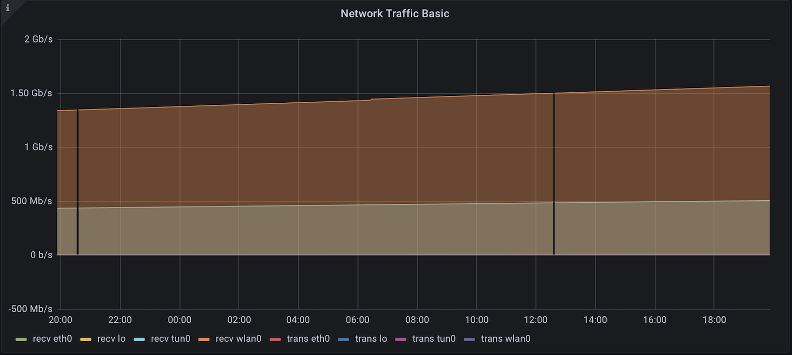

Любой, кто хотя бы раз сталкивался с системами мониторинга, знает, что существует два типа метрик: счётчики (counter) и датчики (gauge). Но не многие знают, зачем именно сделаны эти два типа.
 
### Датчики

Тип "датчик" используется для измерения текущего состояния. Обычно это число, которое может как увеличиваться, так и уменьшаться. Например, это могут быть измерения температуры, количество подключенных пользователей, load average и так далее. По сути, измерение любого стохастического процесса, про которого заранее ничего неизвестно.

### Счётчики

Тип "счётчик" обычно используется для метрик, значения которых [постепенно увеличиваются](https://ru.wikipedia.org/wiki/Монотонная_функция). Примером таких метрик может быть количество байт, посланных по сети, количество обработанных запросов и так далее.

### Практическое использование

Из этих определений по-прежнему непонятно зачем нужен тип "счётчик". Зачем хранить общее количество переданных байт, если, зачастую, интересна скорость передачи данных по сети? А скорость передачи можно посчитать во время съёма информации и записать в базу с типом "датчик". 

А всё дело в способе отображения значений на графике. Допустим, есть метрика "Температура" типа "датчик". Если нужно нарисовать график по минутам, то получится что-то вроде этого:



Всё просто: у нас есть 4 измерения, которые были сделаны раз в минуту.

А что если нам нужно отобразить данные за месяц? В месяце почти 43800 минут. Значит у нас есть 43800 значений, которые нужно отобразить на экране. Если каждое значение на графике будет занимать один пиксел, то потребуется картинка шириной 43800 пикселей. Это слишком много, да и смысла смотреть на каждый из этих 43800 пикселей нет. Поэтому нужно уменьшить количество данных. Есть несколько алгоритмов прореживания данных:

 * Выбрать среднее/минимальное/максимальное. Например, в rrdtool для этого [используется consolidation function (CF)](https://oss.oetiker.ch/rrdtool/doc/rrdcreate.en.html).
 * [Алгоритм Рамера — Дугласа — Пекера](https://ru.wikipedia.org/wiki/Алгоритм_Рамера_—_Дугласа_—_Пекера).

В любом случае график будет отображать приближённые данные. И в таком случае всегда нужно знать каким образом был нарисован график. График максимальных температур всегда будет непохож на график средних температур. Ещё это иногда приводит к достаточно забавным результатам. Например, полтора пользователя на сайте.

А теперь допустим, есть метрика "количество переданных байт" типа "счётчик". Если построить график как-есть, то получится не очень информативно:

Общее количество переданных байт не очень интересно. Но, если взять производную, то получится скорость! 

В примере выше производная приводится к скорости байт в секунду, потому что это стандарт измерения скорости передачи данных. Но ничто не мешает посчитать количество переданных байт в минуту или в месяц. Тип "счётчик" как раз позволяет это сделать. Для этого достаточно вычесть начальное значение из конечного значения:



Этот тип метрик позволяет строить достаточно точные графики и делает это максимально быстро.

Единственный недостаток случается, когда система перезапускается, и счётчик сбрасывается. В таком случае приложение должно само решить как интерпретировать такие события. В r2cloud я просто [считываю последнее сохранённое значение](https://github.com/dernasherbrezon/r2cloud/blob/master/src/main/java/ru/r2cloud/metrics/RRD4JReporter.java#L84) и добавляю его к входящему. Таким образом всегда получается монотонно возрастающие значения.

Таким образом, разделение метрик по разным типам позволяет в некоторых случаях отобразить результаты более точно.