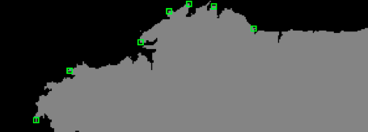
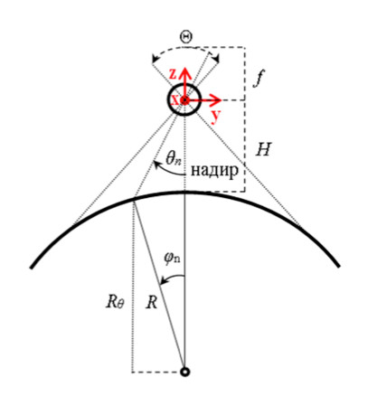
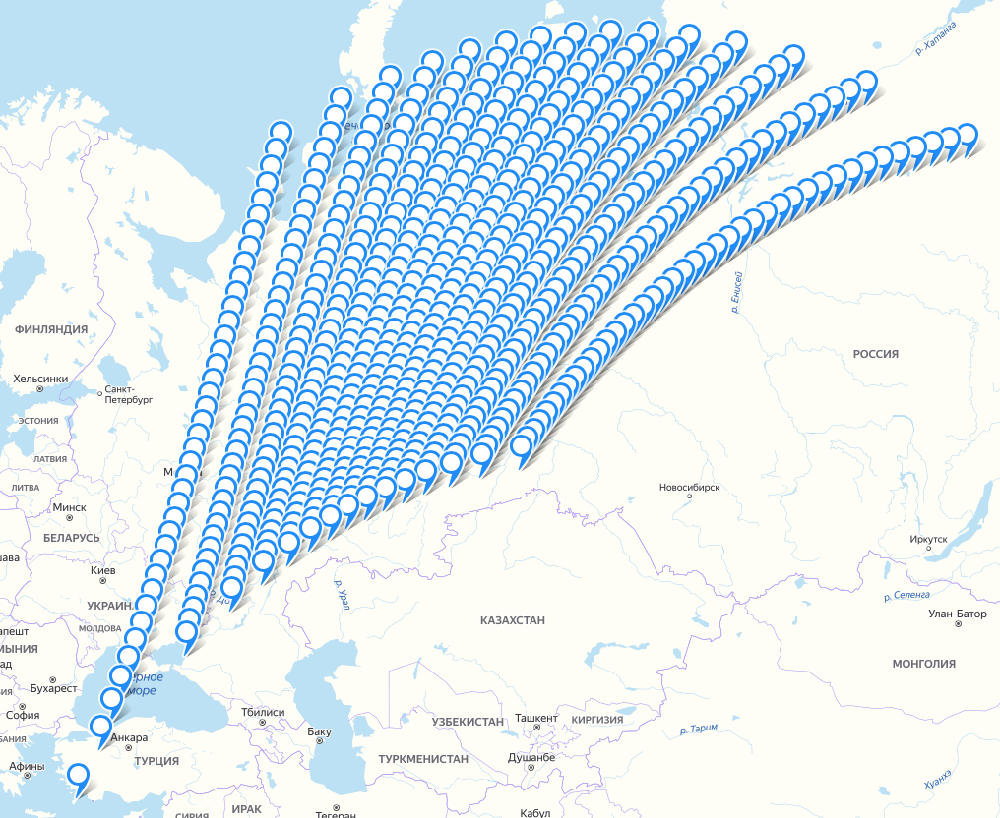

## Начало

В [прошлом посте]() я описал основные шаги, необходимые для геокодирования изображения. Здесь же, я хочу более подробно описать алгоритм получения опорных точек. Опорная точка - это отображение координат пиксела (X, Y) на географические координаты (широта, долгота).

Зная список опорных точек, можно растянуть изображение по ширине и высоте так, чтобы оно совпало с картой. Их, например, можно задать вручную в любой ГИС. Обычно выбирают береговые линии с характерными полуостровами:



Мне же такой способ не подходит, так как я хочу делать это в автоматическом режиме. Это более сложный способ, так как требуется смоделировать поведение спутника в каждый момент времени. А для этого нужно вычислить: 

 * положение спутника
 * положение камеры относительно спутника
 * параметры камеры (фокусное расстояние, пространственное разрешение и пр.)

Далее я постараюсь рассчитать каждый из этих параметров и посчитать на их основе опорные точки.

## Положение спутника

Положение спутника можно получить двумя способами:
 
 1. На основе телеметрии, которую передаёт сам спутник
 2. На основе SGP4 модели
 
Несмотря на то, что первый способ более точный, Метеор-М2 не передаёт эту информацию. Но это не беда. Можно рассчитать чуть менее точное положение на основе модели [SGP4](https://en.wikipedia.org/wiki/Simplified_perturbations_models). Для этого нужно знать:

 * TLE
 * текущее время
 
#### TLE
 
[TLE](https://ru.wikipedia.org/wiki/TLE) - это двухстрочный формат данных, представляющий собой набор элементов орбиты для спутника Земли. Взять актуальные параметры можно с сайта [www.celestrak.com](https://www.celestrak.com/NORAD/elements/weather.txt). Например, в данный момент TLE для Метеор-М2 такие:

```
METEOR-M 2              
1 40069U 14037A   20109.60817406 -.00000042  00000-0 -58409-8 0  9990
2 40069  98.5096 149.3859 0006903  94.0019 266.1946 14.20671606299713
```

#### Текущее время

Время - очень важный параметр, который нужно знать для каждой строчки изображения. Его можно получить двумя способами:

 1. На основе информации со спутника
 2. Рассчитать на станции приёма
 
К счастью, Метеор-М2 передаёт время формирования изображения в каждом пакете. В протоколе LRPT для этого существует вторичный заголовок, в котором может содержаться актуальное время:


Метеор-М2 передаёт в поле "мс суток" количество миллисекунд, прошедших с начала дня по московскому времени.

#### Расчёт положения

На основе этих данных можно посчитать положение спутника. Для этого я использую библиотеку [orekit](https://www.orekit.org):

```java
String line1 = "1 40069U 14037A   20109.60817406 -.00000042  00000-0 -58409-8 0  9990";
String line2 = "2 40069  98.5096 149.3859 0006903  94.0019 266.1946 14.20671606299713";
TLEPropagator tlePropagator = TLEPropagator.selectExtrapolator(new TLE(line1, line2));

AbsoluteDate date = new AbsoluteDate("2020-04-11T05:36:00.899994", TimeScalesFactory.getUTC());
PVCoordinates pv = tlePropagator.getPVCoordinates(date);
```

Здесь для примера я взял расчёт положения для времени ```2020-04-11 05:36```. Таким же образом можно найти положение для любой даты. Единственное, что нужно учитывать - это устаревание TLE. Посчитать траекторию спутника на длительном отрезке времени достаточно сложно и ресурсоёмко. Именно поэтому авторы SGP4 выбрали простые расчёты и периодическую коррекцию на основе визуальных наблюдений.

Если рассчитать положение спутника с 2020-04-11 05:36 по 2020-04-11 05:46 и наложить полученные координаты на Яндекс карты, то получится вот такая симпатичная картинка:


К слову, использование Яндекс карт оказалось очень удобным способом отладки.

## Положение камеры относительно спутника

Следующим шагом необходимо понять направление камеры. Для этого необходимо вычислить [кватернионы](https://ru.wikipedia.org/wiki/Кватернионы_и_вращение_пространства) самого спутника. Согласно документации, камера спутника смотрит точно в надир. То есть, спутник равномерно вращается вокруг своей оси и при этом угол напрямую зависит от положения относительно Земли. Всё это можно смоделировать с помощью orekit:

```java
String line1 = "1 40069U 14037A   20109.60817406 -.00000042  00000-0 -58409-8 0  9990";
String line2 = "2 40069  98.5096 149.3859 0006903  94.0019 266.1946 14.20671606299713";
TLEPropagator tlePropagator = TLEPropagator.selectExtrapolator(new TLE(line1, line2));

Frame eme2000 = FramesFactory.getEME2000();
Frame earthFrame = FramesFactory.getITRF(IERSConventions.IERS_2010, true);
OneAxisEllipsoid earth = new OneAxisEllipsoid(Constants.WGS84_EARTH_EQUATORIAL_RADIUS, Constants.WGS84_EARTH_FLATTENING, earthFrame);
BodyCenterPointing earthCenterAttitudeLaw = new BodyCenterPointing(eme2000, earth);
AbsoluteDate date = new AbsoluteDate("2020-04-11T05:36:00.899994", TimeScalesFactory.getUTC());
Attitude attitude  = earthCenterAttitudeLaw.getAttitude(tlePropagator, date, eme2000);
```

Основная идея заключается в том, чтобы определить угол между базисными векторами спутника и вектором, соединяющим центр спутника и центр Земли. Конечно, для более точного позиционирования нужно использовать гравитационный центр Земли. А для этого использовать гравитационные карты Земли. К счастью, в случае Метеор-М2 и камеры MСУ-МР, такой точности не требуется.

## Параметры камеры

Самый сложный шаг заключается в моделировании камеры МСУ-МР. Дело в том, что в интернете почти нет её параметров. Я почти разуверился в том, что это вообще возможно найти, однако мне удалось раскопать научную статью "[МЕТОДИКИ ОПРЕДЕЛЕНИЯ ВЕЛИЧИНЫ ПРОЕКЦИИ ПИКСЕЛЯ СЪЁМОЧНЫХ СИСТЕМ МСУ-МР И КМСС НА МЕСТНОСТЬ](http://jurnal.vniiem.ru/text/154/32-42.pdf)". В ней вскользь упоминаются параметры:

 * количество точек N=1568
 * общий угол обзора Θ = 110,5°
 * фокусное расстояние. Зависит от типа канала:
   * f=150мм,w=0,2 мм для каналов 1,2
   * f=150мм,w=0,18мм для канала 3
   * f=40мм, w=0,05мм для каналов 4,6 	

Схематично геометрия съёмки выглядит следующим образом:



Для модели расчёта опорных точек мне нужно рассчитать вектора исходящие из камеры и направленные на поверхность. Если принять угол Θn = Θ * n / N, то вектора можно рассчитать следующим образом:

```java
double width = 1568;
double delta = FastMath.toRadians(110.5) / width;
for (int i = 0; i < width; i++) {
    SinCos sc = FastMath.sinCos((i - width / 2) * delta);
    Vector3D curVector = new Vector3D(0.0, sc.sin(), sc.cos());
}
```

## Построение опорных точек

На основе полученных параметров можно рассчитать опорные точки. Для этого надо вспомнить школьный курс неевклидовой геометрии и рассчитать проекции на сферу. Или можно взять готовую библиотеку [Rugged](https://www.orekit.org/rugged/). В ней описана достаточно сложная модель получения опорных точек. Она учитывает скорость света и относительную скорость спутника относительно Земли, модель рефракции атмосферы. Также можно, например, загрузить карту высот и получить более точные координаты. 


Для МСУ-МР такая точность не нужна, но это может быть полезно для других типов камер и спутников.

Центральным классом модели является ```Rugged```. Его можно создать следующим способом:

```java
LOSBuilder losBuilder = new LOSBuilder(rawDirs);
TimeDependentLOS lineOfSight = losBuilder.build();
		
MeteorLineDatation lineDatation = new MeteorLineDatation(image, startOfTheDay.getTime());
LineSensor lineSensor = new LineSensor("MSU_MR", lineDatation, Vector3D.ZERO, lineOfSight);

Rugged rugged = new RuggedBuilder().
	// do not use Digital Elevation Model
	setAlgorithm(AlgorithmId.IGNORE_DEM_USE_ELLIPSOID). 
	setEllipsoid(EllipsoidId.WGS84, BodyRotatingFrameId.ITRF).
	// calculate 10 minute pass
	setTimeSpan(absDate, absDate.shiftedBy(60 * 10), 0.01, 8 / lineSensor.getRate(0)). 
	setTrajectory(InertialFrameId.EME2000,
	              satellitePVList, 4, CartesianDerivativesFilter.USE_PV,
	              satelliteQList,  4,  AngularDerivativesFilter.USE_R).
	addLineSensor(lineSensor).
	build();
```

Алгоритм следующий:

 * создаётся ```lineOfSight``` на основе параметров камеры
 * создаётся модель сенсора на основе ```lineOfSight``` и, так называемого,  ```LineDatation```. Это объект, который позволяет на основе индекса строки получить дату и наоборот
 * для расчёта координат точек:
   * используется проекция WGS84. Об этом будет чуть подробнее в следующей статье
   * траектория спутника ```satellitePVList```
   * кватернионы спутника ```satelliteQList```

Как только объект создан, можно вычислить опорные точки:

```java
int lineIndex = 0;
int pixelIndex = 0;
// position of sensor within spacecraft frame
Vector3D position = lineSensor.getPosition();
AbsoluteDate date = lineSensor.getDate(lineIndex);
// get line-of-sight
Vector3D los = lineSensor.getLOS(date, pixelIndex);
// calculate GCP
GeodeticPoint gcp = rugged.directLocation(date, position, los);
```

## Результат

Для того чтобы проверить корректность модели, можно рассчитать опорные точки для каждого пиксела и нанести на карту. Например, неправильно рассчитанные квартернионы дают следующую картинку:



Судя по изображению, камера спутника сначала смотрит точно в надир, а потом начинает отклоняться вверх и влево.

Если все параметры заданы верно, то опорные точки должны выглядеть так:


Здесь видно, что:

 1. Спутник летит под небольшим углом с севера на юг
 2. Расстояния между линиями увеличиваются с юга на север из-за проекции меркатора
 3. Расстояния между пикселами увеличиваются из центра к краям из-за широкоугольной камеры спутника

После того как получены опорные точки и они выглядят правдоподобно, можно переходить к следующему шагу: создание GeoTiff файла.

<hr/>

Геокодирование спутниковых снимков:

  1. [Введение]()
  2. Опорные точки
  3. [GeoTIFF]()
  4. [Тайлы]()

