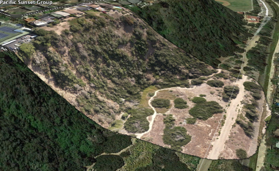
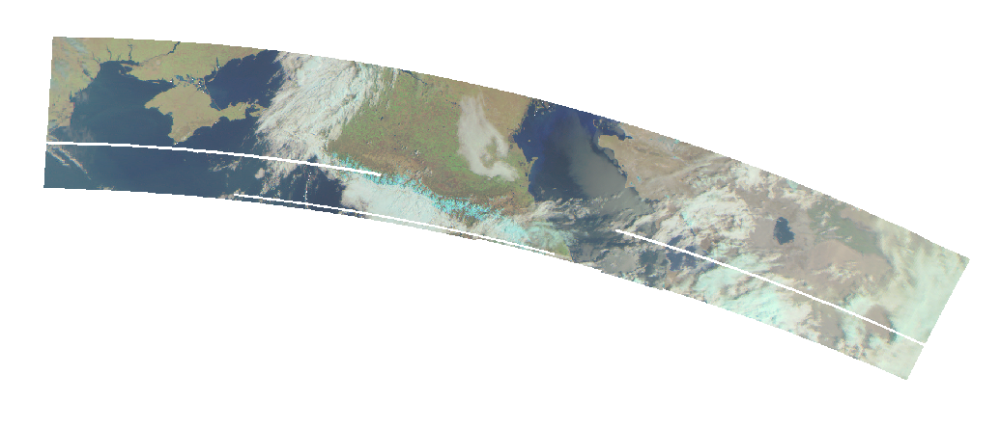

## Начало

Итак, в [прошлом посте]() я описал основные шаги, необходимые для получения списка опорных точек. Следующим шагом будет создание файла в формате [GeoTIFF](https://en.wikipedia.org/wiki/GeoTIFF). Это подмножество формата tiff, в котором хранится дополнительная геоинформация. Почти все современные ГИС поддерживают этот формат, поэтому в нём распространяются как карты [Google Earth](https://developers.google.com/earth-engine/exporting), так и панорамы съёмки [квадрокоптерами](https://support.dronedeploy.com/docs/data-export-formats).



## GDAL

Для работы с GeoTIFF форматом существует множество библиотек. Наиболее популярная и открытая - [GDAL](https://gdal.org). Она позволяет создавать и редактировать GeoTIFF, выполнять преобразование из одной проекции в другую, создавать тайлы. Несмотря на то, что есть [java альтернативы](https://www.geotools.org), я решил использовать именно GDAL. Прежде всего из-за лицензии и большого сообщества.

Итак, для того, чтобы создать GeoTIFF, нужно использовать команду ```gdal_translate```:

```
gdal_translate -gcp pixel1 line1 X1 Y1 -gcp pixel2 line2 X2 Y2 ... source.tif sourceGCP.tif
```

С это командой есть несколько проблем:

 * она создаёт промежуточный GeoTIFF файл. Для того чтобы наложить изображение на карту, его необходимо преобразовать в формат EPSG:3857. Хотелось бы сразу генерировать файл в нужной проекции.
 * задавать опорные точки через командную строку не очень удобно. Особенно есть их очень много.
 
К счастью, в GDAL есть мета-формат для описания виртуальных датасетов - [VRT](https://gdal.org/drivers/raster/vrt.html). Он позволяет описывать опорные точки и соответствующее им оригинальное изображение.

## VRT

vrt файл - это обычный xml файл. Для него даже есть [xml схема](https://raw.githubusercontent.com/OSGeo/gdal/master/gdal/data/gdalvrt.xsd), чтобы проверить корректность. Для своих нужд я создал следующий файл: 

```xml
<VRTDataset rasterXSize="1568" rasterYSize="480">
	<GCPList Projection="EPSG:4326">
		<GCP Id="0" Pixel="1568.5" Line="0.5" X="64.87017562215375" Y="41.05354188002164" Z="0.0" />
		<GCP Id="1" Pixel="1536.5" Line="0.5" X="62.466422534484025" Y="41.906597006909756" Z="0.0" />
		...
	</GCPList>
	<VRTRasterBand dataType="Byte" band="1">
		<Description>channel1</Description>
		<NoDataValue>0.0</NoDataValue>
		<SimpleSource>
			<SourceFilename relativeToVRT="1">output.png</SourceFilename>
			<SourceBand>1</SourceBand>
		</SimpleSource>
	</VRTRasterBand>
	<VRTRasterBand dataType="Byte" band="2">
		<Description>channel2</Description>
		<NoDataValue>0.0</NoDataValue>
		<SimpleSource>
			<SourceFilename relativeToVRT="1">output.png</SourceFilename>
			<SourceBand>2</SourceBand>
		</SimpleSource>
	</VRTRasterBand>
	<VRTRasterBand dataType="Byte" band="3">
		<Description>channel3</Description>
		<NoDataValue>0.0</NoDataValue>
		<SimpleSource>
			<SourceFilename relativeToVRT="1">output.png</SourceFilename>
			<SourceBand>3</SourceBand>
		</SimpleSource>
	</VRTRasterBand>
</VRTDataset>
```

В этом файле следует обратить внимание на несколько вещей:

 * Список опорных точек создан для модели земли WGS84 (EPSG:4326) 
 * ```output.png``` - оригинальное изображение.
 * Для каждого канала изображения есть описание. Например, ```<Description>channel2</Description>``` - данные спектрального диапазона 0.7-1.1 мкм.

## gdalwarp

После того как vrt файл создан, можно создавать GeoTIFF в нужной проекции:

```bash
gdalwarp -tps -overwrite -t_srs epsg:3857 -of GTIFF output.vrt output.tif
```

Где:

 * tps (thin plate spline) - метод интерполяции точек. Без него gdalwarp не сможет правильно обработать опорные точки
 * epsg:3857 - проекция [web mercator](https://en.wikipedia.org/wiki/Web_Mercator_projection). Эту проекцию используют все вэб карты: google карты, open street map, yandex карты
 * GTIFF - формат выходного файла.
 
В результате оригинальное изображение:


Будет преобразовано в следующее:



Как видно, оно было немного повёрнуто и растянуто по краям. На первый взгляд выглядит как раз то, что и нужно было сделать. Но как же убедиться, что всё правильно? Всё правильно, надо наложить его на настоящую карту. Об этом и пойдёт речь в следующей статье.
 
<hr/>

Геокодирование спутниковых снимков:

  1. [Введение]()
  2. [Опорные точки]()
  3. GeoTIFF
  4. [Тайлы]()

