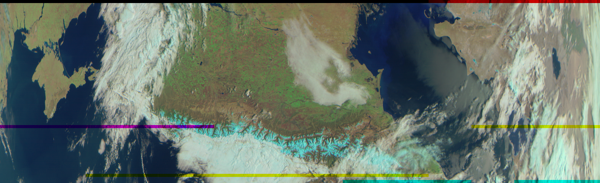
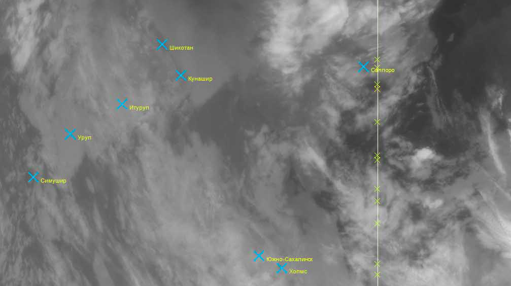
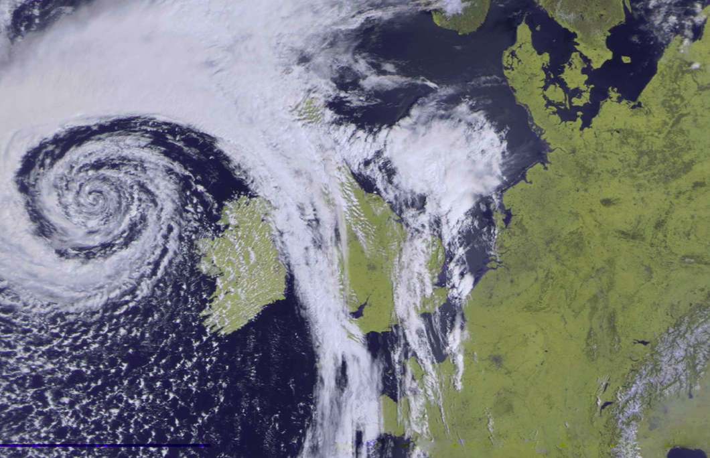
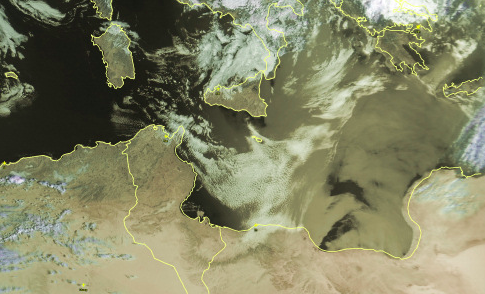

## Начало

Пару лет назад я научился [получать изображение]() со спутника Метеор-М2. Тогда я подробно прошёлся по всей модели OSI, начиная с физического уровня rtl-sdr и заканчивая транспортным LRPT. Все наработки я интегрировал в [r2cloud](https://github.com/dernasherbrezon/r2cloud), и с тех пор у меня в автоматическом режиме сохраняются все изображения.

Однако, меня не покидало ощущение некоторой незавершённости задачи. Изображения-то я получал, но что делать с ними дальше совершенно не знал. Вернее, конечно же, знал: как и любой другой метеорологический снимок, он нужен для того, чтобы предсказывать погоду.

Как видно на изображении выше, у всех снимков с Метеор-М края сильно деформированы. Регион, который они покрывают тоже сложно угадать. С такими изображениями не то, что погоду предсказать, с ними понять погоду совершенно невозможно.

Бегло пробежавшись по результатам выдачи google, я нашёл несколько программ, которые позволяют обрабатывать такие снимки.

## Lrpt places

Программа распространяется через форум [radioscanner](http://www.radioscanner.ru/forum/topic47659-146.html) и позволяет добавлять метки городов на изображение.

Это хорошая программа, которая позволяет быстро понять погоду в своём городе и в нескольких соседних. Однако, она имеет несколько серьёзных недостатков:

 * изображение навсегда портится, так как метки и текст рисуются прямо на нём.
 * названия городов только на одном языке. Я не уверен, есть ли локализация на другие языки.
 * список городов фиксирован. При этом отображаются только крупные города. Если Вы живёте в небольшой деревушке, то её нельзя будет найти.
 * снимок по-прежнему деформирован по краям и его сложно анализировать.
 * программа работает только под Windows и запускается вручную.
 
## SmoothMeteor

Программа [SmoothMeteor](https://leshamilton.co.uk/meteor3m.htm0) позволяет растягивать изображения, тем самым устраняя деформации по краям.

Как и предыдущая программа, она имеет ряд недостатков:

 * изображение повёрнуто по ходу движения спутника.
 * нет городов и границ стран. Нельзя понять какая погода в моём городе.
 * программа работает только под Windows и запускается вручную.
 
## LrptImageProcessor

[LrptImageProcessor](https://www.satsignal.eu/software/LRPT-processor.html) позволяет исправлять искажения, накладывать города и границы стран.

Из недостатков:

 * неточности в наложении границ.
 * работает только под Windows и запускается вручную.
 
## Требования

Все эти программы работают хорошо, но я захотел сделать лучше и определил для себя следующие требования:

 1. Автоматическая обработка и возможность запускать из-под Linux. Все мои изображения принимаются в автоматическом режиме и мне хочется их так же обрабатывать в автоматическом режиме.
 2. Результат обработки должен быть в стандартном формате. Я точно не первый человек на планете, который обрабатывает изображения со спутников. Именно поэтому, мне хочется выдавать результат, который будет удобно использовать для дальнейшей обработки.
 3. Правильная работа со слоями. Все программы выше просто комбинируют каналы изображения в RGB картинку и делают JPEG. Однако, на Метеор-М2 есть 6 каналов, которые могут включаться и выключаться. И они не всегда соответствуют R, G и B. В тот момент, когда каналы группируются в RGB теряется информация о том, какой именно канал был использован где.
 4. Полученные изображения можно наложить на Яндекс карту или open street map. Это позволит точно понять, где какой город, речка и страна.
 
## Анализ

Итак, прежде всего необходимо понять в каком виде существуют метео данные. [Nasa Earth Data](https://earthdata.nasa.gov/collaborate/open-data-services-and-software/data-information-policy/data-levels) даёт классификацию данных по 4 уровням:

 * уровень 0. Данные со спутника в необработанном виде. Тип данных зависит от протокола передачи. В случае Метеор-М2 - это VCDU.
 * уровень 1А. Реконструированные данные с временными метками и вспомогательной информацией. Посчитанной, но не применённой к изображению.
 * уровень 1B. Данные уровня 1А, но вспомогательная информация откалибрована на основе параметров сенсора.
 * уровень 2. Геокодированные данные.
 * уровень 3. Спроецированные и геокодированные данные с учётом всех исправлений и коррекций. 
 * уровень 4. Обработанные данные с учётом разных моделей. Например, [NDVI](https://en.wikipedia.org/wiki/Normalized_difference_vegetation_index).
 
Исходя из такого описания, я хочу формировать данные уровня 1B или уровня 2. Уровни 3 и 4 требуют глубоких знаний приборов и различных метеорологических моделей. Я пока не готов погружаться на такую глубину.

Как легко заметить, эти уровни чем-то похожи на уровни модели OSI. Где каждый уровень предоставляет интерфейс или данные для последующего. Это значит, что подготовив данные уровня 2, я могу предоставить их в стандартном виде для последующей обработки. В теории, любой метеоролог может их взять и начать использовать.

## Шаги

Итак, чтобы получить геокодированные данные, мне нужно сопоставить каждому пикселю координаты широты и долготы. Несмотря на то, что это звучит достаточно просто, этому процессу посвящено отдельное направление науки - [Дистанционное зондирование Земли](https://ru.wikipedia.org/wiki/Дистанционное_зондирование_Земли). На эту тему написано множество увесистых книжек, поэтому я не буду здесь выводить формулы и аксиомы, а лишь опишу основные шаги.

Задача геокодирования изображений для каждого спутника может выглядеть чуть-чуть по-другому. Я же постараюсь описать шаги для Метеор-М2. В общем случае алгоритм выглядит следующим образом:



На первом этапе необходимо получить:

 * положение спутника в пространстве
 * положение камеры относительно спутника
 * непосредственно изображение с временными метками
 * параметры камеры. Такие, как фокусное расстояние, пространственное разрешение и пр.

На втором этапе создаётся список опорных точек. Каждая точка - это отображение пиксела в соответствующую широту и долготу.

На третьем этапе формируется файл в формате GeoTiff. Это специальный формат, который позволяет хранить изображение и привязанные к нему контрольные точки.

На четвёртом этапе можно загрузить файл в любую ГИС и проверить результат. Либо нарезать GeoTiff на тайлы и наложить на карту.

Я постараюсь описать каждый из этих шагов в последующих статьях по-подробнее. А в самом конце будет результат работы.

Геокодирование спутниковых снимков:

  1. Введение
  2. [Опорные точки]()
  3. [GeoTIFF]()
  4. [Тайлы]()