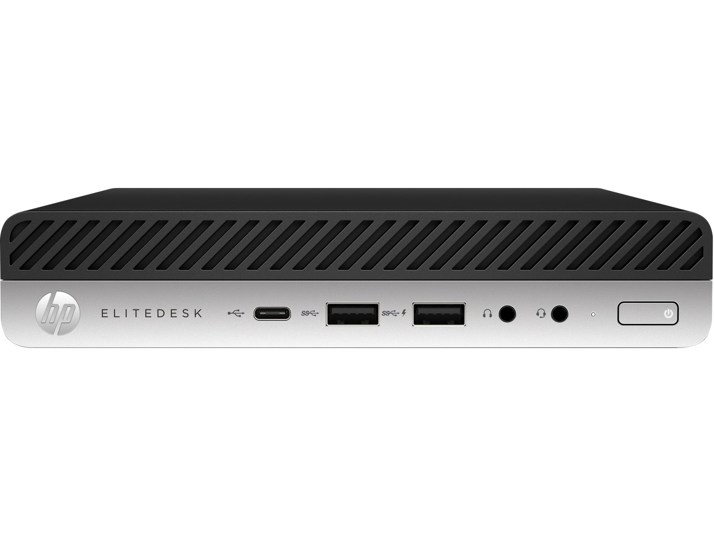
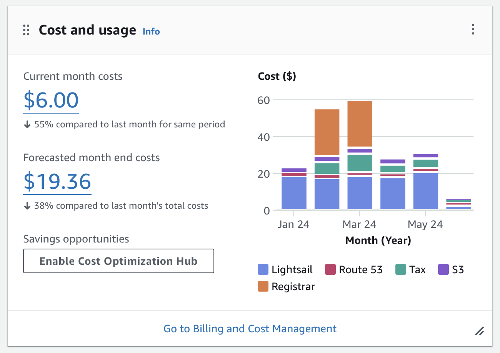
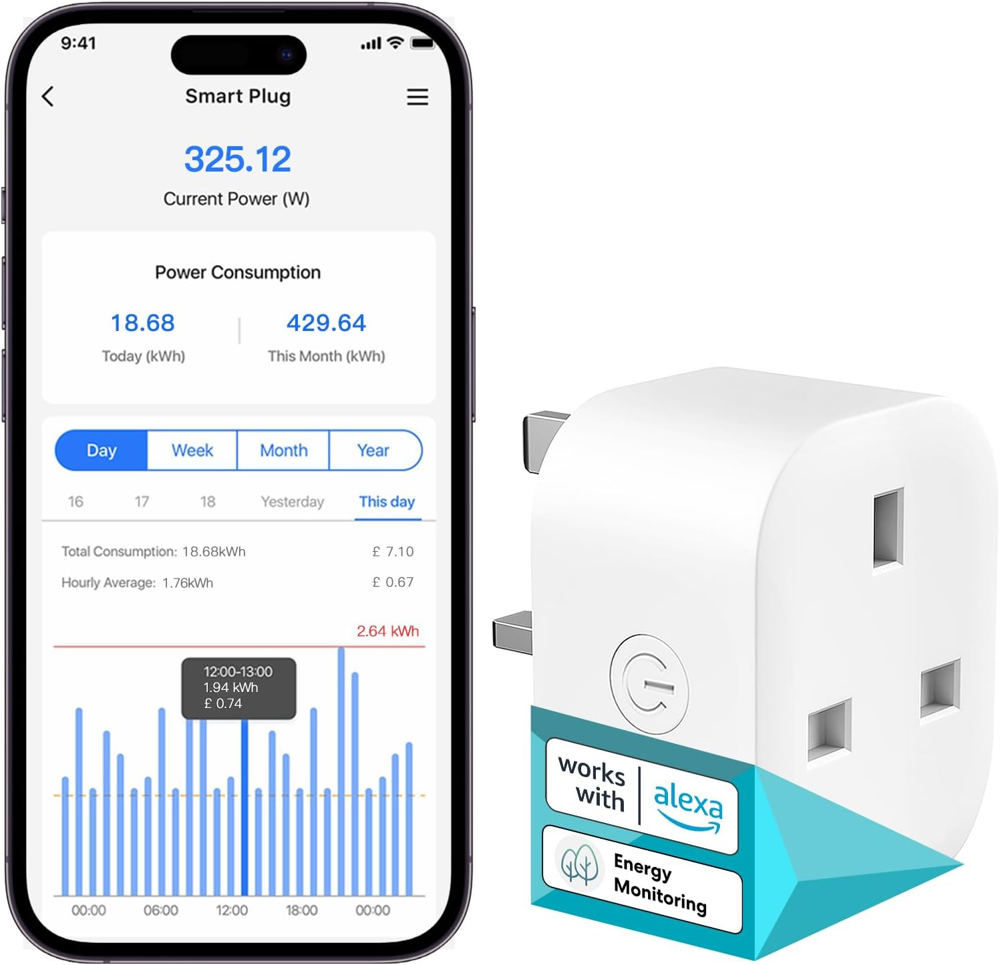
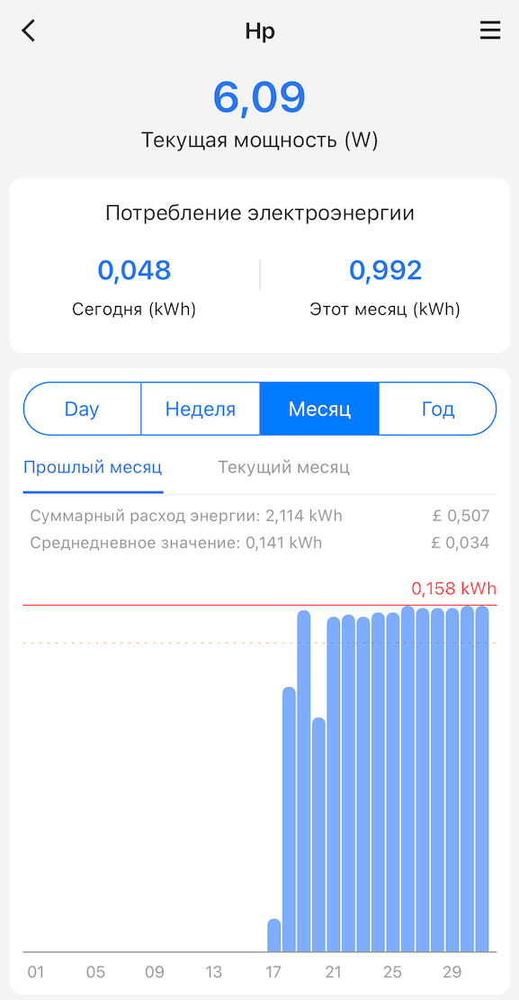

"Домашний сервер" - это что-то из 2000-х, когда люди держали у себя дома небольшой сервер, который раздавал веб сайт, отправлял почту или просто хранил гигабайты фотографий. Но уже в 2010-х держать такой сервер дома считалось моветоном, и всё больше людей склонялось к тому, что облако победило. Именно на тот период приходится расцвет таких замечательных сервисов как AWS, Dropbox, Google Disk и тп. Аргументами за переезд были: "А кто будет обновлять этот сервер и накатывать security патчи?", "А что, если Интернет пропадёт?", "За электричество денег уйдёт не меньше". И вот на дворе 2024-ый год, и я решил проверить насколько актуальны эти проблемы и завёл себе небольшой домашний сервер.

## Выбор сервера

Изначально я поставил RaspberryPI 4 и подключил к нему SSD на 256Gb. Таким образом у меня получился достаточно быстрый сервер, с минимальным потреблением энергии и быстрым диском. Он идеально подходил для какой-то небольшой разработки, компиляции и фильтрации траффика внутри домашней сети. Однако, со временем мне захотелось поставить на него больше сервисов. Например, неплохо было бы перенести jenkins с моего MacBook Air. Он занимает в памяти почти 2Гб, хотя использую я его крайне редко. Или, например, собирать [sdr-server](https://github.com/dernasherbrezon/sdr-server) для amd64. Или перенести часть виртуалок с AWS Lightsail и съэкономить денег.

В итоге всё это привело к тому, что я купил подержанный [HP EliteDesk 800 G3 Desktop Mini - Core i5-7500 3.4 GHz - 8 GB DDR4 - 256 GB SSD](https://www.ebay.co.uk/itm/364890844533):

Я совсем не разбираюсь в линейке современных Intel процессоров и модельном ряде HP. Определяющим фактором стала цена - 90£. Примерно за эту же сумму можно купить RaspberryPI 5 с блоком питания, корпусом и SSD диском. Однако, в отличие от Raspberry, этот mini PC [гораздо мощнее](https://www.youtube.com/watch?v=amVP96OYfUg). У него больше памяти, больше диск, защищённый металлический корпус и абсолютно стандартный блок питания. В дополнение к этому за последние 20 лет производители научились делать достаточно энергоэффективные сборки.

## Выбор системы

Мне периодически нужно собирать проекты под Debian и Ubuntu, поэтому выбор операционной системы очевиден - Debian 12 (Bookworm). Установка с USB устройства прошла без проблем. Я даже установил систему два раза: первый раз с графической оболочкой, а второй - чисто headless вариант. При этом более тонкий дистрибутив потребляет на 700Мб меньше памяти.

## Перенос проектов

У меня в AWS Lightsail есть две виртуалки, которые используются чисто для внутренних целей: одна собирает метрики о состоянии Raspberry PI устройств, а другая хостит комментарии к этому блогу. Я поднимал их в Lightsail на самом минимальном тарифе - 5$ за штуку ( + сколько-то за выделенный IPv4 адрес). Так как у меня появился домашний сервер, то имело смысл перенести все сервисы на него. Даже если пропадёт Интернет - это не будет большой потерей для общества.

Каково же было моё удивление, когда я обнаружил, что эти виртуалки просто зависли. Я не смог залогиниться туда по SSH, ни получить какой-нибудь ответ по HTTP. Неудивительно, что мои статьи почти никто не комментирует! При этом Amazon очень честно показывал, что виртуалки подняты, работают и у них есть выделенный IPv4. А раз они работают, значит можно честно взять за это деньги.

Пока-пока!

## Потребление энергии

По заверениям компьютерных энтуазистов основной статьёй расхода является потребление энергии. Если сервер будет работать 24/7, то это может стоить примерно столько же сколько и хостинг виртуалки. Особенно актуально в странах с дорогой энергией. Я решил это лично проверить и купил умную розетку:

А всё потому, что в зависимости от нагрузки потребление энергии будет разным. А нагрузка у каждого своя.

Я измерял потребление энергии на протяжении целого месяца с помощью приложения и получил следующие результаты:

Весь день сервер стоит, ничего не делает и потребляет ~7Вт (0.158кВт за 24 часа). За месяц это будет примерно 4.8кВт. У меня тариф 0.24£ за кВт, поэтому в месяц я буду платить баснословные 1.15£. Это примерно в 4 раза меньше, чем хостинг одной виртуалки в AWS.

Разумеется, если домашний сервер будет компилировать Linux ядро 24 часа в сутки или обучать нейронную сеть, то стоимость будет значительно выше. Но для моих задач - это подходит более, чем полностью!

## Выводы

 * Подержанные mini PC - это действительно вещь.
 * Не стоит сдаваться облаку раньше времени
 * Всё нужно мерить самому