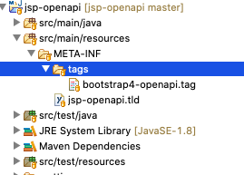
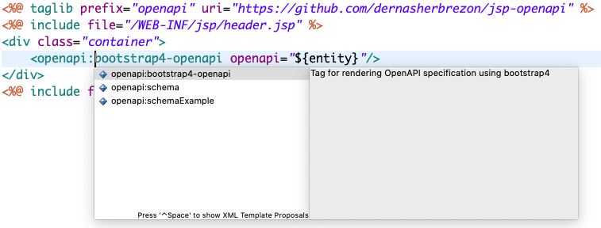
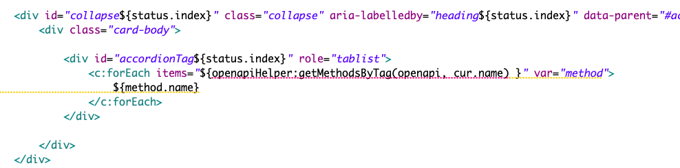

Несмотря на то, что технологии [JSP](https://en.wikipedia.org/wiki/JavaServer_Pages) уже почти 20 лет, она по-прежнему не перестаёт удивлять своей продуманностью. В частности, мне очень нравится как реализовано переиспользование компонентов. Если вкратце, то в JSP есть несколько способов.

### include 

Позволяет вставлять в страницу кусок другой страницы. Обычно используется, если нужно переиспользовать блоки без параметров. Например:

```html
<%@ include file="/WEB-INF/jsp/header.jsp"%>
<div class="container">
	<h1>Hello world!</h1>
</div>
<%@ include file="/WEB-INF/jsp/footer.jsp"%>
```

### Тэги

Позволяют создавать блоки с параметрами. Сами тэги описываются в java коде. Например:

```html
<%@ taglib prefix="c" uri="http://java.sun.com/jsp/jstl/core"%>
<c:if test="${not empty header }">
	<h1><c:out value="${header}"></h1>
</c:if>
```

При этом тэг объявлен в специальном .tld файле:

```xml
<tag>
    <description>
        Simple conditional tag, which evalutes its body if the
        supplied condition is true and optionally exposes a Boolean
        scripting variable representing the evaluation of this condition
    </description>
    <name>if</name>
    <tag-class>org.apache.taglibs.standard.tag.rt.core.IfTag</tag-class>
    ...
 </tag>
```

И реализация в Java классе:

```java
public class IfTag extends ConditionalTagSupport {
    @Override
    public int doStartTag() throws JspException {

        // execute our condition() method once per invocation
        result = condition();

        // expose variables if appropriate
        exposeVariables();

        // handle conditional behavior
        if (result) {
            return EVAL_BODY_INCLUDE;
        } else {
            return SKIP_BODY;
        }
    }
    ...
}
```

Тэги можно кэшировать и сбрасывать на диск при горячей миграции servlet-контейнера. 

### Тэг-файлы

То же самое, что и обычные тэги, только описываются в .tag файле, который можно напрямую подключить в JSP страницу. Очень удобно, так как не надо создавать промежуточный .tld файл. Например:

```html
<%@ tag pageEncoding="UTF-8" %>
<%@ attribute name="name" required="true" rtexprvalue="false" %>
<h1>${name}</h1>
```

И использование:

```html
<%@ taglib prefix="er" tagdir="/WEB-INF/tags" %>
<er:title name="Hello world"/>
```

## Переиспользование

Но это ещё не всё. Самое интересное - это возможность переиспользовать компоненты между разными проектами. Для этого достаточно собрать .jar файл с описанием тэгов. После этого его можно подключать и использовать в разных проектах.

До недавнего времени я успешно собирал различные библиотеки с обычными тэгами. Например, [jtimeago]() - библиотека для отображения прошедшего времени в человеко-читабельном виде или [spring-security-taglib](https://github.com/dernasherbrezon/spring-security-taglib) - библиотека для простой проверки ролей spring-security.

Однако, когда мне понадобилось отобразить спецификацию OpenAPI, обычные тэги уже не подошли. Их не так удобно использовать для отрисовки большого количества html-кода. Я не знал, можно ли переиспользовать продвинутые тэг-файлы, и сделал небольшое исследование. Каково было моё удивление, когда я узнал что это возможно!

### Переиспользование тэг-файлов

По сравнению с обычными тэгами, библиотеку необходимо собрать особым образом:



Тэг-файл должен находится в подпапке ```/META-INF/tag``` и должен быть описан в .tld файле следующим образом:

```xml
<tag-file>
	<description>Tag for rendering OpenAPI specification using bootstrap4</description>
	<display-name>jsp-openapi</display-name>
	<name>bootstrap4-openapi</name>
	<path>/META-INF/tags/bootstrap4-openapi.tag</path>
</tag-file>
```

После того как библиотека собрана, она подключается стандартным способом:

```
<%@ taglib prefix="openapi" uri="https://github.com/dernasherbrezon/jsp-openapi" %>
```

И используется, как обычно:

```html
<body>
	<div class="container">
		<openapi:bootstrap4-openapi openapi="${entity}"/>
	</div>
</body>
```

Из плюсов стоит отметить, что встроенный редактор .jsp в Eclipse отлично подхватывает такие библиотеки и позволяет делать auto-complete.



Ну и куда-ж без ложки дёгтя:

1. Контейнеры, в частности jetty, до сих пор не могут загружать тэги из файлов в classpath. Можно забыть про ```Workspace Resolution``` maven артефактов при разработке.
2. Встроенный в Eclipse JSP Editor не может найти тэг внутри тэг-файла внутри библиотеки тэгов (тройное комбо!!):



## Послесловие

Несмотря на своё 20-летие, технология JSP до сих пор позволяет делать 100% необходимых вещей. В ближайшее будущее я планирую написать о том, как я разрабатывал один и тот же компонент на JSP и модном VueJS. Будет интересно.
