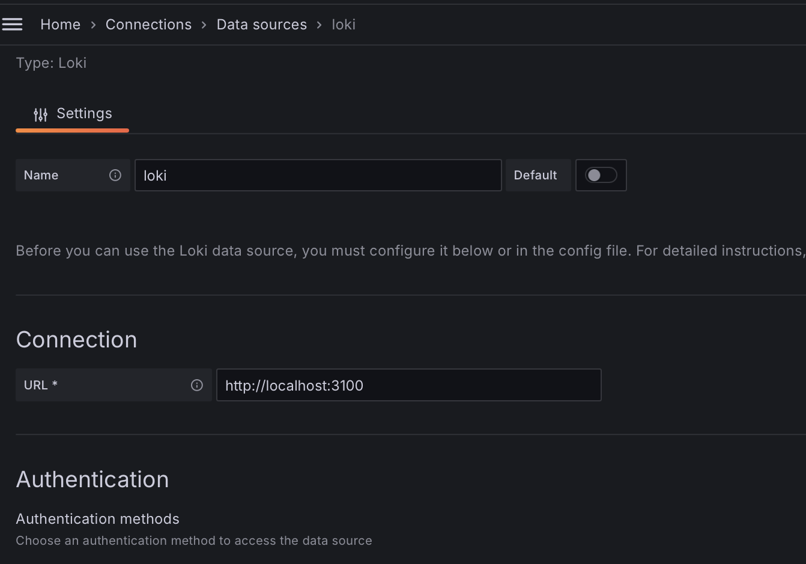
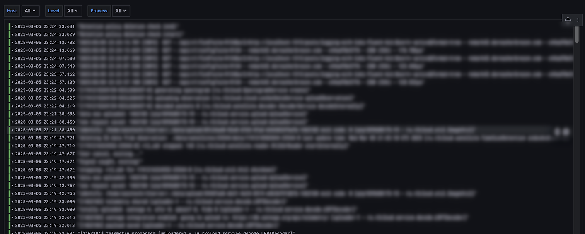
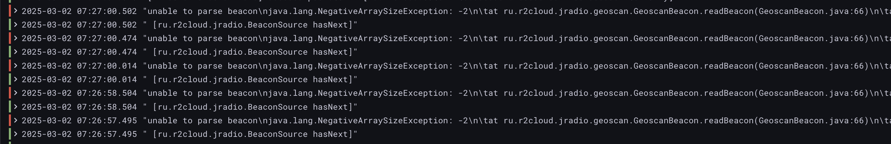

## Введение

Во всех моих проектах действует принцип "логи не должны содержать ошибок". Это значит, что как только появляется ошибка в логах, я должен с ней разобраться. Это может показаться занудством, но на практике, разбирая даже самые очевидные и небольшие проблемы, я открывал для себя много нового. По мере увеличения количества устройств в сети, их становится всё сложнее и дольше проверять на наличие ошибок. Чтобы решить эту проблему, нужно скидывать логи в какое-то центральное место и посылать оповещения если появилась ошибка. 

## Выбор технологий

Централизация - это логично, но на практике всё не так просто. До последнего времени самым распространённым способом собрать логи в одном месте был стек технологий: Elasticsearch - Logstash - Kibana (ELK). И качество его кода было прямо таки сомнительным. Для начала, Elasticsearch не подходит для хранения логов. Эта распределённая система для полнотекстового поиска. Она разбивает предложения на лексемы, делает морфологический анализ и пр. Всё это занимает место на диске и требует дополнительной обработки на сервер. Для логов это просто не нужно. Для них достаточен поиск по уровню, например "ERROR", и/или ключевому слову, например id=123234. [Kibana](https://github.com/elastic/kibana) - UI для поиска данных в Elasticsearch. Тяжеловесное приложение на javascript с [1207 (!) прямых зависимостей](https://github.com/elastic/kibana/blob/main/package.json). [Logstash](https://github.com/elastic/logstash) -  агент для отправки логов. Ещё один монстр бесконтрольного добавления количества фич. В архиве занимает 400+ Мб и при запуске съедает 700+ Мб памяти. Как будто плохого качества кода было недостаточно и Elasticsearch B.V. поменяло лицензию. Это породило довольно популярный форк Opensearch и Opensearch dashboards. После чего компания решила сделать агенты несовместимые с Opensearch, что привело теперь к ещё и путанице с различными версиями.

В результате я стал более пристальнее смотреть на альтернативы и открыл для себя следующий стек: fluent-bit - Loki - Grafana. Такое ощущение, что каждое из этих приложений - это ответ на безумство ELK.

 * [fluent-bit](https://github.com/fluent/fluent-bit). Написан на Си и занимает в памяти 35Мб. Не является частью других приложений, поэтому имеет хорошую интеграцию с Elasticsearch, Opensearch, Loki, Influx, Prometheus и пр.
 * [Loki](https://github.com/grafana/loki) - база для хранения логов. Построена по тем же принципам, что и Prometheus, но для логов. Каждая строчка имет некоторое количество аттрибутов по которым можно фильтровать.
 * [Grafana](https://github.com/grafana/grafana) - универсальный UI для отображения метрик. С недавнего времени есть поддержка отображения логов. В отличие от Kibana может отображать не только логи, но и метрики. В отличие от Kibana может отображать логи из Elasticsearch, Opensearch и Loki. "Всего" [167 зависимостей](https://github.com/grafana/grafana/blob/main/package.json).
 
## fluent-bit

fluent-bit определяет три фазы обработки данных:

* input. Источники данных
* filter. Обработка каждой записи
* output. Отправка данных

Источниками данных может быть как файл, так и различные системы. В частности, systemd. В systemd есть специальный процесс journald, который собирает логи со всей системы и сохраняет в бинарные файлы. Он пришёл на замену syslog и основное отличие в том, что логи стали структурированными и бинарными. Это позвоялет делать более быстрый поиск, поиск по тэгам и пр. Ещё одной особенностью systemd является то, что все запущенные сервисы отправляют свои логи в stdout/stderr, которые автоматически отправляются в journald. Так вот fluent-bit может подключаться к journald по API и получать логи. Это невероятно мощная комбинация:

* Во-первых, не нужно парсить файлы. fluent-bit получает уже структурированные логи.
* Во-вторых, fluent-bit получает вообще все логи в системе. Это невероятно круто, поскольку позволяет коррелировать события в приложении с общесистемными. Например, приложение не смогло отправить данные на сервер. В логах будет сначала потеря сигнала с WiFi (бывший dmesg), а потом уже логи приложения.

Конфигурируется input следующим образом:

```
[INPUT]
    Name            systemd
    Tag             host.*
    Lowercase On
    Strip_Underscores On
    Read_From_Tail On
```

По-умолчанию, плагин добавляет атрибуты сообщения в том же формате, что и journald, например _SYSLOG_IDENTIFIER. Это выглядит немного кричаще и подчёркивание первым символом обычно используется для каких-то зарезервированных переменных. Хорошо, что по-умолчанию плагин может преобразовать такие атрибуты в syslog_identifier.

journald добавляет множество атрибутов разной полезности. Например, _STREAM_ID=498daf9630ae40cebb79c5c1f475617e или _PID=39877. Хранить их в базе достаточно бессмысленно, поэтому можно отфильтровать:

```
[FILTER]
    Name record_modifier
    Match *
    Allowlist_key hostname
    Allowlist_key syslog_identifier
    Allowlist_key systemd_unit
    Allowlist_key message
    Allowlist_key priority
```

Далее необходимо преобразовать priority в более человеко-читабельный формат. priority - это число, которое соответствует уровню лога. Уровни бывают семи видов от 0 - fatal до 7 - trace. На практике важны только 4: ERROR, INFO, WARN, DEBUG. На каждое изменение атрибута нужна своя секция filter:

```
[FILTER]
    Name modify
    Match host.*
    Condition Key_Value_Equals priority 6
    Remove priority
    Add level info

[FILTER]
    Name modify
    Match host.*
    Condition Key_Value_Equals priority 3
    Remove priority
    Add level error

[FILTER]
    Name modify
    Match host.*
    Condition Key_Value_Equals priority 2
    Remove priority
    Add level error

[FILTER]
    Name modify
    Match host.*
    Condition Key_Value_Equals priority 1
    Remove priority
    Add level error

[FILTER]
    Name modify
    Match host.*
    Condition Key_Value_Equals priority 0
    Remove priority
    Add level error

[FILTER]
    Name modify
    Match host.*
    Condition Key_Value_Equals priority 4
    Remove priority
    Add level warn

[FILTER]
    Name modify
    Match host.*
    Condition Key_Value_Equals priority 7
    Remove priority
    Add level debug

[FILTER]
    Name modify
    Match host.*
    Condition Key_Value_Equals priority 5
    Remove priority
    Add level debug
```

В результате в Loki будет хранится атрибут level с возможными значениями error, warn, debug, info. Текстовые значения особенно удобны в Grafana при конфигурации дашбордов.

Завершающим шагом нужно сконфигурировать output секцию:

```
[OUTPUT]
    name   loki
    host   <somehost>
    match  host.*
    labels    $hostname, $syslog_identifier, $level
    remove_keys $hostname, $syslog_identifier, $level
    drop_single_key        On
```

Комбинация labels, remove_keys и drop_single_key позволяет преобразовать атрибуты сообщения в labels для отправки в Loki. Если этого не сделать, то в качестве сообщения будет отправлен json с множеством полей. Это удобно, если хочется передать чуть больше контекста, но в моём простом случае не нужно.

## Influxdb

Иногда приложения плохо интегрированы с journald. И тогда в локах можно увидеть:

```
priority=6 message="ts=2025-02-27T15:33:23.222758Z lvl=error msg=\"some error goes here\" log_id=0uJYAO6l000 engine=tsm1 trace_id=0uz0VbaW000 op_name=tsm1_cache_snapshot op_event=st"
```

Во-первых, время дублируется внутри сообщения. Во-вторых, сообщение с priority=6 (INFO), но при этом внутри него ```lvl=error```. В-третьих, сообщение содержит какие-то дополнительные бесполезные атрибуты. В таких случаях fluent-bit может распарсить текст. 

```
[FILTER]
    Name parser
    Match host.influxdb.service
    Parser logfmt
    Key_Name message
    Reserve_Data On

[FILTER]
    Name modify
    Match host.influxdb.service
    Rename msg message
    Rename lvl level
```

В этой конфигурации есть два интересных момента: во-первых, фильтр можно настроить только на конкретное приложение. Это позволяет ускорить парсинг данных. Во-вторых, fluent-bit поддерживает множество стандартных парсеров, в том числе logfmt.

## Java

Иногда приложения печатают в лог несколько строчек на одно событие. Самое распространённое - это java stacktrace в случае ошибки. При анализе таких событий неплохо было бы собрать все строчки вместе. Для этого есть поддержка multiline фильтра:

```
[FILTER]
    name                  multiline
    match                 host.r2cloud.service
    multiline.key_content message
    multiline.parser      custom-java
```

fluent-bit поддерживает несколько стандартных парсеров: go, java, python, docker. Однако, для java он ожидает следующий формат: 
 
```
<some message> <exception>
	at
	at
	at
```

В то время как большинство библиотек логирования выводят в другом формате:

```
<some message>
<exception>
	at
	at
Caused by:
	at
	at
```

Но это не беда, потому что fluent-bit позволяет задавать собственный формат. Я сконфигурировал ```custom-java``` следующим образом:

```
[MULTILINE_PARSER]
    name          custom-java
    type          regex
    flush_timeout 1000
    # rules |   state name  | regex pattern                  | next state
    # ------|---------------|--------------------------------------------
    rule      "start_state"   "/(.+)/"                         "exception"
    rule      "exception"     "/(.+Exception.*)/"              "cont" 
    rule      "cont"          "/^(Caused by:.*)|(\s+at.*)/"    "cont"
```

## Grafana

Grafana по-умолчанию поставляется с плагином для доступа к Loki, поэтому можно сразу переходить к конфигурации datasource:



Далее сделать дашборд. Самое простое - это список логов во всю ширину экрана с бесконечной прокруткой. 



Я использовал визуализацию "Logs", но можно и обычную таблицу. Разница лишь в том, что ошибки слева подсвечиваются красным и это удобно. Помимо этого сверху есть быстрые фильтры, которые можно сделать через параметры дашборда.

Единственный недостаток в том, что многострочные логи выводятся в одну строчку и это выглядит не очень:



## Заключение

fluent-bit - это как глоток свежего воздуха. Он делает именно то, что нужно. Занимает памяти ровно столько, сколько не жалко выдать агенту для сбора метрик. Доступен для любых платформ и архитектур. Наверное, единственный его недостаток в том, что его собственные логи в странном формате, который нельзя поменять, поэтому для разбора его логов нужно писать отдельный парсер.

Следующим шагом будет настройка оповещений об ошибках.