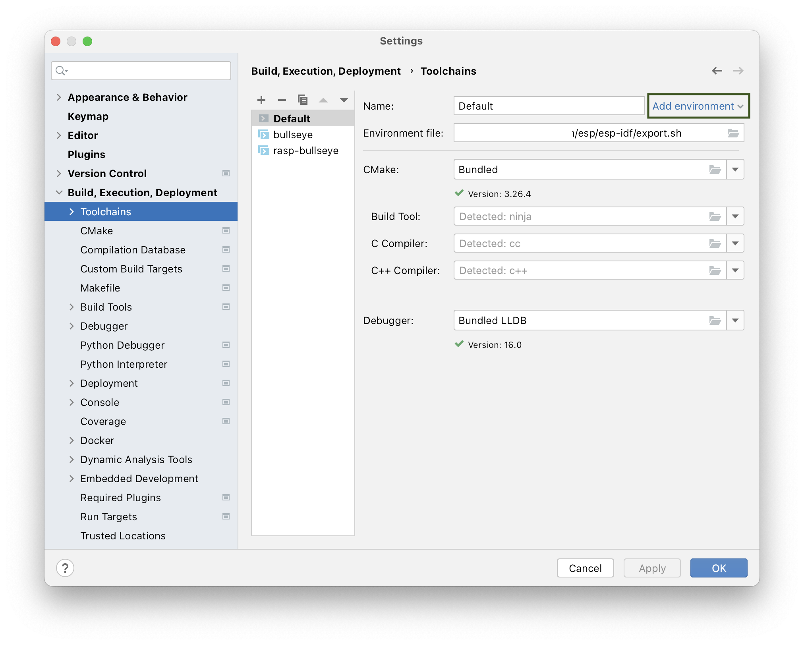
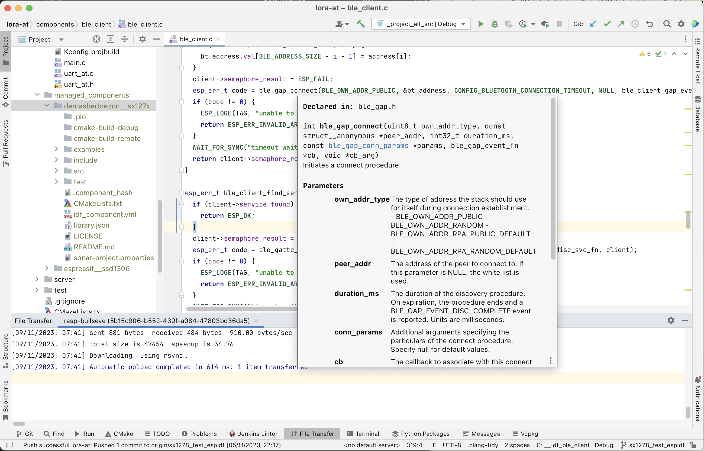
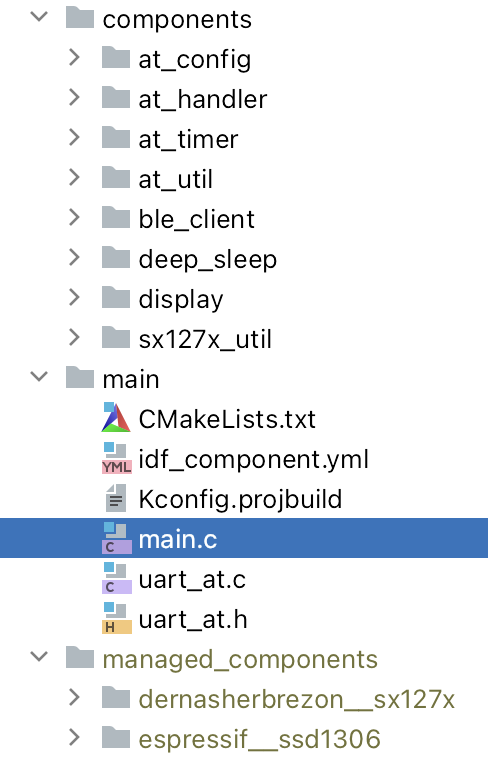
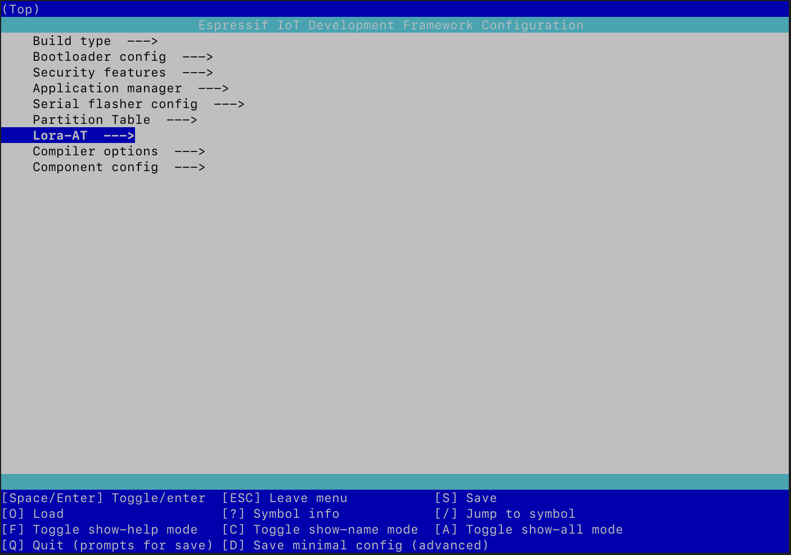
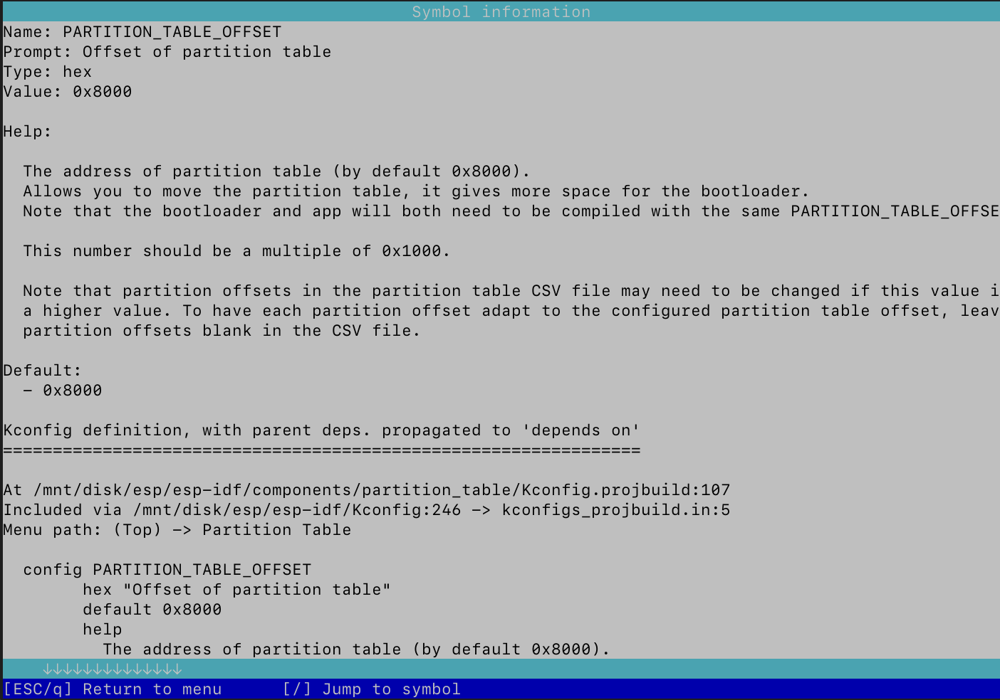

## Background

It's been too long since my last post about LoRa. During this time, I created a project [lora-at](https://github.com/dernasherbrezon/lora-at), which I would like to write about in this post. But before I deep dive into the meety details, I little background on how it started.

Initially, I planned to create a small firmware for receiving signals from satellites using LoRa protocol. I used [tinyGS](https://github.com/G4lile0/tinyGS) as a basis, which did almost everything I needed. tinyGS support scheduling satellite observations, receive packets from satellites and send them to a central server. I needed something more lightweight and not integrated with any servers. It was enough to have a simple REST API service, that can be controlled via HTTP. As a result, I created [r2lora](https://github.com/dernasherbrezon/r2lora) project. It proved to be more [energy efficient]() than tinyGS and supported [over-the-air updates]().

However, after several field tests, it became clear that using a REST API and a web server is not the best idea. First, you need to set up Wi-Fi access point. And for this you need either a router or a Raspberry PI in access point mode. The router cannot be started in the field without a 12V battery. Raspberry PI cannot always operate in access point mode. Sometimes you want to bring it home, connect it to your home network and send all the received data to [leosatdata.com](https://leosatdata.com). All these problems can be solved, but in my opinion, the result will look cumbersome for such a simple task as transferring several bytes from one device to another.

It was then that the idea came to me to control the LoRa transceiver via the UART interface. It is used to upload new firmware to the device and view the logs. So why not use it to send commands as well?

## Design

I am finishing second version of lora-at. The first one was written in C++, used many of r2lora's ideas and worked. However, there were also several rather unpleasant moments. First, it used the RadioLib library, which [did not support]() waking up from sleep mode correctly. Secondly, the code was written using the [Arduino framework ported to the ESP32](https://github.com/espressif/arduino-esp32). This framework is quite simple and designed for beginners. With its help, you can make a working prototype relatively quickly, but I wanted to use the full power of the ESP32. For example, a typical Arduino handler looks like this:

```c
void loop() {
  if (lora->isReceivingData()) {
    LoRaFrame *frame = lora->loop();
    if (frame != NULL) {
      client->sendData(frame);
      handler->addFrame(frame);
    }
  }
  // ...
}
```

It’s not clear why make an endless loop if the ESP32 has FreeRTOS, which allows you to process asynchronous events using interrupts and tasks. Thirdly, C++. Long compilation, a mishmash of concepts, interfaces, system and auxiliary libraries - all this does not give confidence in the written code.

I wanted:

 * C
 * Use ESP32 API and abstractions as low as possible
 * Own [sx127x](https://github.com/dernasherbrezon/sx127x)
 * Interrupts and handlers in separate FreeRTOS tasks
 
The remaining functional requirements are:

 * Support AT commands via UART interface. They must control every aspect of the system
 * Storing configuration in flash memory
 * Deep sleep support and [Bluetooth integration]()
 * Support for LoRa and FSK modulations
 * Sending and receiving data in batch mode. Maximum packet size 255 bytes
 
The design is not fundamentally different from r2lora:



Each subsystem must be in a separate component and together they must be controlled by ```at_handler``` - an AT command handler.

I changed the language, why stopping now? I decided to switch to [ESP-IDF](https://docs.espressif.com/projects/esp-idf/en/latest/esp32/get-started/). After all, this is an officially supported development environment for the ESP32. This means that all other libraries and frameworks are based on it. And it is quite low-level.

## ESP-IDF

My main complaint with PlatformIO and [arduino-esp32](https://github.com/espressif/arduino-esp32) is that they add layers of abstraction that are not always good. This helps with quick assemble the prototype, but often at the expense of the overall project structure and maintainability. For example, a LoRa chip is connected via an SPI bus. It probably needs to be initialized, some function to send a command to the chip, receive a response and process it. If a problem occurs somewhere, then it is very important to understand where and when. And, reading fairly low-level code, this is easy to understand. However, a typical code example for arduino-esp32:

```c++
if (!LoRa.begin(915E6)) {
  Serial.println("Starting LoRa failed!");
  while (1);
}
```

What is this? Constructor? Singleton? Where is the SPI bus initialization? What pins are used? But looks how cool it is to initialize everything on a single line.

As it turned out, despite the fact that ESP-IDF is quite low-level, it has quite easy to understand abstractions and very familiar working tools. This framework determines how the project should be assembled, how it should be tested, the API for internal ESP32 components, where and how to get dependencies - in general, everything that is needed for development. The official website has [integrations with Eclipse and VSCode](https://docs.espressif.com/projects/esp-idf/en/latest/esp32/get-started/index.html#ide), but I decided to try [CLion](https://www.jetbrains.com/clion/). Fortunately, I already bought it and used to develop other projects. At some point, CLion started to support initialization from an environment file. This is quite handy when working with ESP-IDF. Once everythying is configured CLion will run the standard ```export.sh``` script and receive all the information about which compiler is used, where to get different sources and header files, etc.



Among the unobvious advantages: CLion allows you to upload a project to a remote host and compile it there. VSCode can do it too, but it requires the latest version of Python and NodeJS. Both are terribly slow on RaspberryPI. CLion doesn't have this problem. Apparently it has a very lightweight way of working with remote hosts.



### Dependency management

Dependency management in ESP-IDF is very similar to NodeJS. They are downloaded as source code to a special folder and compiled when building the project. Dependencies can be added using the command:

```
idf.py add-dependency dernasherbrezon/sx127x
```

After this ~~node_modules~~ managed_components folder appears with the necessary dependencies.

lora-at uses only two external dependencies:

 * [dernasherbrezon/sx127x](https://github.com/dernasherbrezon/sx127x/tree/main) - to work with sx127x chip
 * [espressif/ssd1306](https://github.com/espressif/esp-bsp/tree/master/components/ssd1306) - to work with OLED screen

In addition to external ones, it is possible to connect components of the framework itself or own. This is done using CMakeLists.txt:

```cmake
idf_component_register(SRCS "ble_client.c"
        INCLUDE_DIRS "."
        REQUIRES bt nvs_flash sx127x_util)
```

Once the dependencies are declared, they can be used in the project:

```
#include <nvs_flash.h>
```

This is slightly different from the PlatformIO approach, where you can immediately include the header file, and the IDE itself will find the necessary dependencies and connect it. I am a supporter of everything explicit, so the ESP-IDF approach appeals to me more.

The framework components I used:

 * bt - to work with Bluetooth
 * nvs_flash - for working with flash memory. lora-at uses it to store the configuration and load from it after a reboot
 * driver - for working with the SPI bus, which controls the sx127x chip. There is also a driver for working with GPIO

### Project structure

The project structure is very similar to PlatformIO, where each module is separated into a separate component. Each of them is separately compiled and configured.



They are all added as dependencies to the central ```main``` component, which contains the entry point:

```c
void app_main(void) {
	// do the stuff
}
```

### Configuration

There are two ways to configure a project:

 - using AT commands. Suitable for options that may change from time to time
 - using KConfig. Static configuration at compile time
 
Couple words about KConfig. It is a fairly powerful system that PlatformIO do not have. In order to add own configuration, create a KConfig file in a special format. I will not dwell on its structure, especially since everything is described in great detail in the [official documentation](https://docs.espressif.com/projects/esp-idf/en/latest/esp32/api-reference/kconfig.html). After the file is created, launch the configurator itself using the command:

```
idf.py menuconfig
```

The result will be an interface very similar to the Linux kernel configurator:



When I launched it for the first time, I was extremely surprised. If you examine the available options, it becomes clear that absolutely everything can be configured: from the size of the partitions to the Bluetooth stack. This configurator picks up not only the application configuration, but also the framework itself. And in general, this is logical - after all, the application is compiled together with the framework and then uploaded to the device in one binary.

Another thing that pleasantly surprised me was the very good documentation! If you select an option and press ```?```, an option documentation will appear: what this option is about, what choices exist, and so on. Such a thorough approach is extremely contagious, so for lora-at I also added the most detailed description of each parameter.



After the configurator runs, an sdkconfig file containing the configuration will appear in the project root.

```
...
CONFIG_MIN_FREQUENCY=25000000
CONFIG_MAX_FREQUENCY=1700000000
...
```

When compiled, it becomes sdkconfig.h, which can be used in any component.

```c
#define CONFIG_MIN_FREQUENCY 25000000
#define CONFIG_MAX_FREQUENCY 1700000000
```

PlatformIO has quite convenient functionality for configuring various [environments](https://docs.platformio.org/en/latest/projectconf/sections/env/index.html). In r2lora it was used for quickstart a specific board. ESP32 and sx127x can be soldered differently on different boards. This results in the GPIO pin numbers slightly mismatching. I created a pin configuration in advance for the most commonly used boards and assigned each board its own "environment". When compiling, it was enough to indicate the required environment for which the firmware was built.

I did something similar in ESP-IDF. The framework allows you to create various default settings in advance in the form of sdkconfig files. For example, I created: ```sdkconfig.ttgo-lora32-v2```, ```sdkconfig.ttgo-lora32-v1``` &etc. In them I redefined the pins for the corresponding boards. They can be used during the build using the command:

```
SDKCONFIG_DEFAULTS="sdkconfig.ttgo-lora32-v2" idf.py build
```

If a more complex configuration is required, then it is possible to use multiple files. But for lora-at this turned out to be quite enough.

## Implementation

Most of the components that were in r2cloud had to be significantly rewritten. Because of the low-level API I was using, most of components now contain a little bit more code. If previously I was using the following code to get the data from flash disk:

```c++
Preferences preferences;
preferences.begin("lora-at", true);
size_t chip_index = preferences.getUChar("chip_index");
preferences.end();
```

But now it looks like this:

```c
nvs_handle_t out_handle;
esp_err_t err = nvs_open("lora-at", NVS_READONLY, &out_handle);
if( err == ESP_ERR_NVS_NOT_FOUND ) {
  return EPS_OK;
} 
if( err != ESP_OK ) {
  return err;
} 
err = nvs_get_u64(out_handle, "period", &result->deep_sleep_period_micros);
if( err != ESP_OK && err != ESP_ERR_NVS_NOT_FOUND ) {
  return err;
} 
nvs_close(out_handle);
```

Code looks more complex, but only at the first glance. It just has error handling and explicit calls to nvs functions. In the C++ example, it is not clear what ```Preferences``` is. Why did they renamed ```nvs```? Why couldn't the class names be made closer to the C API? Why did they somehow decide to rename fixed-length types like uint32_t to UInt?

```C++
uint32_t getUInt(const char* key, uint32_t defaultValue = 0);
```

While the original API was much cleaner:

```C
esp_err_t nvs_get_u32(nvs_handle_t handle, const char* key, uint32_t* out_value);
```

So many questions, and so few answers.

Despite the fact that the C API is more concise, I had to tinker with some components. Mainly due to the fact that I did not understand how this or that technology works, and the C++ API hid it from me.

### Bluetooth

Probably the most difficult component I had to write. Initially, I opened the ESP32 Bluetooth tutorial and started implementing the necessary functions. However, at some point I came across a comment in the [documentation](https://docs.espressif.com/projects/esp-idf/en/latest/esp32/api-guides/bluetooth.html): "If you only need interaction via the BLE protocol, then it is better to take NimBLE. It is more lightweight and requires less code compared to Bluedroid". Well. I had to figure out what NimBLE is and how it differs from Bluedroid.

It turns out that Bluedroid is a full-fledged implementation of both "classic" Bluetooth and Bluetooth Low Energy (BLE). And, since it supports both modes, its API is more complex. NimBLE only implements BLE and is therefore more lightweight. ESP-IDF supports both implementations and you can select the one you need at the configuration stage. This is done using sdkconfig:

```
CONFIG_BT_ENABLED=y
CONFIG_BT_NIMBLE_ENABLED=y
CONFIG_BT_CONTROLLER_ENABLED=y
```

The API itself didn't seem easier to me. Both are built on callbacks, where a handler function is passed for each operation, which is then asynchronously called in a separate FreeRTOS task. Ironically, for lora-at, asynchrony is not particularly necessary, since all commands must be guaranteed to complete before the device goes into sleep mode. Typical code looks like this:

```c
int ble_client_disc_svc_fn(/* some arguments */) {
  if( error->status == 0 ) {
      client->semaphore_result = ESP_OK;
  } else {
  	 // handle error properly
      client->semaphore_result = ESP_ERR_TIMEOUT;
  }
  xSemaphoreGive(client->semaphore);
  return 0;
}

esp_err_t ble_client_find_service(/* some arguments */) {
  client->semaphore_result = ESP_FAIL;
  esp_err_t code = ble_gattc_disc_svc_by_uuid(conn_handle, remote_svc_uuid, ble_client_disc_svc_fn, client);
  if( code != ESP_OK ) {
  	return code;
  }
  WAIT_FOR_SEMAPHORE("...");
  return client->semaphore_result;
}
```

### UART

The second most difficult component was reading commands from the UART. If previously it was possible to read one character at a time in a loop:

```c++
size_t AtHandler::read_line(Stream *in) {
  size_t result = 0;
  while (in->available() > 0) {
    char inByte = in->read();
    result++;
    // if char is \n, then return result
  }
  return 0;
}
```

Working through interrupts requires a little more complex code. First, you need to initialize one of the four UART buses:

```c
uart_config_t uart_config = {
    .baud_rate = CONFIG_AT_UART_BAUD_RATE,
    .data_bits = UART_DATA_8_BITS,
    .parity = UART_PARITY_DISABLE,
    .stop_bits = UART_STOP_BITS_1,
    .flow_ctrl = UART_HW_FLOWCTRL_DISABLE,
    .source_clk = UART_SCLK_DEFAULT,
};
uart_driver_install(result->uart_port_num, CONFIG_AT_UART_BUFFER_LENGTH * 2, CONFIG_AT_UART_BUFFER_LENGTH * 2, 20, &result->uart_queue, 0);
uart_param_config(result->uart_port_num, &uart_config);
uart_set_pin(result->uart_port_num, CONFIG_AT_UART_TX_PIN, CONFIG_AT_UART_RX_PIN, UART_PIN_NO_CHANGE, UART_PIN_NO_CHANGE);
uart_enable_pattern_det_baud_intr(result->uart_port_num, '\n', 1, 9, 0, 0);
uart_pattern_queue_reset(result->uart_port_num, 20);
```

Secondly, you need to initialize the FreeRTOS task and start reading data from ```uart_queue```:

```c
void uart_at_handler_process(uart_at_handler_t *handler) {
  while (1) {
    if (xQueueReceive(handler->uart_queue, (void *) &event, (TickType_t) portMAX_DELAY)) {
      switch (event.type) {
        case UART_DATA:
        	// handle using uart_read_bytes
        case UART_PATTERN_DET:
         // handle using uart_read_bytes
        case UART_FIFO_OVF:
         // handle
        case UART_BUFFER_FULL:
         // handle
	}
	// determine if data contains new line
	if (found) {
	  // call at handler
	}
  }
}

xTaskCreate(uart_at_handler_process, "uart_rx_task", 1024 * 4, handler, configMAX_PRIORITIES, NULL);
```

Manual control made me think about how UART works at a low level, learn that there are as many as 4 buses and write more efficient code. As a side bonus, I was able to reconfigure the UART to different GPIOs, and power the device itself from the [JST connector](https://en.wikipedia.org/wiki/JST_connector). This made it possible to connect the [Power Profiler Kit II](https://www.nordicsemi.com/Products/Development-hardware/Power-Profiler-Kit-2) and measure energy consumption. The whole process took about 10 minutes. Of these, I spent 5 minutes looking for a USB-to-UART cable and 3 minutes choosing which pins were best to use.

## Results

The second version works just great! Comparing the performance of C and C++ code is probably pointless, most likely because it is not so important in the world of microcontrollers. But the energy consumption will be very interesting to see. But more on that in the next article. For now, just a comparison of firmware sizes:

```
$ ls -lh ./build/lora-at.bin 
-rw-r--r-- 1 pi pi 665K Nov  5 22:09 ./build/lora-at.bin
```

And C++ version:

```
$ ls -lh .pio/build/ttgo-lora32-v2/firmware.bin
-rw-r--r-- 1 pi pi 1.1M Nov  9 20:39 .pio/build/ttgo-lora32-v2/firmware.bin
```

The C version is almost 2 times smaller!