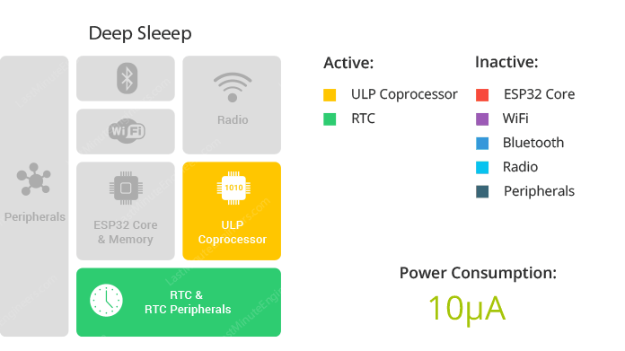
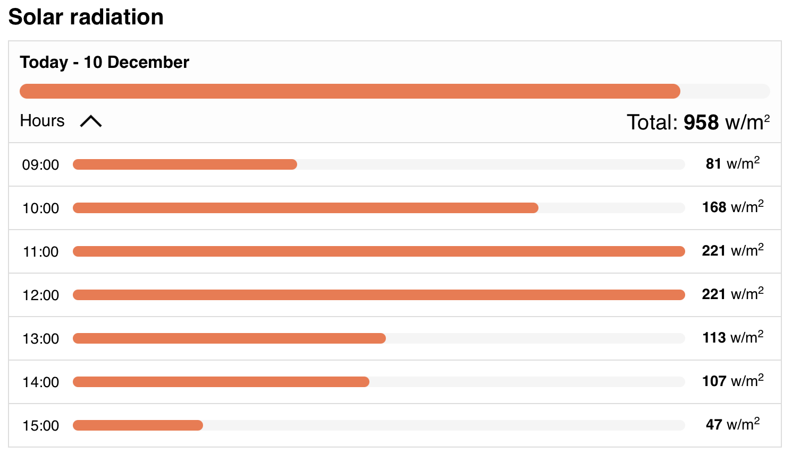

In recent months, I have been working on reducing power consumption in the [lora-at](https://github.com/dernasherbrezon/lora-at) project. The idea is to create a self-sufficient receiver, place it on the balcony, and receive signals from satellites 24/7. Easier said than done, especially for those who have never optimized code for low power consumption or designed electrical circuits. Of course, you could install the largest solar panel, receive signals only during the day, and not worry about it. However, I found this approach unworthy of an engineer, so I took on the challenge and started designing.

## General design

Before optimizing power consumption, it is necessary to understand the electrical circuitry and program algorithm.



The idea is quite simple:

* A 6V solar panel is connected to a special controller.
* This controller should do the following:
  * Charge the battery.
  * Monitor the charging voltage and battery discharge level.
  * Disconnect the battery from the load during heavy discharge.
  * Monitor the current consumption from the solar panel (MPTT).
* A Li-ion battery should operate at night when there is no sun, and the panel does not generate enough energy.
* ESP32 board with LoRa receiver.
* (Optional) Voltage divider for monitoring battery charge.

Since the scheme is quite standard, you can find [many different guides](https://www.youtube.com/watch?v=WdP4nVQX-j0) and descriptions online.

## Algorithm

The software part is not as colorful as "hello world" and is more complex to find. The primary and only way to reduce power consumption is to put the processor into deep sleep mode. In this mode, most processor modules are turned off, and power consumption is minimal — 10 microamps.



The ordinary linear program changes completely in this mode. I came up with the following algorithm:



Firstly, I need the firmware to support both deep sleep mode and AT commands. AT commands are extremely convenient for debugging. However, the serial bus is not available in deep sleep mode. To overcome this, I created a special inactivity timer. If there are no commands for a certain period, the processor goes into deep sleep mode. In this mode, it periodically wakes up, receives the time of the next observation via Bluetooth, and goes back to sleep. Since the wake-up cycle is quite short, it's practically impossible to send an AT command. To send an AT command to the device in deep sleep mode, you need to manually restart the ESP32. It's a bit inconvenient, but you can live with it during debugging or temporarily disable deep sleep mode.

Secondly, Bluetooth is used for communication with Raspberry Pi. This protocol is not the most energy-efficient, and it would be logical to use LoRa to send data. Unfortunately, Raspberry Pi does not have a LoRa module, and a separate one is [quite expensive](https://thepihut.com/products/sx1262-lora-hat-for-raspberry-pi-868mhz-for-europe-asia-africa). The good news is that both ESP32 and Raspberry Pi support the energy-efficient version of Bluetooth - Bluetooth Low Energy (BLE), which makes sense to use. Integration via Bluetooth deserves a separate article.

## Power Consumption Measurement

At this point, I was hit by vibes from physics laboratory work at the university. With one exception - this time I'm really interested in understanding the physics of the process. For measurements, I used the A3-B USB tester, which I reviewed in one of the [previous articles](). The results were as follows:

* In deep sleep mode: 6 mA
* In signal reception mode: 86 mA

On average, all satellites with LoRa transmitters pass by for 313 minutes a day. Then all the remaining deep sleep time will be 1127 minutes. Total:

```
323 min * 86 mA + 1127 min * 6 mA = 575.66 mAh
```

Or in terms of power:

```
575.66 mAh * 3.3 V = 1.8997 Wh
```

1.8997 Wh per day. It's not entirely clear whether this is a lot or a little. To understand this, we need to estimate the theoretical power that can be obtained from solar panels.

## Theoretical Power

In [this video](https://www.youtube.com/watch?v=WdP4nVQX-j0), it is explained very well how to calculate the theoretical power from solar panels. In my case, the input parameters are as follows:

* City: London
* 6V 1W solar panel with an area of 11 cm * 6 cm. Yes, I chose the smallest 6V solar panel. But I got three at a discount.
* Average efficiency of such panels - 15%
* Controller and voltage reduction efficiency are considered an additional 5%
* Panel orientation - strictly upward
* Month: December. The cloudiest month of the year with the shortest duration of daylight.

Total:

```
600 Wh/m2 * (15% - 5%) = 60 Wh/m2 = 0.006 Wh/cm2
```

Converted to my solar panel:

```
0.006 Wh/cm2 * (11 cm * 6 cm) = 0.396 Wh
```

The calculations are very averaged, and energy may be twice as much on one sunny day and half as much on another day. Nevertheless, it turns out that my solar panel won't be enough (0.396 Wh < 1.8997 Wh).

Since it won't be enough for a whole day, maybe it will be just enough for a bit? To find out, I opened [this website](https://en.tutiempo.net/solar-radiation/london.html) to see how much energy I can theoretically get with an hourly breakdown.



So, at 12 PM, I can get 221 Wh/m2.

```
221 Wh/m2 * (15% - 5%) = 22.1 Wh/m2 = 0.00221 Wh/cm2 * (11 cm * 6 cm) = 0.14586 Wh
```

And the average consumption of ESP32:

```
1.8997 Wh / 24 = 0.07915 Wh
```

It turns out that there will be enough energy. Thus, the entire station will start around 11-12, work for at most one or two hours, and turn off until the next day. The battery will constantly be in a discharged state and will only charge slightly at 0.06671 Wh, to then discharge again.

## Power Consumption Optimization

The most obvious methods that come to mind without Google:

* Connect another small panel. 0.396 Wh * 2 = 0.792 Wh - still not great.
* Move to Dubai.
* Reduce the number of satellite observations.
* Optimize the code.

The third and fourth points look very enticing. So, if we leave only one observation per day:

```
10 min * 86 mA + 1430 min * 6 mA = 860 mAmin + 8580 mAmin = 157.33 mAh * 3.3 V = 519.2 Wh
```

Even for one observation per day, one solar panel will be insufficient. At least two are needed.

It's time to optimize the code.

## Code Optimization

In the table below, I've compiled all the techniques I could find on the internet.

<table>
	<thead>
		<tr>
			<th>Method</th>
			<th>Consumption</th>
		</tr>
	</thead>
	<tbody>
		<tr>
			<td>Default empty project</td>
			<td>70mA</td>
		</tr>
		<tr>
			<td>Enabled LoRa receiver</td>
			<td>86mA</td>
		</tr>
		<tr>
			<td>Empty project with reduced frequency - 80 MHz<br/>Minimum frequency for Bluetooth operation</td>
			<td>30mA</td>
		</tr>
		<tr>
			<td>Enabled LoRa receiver with reduced ESP32 frequency</td>
			<td>46mA</td>
		</tr>
		<tr>
			<td>Deep sleep</td>
			<td>6mA</td>
		</tr>
		<tr>
			<td><a href="https://github.com/Heltec-Aaron-Lee/WiFi_Kit_series/issues/6#issuecomment-403254130">Using power through JST connector</a>, not 5V USB</td>
			<td>Apparently small currents, and  <a href="https://www.youtube.com/watch?v=LUB8RWzzLWc">measuring with a multimeter may not work</a></td>
		</tr>
		<tr>
			<td>Enabled LoRa receiver with ESP32 in deep sleep</td>
			<td>16mA</td>
		</tr>
	</tbody>
</table>

So, the most interesting method is the last one. I accidentally stumbled upon it in [this article](https://learn.circuit.rocks/esp32-lora-gateway-battery-optimized). The point is that the ESP32 can wake up from deep sleep in several ways - by timer, by changing the voltage on an external pin, or by interrupt. Moreover, when the LoRa receiver receives a message, it also generates an interrupt! The working algorithm in this case is as follows:



The corresponding configuration:

```c
pinMode(RST, INPUT_PULLUP);
esp_sleep_enable_ext0_wakeup((gpio_num_t)DIO0, RISING);
```

The LoRa receiver will continue to work even if the ESP32 goes into sleep mode. Power consumption in active mode will be reduced from 86 mA to 16 mA - more than 5 times!

```
323 min * 16 mA + 1127 min * 6 mA = 5168 mAmin + 6762 mAmin =
= 198.83 mAh * 3.3 V = 656.15 Wh
```

Two small panels will be enough to receive all passing satellites.

Unfortunately, none of the existing libraries allow reading messages from LoRa after waking up from sleep. I had to take [arduino-LoRa](https://github.com/sandeepmistry/arduino-LoRa) and modify it.

## Conclusion

And then I went out to the balcony and realized that it faces north...
