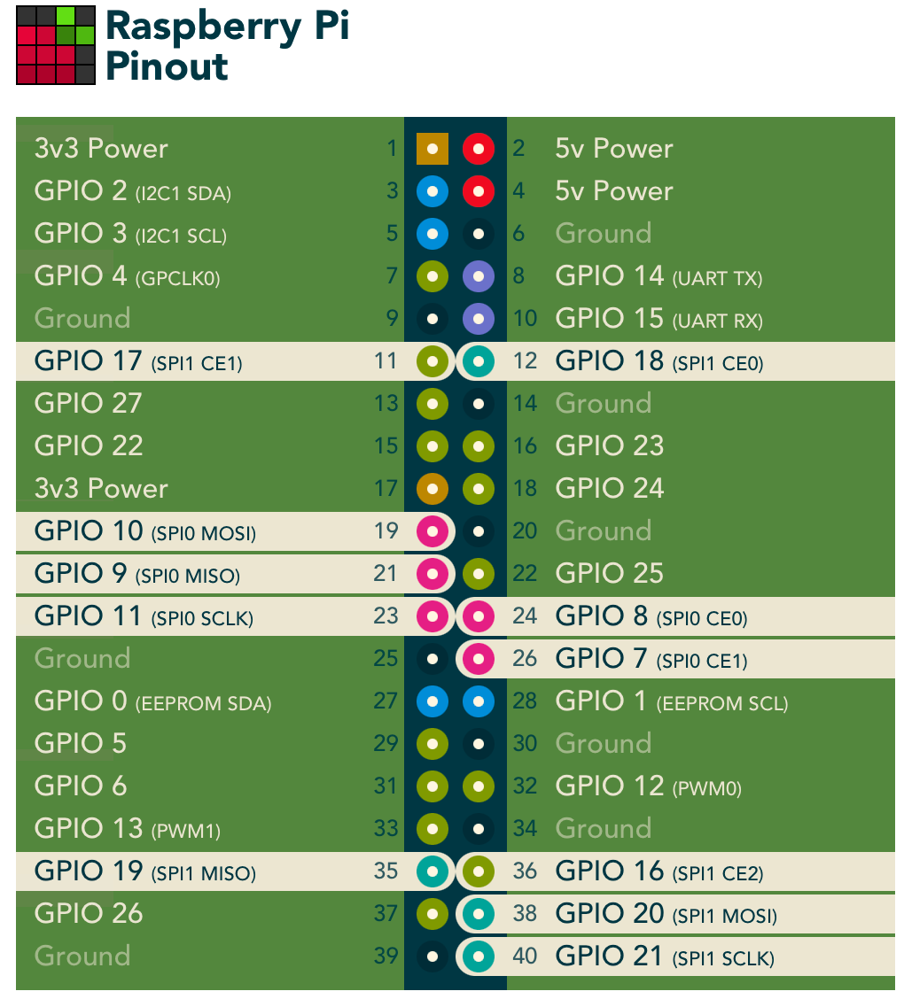

Continuing work on the new [sx127x library](https://github.com/dernasherbrezon/sx127x), I decided to add Linux support, specifically for Raspberry Pi. Besides the practical need, I wanted to understand how programming for microcontrollers differs from regular operating systems.

I designed the library quite well from the beginning, so migrating to Linux required only a few changes:

 * Abandoning esp_err.h and using return codes of type ```int```
 * Separating SPI operations into a separate header and redefining for different platforms.
 
While the first point is relatively simple, the second required some effort.

## SPI in Linux

Modern Linux kernel versions (4.x+) have SPI support. On the operating system side, there is a driver that creates devices like ```/dev/spidevX.X```  for user-mode interaction. Each master device can have one or more SPI buses. Each bus consists of several wires: MOSI, MISO, SCLK, SS. Multiple slave devices can be connected to each bus.



Raspberry Pi, by default, has only one enabled SPI bus, SPI0, with the address ```/dev/spidev0.X```. If needed, a second bus can be enabled in the  ```/boot/config.txt``` file:

```
dtoverlay=spi1-3cs
```

Up to two slave devices can be connected to each Raspberry Pi bus.



In this way, the SPI driver creates four files:

 * /dev/spidev0.0
 * /dev/spidev0.1
 * /dev/spidev1.0
 * /dev/spidev1.1
 
In ESP32, when initializing SPI, it was necessary to explicitly specify which pin corresponds to which signal. In Raspberry Pi, you just need to open the required device for operation:

```c
int spi_device_fd = open("/dev/spidev0.0", O_RDWR);
if (spi_device_fd < 0) {
    perror("unable to open device");
    return EXIT_FAILURE;
}
```

Then configure it using ioctl:


```c
int mode = SPI_MODE_0; // CPOL=0, CPHA=0
LINUX_ERROR_CHECK(ioctl(spi_device_fd, SPI_IOC_WR_MODE, &mode));
```

The API for sending and receiving data looks very similar to ESP32:

```c
struct spi_ioc_transfer tr[2];
memset(&tr, 0, sizeof(tr));
tr[0].tx_buf = (unsigned long)&reg;
tr[0].len = 1;
tr[1].rx_buf = (unsigned long)result;
tr[1].len = data_length;
int code = ioctl(*(int *)spi_device, SPI_IOC_MESSAGE(2), &tr);
```

This uses the ```spi_ioc_transfer``` structure and the familiar ioctl. The example above shows a half-duplex mode of operation: first, a command with the register type is sent, and then the response is read into the ```result``` variable with a length of ```data_length```. For full-duplex mode, only one message would be needed, with both ```tx_buf``` and ```rx_buf``` filled. However, half-duplex mode is sufficient for controlling sx127x.
 
## GPIO in Linux

In principle, one SPI is enough to work with sx127x. To receive a message, you would periodically call the ```sx127x_handle_interrupt``` function. It checks if the message flag is set and calls the necessary handler. However, if messages arrive frequently or at unpredictable intervals, this method may miss a packet. Each new packet would overwrite the previous one in the chip's internal memory. To avoid this, interrupts should be used. sx127x has six pins that generate various types of interrupts. For sending and receiving, only one needs to be connected - DIO0.

But how to handle it in Linux?

To achieve this, the GPIO driver needs to be used. It is a standard driver that controls user access to the device's pins and allows multiple programs to work independently.

On Raspberry Pi, it creates the device ```/dev/gpiochip0```. It needs to be opened to start working:

```c
int fd = open("/dev/gpiochip0", O_RDONLY);
if (fd < 0) {
    perror("unable to open device");
    return EXIT_FAILURE;
}
```

Next, reserve one of the pins or "lines" in Linux terminology:

```c
struct gpioevent_request rq;
rq.lineoffset = 27;
rq.eventflags = GPIOEVENT_EVENT_RISING_EDGE;
char label[] = "lora_raspberry";
memcpy(rq.consumer_label, label, sizeof(label));
rq.handleflags = GPIOHANDLE_REQUEST_INPUT;
int code = ioctl(fd, GPIO_GET_LINEEVENT_IOCTL, &rq);
```

In the example above, I reserve pin 27 to receive events. In this case, the event is a change from "low level" to "high level." This is precisely what the chip will do when generating an interrupt.

After that, wait for the event using the poll API:

```c
struct pollfd pfd;
pfd.fd = rq.fd;
pfd.events = POLLIN;
fprintf(stdout, "waiting for packets...\n");
while (1) {
    code = poll(&pfd, 1, GPIO_POLL_TIMEOUT);
    if (code < 0) {
        perror("unable to receive gpio interrupt");
        break;
    } else if (pfd.events & POLLIN) {
        sx127x_handle_interrupt(device);
    }
}
close(rq.fd);
```

If the event is received, call the interrupt handler function ```sx127x_handle_interrupt```.

## Build

A few words need to be said about project build. Because the SPI API differs between ESP32 and Linux, I had to move all the code working with SPI into a separate file ```sx127x_spi.h```. It contains four methods of the following kind, which are implemented differently for different platforms:

```c
/**
 * @brief Read up to 4 bytes from device via SPI
 * 
 * @param reg Register
 * @param spi_device Pointer to variable to hold the device handle. Can be different on different platforms
 * @param data_length Number of bytes to read into result
 * @param result Where the data will be written to
 * @return 
 *         - SX127X_ERR_INVALID_ARG   if parameter is invalid
 *         - SX127X_OK                on success
 */
int sx127x_spi_read_registers(int reg, void *spi_device, size_t data_length, uint32_t *result);
```

During the build for Raspberry Pi, I compile ```sx127x_linux_spi.c```, and for ESP32 - ```sx127x_esp_spi.c```.

## Testing

For testing, I bought an RA-02 module. It contains the sx1278 chip. I had to do a little soldering to get something like this:


In my test, I transmitted a signal from one ESP32 to another ESP32 and Raspberry Pi. Everything worked perfectly, except for frequency error calculation. The sx127x chip can calculate the difference between the frequency at which the message was received and the frequency to which the receiver was tuned. In the case of ESP32, it was about -473 Hz, and for Raspberry Pi, it was around 4024 Hz. Most likely, this is because the crystal oscillators for the two modules are slightly different.