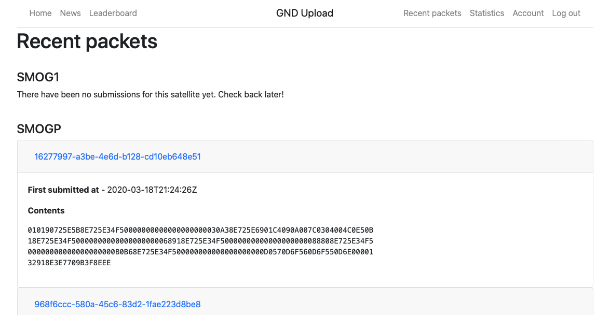

Последние несколько дней я работал над декодированием сигналов со спутника [SMOG-P](https://destevez.net/2019/12/decoding-smog-p-and-atl-1/). Помимо декодирования самого протокола я решил заморочиться и написать полноценную интеграцию между [r2server](https://r2server.ru) и [gnd.bme.hu](https://gnd.bme.hu:8080/index). 

Gnd bme - это сайт, на котором отображаются последние пакеты, принятые со спутника, общая информация о том, как декодировать сигнал. 



Но самое интересное заключается в том, что этот сайт предоставляет небольшой API, чтобы можно было программно отправлять им данные. На самом сайте нет описания этого API, но я внимательно посмотрел [исходники](http://152.66.80.46/smog1/receivesmogpatl1/gorgon.zip) и нашёл в них всё необходимое.

## BmeClient

Для подобных интеграций я предпочитаю делать небольшие проекты, которые удобно переиспользовать. Я завёл проект [bmeClient](https://github.com/dernasherbrezon/bmeClient). Он достаточно простой:

  * по сути переписанный bash скрипт на java
  * при этом для обработки JSON используются внешние библиотеки, а не regexp, как в bash.
  * используется новый HttpClient из JDK11
  * slf4j-api для логирования
  * retry запросов
  
Само API имеет всего 2 метода:

  * получить token для дальнейшей работы
  * загрузить JSON с данными на сервер
  
Несмотря на такой простой протокол, мне захотелось его протестировать.

## Тестирование

Единственное, чем занимается BmeClient - это конвертирует входные параметры в http запрос и обрабатывает ответ от сервера. Именно поэтому я решил протестировать работу клиента с настоящим вэб сервером. Такой сервер должен уметь делать следующее:

  * получать запрос по http
  * отправлять ответ согласно установленному сценарию
  
Такие типы серверов называются - Mock сервер. Я решил погуглить готовую реализацию, нашёл несколько готовых, но меня ужаснули результаты. Чтобы разобраться насколько всё плохо, я решил сравнить несколько на примере простого теста.

## Сравнение

Я ни сколько не сомневаюсь, что все реализации действительно работают и помогают писать тесты. Мне же прежде всего хотелось сравнить простоту реализации одного и того же теста на разных Mock серверах. Сам тест достаточно простой:

  * Из клиента вызвать загрузку данных
  * Сервер должен ответить ошибкой 503 на первую попытку получения токена
  * На следующую попытку ответить статусом 200
  * На попытку загрузить данные ответить статусом 200
  * Тест должен проверить, что на сервер данные были загружены с помощью заранее известного JSON
  
Для сравнения я выбрал следующие Mock сервера:

  * [Mock-Server](https://www.mock-server.com). Рекомендован [baeldung](https://www.baeldung.com/mockserver). [2.5k звёзд на github](https://github.com/mock-server/mockserver)
  * Стандартный ```com.sun.net.httpserver.HttpServer```, который поставляется в каждой JRE. Собственно это даже не Mock сервер, а просто вэб сервер. Из преимуществ - стандартный, простой.
  * [jadler](https://github.com/jadler-mocking/jadler). 84 звезды
  * [WireMock](http://wiremock.org). Просто нагуглил. [3.7к звёзд на github](https://github.com/tomakehurst/wiremock)
  
## Mock-Server

Подключается просто:

```xml
<dependency>
    <groupId>org.mock-server</groupId>
    <artifactId>mockserver-netty</artifactId>
    <version>5.9.0</version>
    <scope>test</scope>
</dependency>
<dependency>
    <groupId>org.mock-server</groupId>
    <artifactId>mockserver-client-java</artifactId>
    <version>5.9.0</version>
    <scope>test</scope>
</dependency>
```

Казалось бы, 2 простые зависимости? Нет, они добавляют ровно ***50 (!!!)*** библиотек в проект. Я не очень понимаю зачем столько нужно. Может быть от этого тесты становятся лучше? Мне потребовалось минут 10, чтобы написать тест. Это достаточно неплохо, если учесть, что я никогда не писал тестов с помощью этой библиотеки. Я потратил бы меньше времени, если бы [туториалы](https://www.baeldung.com/mockserver) работали и, если бы не было этих дурацких статических импортов. Кто вообще их придумал? Вот у меня есть код:

```java
request()
.withBody(exact("some data"))
```

Из какого класса этот ```request``` импортируется? А из какого ```exact```? Для этого мне пришлось залезть в исходники примеров и поискать импорты. Тем не менее с первого раза тест не сработал. 


Да, я не первый день программирую на Java, поэтому точно знаю в чём причина. Хотя она и не следует из описания exception. Конфликт библиотек. Помните я говорил, что подключается 50 библиотек в проект? Так вот, чем больше библиотек, тем больше шанс, что произойдёт конфликт. Именно это и произошло. После того как я поменял версию slf4j в своём проекте с 1.7.12 на 1.7.26, тест выполнился.


Стоп-стоп. Nashorn? Это тот самый [Nashorn](https://openjdk.java.net/projects/nashorn/), который Java движок для запуска Javascript? Почему я вижу это предупреждение? У меня тест REST клиента. Тут нет javascript. Неужели они стартуют его? Я даже не представляю, как исправить это предупреждение. И уж точно не знаю, сломаются ли мои тесты при запуске на следующей версии JDK. Мир сошёл с ума.

Тест вывел кучу бесполезной информации в логи, но при этом успешно прошёл за почти 4 секунды.


Сам код теста выглядит следующим образом:

```java
private ClientAndServer mockServer;
private BmeClient client;
	 
@Before
public void startServer() {
    mockServer = ClientAndServer.startClientAndServer(1080);
    client = new BmeClient("http://localhost", 1080, 10000, 0L, UUID.randomUUID().toString(), UUID.randomUUID().toString());
}
    
@Test
public void testRetryAuthOnInternalSystemError() throws Exception {
    mockServer
    .when(
      request().withPath("/api/tokens"), Times.exactly(1))
    .respond(HttpResponse.response().withStatusCode(503).withBody("{\"error\":\"internal server error\"}"));
    mockServer
    .when(
      request().withPath("/api/tokens"), Times.exactly(1))
    .respond(HttpResponse.response().withStatusCode(200).withBody("{\"token\":\"1234567890\"}"));
    mockServer
    .when(
      request().withPath("/api/packets/bulk"), Times.exactly(1))
    .respond(HttpResponse.response().withStatusCode(200).withBody("{\"results\":[{\"location\":\"/api/packets/1234567890\"}]}"));
    client.uploadBatch(Satellite.SMOGP, Collections.singletonList(new byte[] { (byte) 0xca, (byte) 0xfe }));
    new MockServerClient("localhost", 1080).verify(
            request()
                    .withMethod("POST")
                    .withPath("/api/packets/bulk")
                    .withBody(exact("{\"packets\":[{\"satellite\":\"smogp\",\"packet\":\"cafe\"}]}")),
            VerificationTimes.exactly(1)
    );        
}
  
@After
public void stopServer() { 
    mockServer.stop();
}
```

## WireMock

Подключается просто:

```xml
<dependency>
    <groupId>com.github.tomakehurst</groupId>
    <artifactId>wiremock-jre8</artifactId>
    <version>2.26.3</version>
    <scope>test</scope>
</dependency>
```

Здесь всё суровее - ***52 (!!!)*** дополнительные библиотеки. Наверное, для того, чтобы поддерживать [расширения](http://wiremock.org/docs/extending-wiremock/).

Ладно, можно приступать к исследованию Java API. Я открыл [getting started](http://wiremock.org/docs/getting-started/) и обнаружил очередной DSL:

```java
public void exampleTest() {
    stubFor(get(urlEqualTo("/my/resource"))
```

Откуда взялась эта мода на DSL? Вот как мне понять какие классы нужно заимпортить? Начал исследовать сайт в поисках исходников и наткнулся на изумительное:


На-секундочку, ещё раз. ```Friendly Web UI``` для того, чтобы написать юнит тесты? Или это мода на монетизацию? Мол, попробуйте наш бесплатный продукт, а для использования Web UI заплатите. Я чего-то не понимаю.


Я не знаю, что хотели сказать авторы отсутствующим javadoc к своему DSL. Но мне потребовалось где-то 30 минут, чтобы разобраться в API и написать работающий тест. 2 секунды на исполнение и собственно код теста:

```java
@Rule
public WireMockRule wireMockRule = new WireMockRule(8089);

private BmeClient client;

@Test
public void testRetryAuthOnInternalSystemError() throws Exception {
    stubFor(post(urlEqualTo("/api/tokens")).inScenario("retryAuth")
            .willReturn(aResponse()
                .withStatus(503)
                .withBody("{\"error\":\"internal server error\"}"))
            .willSetStateTo("RETRIED"));		
    stubFor(post(urlEqualTo("/api/tokens")).inScenario("retryAuth").whenScenarioStateIs("RETRIED")
            .willReturn(aResponse()
                .withStatus(200)
                .withBody("{\"token\":\"1234567890\"}")));		
    stubFor(post(urlEqualTo("/api/packets/bulk"))
            .willReturn(aResponse()
                .withStatus(200)
                .withBody("{\"results\":[{\"location\":\"/api/packets/1234567890\"}]}")));		

    client.uploadBatch(Satellite.SMOGP, Collections.singletonList(new byte[] { (byte) 0xca, (byte) 0xfe }));
    
    verify(postRequestedFor(urlEqualTo("/api/packets/bulk")).withRequestBody(equalTo("{\"packets\":[{\"satellite\":\"smogp\",\"packet\":\"cafe\"}]}")));
}

@Before
public void start() throws Exception {
	client = new BmeClient("http://localhost", 8089, 10000, 0L, UUID.randomUUID().toString(), UUID.randomUUID().toString());
}
```

## Jadler

Подключение стандартное:

```xml
<dependency>
    <groupId>net.jadler</groupId>
    <artifactId>jadler-all</artifactId>
    <version>1.3.0</version>
    <scope>test</scope>
</dependency>
```

На удивление мало зависимостей. Всего 14 библиотек. Настройка и использование достаточно тривиальны. Несмотря на то, что используется вездесущий DSL, на его настройку мне потребовалось минут 5. Тест прошёл за 1 секунду и выглядит следующим образом:

```java
private BmeClient client;

@Test
public void testRetryAuthOnInternalSystemError() throws Exception {
	 onRequest()
     	.havingPathEqualTo("/api/tokens")
     	.havingMethodEqualTo("POST")
     .respond()
     	.withStatus(503)
     	.withBody("{\"error\":\"internal server error\"}")
     .thenRespond()
     	.withStatus(200)
     	.withBody("{\"token\":\"1234567890\"}");
	 onRequest()
     	.havingPathEqualTo("/api/packets/bulk")
     	.havingMethodEqualTo("POST")
     .respond()
     	.withStatus(200)
     	.withBody("{\"results\":[{\"location\":\"/api/packets/1234567890\"}]}");
	 
	 client.uploadBatch(Satellite.SMOGP, Collections.singletonList(new byte[] { (byte) 0xca, (byte) 0xfe }));
	 
     verifyThatRequest()
     	.havingMethodEqualTo("POST")
     	.havingPathEqualTo("/api/packets/bulk")
     	.havingBodyEqualTo("{\"packets\":[{\"satellite\":\"smogp\",\"packet\":\"cafe\"}]}")
     	.receivedOnce();		 
}

@Before
public void start() throws Exception {
	initJadler();
	client = new BmeClient("http://localhost", port(), 10000, 0L, UUID.randomUUID().toString(), UUID.randomUUID().toString());
}

@After
public void stop() {
    closeJadler();
}
```

## HttpServer

Подключение простое: его просто нет. Этот сервер по-умолчанию доступен в любой JRE. Нет зависимостей, нет проблем совместимости версий. Не нужно следить за обновлениями.

Поскольку это простой вэб сервер, то никакого DSL для написания тестов нет. Его можно сделать самому или не использовать совсем! [Некоторые](https://alistairisrael.wordpress.com/2009/09/02/functional-http-testing-with-sun-java-6-httpserver/) излишне переусложняют свои тесты. Они получаются громоздкими и не очень читабельными. Мне удалось написать достаточно просто:

```java
private HttpServer server;
private BmeClient client;

private String request;

@Test
public void testRetryAuthOnInternalSystemError() throws Exception {
	List<HttpResponse> responses = new ArrayList<>();
	responses.add(new HttpResponse(503, "{\"error\":\"internal server error\"}"));
	responses.add(new HttpResponse(200, "{\"token\":\"1234567890\"}"));
	server.createContext("/api/tokens", new SequentialHttpResponse(responses));
	server.createContext("/api/packets/bulk", createSuccessBulkHandler());
	
	client.uploadBatch(Satellite.SMOGP, Collections.singletonList(new byte[] { (byte) 0xca, (byte) 0xfe }));
	assertEquals("{\"packets\":[{\"satellite\":\"smogp\",\"packet\":\"cafe\"}]}", request);
}

@Before
public void start() throws Exception {
	request = null;
	String host = "localhost";
	int port = 8000;
	server = HttpServer.create(new InetSocketAddress(host, port), 0);
	server.start();
	client = new BmeClient("http://" + host, port, 10000, 0L, UUID.randomUUID().toString(), UUID.randomUUID().toString());
}

private HttpResponse createSuccessBulkHandler() {
	return new HttpResponse(200, "{\"results\":[{\"location\":\"/api/packets/1234567890\"}]}") {

		@Override
		public void handle(HttpExchange exchange) throws IOException {
			request = convertToString(exchange.getRequestBody());
			byte[] bytes = getMessage().getBytes(StandardCharsets.UTF_8);
			exchange.sendResponseHeaders(getStatusCode(), bytes.length);
			OutputStream os = exchange.getResponseBody();
			os.write(bytes);
			os.close();
		}
	};
}

private static String convertToString(InputStream is) {
	try (java.util.Scanner s = new java.util.Scanner(is)) {
		return s.useDelimiter("\\A").hasNext() ? s.next() : "";
	}
}

@After
public void stop() {
	if (server != null) {
		server.stop(0);
	}
}
```

Такой тест выполняется за ~0.8с. Ещё я сделал 2 вспомогательных класса ```HttpResponse``` и ```SequentialHttpResponse```, которые просто возвращают ожидаемый результат и статус код. Для того чтобы протестировать результат запроса, я написал метод ```createSuccessBulkHandler```. Он немного громоздкий, но при желании можно упростить.

## Выводы

  1. Мир сошёл с ума. Для простейшей задачи требуется 50+ библиотек
  2. Чем меньше библиотек, тем лучше
  3. DSL - это зло. В каждой из библиотек используется свой собственный DSL со своими собственными парадигмами.
  4. HttpServer - идеальный вариант для тестирования небольших REST клиентов