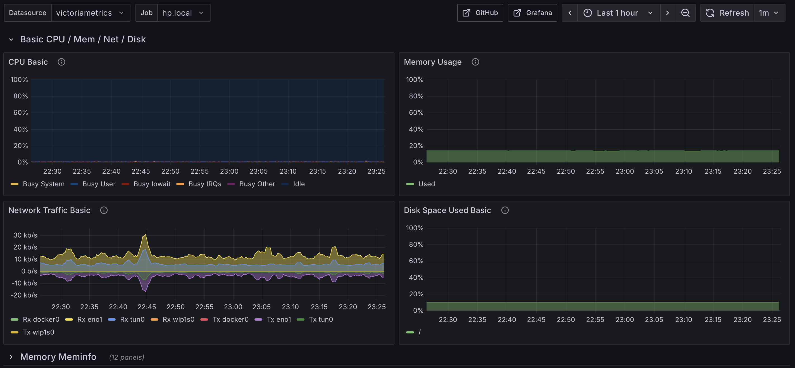
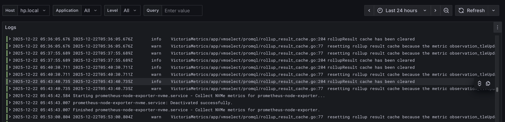

После нескольких месяцев использования MQTT для сборка метрик, я понял, что и [эта конфигурация]() тоже не работает.



Во-первых, хранение на диске реализовано очень плохо. Оно происходит периодически раз в ```autosave_interval```, но при этом данные не удаляются из памяти! А при рестарте mosquitto полностью читает файл с диска в память. Такой дизайн подходит только для коротких проблемах с сетью. В моём случае, проблемы с сетью могут достигать от нескольких дней до нескольких месяцев.

Во-вторых, если mosquitto находится за NAT, то пробить доступ к нему очень сложно.

## Поиск дизайна

Я в очередной раз решил поискать существующие альтернативы и нашёл [VictoriaMetrics](https://victoriametrics.com). Victoria* - это семейство утилит, которые позволяют собирать метрики (VictoriaMetrics) и логи (VictoriaLogs) в одном месте. При этом их дизайн разрабатывался с учётом уже существующего Prometheus, Loki и Elasticsearch. [В своих статьях](https://docs.victoriametrics.com/victorialogs/faq/) они часто ссылаются на те или иные системы и говорят, что у них сделано лучше. И это скорей всего так и есть, потому что только разработка с нуля может решить некоторые концептуальные проблемы. А существующие системы обычно не могут себе такое позволить, так как для этого им придётся сделать очень много обратно несовметимых изменений.

Поскольку есть разделение на метрики и логи, то и в своём дизайне я решил их собирать разными способами. 

## Сбор метрик

Для сбора метрик я поднял рекомендованную разработчиками VictoriaMetrics систему:



В такой конфигурации node_exporter - это вынужденный шаг, так как нужен какой-то процесс для, собственно, получения системных метрик. Далее [vmagent](https://docs.victoriametrics.com/victoriametrics/vmagent/) периодически получает эти метрики и шлёт на сервер. Тут он ничем не отличается от [fluent-bit](https://fluentbit.io), который я использовал раньше, за исключением того, что в нём правильно реализована персистентная очередь. 

На сервере стоит [vmauth](https://docs.victoriametrics.com/victoriametrics/vmauth/) - это легковесный прокси, который может делать SSL termination, аутентификацию и роутинг. В принципе, мог бы подойти nginx, но он слишком заточен для проксирования сайтов.

За vmauth стоит, собственно, процесс VictoriaMetrics. Он сохраняет данные локально, строит индексы, поддерживает разные типы запросов для получения данных в том числе PromQL.

Вообще хочется отметить насколько авторы VictoriaMetrics знают, что делают, и что уже существует. Так как они зашли на рынок самые последние, то у них было преимущество - они могли разрабатывать систему с оглядкой на другие похожие. Но был и недостаток - многие уже используют ту или иную систему сбора метрик. Так вот, чтобы сгладить это, все их компоненты обратно-совместимые с Prometheus, а vmagent позволяет принимать данные в формате influxdb, Prometheus и многих других.

Ещё одна вещь, которая мне крайне понравилась - это интеграция всех компонент между собой. Все конфиги единообразные, все потоки данных согласованы между собой.

Так как VictoriaMetrics полностью совместима с Prometheus, то можно взять любой готовый дашборд и просто поменять источник данных:



## Сбор логов

Для сбора логов я поднял [VictoriaLogs](https://docs.victoriametrics.com/victorialogs/). А для отправки системных логов настроил интеграцию c [systemd-journal-upload](https://docs.victoriametrics.com/victorialogs/data-ingestion/journald/).



Из плюсов такого дизайна:

 * systemd-journal-upload - это стандартный процесс, который поставляется с journald
 * VictoriaLogs нативно поддерживает передачу логов в бинарном виде от systemd-journal-upload
 
Из минусов:

 * systemd-journal-upload поддерживает только аутентификацию по сертификату (mTLS). И только начиная с версии v258 можно передавать дополнительные заголовки
 * systemd-journal-upload совсем не умеет работать с нестабильными соединениями. В моём случае соединение периодически обрывалось, и вместо того, чтобы уменьшить блок передаваемых логов и перепослать данные, процесс просто зависал. При этом нет никакого способа сконфигурировать таймаут соединения
 * systemd-journal-upload передаёт все данные включая PID процесса, командную строку запуска процесса и тд. Это удобно, если нужно объединить журналы со многих серверов в одном, но совсем не подходит для меня. Мне нужно получать данные по достаточно узкому каналу мобильного Интернета
 * vmauth community версии не поддерживает mTLS, поэтому нужно использовать что-нибудь ещё, например, nginx

systemd-journal-upload - это не единственная интеграция, которую [поддерживает VictoriaLogs](https://docs.victoriametrics.com/victorialogs/data-ingestion/). Однако, ставить мощный комбайн, а потом исследовать его особенности у меня не было желания. Поэтому я решил написать небольшую программу на С, которая бы получала данные из journald и отправляла с помощью libcurl на сервер.



Из преимуществ такого подхода:

 * можно полностью контроллировать что посылается на сервер. Например, отфильтровать ненужные поля или, например, преобразовать названия приложений из r2cloud.service в r2cloud
 * можно использовать HTTP Basic Authentication и переиспользовать vmauth
 
Но есть и ряд недостатков:

 * нужно придумать птичий язык фильтрации логов. Например, исключить debug логи из посылки на сервер для определённых приложений или поменять уровень лога, или дополнительно распарсить сообщение в логе
 * нужно поддерживать и перекомпилировать для новых архитектур и операционных систем

В результате я настроил [VictoriaLogs](https://grafana.com/grafana/plugins/victoriametrics-logs-datasource/) плагин для Grafana и смог построить вот такой дашборд:



