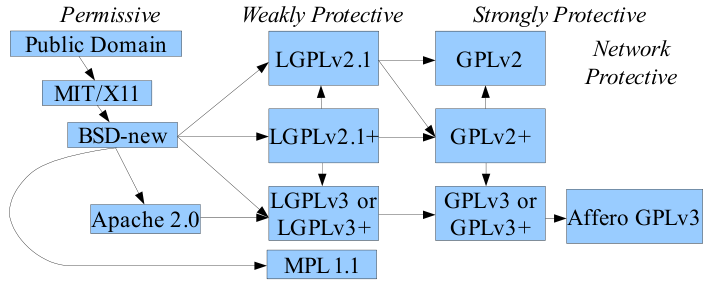
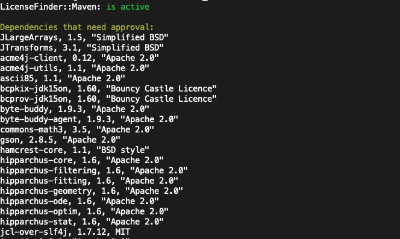

На самом деле универсального ответа на этот вопрос нет. Всё, как обычно, зависит от целей проекта и личных предпочтений автора. Open source лицензий великое множество и каждый может выбрать абсолютно любую. Главное, что нужно помнить, open source - это не код без лицензии. 

Даже для мини-проектов на github нужно указывать лицензии. Зачем? Допустим, Вы сделали небольшую, но крайне полезную библиотеку. Допустим, её нашёл какой-нибудь разработчик и захочет использовать в своём коммерческом приложении. Но ни одна компания в здравом уме не будет использовать библиотеку без лицензии. Никому не нужны проблемы с юристами. Именно поэтому, Ваш, хоть и полезный проект, не будет использован. А разработчики вынуждены будут либо использовать альтернативы, либо полностью переписывать Ваш код. Чтобы избежать этой ситуации, лучше озаботиться правильной лицензией заранее.

## Зоопарк

Существует целый зоопарк Open source лицензий. Наверное, именно поэтому, разработчики не заморачиваются и просто не указывают лицензию. Однако, разобраться с ними достаточно просто.



By David A. Wheeler - <a rel="nofollow" class="external free" href="http://www.dwheeler.com/essays/floss-license-slide.html">http://www.dwheeler.com/essays/floss-license-slide.html</a>, <a href="https://creativecommons.org/licenses/by-sa/3.0" title="Creative Commons Attribution-Share Alike 3.0">CC BY-SA 3.0</a>, <a href="https://commons.wikimedia.org/w/index.php?curid=41060008">Link</a>

Дэвид провёл небольшое исследование и собрал наиболее популярные open source лицензии на одной картинке. Если вкратце, то все open source лицензии условно можно разделить на 3 основные группы:
 
 * Разрешающие (permissive)
 * Слабо защищающие (weak protective)
 * Сильно защищающие (strong protective)

Стрелочками указана совместимость между лицензиями. Например, разрабатывая программу под GPLv3, Вы можете включать в неё компоненты, выпущенные по лицензии Apache 2.0. Но не наоборот.

## Разрешающие

Наиболее распространённые лицензии - это [MIT](http://licenseit.ru/wiki/index.php/MIT_License), [BSD](http://licenseit.ru/wiki/index.php/BSD_License) и [Apache 2.0](http://licenseit.ru/wiki/index.php/Apache_License_version_2.0). За небольшими девиациями, эти лицензии позволяют использовать код как в коммерческих, так и в open source проектах. Главное указывать авторство оригинальной программы. Полное описание доступно по ссылкам выше.

## Слабо защищающие

Различные варианты [Lesser GPL](http://licenseit.ru/wiki/index.php/GNU_Lesser_General_Public_License_version_2.1). Основное отличие от разрешающих лицензий - это необходимость предоставлять исходные коды и лицензировать программу под GPL лицензией (копилефт). При этом, если в Вашем проекте используется библиотека (динамическая линковка или статическая) под лицензией LGPL, то она будет совместима с любой лицензией Вашего проекта. 

## Сильно защищающие

Различные варианты [GPL](http://licenseit.ru/wiki/index.php/GNU_General_Public_License_version_3). Эти лицензии требуют раскрытие исходных кодов и лицензирование проекта, независимо от того, как используется библиотека.

## Немного экзотики

Существует ещё одна достаточно полезная лицензия - [GPLv2 with classpath extensions](https://softwareengineering.stackexchange.com/questions/119436/what-does-gpl-with-classpath-exception-mean-in-practice). Она используется компанией Oracle для лицензирования своих open source решений. Зачем она вообще нужна и чем отличается от обычной LGPL? 

Для начала нужно сказать, что все "классические" GPL лицензии не работают с такой штукой как байт-код. В них есть описание процесса линковки и компиляции, что совсем не подходит интерпретируемым языкам, в том числе Java. Для этого как раз и была выпущена специальная лицензия GPLv2 with classpath extensions. Она ясно и чётко говорит, что библиотеки, выпущенные под этой лицензией можно использовать в коммерческих приложениях с любой другой лицензией.

## Выбор лицензии

После того как лицензия выбрана, её достаточно добавить в корень проекта. Это можно сделать во время создания проекта или в любое другое время. Например, github сделали очень удобный способ добавления лицензии при старте проекта:


## license_finder

Однако, это ещё не всё. Нужно проверить все зависимости, которые использованы в проекте. Если одна из зависимостей в проекте выпущена под лицензией GPL, то и Ваш проект должен быть GPL-совместим. Для такой проверки есть очень удобный инструмент - [license_finder](https://github.com/pivotal/LicenseFinder). Он поддерживает все современные системы сборки и может получить лицензии всех зависимых библиотек. 



На картинке выше, эта программа автоматически определила систему управления зависимостями maven и прошлась по каждой из них. В результате найдено множество зависимостей и напротив каждой из них проставлено название лицензии.

Программа сама не разрешает конфликтов между лицензиями и не выбирает правильную. Это лишь удобный инструмент просмотреть лицензии всех своих зависимостей. Разруливать конфликты нужно вручную. Для этого можно добавить лицензии в список разрешённых.

```bash
license_finder approvals add "Apache 2.0"
```

После того как лицензии вручную одобрены, программа создаст файл ```doc/dependency_decisions.yml```. В этом файле будет список всех разрешённых лицензий. 

Ну и вишенкой на торте будет добавление license_finder шагом сборки в CI. Если он найдёт не одобренную лицензию, то статус код будет не равен 0, и сборка упадёт. Очень удобно, если случайно добавили новую зависимость, но не посмотрели её лицензию. Вот пример добавления в travis-ci:

```yaml
before_install:
  - gem install license_finder
  
script:
  - set -e
  - license_finder
  - the rest of build
```

