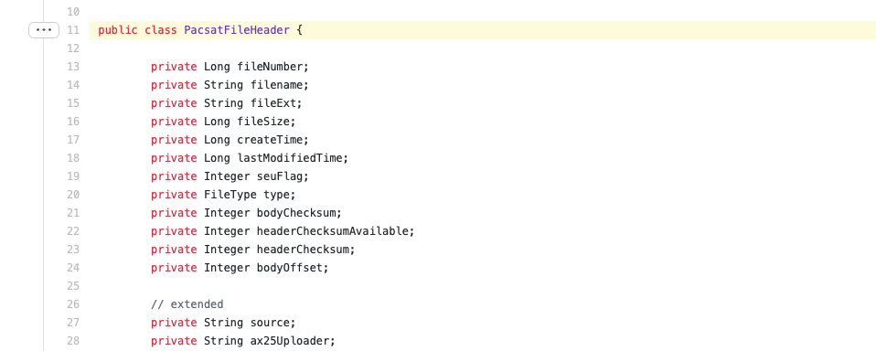

## Вступление

30 лет назад, когда я ещё под стол ходил, собрались умные люди и придумали протокол под названием Pacsat. Этот протокол позволял обмениваться сообщениями и файлами через спутники. Звучит, как будто в конце 80-х решили придумать космический FTP сервер. Всё это, а так же многое другое я обнаружил, когда решил декодировать [Falconsat-3](https://db.satnogs.org/satellite/30776). В голове почему-то сразу всплыли ББС, телетайпы и запахло пылью. Недолго думая, я решил погрузиться в мир старины и заняться активной археологией.

## Pacsat

На момент создания, уже был протокол обмена файлами - [FTP](https://ru.wikipedia.org/wiki/FTP). Он работал в режиме точка-точка: один клиент запрашивает данные у одного сервера. Это удобно, если нужно обеспечить конфиденциальность данных и простоту реализации. Однако, каналы радиолюбительских спутников в то время были достаточно узкие. Да и конфиденциальность тоже не нужна, так как по закону вся коммуникация на радиолюбительских частотах должна быть в открытом виде. А раз этого не нужно делать, то можно придумать протокол, который бы использовал эти особенности. Так и появился Pacsat.

Идея заключается в том, что одна станция может послать запрос, а несколько станций в пределах видимости спутника могут получить ответ. И, вместо того, чтобы делать похожие запросы, станции могут переиспользовать полученные данные.  

С помощью этого протокола можно загружать файлы на спутник, просматривать список доступных файлов, скачивать выбранный, получать обычные текстовые сообщения и телеметрию спутника. Больше о мотивации создания протокола можно прочитать в [официальной документации](https://www.g0kla.com/pacsat/intro.txt).

## Структура фреймов

Все фреймы протокола Pacsat передаются с помощью протокола [AX.25](https://ru.wikipedia.org/wiki/AX.25). При этом тип фрейма определяется значением "destination" заголовка AX.25.

```java
if (source.equalsIgnoreCase("PFS3")) {
	if (destination.equalsIgnoreCase("TIME")) {
		pht = new PacsatHousekeepingTask(readMessage(dis));
	} else if (destination.equalsIgnoreCase("LSTAT")) {
		lstat = new LoaderStatusLine(readMessage(dis));
	}
	...
}
```

Большинство фреймов - это текстовые строчки в ASCII кодировке. Например, информация о текущем времени на спутнике:

```
PHT: uptime is 922/22:26:34.  Time is Thu Sep 03 20:54:33 2020
```

Телеметрия передаётся в бинарном виде и для каждого спутника своя. Для Falconsat-3 я не нашёл официальной документации с описанием формата. Однако, есть проект [Falcon](https://github.com/ac2cz/Falcon/blob/master/spacecraft/TlmIformat.csv), в котором есть описание полей. За неимением лучшего, я [скопировал](https://github.com/dernasherbrezon/jradio/blob/master/src/main/java/ru/r2cloud/jradio/falconsat3/Telemetry.java) их формат. В итоге получилось неплохо. По крайней мере количество передаваемых байт в настоящем фрейме совпало с количеством в описании.

```
"bus4v6Current": 0.018719183,
"bus4v6Voltage": 4.5808215,
"bus3v3Current": 0.09616788,
"bus3v3Voltage": 3.3550766,
...
```

Данные тоже выглядят более или менее правдоподобно. Например, напряжение 3.3В на шине действительно близко к 3.3В.

А вот формат передачи файлов стандартный и описан в [спецификации Pacsat](https://www.g0kla.com/pacsat/broadcst.txt). Каждый файл передаётся на Землю разбитым на фреймы. Каждый фрейм состоит из заголовка и данных.

```
<flags><file_id><file_type><offset><data><crc>
```

Для того чтобы получить файл, нужно собрать все фреймы с одинаковым ```file_id``` и склеить их поле ```data```. Однако, тут есть тонкость. Так как общего количества фреймов нет в заголовке, то и понять, когда же файл полностью получен нельзя. Есть только смещение блока данных в результирующем файле. По нему нельзя сказать сколько всего будет этих блоков. 

Поэтому я решил [сгруппировать их по file_id и отсортировать по offset](https://github.com/dernasherbrezon/jradio/blob/master/src/main/java/ru/r2cloud/jradio/falconsat3/FileExtractor.java#L32). Фрейм, у которого offset=0 является первым. Этот фрейм очень важен, так как в нём находится заголовок pacsat файла. А в этом заголовке передаётся мета-информация о файле, в том числе и его размер. Зная размер файла, можно понять какой фрейм последний. Псевдокод выглядит следующим образом:

```java
Map<Long, List<BroadcastFileFrame>> groupByFileId = groupBy(frames);
for (List<BroadcastFileFrame> cur : groupByFileId.values()) {
	Collections.sort(cur, BroadcastFileFrameComparator.INSTANCE);
	PacsatFile file = null;
	for (int i = 0; i < cur.size(); i++) {
		BroadcastFileFrame frame = cur.get(i);
		if (i == 0 && frame.getOffset() != 0) {
			// can't restore the file without header
			break;
		}
		if (i == 0 && frame.getOffset() == 0) {
			// read the header and populate the file
			file = new PacsatFile();
			file.setHeader(header);
			file.setFileId(frame.getFileId());
			file.setBody(new byte[header.getFileSize().intValue() - header.getBodyOffset()]);	
			...		
		} else {
			// populate the body
			file.append(frame.getData(), frame.getOffset() - file.getHeader().getBodyOffset());
		}
}
```

Тут не очень понятно зачем добавили тип файла в заголовок фрейма. Дело в том, что в заголовке pacsat файла тоже есть тип файла. И по спецификации они должны совпадать. Вместо этого типа файла я бы добавил размер файла, чтобы упростить декодирование.

Ещё одним неудобством этих фреймов является их количество. Допустим, я знаю общий размер файла и таким образом фрейм с последним кусочком файла. Но как узнать сколько всего кусочков-фреймов было использовано для передачи? Поле ```length``` опционально, а значит нельзя рассчитывать, что каждый спутник будет его посылать. И, например, Falconsat-3 не посылает его. Также в спецификации нет требования к длине фрейма. Поэтому один и тот же файл 400 байт может быть послан одним фреймом, а может быть четырьмя.

Для того чтобы понять, получены ли все фреймы я написал следующий алгоритм:

```java
System.arraycopy(part, 0, body, offset, part.length);
holes.remove(offset);
int nextExpectedOffset = offset + part.length;
// add hole of the next offset
// if this is the last chunk, then do not it's offset
if (nextExpectedOffset < body.length) {
	holes.add(nextExpectedOffset);
}
``` 

В наборе ```holes``` содержатся недостающие индексы. Как только приходит самый первый кусочек файла, я сразу же добавляю недостающий индекс, который должен быть следующим. Таким образом в ```holes``` содержится как минимум один индекс. Если же он получен, то я рассчитываю следующий недостающий. И так далее пока не будет получен самый последний. Тогда я не добавляю его в ```holes``` и этот набор становится пустым. А это значит файл был полностью принят. Алгоритм использует тот факт, что все полученные фреймы отсортированы по ```offset```.

Сам [заголовок pacsat файла](https://github.com/dernasherbrezon/jradio/blob/fc7863b71a28029a7e480f92d99ca5ada8f3063c/src/main/java/ru/r2cloud/jradio/falconsat3/PacsatFileHeader.java#L11) содержит достаточно много полей. Среди них есть и название файла, и его контрольная сумма:



С контрольной суммой вышла забавная история. Каждый фрейм уже содержит контрольную сумму XMODEM CRC16. Однако, есть ещё контрольная сумма заголовка pacsat файла и его данных. Как написано в документации, спутники могут попытаться восстановить часть файла, если произошёл ```Single Event Upset```. Файлы ведь хранятся на диске спутника, а значит подвержены ошибкам. И то, что в протоколе предусмотрена возможность контроля целостности на уровне файлов - это заслуживает уважения. Другой вопрос в том, как это сделано. Когда я попытался рассчитать контрольную сумму, у меня ничего не получилось! И только спустя несколько часов исследований выяснилось, что нужно было использовать другой алгоритм CRC16! Не XMODEM CRC16, как везде, а простой [Sum-Of-Bytes](https://github.com/dernasherbrezon/jradio/blob/fc7863b71a28029a7e480f92d99ca5ada8f3063c/src/main/java/ru/r2cloud/jradio/crc/Crc16SumOfBytes.java).

Вот, собственно, и всё. Я скачал демодулированые AX.25 кадры с db.satnogs.org и получил вот такое милое сообщение:

```
To  : ALL
From: ST2NH
Time: 084104UTC
Date: 20 Aug 2020
-----------------
Hello all,
very dark clouds with heavy thunderstorm at the med of the day.
see photo of the dark sky above my antenna.

Good WX for every one

73 de st2nh
```

## Выводы

Я стал ещё на шаг ближе к выживанию в случае зомби-апокалипсиса.