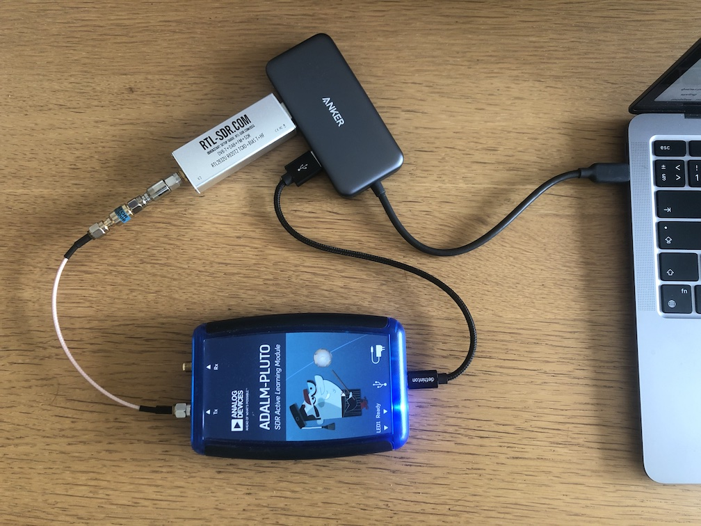
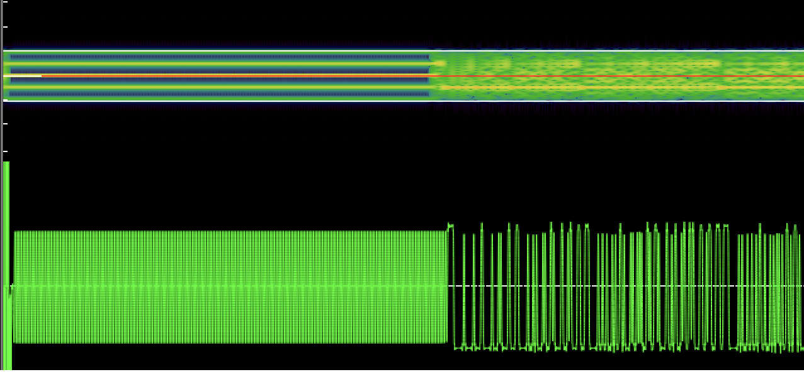
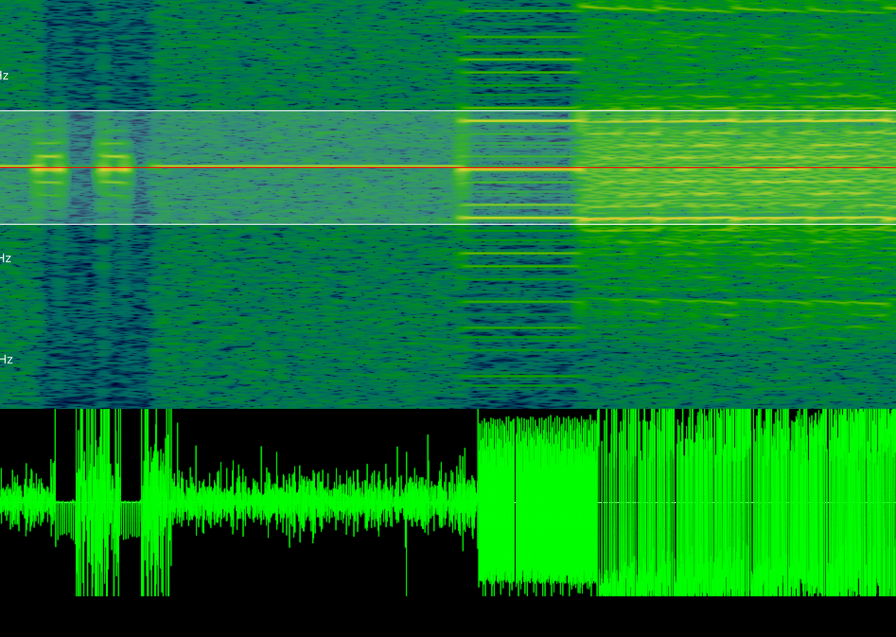
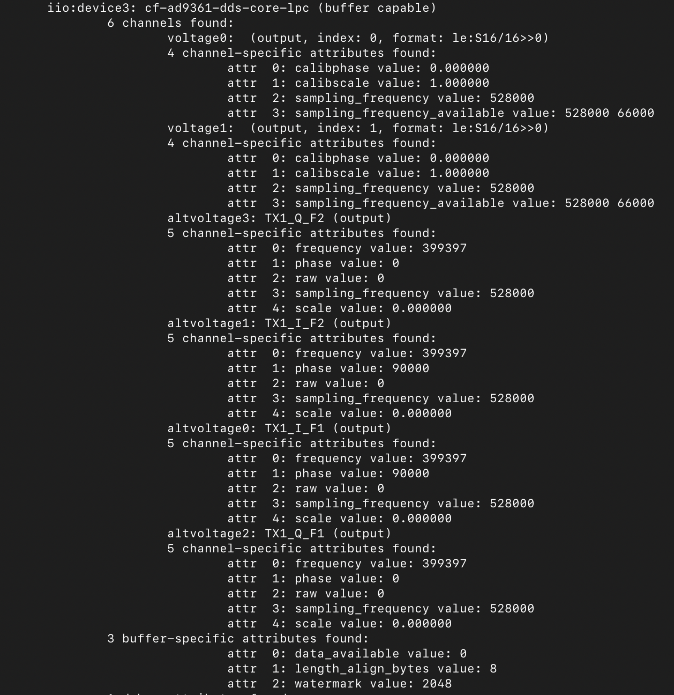
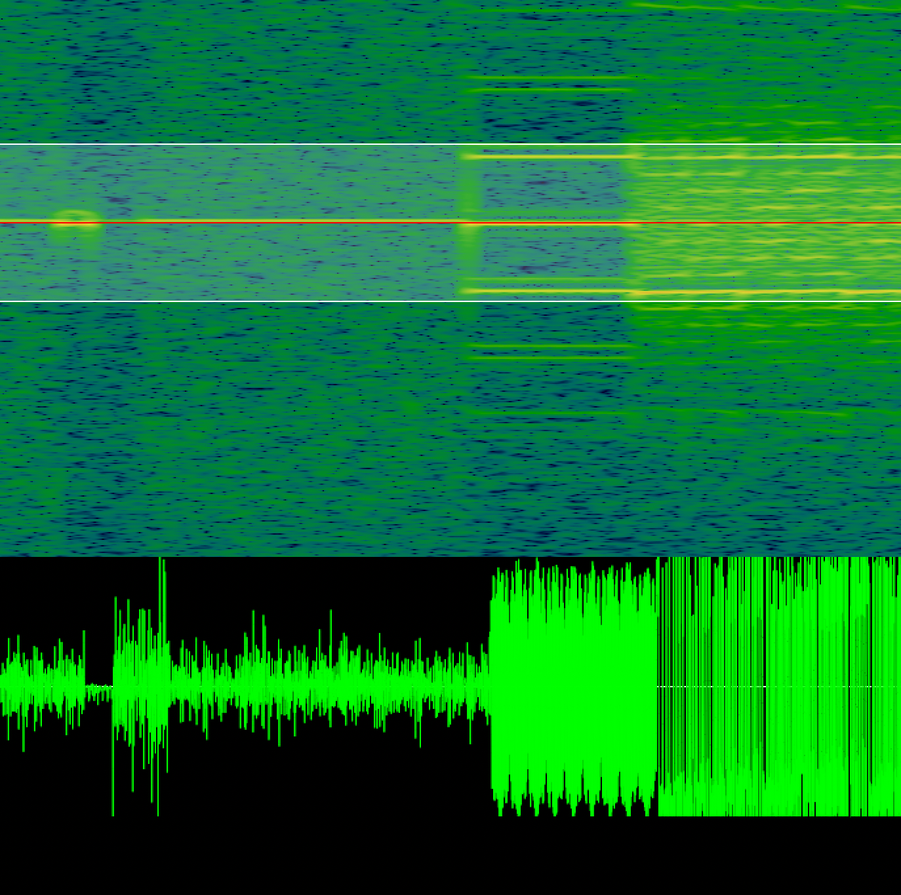
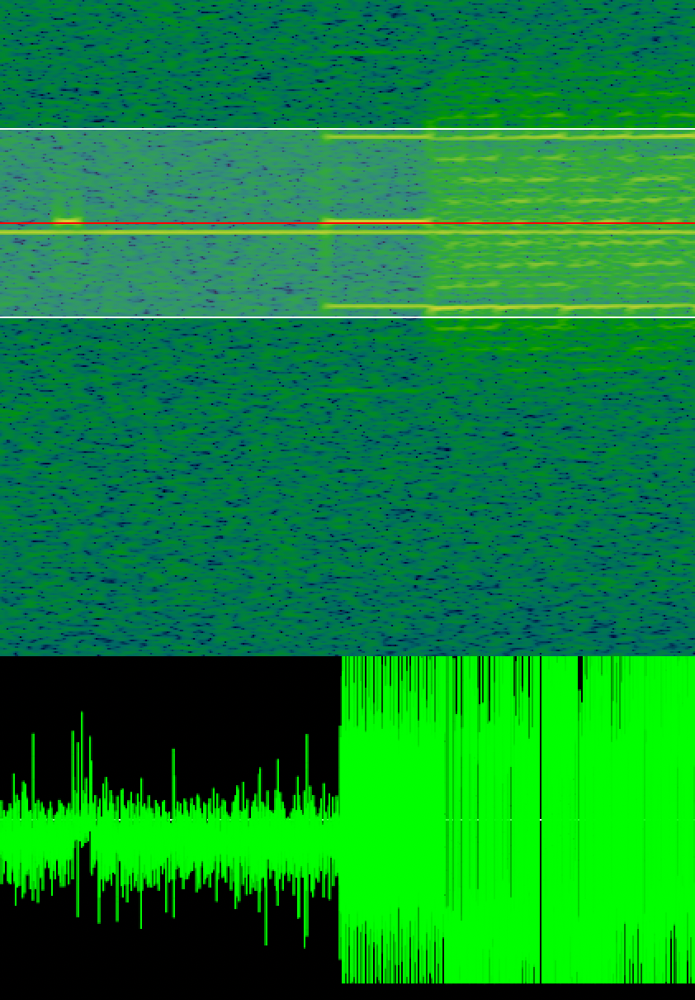
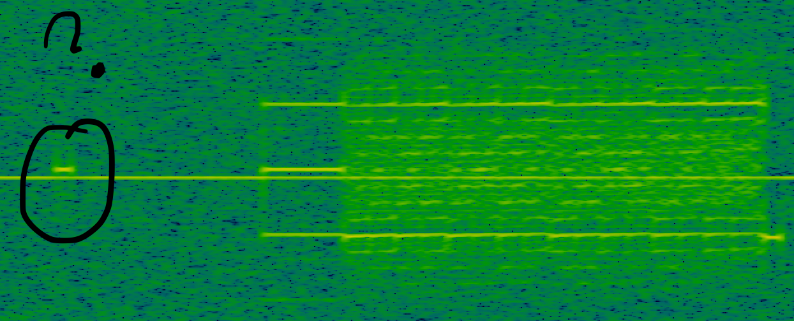
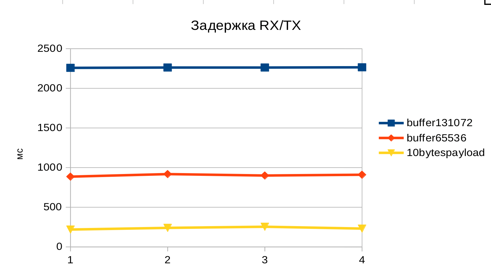

Последние несколько месяцев я напряжённо работаю над своим проектом [sdr-modem](https://github.com/dernasherbrezon/sdr-modem). Он представляет собой небольшой TCP сервер, который получает массив байт от клиента и передаёт их с помощью радио сигнала в эфир. Также он может и получать сигнал, декодировать и отправлять клиентам поток байтов.

Пару недель назад я наконец-то дописал основную функциональность и тесты. Пришло время протестировать его работу в реальных условиях. Для этого я сделал небольшой тестовый стенд:
 
  * java приложение соединяется с
  * sdr-modem по TCP и отправляет массив байтов.
  * sdr-modem отправляет FSK модулированный сигнал в plutosdr. У меня есть только одно устройство, которое может отправлять радио сигналы, поэтому выбора особого не было.
  * plutosdr по проводу и с помощью аттенюаторов на 40db соединён с 
  * rtlsdr. Сигнал от rtlsdr идёт в 
  * sdr-server, который отправляет его в 
  * sdr-modem. sdr-modem отправляет демодулированный сигнал в 
  * изначальное java приложение, которое слушает его на отдельном потоке
  
Выглядит всё это как-то так:



Ну или как-то так:



В результате получается полный дуплекс с отправкой и получением данных.

Всё это было сделано, чтобы:

  1. Убедиться, что отправленный фрейм можно получить.
  2. Измерить задержку в коде. 

## Отправка и получение

Данные перед отправкой должны быть закодированы во фреймы. Это нужно прежде всего для того, чтобы найти начало и окончание. Как только фрейм будет получен и контрольная сумма проверена, то можно замерить время получения.

Я выбрал наиболее распространённый канальный протокол - [HDLC](https://ru.wikipedia.org/wiki/HDLC). Именно он лежит в основе AX.25. И его достаточно просто реализовать. И приём HDLC фреймов уже реализован в другом моём проекте - [jradio](https://github.com/dernasherbrezon/jradio).

После того как фрейм получен, нужно добавить перед ним несколько байтов вида 0b01010101. Это нужно для того, чтобы символьная синхронизация смогла синхронизироваться с потоком. Так же такая последовательность используется в модемах с автоматическим определением скорости передачи данных. 

В конце же, неплохо было бы добавить несколько нулевых байтов, чтобы [NRZI кодирование](https://ru.wikipedia.org/wiki/NRZI) пакета корректно выдала самые последние биты фрейма.

В итоге спектограмма сигнала выглядит как-то так:



Я использовал классную программу [inspectrum](https://github.com/miek/inspectrum) для визуализации сигнала. Сверху отображается спектограмма сигнала. Снизу сэмплы. На спектограмме отчётливо видна синхронизирующая последовательность 01010101 - это две параллельные линии. Также видно, что частоты, кодирующие 0 и 1, разнесены (спойлер: 5кГц, а скорость передачи данных 9600 бод).

## Анализ результатов

[sdr-modem](https://github.com/dernasherbrezon/sdr-modem) позволяет сохранять переданный и полученный сигнал в файл для последующего анализа. Вот, что я получил на входе rtlsdr:



Что ж, полученный сигнал очень походит на то, что я послал и это своего рода успех. Однако, java программа не смогла найти переданный фрейм. Если приглядеться к спектограмме, то видно, что вместо двух частот для 0 и 1, передаётся очень много других частот (горизонтальных линий).

Мне пришлось потратить целую неделю, пересобрать ~~двигатель~~ модулятор/демодулятор и симулировать сигнал в java программе, чтобы найти причину такого странного поведения.

Когда я уже почти отчаялся найти проблему в коде, внезапно наткнулся в одной статье на DDS. Поскольку ничего другого, мне не оставалось, я решил почитать, что же это такое. Оказывается, внутри plutosdr есть некий виртуальный генератор сигнала. Он может генерировать сигнал заданной частоты и фазы. Его можно включить и выключить. Причём, как позже я выяснил, самое интересное заключается в том, что настройки этого генератора сохраняются на внутреннем диске plutosdr и применяются при перезагрузке устройства!

Чтобы узнать включён ли генератор, нужно выполнить команду:

```
iio_attr -a -c cf-ad9361-dds-core-lpc altvoltage0
```

Если генератор (TX1_I_F1/TX1_Q_F1/TX1_I_F2/TX1_Q_F2) включён, то вывод будет содержать:

```
dev 'cf-ad9361-dds-core-lpc', channel 'altvoltage0' (output), id 'TX1_I_F1', attr 'raw', value '1'
```



Понятное дело, при передаче полезного сигнала не стоит подмешивать случайно генерируемый. Отключается DDS достаточно просто:

```c
struct iio_channel *channel = pluto->lib->iio_device_find_channel(pluto->tx, "TX1_I_F1", true);
int code = pluto->lib->iio_channel_attr_write_bool(channel, "raw", 0);
if (code < 0) {
    return code;
}
```

После ещё одного запуска спектограмма стала выглядеть следующим образом:



Результат стал значительно лучше! Нет больше паразитных частот. Однако, частоты 0 и 1 почему-то сдвоены. Такое ощущение, что передаётся два сигнала с незначительным сдвигом по частоте.

Предыдущее открытие показало, что дело скорей всего в самом plutosdr, чем в исходном сигнале или моём коде. Я стал внимательно исследовать параметры устройства.

К сожалению, ничего интересного в параметрах я не обнаружил. Зато нашёл [интересный код](https://github.com/analogdevicesinc/plutosdr_scripts/blob/master/pluto_tx_data.py#L45), который инициализировал plutosdr на передачу сигнала. Этот код очень похож на мой, однако в нём частота (frequency) устанавливалась ДО установки всех других параметров (rf_bandwidth/sampling_frequency). "Чем чёрт не шутит" - подумал я и сделал так же. Какого было моё удивление, когда я увидел спектограмму:



Все паразитирующие частоты пропали! Это просто невероятно. Разумеется, в документации об этом ни слова. Сигнал стал значительно чище. Красная линия показывает центральную частоту сигнала. А жёлтая горизонтальная линия чуть ниже - это [DC offset](https://en.wikipedia.org/wiki/DC_bias). Вполне ожидаемый артефакт в таких системах.

У меня нет внятного объяснения полученному улучшению. Разве что, существует ещё один тип генератора в системе и он по-прежнему включён, но при конфигурировании частоты отключается.

Наверняка, многие заметили на спектограмме ещё один сигнал. Он передаётся чуть раньше основного:



Это не я. Вернее, не мой код. Такое ощущение, что этот импульс передаётся самим plutosdr при инициализации. Я попробовал добавить 4-х секундную задержку после инициализации каждого параметра и выяснил, что этот сигнал передаётся во время установки частоты:

```c
int code = plutosdr_write_lli(chn, "frequency", cfg->center_freq, iio);
if (code != 0) {
    return code;
}
```

Иногда что-то случалось, и в спектограмме я видел несколько таких импульсов, идущих друг за другом. Меня это наводит на мысль об ещё одном генераторе сигнала внутри plutosdr, но я пока не могу его найти. Он точно не должен повлиять на мой второй тест - замеры задержки в передаче сигнала.

## Задержка в передаче сигнала

Прежде, чем радоваться графикам, нужно понять откуда возникает задержка и как на неё можно повлиять.

  1. Задержка внутри кода. Непосредственно влиять на неё не получится. Разве, что купить более мощный процессор или писать код на ассемблере. sdr-modem и так по-максимуму использует возможности процессора, так, сэкономить здесь вряд ли получится.
  2. Чем больше передаваемый фрейм, тем больше времени нужно на его передачу в эфир. Логично, чёрт побери. Для того чтобы убедиться, что фрейм получен правильно, нужно дождаться окончания приёма и посчитать контрольную сумму всего пакета. Например, для передачи 256 байт со скоростью 9600 бод с помощью 2FSK модуляции нужно: 256 байт * 8 бит / 9600 = 213мс. На практике 256 байт вполне могут стать 325 байт из-за HDLC фрейма, преамбулы и нескольких финальных нулевых байтов. А это уже 270мс. 
  3. Внутренние буфера при получении сигнала. Сигнал от приёмника идёт непрерывно и накапливается во внутренних буферах приложения. Чем больше буфер, тем меньше переключение контекста и больше задержка. Чем меньше буфер, тем чаще переключается контекст (увеличивается потребление CPU) и меньше задержка. В моём стенде ситуация ещё хуже, потому что получаемый сигнал проходит через 2 приложения: sdr-server и sdr-modem. И каждое приложение имеет свои внутренние буфера.
  
Я провёл несколько измерений с различными размерами буферов и фреймов. Получились следующие результаты:



Синий график - это задержка в получении при размере внутренних буферов 131072 и сообщения в 256 байт. Красный график - размер буфера 65536 элементов. Жёлтый график - размер передаваемого сообщения 10 байт и буфера в 65536 элементов.

Видно, что размер буфера в 65536 максимально близко подбирается к теоретическому пределу - 213мс. Значения всего лишь в 4 раза выше теоретических ~900мс. Непонятно насколько это хорошо или плохо. У меня есть идея, которая заключается в том, что sdr-server даёт существенные задержки из-за дополнительного количества внутренних буферов. Наверное, следующим шагом будет получение сигнала напрямую из plutosdr. Интересно насколько изменятся значения в таком случае.

## Некоторые выводы

Наверное, основное моё негодование - это отсутствие внятной документации на сотни параметров внутри plutosdr. Это, конечно, восхитительно уметь тонко управлять передаваемым сигналом, но без чёткого понимания как эти параметры работают, толку мало. И даже наоборот - можно случайно что-нибудь наконфигурировать и получить не очень оптимальный результат.

Из планов на будущее:

  * разобраться в паразитирующем сигнале при инициализации. UPD: [задал вопрос](https://ez.analog.com/linux-software-drivers/f/q-a/546583/spurious-signal-when-configuring-sampling_frequency/423279#423279) на официальном сайте поддержки. Если вкратце, то ничего нельзя поделать.
  * сделать поддержку приёма сигнала с помощью plutosdr и померить задержку
  * зарелизить, наконец-то, sdr-modem