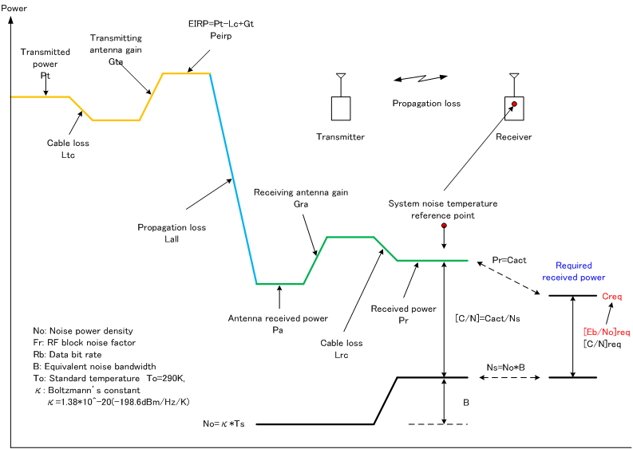

Нашёл в Интернете совершенно потрясающую визуализацию изменения мощности при передаче радио сигнала:

Это картинка описывает как изменяется мощность от передатчика к приёмнику. Формула следующая:

$$
P\_r = P\_t - L\_{tc} + G\_{ta} - L\_{all} + G\_{ra} - L\_{rc}
$$

Где,

 - \\( P\_r \\) - результирующая мощность полученного сигнала
 - \\( P\_t \\) - мощность передачи сигнала
 - \\(L\_{tc}\\) - потери в кабеле при передаче сигнала от передатчика на его антенну
 - \\(G\_{ta}\\) - усиление антенны
 - \\(L\_{all}\\) - потери в среде
 - \\(G\_{ra}\\) - усиление принимающей антенны
 - \\(L\_{rc}\\) - потери в кабеле приёмника
 
Большинство параметров достаточно очевидны, но собранные все вместе они дают хорошую картину изменения мощности. Так, например, чтобы увеличить мощность принимаемого сигнала, надо уменьшить потери на различных участках и/или увеличить усиление антенн.