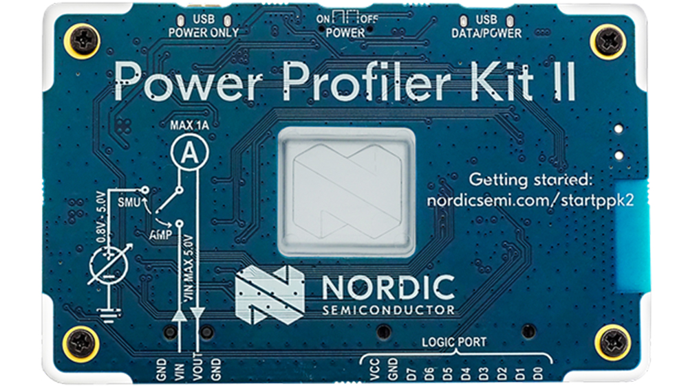
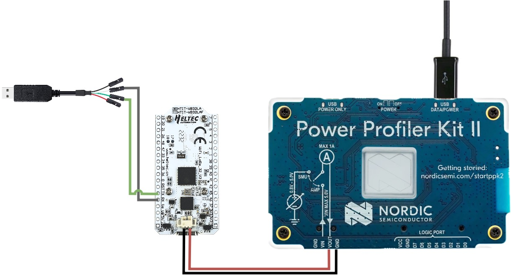
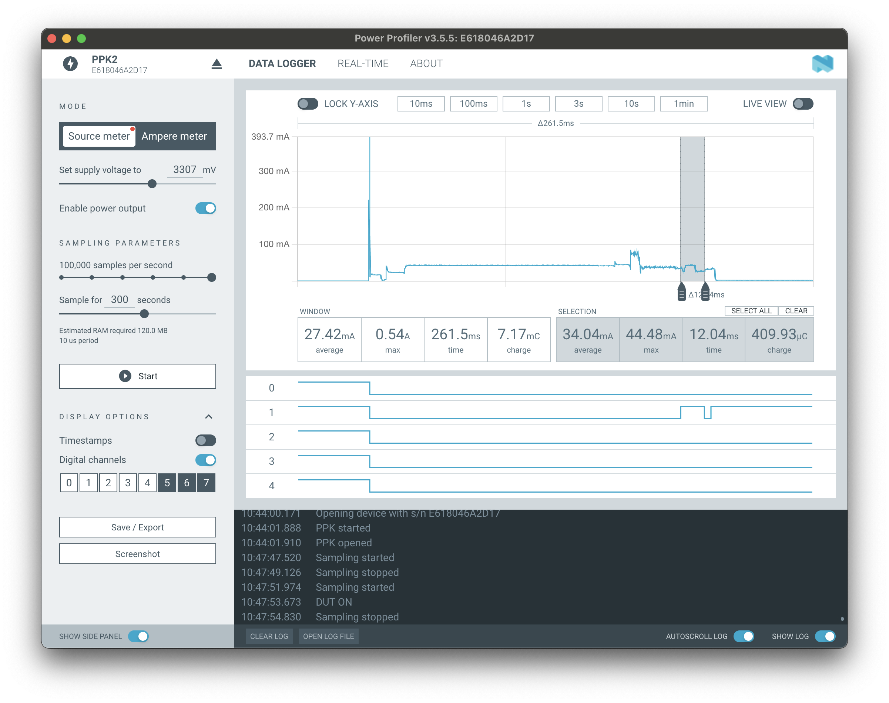
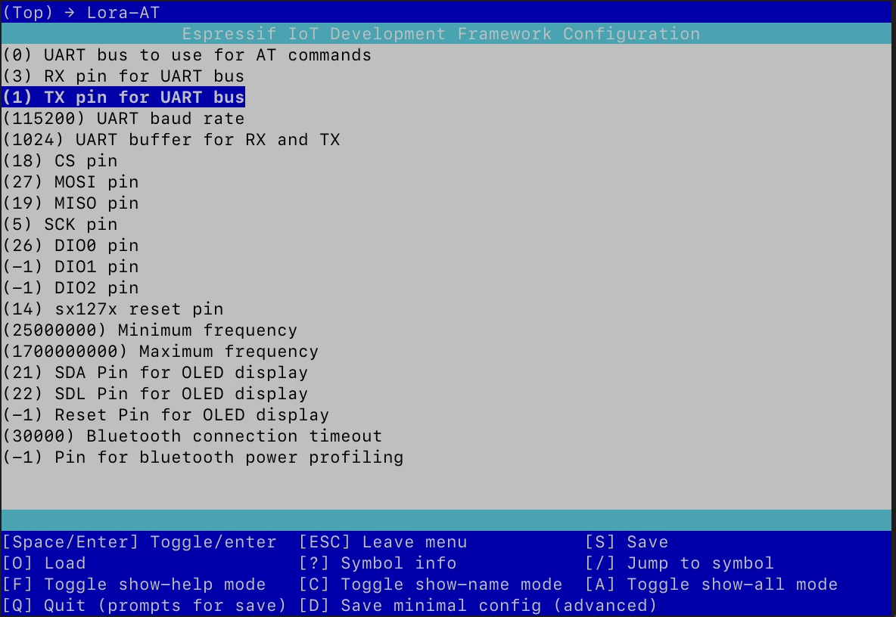
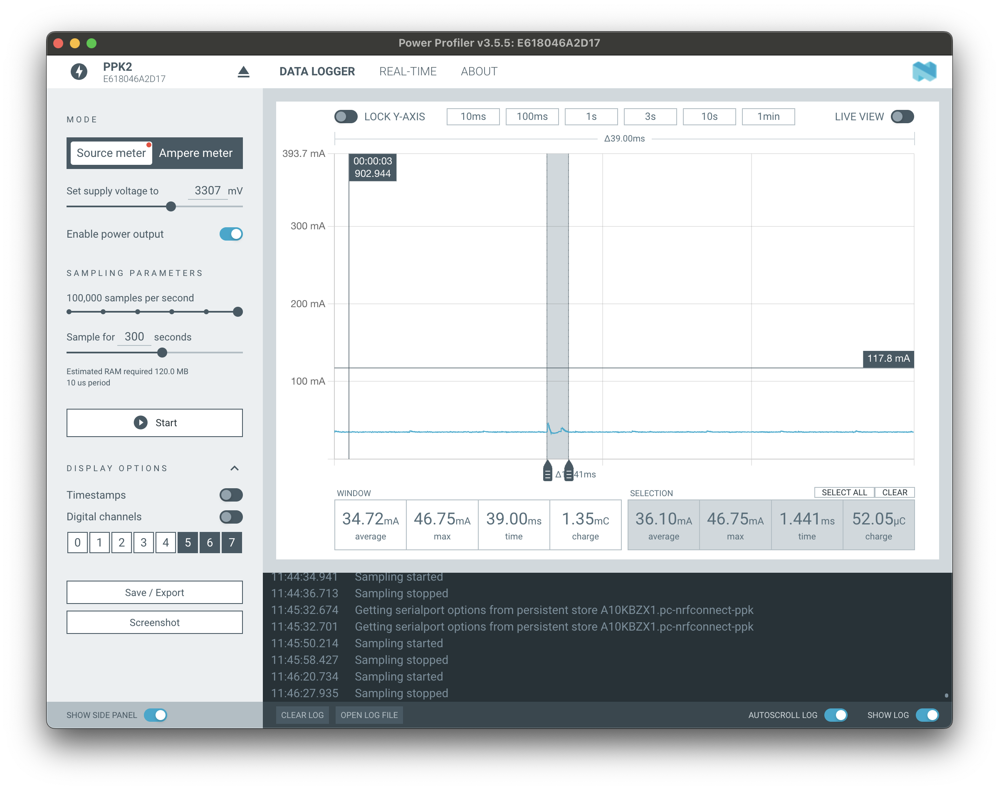
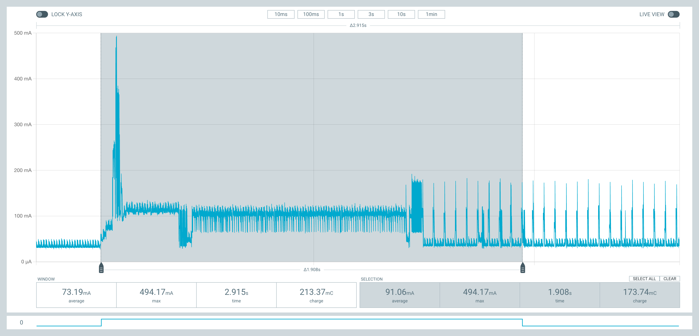
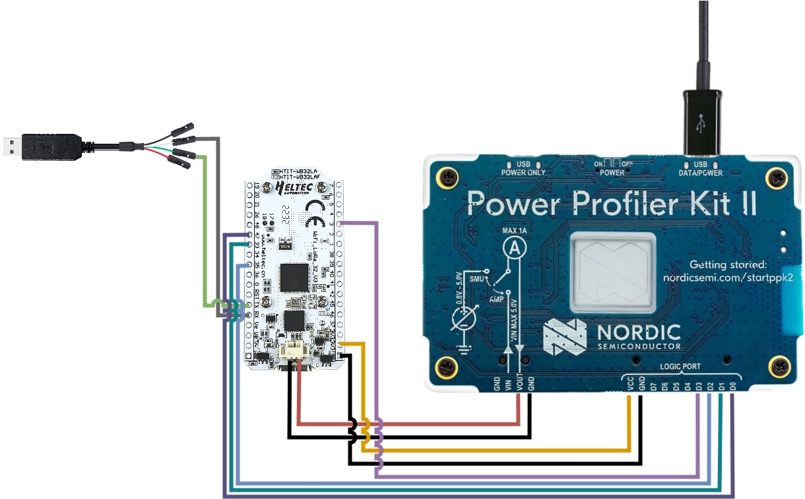
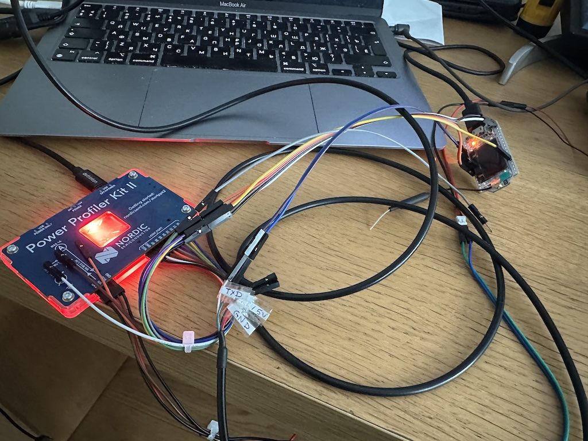
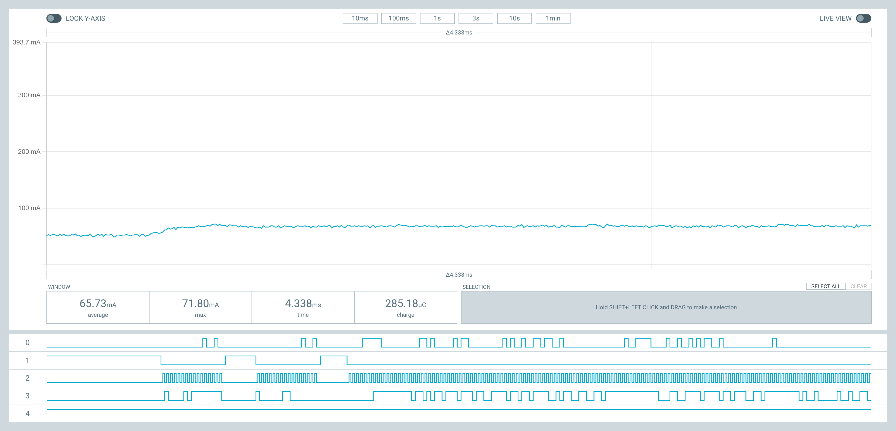

After I re-wrote [lora-at in C](), I reduced the size of the firmware by half! However, although this looks impressive, it is actually not that important. If both versions fit on a chip, then size doesn't make too much difference. Energy consumption is another matter. Low power consumption is important when operating from solar panels. That is why I decided to explore this topic in more detail.

Previously, I used the [A3-B USB tester](), but it is not suitable for measuring current consumption in microcontrollers. Firstly, because currents vary from milliamps to nanoamps. This is quite big dynamic range. Here's a [great video](https://www.youtube.com/watch?v=LUB8RWzzLWc) that explains why measuring such wide range is difficult and how to do it. Secondly, events occurring in microcontrollers can be from microseconds to milliseconds. The A3-B simply cannot sample and deliver data as quickly. Something else is needed. After watching [this video](https://www.youtube.com/watch?v=LUB8RWzzLWc), I decided to buy [Power Profiler Kit 2 (PPK2)](https://www.nordicsemi.com/Products/Development-hardware/Power-Profiler-Kit-2).

## Power Profiler Kit 2

Power Profiler Kit 2 (PPK2) is a special device that allows you to measure current in a fairly wide range: from milliamps to nanoamps. It was created to help optimize the power consumption of various low-power devices.



The idea is quite simple: connect device to PPK2. It will measure the current and send the data to the computer. There, with the help of a special program, the data can be visualized and analyzed.



At the top of the PPK2 there are two micro-USB ports: one for power and data, the other for additional power. It can used if the device consumes more than 500mA. I used [Heltec LoRa 32 v2](https://resource.heltec.cn/download/WiFi_LoRa_32/WIFI_LoRa_32_V2.pdf) for testing. It consumes about ~100-150 mA, so one connection was enough.

There are two rows of pins at the bottom. The first is used to measure current, the second is used as a [logic analyzer](https://en.wikipedia.org/wiki/Logic_analyzer). To get started, just connect two pins **Vout** and **GND** as a power source. I used PPK2 as a power source and connected it through a special JST connector. Firstly, it was more convenient - there was no need to solder the USB cable. And secondly, power supply via the JST connector is optimized for low consumption. An external 3.3~3.7V battery is connected through this connector, and additional elements such as LEDs, a voltage converter and CP2104 are not used.

## nRF Connect for Desktop

But perhaps the coolest thing is the device management program - [nRF Connect for Desktop](https://www.nordicsemi.com/Products/Development-tools/nrf-connect-for-desktop). I was able to launch on MacOS without any issues. It works fast, and allows you to analyze large amounts of data.



On the left you can select the operating mode and, if it is the “power supply” mode (Source meter), then select the voltage. You can adjust the sampling speed and observation time. In the very center there is a graph that can be updated in real time. You can zoom in and out of the desired areas on the graph. If you select the most interesting areas, the average energy consumption and time will be automatically calculated for them.

## Settings

Once all the wires are connected and barely holding in place, its time to move on to setting up the application. Different applications can be measured differently. The easiest way to measure an application is to write a separate small application that just uses the function under the test. For example, connect via bluetooth. The measurement algorithm can be as follows:

 * start PPK2
 * enable power output
 * the firmware will start automatically
 * will try to connect to the server via bluetooth
 * next you need to stop PPK2 and
 * analyze the results

Looks very tedious and time-consuming. But, probably, the only way is if some parts of the program are difficult to reproduce and run. I was lucky - lora-at can receive commands via the UART bus, so it’s enough to send commands and look at the result.
 
To do this, I connected the RX (3) and TX (1) pins via a special cable to the computer and configured the output as follows:

```
idf.py menuconfig
```



After everything is configured, a device will appear somewhere under ```/dev/``` directory. Then it is possible to connect to it and send AT commands:

```
screen /dev/cu.usbserial-A10KBZX1 115200
```

## Testing

My initial goal was to see what PPK2 could do. After everything was connected together I ran several basic tests. Here is what happen when you type character and send via the UART bus.



Each press consumes 12mA and is processed in 1.4ms.

And here is an example of what happens when a device connects via bluetooth to the server:



By the way, the small graph below is the output of the logic analyzer.

## Logic analyzer

Sometimes you need to align function under the test to the energy consumption. To do this, you can use the pins of a logic analyzer. First connect a pin from analyzer to the device pin. In the program set pin to value 1 on enter, and reset to 0 upon leaving. Then run the program.

With such cool feature it is possible to do really interesting things. For exampple, it is possible to analyze [SPI protocol](https://en.wikipedia.org/wiki/Serial_Peripheral_Interface). To do this, you need to connect the wires as follows:



In reality it doesn't look so neat:



After all the wires are mixed up, barely holding on and trying to fly out, its time to configure the program. By default, lora-at initializes the SPI bus at a frequency of 3 MHz. According to the [Nyquist-Shannon-Kotelnikov theorem](https://en.wikipedia.org/wiki/Nyquist–Shannon_sampling_theorem), to see this signal you need to sample at a frequency of 6 MHz. PPK2 can only sample at 100KHz. Therefore, in order to see the operation of the SPI protocol on the graph, you need to reduce its frequency to 50 KHz. This is done when the device is initialized:

```c
spi_device_interface_config_t dev_cfg = {
    .clock_speed_hz = 50000,
    .spics_io_num = CONFIG_PIN_CS,
    .queue_size = 16,
    .command_bits = 0,
    .address_bits = 8,
    .dummy_bits = 0,
    .mode = 0};
```

After updating the firmware you can see the result:



Its clear that pin 2 is SCLK, where the master device generates operating frequency. Pin 1 is CS(SS), which goes to 0 when the master is about to transmit data. Pin 3 is MOSI. The line through which the master transmits commands. By the way, the graph clearly shows the protocol with sx127x, when my library requests the value of register 0x42 to get the chip version, and the response comes via pin 0. Next comes the transition to sleep mode, and after that a fairly long communication, during which I receive states of all registers for debugging.

## Conclusion

PPK2 is a very powerful tool for analyzing microcontrollers. The next step will be more detailed measurement of various modes and optimization of energy consumption. It would also be a good idea to convert the output to JSON in order to display graphs on the blog.
