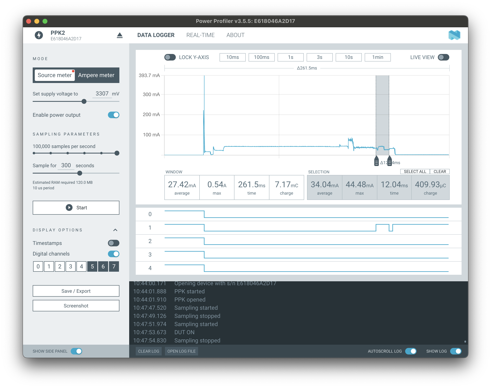
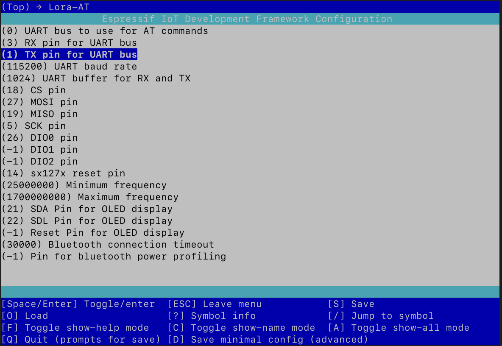
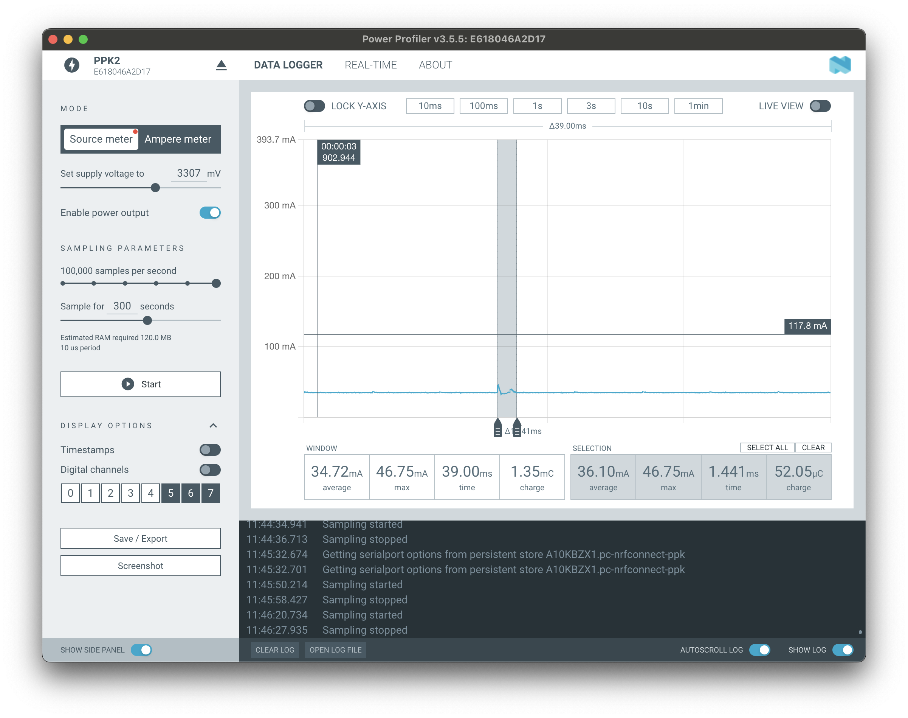
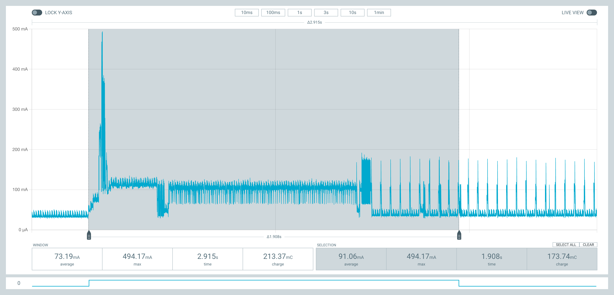
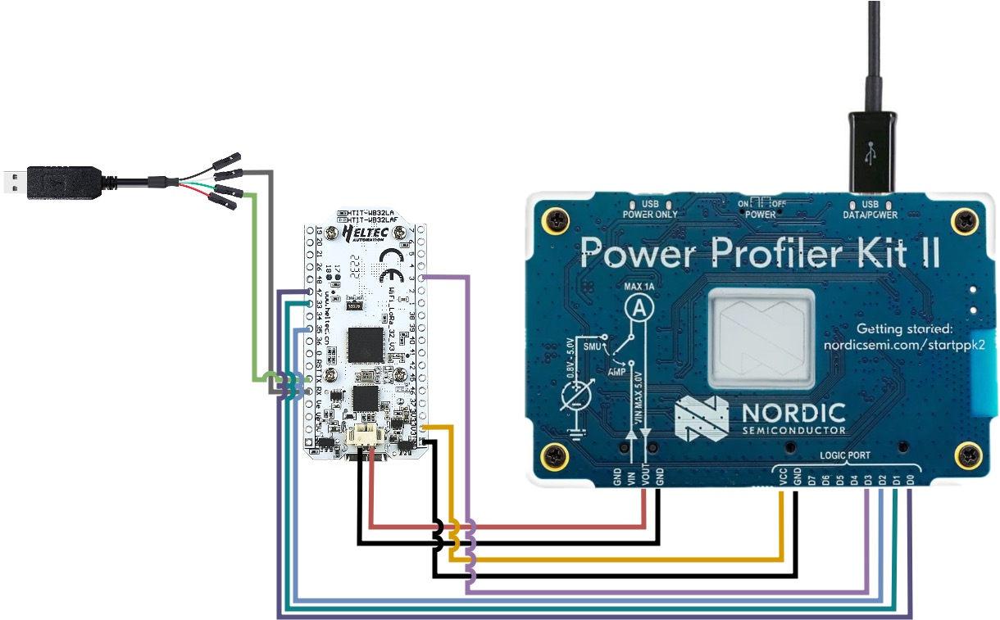
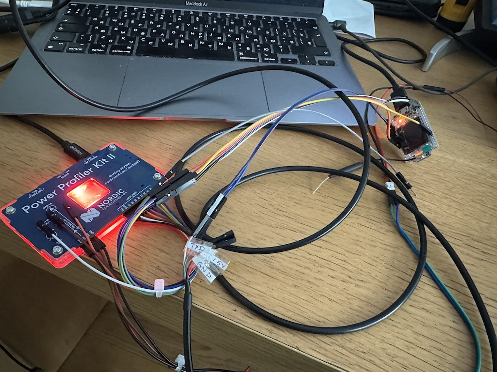

[Переписав LoRa At на С]() я уменьшил размер прошивки в два раза! Однако, это хоть и выглядит впечатляюще, но на самом деле не так важно. Если старая и новая версии помещаются на чипе, то какая разница сколько места они занимают? Поэтому показатель хоть и хороший, но мало применим на практике. А вот энергопотребление - это другое. Низкое энергопотребление важно при работе от солнечных батарей. Именно поэтому я решил исследовать эту тему по-подробнее.

Раньше я использовал [USB тестер A3-B](), но для измерений потребления тока в микроконтроллерах он не годится. Во-первых, потому что токи меняются от миллиампер до наноампер. Это слишком большой диапазон измерений. Вот [отличное видео](https://www.youtube.com/watch?v=LUB8RWzzLWc), в котором объясняется почему измерять в таком диапазоне непросто и как это сделать. Во-вторых, события, протекающие в микроконтроллерах, могут быть от микросекунд до миллисекунд. A3-B просто не может так быстро сэмплировать и отдавать данные. Нужно что-то другое. Посмотрев [видео](https://www.youtube.com/watch?v=LUB8RWzzLWc), я решил купить [Power Profiler Kit 2 (PPK2)](https://www.nordicsemi.com/Products/Development-hardware/Power-Profiler-Kit-2).

## Power Profiler Kit 2

Power Profiler Kit 2 (PPK2) - это специальное устройство, которое позволяет измерять ток в достаточно широком диапазоне: от миллиАмпер до наноАмпер. Оно как раз создано, чтобы помочь оптимизировать энергопотребление разных маломощных устройств.


Идея достаточно простая: устройство подключается к PPK2, тот измеряет потребляемый ток и отправляет данные на компьютер. Там, с помощью специальной программы, данные можно визуализировать и понять, как работает устройство в различных ситуациях.


Вверху PPK2 есть два micro-USB порта: один для питания и данных, второй - дополнительное питание. Оно нужно, если устройство потребляет больше 500мА. Я использовал для тестирования [Heltec LoRa 32 v2](https://resource.heltec.cn/download/WiFi_LoRa_32/WIFI_LoRa_32_V2.pdf). Он потребляет около ~100-150 мА, поэтому достаточно было одного подключения.

Внизу есть два ряда пинов. Первый используется для измерения тока, второй - в качестве [логического анализатора](https://ru.wikipedia.org/wiki/Логический_анализатор). Чтобы начать, достаточно подключить два пина Vout и GND в качестве источника питания. Я использовал PPK2 как источник питания и подключал через специальный JST коннектор. Во-первых, так было удобнее - не нужно было перепаивать USB кабель. А во-вторых, питание через JST коннектор оптимизировано на низкое потребление. Через этот коннектор подключается внешняя батарея 3.3~3.7В, а дополнительные элементы вроде светодиодов, преобразователя напряжения и CP2104 не используются.

## nRF Connect for Desktop

Но, пожалуй, самая классная вещь - это программа для управления устройством - [nRF Connect for Desktop](https://www.nordicsemi.com/Products/Development-tools/nrf-connect-for-desktop). Она запустилась с первого раза под MacOS, работает быстро, позволяет анализировать большие объёмы данных.



Слева можно выбрать режим работы и, если это режим "источник питания" (Source meter), то выбрать напряжение. Можно настроить скорость сэмплирования и время наблюдения. В самом центре есть график, который может обновляться в реальном времени. На графике можно увеличивать и уменьшать нужные участки. Если выделить наиболее интересные участки, то на них будет автоматически подсчитано среднее потребление энергии и время.

## Настройка

После того, как все провода подключены и еле держатся, можно переходить к настройке приложения. Тут уже всё зависит от конкретного приложения. Можно делать небольшие приложения, в которых автоматически запускается какая-либо функция, либо последовательность функций, которые нужно оптимизировать. Например, подключение по bluetooth. Алгоритм измерения может быть следующий:

 * стартовать PPK2
 * подать напряжение на устройство
 * прошивка автоматически запустится
 * попробует подключится к серверу по bluetooth
 * далее нужно остановить PPK2 и 
 * проанализировать результаты
 
Выглядит очень хлопотно и долго. Но, наверное, единственный способ, если какие-то участки программы сложно воспроизвести и запустить. Мне же повезло - LoRa AT может получать команды по UART шине, поэтому достаточно отправлять команды и смотреть на результат.

Для этого я подключил пины RX (3) и TX (1) через специальный кабель к компьютеру и настроил вывод следующим образом:

```
idf.py menuconfig
```



После того, как всё настроено, в MacOS появится устройство ```/dev/cu.usbserial-*```, к которому можно подключиться и посылать команды:

```
screen /dev/cu.usbserial-A10KBZX1 115200
```

## Тестирование

Изначально моей целью было посмотреть, что может PPK2 и какие тесты я смогу потом провести. Собрав всё воедино, я позапускал различные команды. В принципе всё работает. Мне, например, удалось замерить потребление энергии обработки ввода по UART шине. 



Каждое нажатие тратит 12мА и обрабатывается за 1.4мс.

А вот пример того, что происходит, когда устройство подключается по bluetooth к серверу:



Кстати, небольшой график внизу - это вывод логического анализатора.

## Логический анализатор

Иногда нужно сопоставить процессы протекающие в программе, потреблению энергии. Для этого можно использовать пины логического анализатора. Идея заключается в том, чтобы подключить пин анализоватора к пину устройства. Перед тем, как войти в нужную секцию программы, нужно выставить пин в значение 1, а после выхода из секции - выставить в значение 0. В результате можно увидеть, когда началась секция программы, когда закончилась, и сколько времени она заняла.

Дальше - больше! PPK2 поддерживает до 8 входов, а значит может анализировать более сложные вещи, такие как [протокол SPI](https://en.wikipedia.org/wiki/Serial_Peripheral_Interface). Для этого нужно подсоединить провода следующим образом:



В реальности это выглядит не так аккуратно:



После того, как все провода перепутаны, еле держатся и норовят вылететь, нужно настроить программу. Всё так. По-умолчанию, LoRa AT инициализирует SPI шину на частоте 3Мгц. Согласно [теореме Найквиста—Шеннона—Котельникова](https://digitalmusicacademy.ru/lesson-nyquist-theorem), чтобы увидеть этот сигнал нужно сэмплировать с частотой 6Мгц. PPK2 же может сэмплировать только с частотой 100Кгц. Поэтому, чтобы увидеть работу SPI протокола на графике, нужно уменьшить его частоту до 50Кгц. Делается это при инициализации устройства:

```c
spi_device_interface_config_t dev_cfg = {
    .clock_speed_hz = 50000,
    .spics_io_num = CONFIG_PIN_CS,
    .queue_size = 16,
    .command_bits = 0,
    .address_bits = 8,
    .dummy_bits = 0,
    .mode = 0};
```

После обновления прошивки можно увидеть результат:


На графике чётко видно, что пин 2 - это SCLK, где задаётся частота работы между двумя чипами. Пин 1 - это CS (SS), который переходит в значение 0, когда мастер собирается передать данные. Пин 3 - это MOSI. Линия, по которой мастер передаёт команды. Кстати, на графике чётко виден протокол с sx127x, когда моя библиотека запрашивает значение регистра 0x42, чтобы получить версию чипа, и ответ приходит по пину 0. Далее идёт переход в спящий режим, и после этого достаточно длинная коммуникация, во время которой, я получаю состояния всех регистров для дебага.

## Заключение

PPK2 - это очень мощный инструмент для анализа микроконтроллеров. Он позволяет померить все интересующие меня параметры. Следующим этапом будет более детальное измерение различных режимов и оптимизация энергопотребления. Ещё было бы неплохо конвертировать вывод в JSON для того, чтобы отображать графики в блоге.