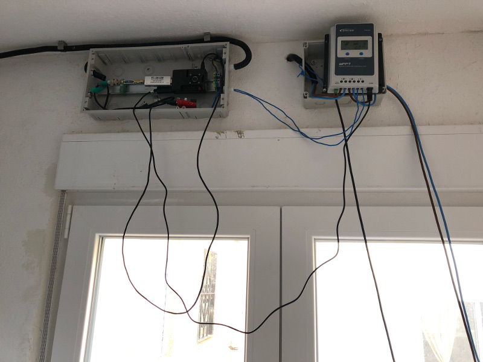
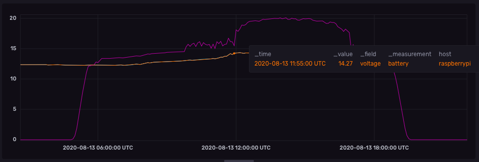
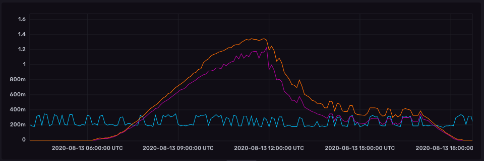
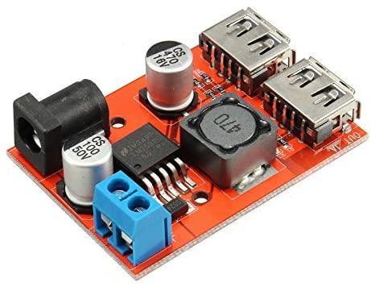
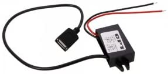

Если поискать в интернете словосочетание "питание для raspberrypi", то можно найти массу статей о том, что нужно использовать официальный блок питания на 5В и 2.5А. Но что, если RPi питается от солнечных панелей и в логах постоянно проскальзывает "Under-voltage detected!"? Для решения этой проблемы мне немного пришлось повозиться с теорией и корзиной для покупок.

## Предыстория

Прежде, чем пытаться найти решение, нужно понять начальные условия. Для одной из своих станций слежения за спутниками я решил использовать солнечную панель. Для этого я купил солнечную панель на 30Вт, контроллер [Epever Tracer](https://www.epsolarpv.com/product/3.html) и аккумулятор на 12В.



Несмотря на нелепый вид и кучу проводов, схема довольно продвинутая:

 * контроллер получает энергию от солнечной панели и питает нагрузку.
 * излишки идут на заряд аккумулятора. Он внизу.
 * ночью, когда панель не работает, аккумулятор питает нагрузку и немного разряжается.
 * температурный датчик (ещё один провод идущий вниз). Служит для температурной компенсации напряжения аккумулятора. Это позволяет заряжать аккумулятор оптимальным напряжением, которое зависит от температуры.
 * RPi (нагрузка) подключена через преобразователь напряжения DC-DC. Так как контроллер может выдавать только 12В, а USB работает на 5В, то нужен специальный преобразователь.
 * RPi по проводу USB-RJ45 считывает показатели контроллера и отправляет в influxdb. Для этого я написал отдельный проект [epever-tracer-influxdb](https://github.com/dernasherbrezon/epever-tracer-influxdb). О нём я постараюсь написать как-нибудь в другой раз.
 * К RPi подключен rtl-sdr, который и получает сигналы со спутников по антенне.

И всё это на удивление работает. За одним исключением: когда начинается запись пролёта спутника, логах появляются ошибки:

```
Aug 13 11:54:04 raspberrypi kernel: Under-voltage detected! (0x00050005)
```

Причём это случалось каждый раз, когда начиналась запись. Ясное дело, это было как-то связано с тем, что rtl-sdr включался на полную, начинал потреблять больше энергии и напряжение на RPi проседало. Но как это исправить без осциллографа и такой-то матери?

## Немного теории

Дело явно не в контроллере, так как никакого проседания напряжения там не было:



Проседания тока тоже не было. Явно видно, что в момент пролёта спутника потребление возрастало до ~300мА.



Что-то явно было в DC-DC преобразователе и для этого мне пришлось погрузиться в теорию. Итак, что же происходит, когда включается rtl-sdr? Схематично процесс изображён ниже.



В момент, когда включается rtl-sdr, мгновенно увеличивается потребление тока всей RasperryPi. При этом, напряжение в какой-то момент проседает, чтобы компенсировать выдачу необходимого тока. После совсем небольшого времени напряжение стабилизируется и всё продолжает работать. Именно этого падения напряжение и достаточно, чтобы RPi начал писать в логи ошибки.

## Решение проблемы

Я ничего путного не придумал, кроме как купить другой преобразователь. У меня до этого был вот такой:

[](https://www.amazon.es/dp/B0769CXVS1/ref=pe_3310721_189395781_TE_SCE_dp_1)

Я нашёл подороже и с хорошими отзывами:

[](https://www.amazon.es/Reduction-Voltage-Converter-Adapter-Module/dp/B00LGWQJNS)

Ещё я поменял провода и продул контакты. Включил, и сообщения пропали. Видимо, второй преобразователь действительно лучше первого.

## Выводы

Несмотря на то, что мне удалось разобраться с проблемой питания, во рту осталось горькое послевкусие. Я просто заменил один преобразователь на другой. Этот другой тоже мог быть недостаточно быстрым и я мог бы ещё долго чесать голову, пытаясь понять в чём же проблема. Но и на будущее у меня нет однозначного рецепта по выбору DC-DC преобразователя. На сайте в обоих случаях написано 5В 2.5А, тем не менее результаты разные. Тут либо надо смотреть на отзывы, либо покупать осциллограф и тестировать.

