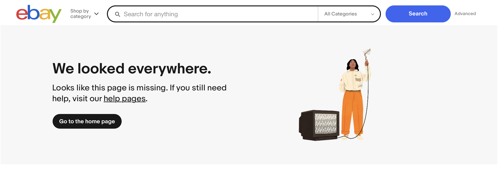
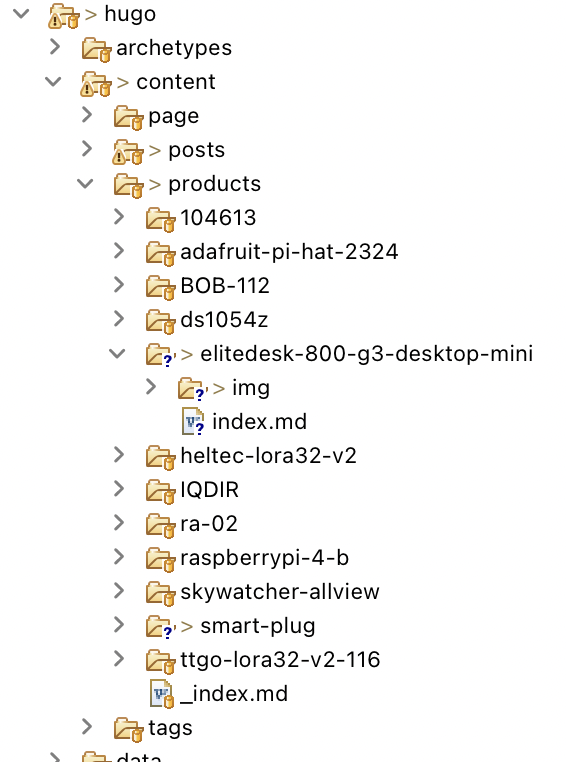
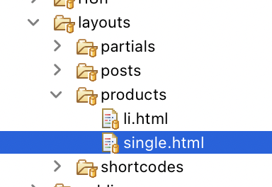
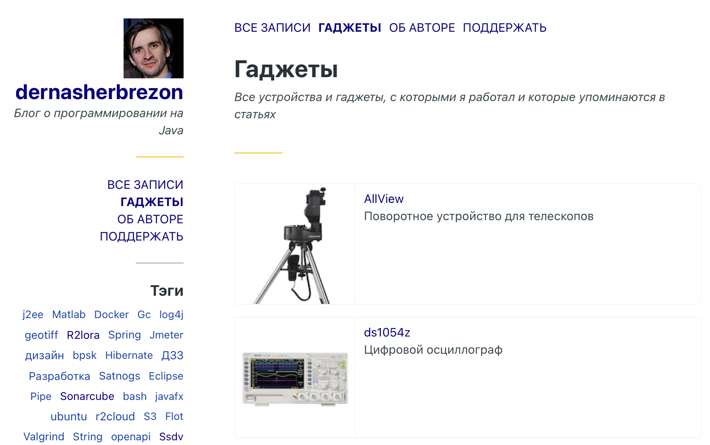

В моём блоге уже 147 статей, и я не собираюсь на этом останавливаться. Но с увеличением статей, увеличивается количество библиотек и гаджетов, с которыми я когда-то работал. Часть из них потихоньку устаревает, и всё чаще я вижу:

Да, Интернет забывает. Производители гонятся за новыми технологиями, и многие устройства становятся просто электронным мусором. Множество ссылок, которые я тщательно подбирал для статей, просто перестали работать. В итоге мои статьи становятся бесполезными. Какой смысл знать, как отправить FSK сигнал, если описание протокола потеряно? Зачем интегрировать новое устройство, если его даташит уже не найти и непонятно при каких температурах он может работать?

Мне хочется, чтобы даже спустя десятки лет, информация в этом блоге могла быть полезна. Именно поэтому я решил добавить раздел "Гаджеты".

### Гаджеты

В этом разделе я постараюсь собирать всю информацию, связанную с каждым из гаджетов, с которыми я работал. 

 * Картинка - самая важная информация.
 * Краткое описание
 * Цена - будет забавно посмотреть через несколько лет
 * Ссылки на статьи, в которых используется или упоминается устройство
 * Ссылки на документы. Я планирую скачивать и хранить документацию прямо в git. У меня не так много гаджетов, чтобы это было большой проблемой
 * Ссылки на другие сайты. Я не надеюсь, что ссылки будет жить несколько лет, но на всякий случай оставлю их
 * Для электронных компонент описание в Fritzing формате
 * Свойства. Возможно, в будущем я сделаю фильтрацию по свойствам. Но это не точно

Добавление всей этой информации несложно, и она, в том или ином виде, уже есть на других сайтах. 

Из планов, я бы хотел добавить побольше интерактива. Это, например, может быть 3D модель или виртуальная реальность, в котором размечены порты подключения.

### Интеграция с Hugo

Этот блог сделан с помощью [Hugo](https://gohugo.io) на основе шаблона [Minimo](https://github.com/MunifTanjim/minimo). Этот шаблон не подразумевает добавление карточек товаров, поэтому мне пришлось написать несколько расширений.

Главное отличие карточки товара от статьи в блоге - её структура. Она полностью статична и фиксирована, и требует новый тип страниц. К счастью, в Hugo очень легко сделать любые типы страниц. Достаточно добавить папку "products", где будет лежать описание гаджетов:

А в папке "layouts" создать такую же папку "products", где будут лежать шаблоны:

Hugo будет использовать их вместо дефолтных.

Дальше уже дело техники.

### Результаты

Первые гаджеты уже добавлены. И я постараюсь постепенно наращивать эту базу знаний и добавлять больше самой разной информации.

