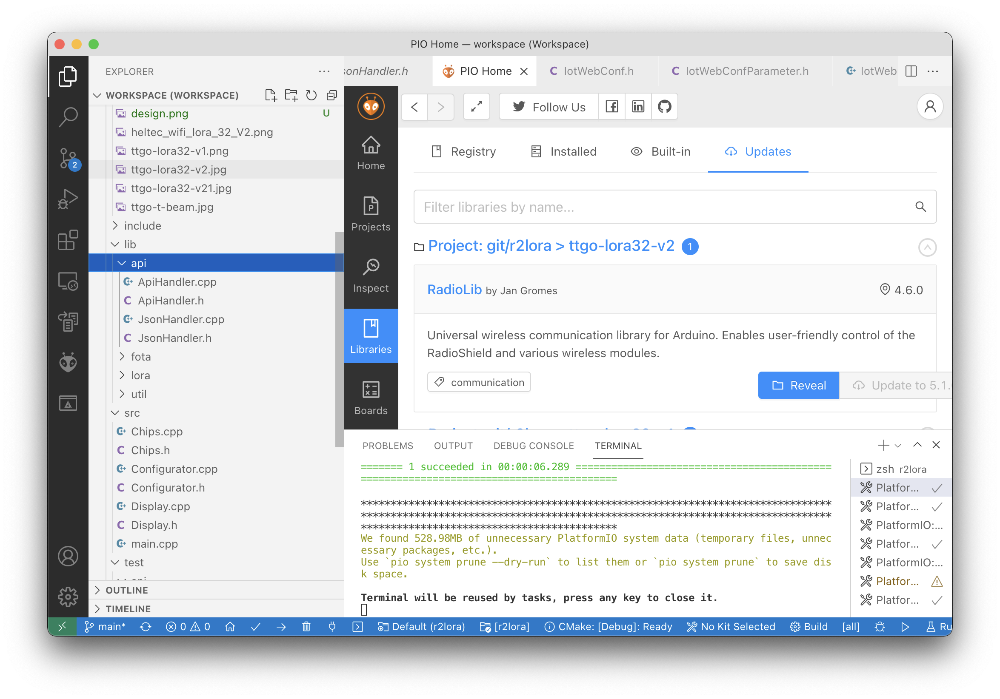

Recently, the [LoRa data transmission protocol](https://en.wikipedia.org/wiki/LoRa) has been gaining popularity. Several satellites actively use it, and there is a whole network for signal reception - [tinyGS](https://tinygs.com). Of course, I couldn't miss such a trend, so I started exploring how to connect the LoRa protocol to [r2cloud](https://github.com/dernasherbrezon/r2cloud). Unfortunately, it's a closed protocol, so you can't demodulate it with the standard rtl-sdr. To receive the signal, you need to use a special chip that will output a ready-made packet. This chip can be [directly connected to Raspberry Pi](), but it is usually used in conjunction with ESP32. To transmit data from ESP32 to Raspberry Pi, I created a separate project - [r2lora](https://github.com/dernasherbrezon/r2lora).

## Problem Statement

So, the goal is to provide access to the LoRa chip from r2cloud. It is desirable that the access interface be universal and suitable not only for the r2cloud project. This will allow other projects unrelated to satellite signal reception to use, improve, and make changes to the project.

There are several options:

 * Fully implement the r2cloud functionality on ESP32. This includes creating pass schedules, obtaining satellite parameters, auto-updating, and sending to the central server. This is a rather laborious process because a lot of ready and tested code will have to be rewritten. Moreover, it is unclear whether the ESP32 has enough power to calculate satellite orbits.
 * Write a minimal application to control the chip and monitor signal reception from r2cloud.
 
I decided to go the second way. Firstly, r2cloud already supports getting data from external sources (plutosdr and sdr-server). Therefore, to add support for LoRa I will write yet another module. Secondly, there will be a minimum amount of logic on ESP32. The less code, the fewer errors. Thirdly, such a design will allow the project to be reused by non-satellite related projects.

## Design

In general, the r2lora design looks like this:



Clients interact with the service through a REST API, which includes several methods:

 * Start receiving data.
 * Get all received data packets. This needs to be run periodically to download received packets.
 * Finish receiving data.
 * Transmit data.
 * Get application status.

I chose polling data instead of websockets because it is easy to implement on ESP32. And it is very reliable. When using websockets, it would be necessary to implement reconnection and data deduplication algorithms.

In addition to the main functionality, auxiliary functionality needs to be implemented. The "Configurator" component is designed to create the initial device configuration. It works as follows:

 * If the device is not yet configured, you need to set up your own access point.
 * To perform the initial configuration, the user must connect to this access point, set the login, password for the local WiFi access point.
 * Disconnect.
 * After that, the device will disconnect its access point and try to connect to the local one.
 * If the connection is successful, the application starts the WebServer and begins to listen for user commands.

If the device is already configured, it should immediately connect to the local access point. If the connection fails, it should return to the initial state and raise its access point.

Another mandatory component is [Firmware-Over-The-Air (FOTA)](https://en.wikipedia.org/wiki/Over-the-air_update). All applications have bugs, and one way to minimize their impact is automatic updating. FOTA allows you to automatically download firmware from a central server and update the device.

## Tool Selection

There are several tools for developing on ESP32: [Arduino IDE](https://www.arduino.cc/en/software), [PlatformIO](https://platformio.org), and [ESP-IDF](https://github.com/espressif/esp-idf). PlatformIO has gradually become the most popular tool. It allows not only developing projects in C/C++ but also building projects, managing third-party libraries, running tests, analyzing code, and much more.

PlatformIO is just a plugin for Visual Studio Code. To install it, you just need to download VSCode and install the plugin.

In addition to the IDE, PlatformIO provides a CLI. With it, you can do everything the same as in the IDE but in the console. PlatformIO design is very similar to cmake, which only calls gcc with the necessary parameters, generates a makefile, builds the application, etc. PlatformIO downloads many Python dependencies and delegates assembly to the same ESP-IDF. At the same time, it integrates many unrelated tools perfectly, allowing you to focus on developing the application rather than configuring.

PlatformIO covers 100% of all my needs. Over several months of development, I did not experience any inconvenience, and everything was at hand.

In the next article, I will try to describe the project structure, the application development process, and reveal some features of programming for microcontrollers.

Next: [project setup]()
