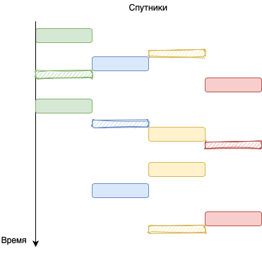
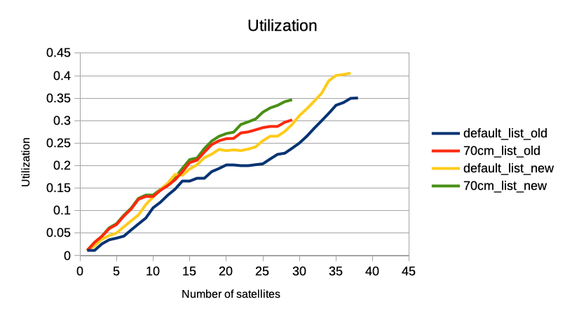

## Задачка

А вот задачка для любителей алгоритмов. Необходимо максимизировать время наблюдения за спутниками. Поясню поподробнее, в чём же она заключается. Итак, есть станция слежения за спутниками. В один момент времени она может записывать сигнал только с одного пролетающего спутника. Спутники летают независимо друг от друга и их количество фиксированно. Можно считать, что пролетают они над одной и той же точкой одинаковое количество раз в день. Но время пролёта случайное. В один момент времени над станцией могут пролетать два и более спутника. Цель номер один: необходимо составить расписание наблюдений так, чтобы оно было максимально продолжительным. Цель номер два: все спутники нужно наблюдать примерно одинаковое время.

Звучит немного сумбурно, но будет более понятно на примере решения "в лоб", которое я сделал много лет назад.

## Решение "в лоб"

Самое простое решение, которое мне пришло в голову заключалось в следующем:

 1. для каждого спутника 
 2. рассчитать время следующего пролёта, начиная с текущего
 3. добавить этот интервал в расписание
 4. если в расписании уже есть перекрывающий интервал, то увеличить начальное время и вернуться на шаг 2.
 5. как только пролёт спутника произошел, то выполнить шаги 2,3,4.
 

У этого алгоритма есть один существенный плюс: он работает в поточном режиме. Это значит, что рассчитав начальное расписание, все дальнейшие пролёты рассчитываются по мере выполнения расписания. Это достаточно просто реализовать.

Тем не менее, есть и громадный недостаток: если новый интервал пролёта спутника пересекается с существующим хотя бы на 10 секунд, то он отбрасывается и берётся следующий. А следующий может случиться только через несколько часов.

Я знал, что алгоритм можно улучшить, но не хотел тратить на это время. Однако, [недавно пришёл](https://github.com/dernasherbrezon/r2cloud/issues/92) пользователь Nehavita и попросил добавить поддержку перекрывающихся наблюдений. И вот я наконец-то нашёл время и придумал "Решение №2".

## Решение №2

Идея нового алгоритма достаточно проста:

 * сначала добавить "полные" наблюдения в расписание, как в предыдущем алгоритме
 * а затем по-очереди добавлять "частичные" наблюдения

Прямо как в притче про банку, камни и песок.

У этого алгоритма есть недостаток. Он не потоковый. Это значит, что нужно определить размер "банки" или временного окна в рамках которого нужно оптимизировать. А что делать, если временное окно закончилось? Нужно обнулять распределение наблюдений и рассчитывать следующее окно. И это не очень хорошо. Во-первых, обнуление внутреннего состояния приводит к тому, что спутники неравновероятностно наблюдаются. То есть спутник с большей вероятностью появления внутри окна будет чаще наблюдаться. В потоковом же алгоритме вероятность появления спутника считается не в заданном окне, а на бесконечном отрезке времени. А значит равновероятностно. Во-вторых, для периодического расчёта следующего окна нужно дополнительно кодировать таймер. А это усложнение кода и логики работы.

Тем не менее я [закодировал этот алгоритм](https://github.com/dernasherbrezon/r2cloud/blob/master/src/test/java/ru/r2cloud/satellite/UtilizationTest.java) и сравнил с предыдущим:

Я ожидал, что новый алгоритм улучшит загрузку станции на какие-нибудь магические 30-40-50%. Однако, на практике для 29 спутников он улучшил на скромные 5%. А относительно первого алгоритма на 15%.

У меня есть ещё одна идея для оптимизации. Она уж точно превратит этот алгоритм в классическую NP-полную задачу о рюкзаке. Допустим, в один момент времени над станцией пролетает 3 спутника. При этом для первого спутника можно запланировать "полное" наблюдение. А вот какой из оставшихся двоих взять? Очевидно, тот у которого "частичный" пролёт дольше. А что, если запланировать "полное" наблюдение не первого спутника, а второго? Тогда решение будет совершенно другое. И это как раз становится той самой [задачей о рюкзаке](https://ru.wikipedia.org/wiki/Задача_о_рюкзаке).

Эта идея хороша, как тренировка кодирования алгоритмов, но на практике она вряд ли даст существенный прирост к загрузке станции. Как видно из графика, проще добавить больше спутников.

## Заключение

Осталось перенести алгоритм на реальный планировщик r2cloud и не облажаться.