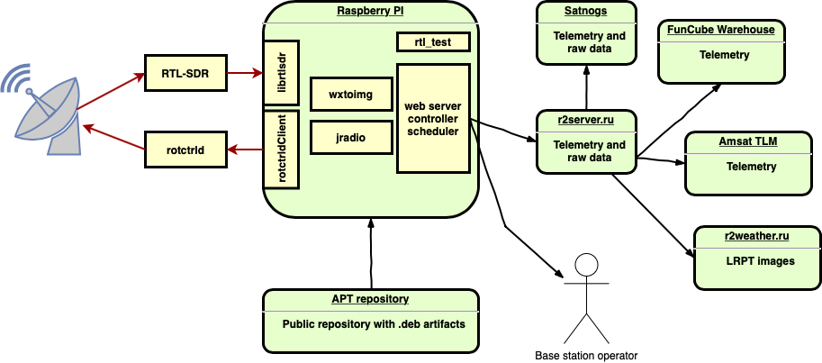
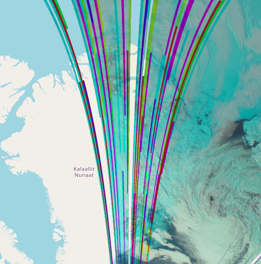
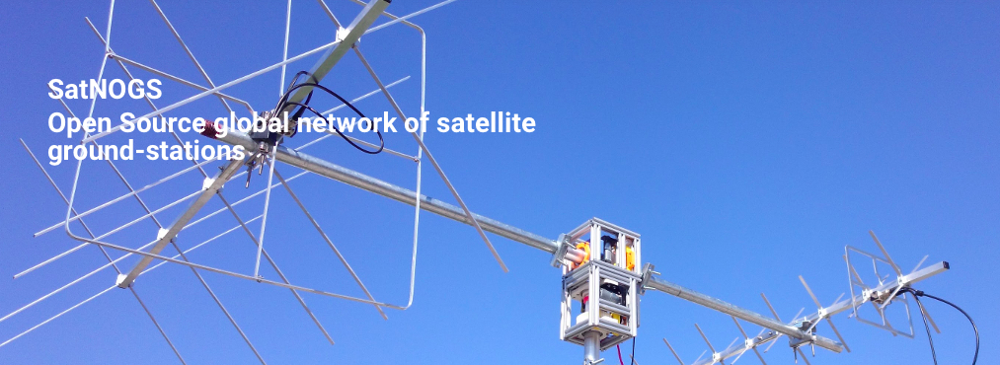
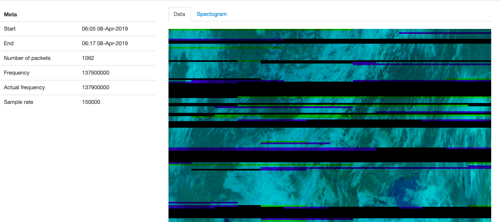
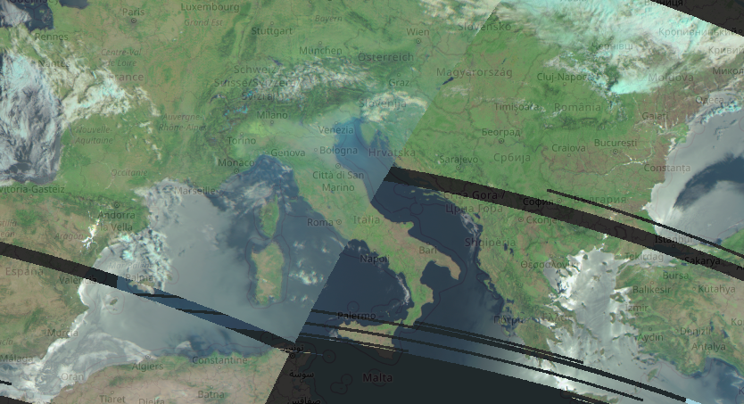
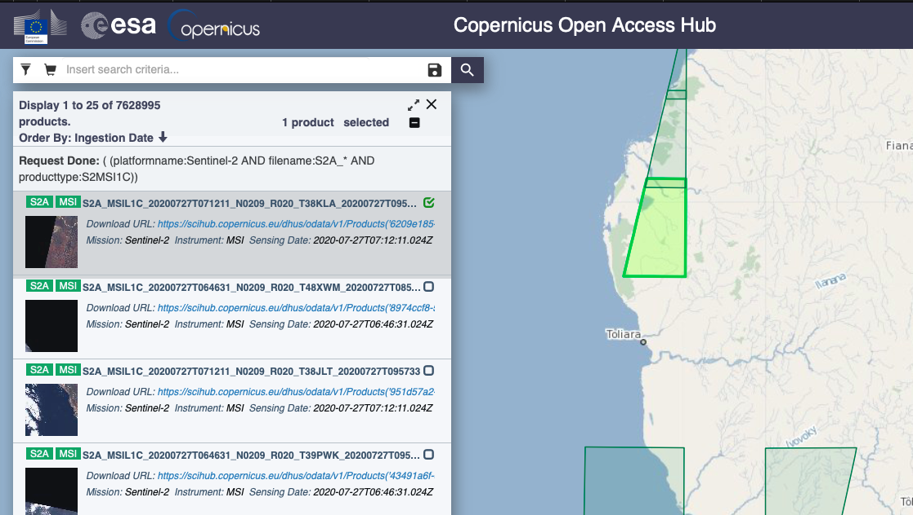
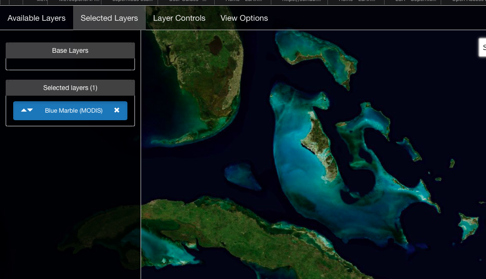
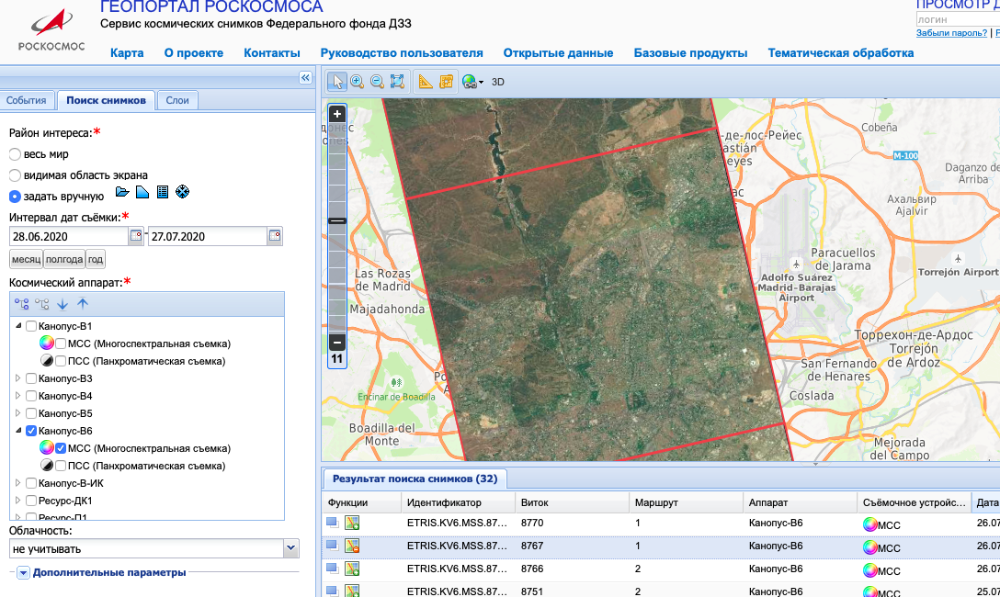

В последнее время я очень много писал про [r2weather](https://r2weather.ru). В том числе про различные технические особенности реализации. В этой же статье я хочу описать общую схему работы.

## Введение

За Землёй наблюдает множество метеорологических спутников. Основная их задача - получение различных метеосников поверхности Земли. Эти данные используются в различных моделях. Например, чтобы предсказывать погоду, таяние полярных льдов или плотность распределения плактона в прибрежных водах.

Одним из таких спутников является [Метеор-М №2](https://ru.wikipedia.org/wiki/Метеор-М_№2). Помимо множества разных камер, на нём установлена камера МСУ-МР. Главная её особенность в том, что данные с неё передаются в открытом международном формате [LRPT](https://planet.iitp.ru/spacecraft/meteor_m_n2_structure_2.pdf). С помощью недорогого оборудования каждый желающий может получить метеоснимки.

Уже много лет энтузиасты со всего мира получают метеоснимки с пролетающего над ними спутника. Однако, никто не объединяет эти данные в единую картину. Они хранятся у каждого локально, в различных форматах.

r2weather - это как раз тот сервис, который объединяет данные Метеор-М №2 со множества станций по всему миру. Каждый желающий может получить метеоснимки со спутника и отправить в r2weather. Затем сервис обработает данные и отобразит на карте мира.

## Принцип работы



Принцип работы достаточно простой:

 * спутник пролетает над приёмной станцией и передаёт изображение на Землю 
 * станция декодирует сигнал и передаёт результат в сервис r2weather.ru
 * сервис обрабатывает изображение и отображает на карте
 


Поскольку формат LRPT открытый, то каждый может собрать приёмную станцию и поучаствовать в проекте. Такую станцию можно разработать с нуля или взять уже готовую. Существует несколько популярных станций.

## SatNOGS

Наиболее популярная сеть станций - [satnogs](https://satnogs.org/). В [официальной документации](https://wiki.satnogs.org/Main_Page) описано несколько типовых конфигураций и способы сборки. Станция satnogs поддерживает различные антенны и приёмные устройства. Большинство из них можно купить в магазине и собрать как конструктор.



Из недостатков то, что прямой интеграции между станцией satnogs и [r2weather.ru](https://r2weather.ru) нет. Поэтому придётся программировать отправку данных со станции в сервис.

## r2cloud

Ещё одна сеть станций - [r2cloud](https://github.com/dernasherbrezon/r2cloud). Это моя собственная разработка. Она не такая популярная как SatNOGS и поддерживает меньшее количество приёмников. Тем не менее она максимально простая и идеально подходит новичкам. В ней есть интеграция с [r2weather.ru](https://r2weather.ru) через промежуточный сервис [r2server.ru](https://r2server.ru).



Более детальную информацию можно найти в [официальной документации](https://r2weather.ru/howto).

## Пересылка данных вручную

Этот способ скорее подходит для специалистов или одноразового добавления данных. Есть несколько разных инструкций от [happysat](http://happysat.nl/Setup_Meteor/Setup.html), [Les Hamilton](https://leshamilton.co.uk/soft/Guide-to-Receiving-Meteor.pdf) и [r4uab](https://r4uab.ru/priyom-meteosnimkov-so-sputnikov-meteor-m/).

После того как данные в сыром виде получены, можно их отправить с помощью следующей команды:

```bash
gzip -c 2020_04_15_LRPT_06-03-15.s | curl -X PUT -H "Content-Type: application/octet-stream" -H "Authorization: xxx" \ -H "Content-Encoding: gzip" "https://r2weather.ru/api/v1/lrpt/soft?receptionTime=2020_04_15_LRPT_06-03-15" -v --data-binary @-
```

## Обработка изображений

После получения изображения, сервис [r2weather.ru](https://r2weather.ru) делает несколько преобразований:

 * геокодирование данных. Он сопоставляет каждому пикселю координаты широты и долготы.
 * восстановление геометрии снимка. Камера снимает в широкоугольном формате, поэтому нужно восстановить пропорции изображения по краям.


После всех преобразований сервис "разрезает" изображение на кусочки, чтобы отобразить на карте.



## Аналоги

Идея r2weather не нова, и многие крупнейшие космические агентства имеют похожие сервисы. Например, у европейского космического агентства есть программа [copernicus](https://www.copernicus.eu/en). В рамках этой программы они предоставляют доступ к данным со спутников Sentinel.



У NASA есть сервис [world weather](https://worldwind.arc.nasa.gov/worldweather/), где доступны данные MODIS, SUOMI NPP, NOAA и другие.



У роскосмоса также есть похожий сервис - [геопортал данных](https://gptl.ru), там можно получить метеоснимки со спутников Канопус, Метеор-М и Ресурс-П.



Все эти сервисы предоставляют доступ к своим данным всем желающим и совершенно бесплатно. Тем не менее, данных с камеры МСУ-МР нет ни на одном из этих сервисов. r2weather как раз и призван восполнить этот недостаток.

## Заключение

r2weather готов и работает стабильно уже несколько месяцев. Тем не менее сервис есть куда улучшать. Вот несколько идей:

 * отфильтровывать ночные снимки. Камера недостаточно чувствительна, поэтому ночью изображение просто серое. Оно не несёт никакой информации и может быть отфильтровано. Сюда же входят изображения сумерек и рассвета.
 * "отрезать" левые и правые границы метеоснимков. Из-за особенности камеры изображение получается сильно растянутым по краям. Если его накладывать рядом с более чётким, то видны небольшие ошибки обработки.
 * добавить разные слои для разных каналов. Сейчас все каналы объединяются в одно изображение. Для более детального анализа подходят разные длины волн и разные каналы.
 * добавить метод API для получения данных в формате GeoTIFF. Это позволит учёным и исследователям использовать данные в своих работах.