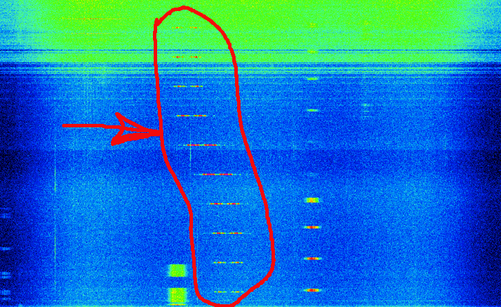

Очередная неделя тестирования поворотного устройства принесла удивительные результаты. Для начала, немного изменений по сравнению с предыдущей неделей.



### Работа от батареек. 

В этот раз я решил попробовать работать от батареек. Это должно уменьшить количество помех, приходящих из сети. Не то, чтобы их очень много, но я надеялся уменьшить noise floor. Кстати, кто-нибудь знает как это перевести на русский язык? 

### 70см фильтр

Недавно мне пришёл новый 70см фильтр, который я протестировал в [предыдущей статье](). Разумеется, мне хотелось понять как он поведёт себя в полевых условиях.

### Ферритовые кольца

Я, честно говоря, так и не смог понять, какие именно частоты эти кольца могут отфильтровать. Возможно, когда-нибудь у меня дойдут руки, и я погружусь в теорию и исследую этот вопрос. А пока пришлось их надеть "на всякий случай".

## Результаты

70см фильтры сделали своё дело. Вот пример того, как раньше принимался сигнал:

Сейчас же, спектограмма выглядит следующим образом:

Тут важно отметить несколько вещей:

* сигнал спутника [CHOMPTT](https://db.satnogs.org/satellite/43855/) отчётливо виден
* когда антенна направлена в сторону центра города, noise floor значительно повышается (на картинке зелёный сверху)
* повышение идёт небольшими ступеньками. Это момент, когда антенна двигается

Меня очень смущает повышение noise floor. Я рассчитывал, что 70см фильтр будет отфильтровывать все нежелательные частоты до АЦП. Тем самым не перегружая его. Однако, видимо, это не так. У меня есть пара идей о том, что ещё можно попробовать, и я постараюсь описать результаты экспериментов в следующих статьях.
