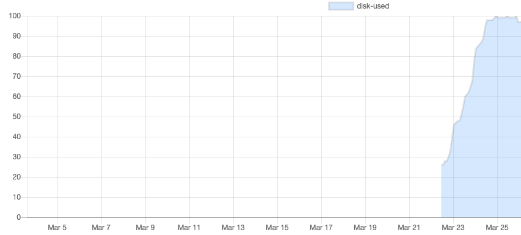
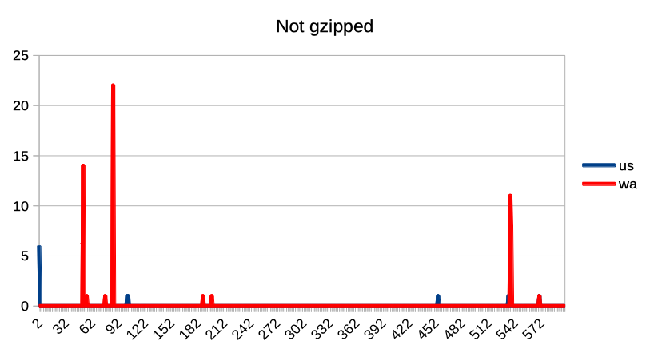

Недавно я добавил поддержку более 20 спутников в [r2cloud](https://github.com/dernasherbrezon/r2cloud). Из-за этого принимаемых данных стало значительно больше и диск переполнился. Чтобы как-то решить эту проблему, я уменьшил количество сохраняемых наблюдений. Теперь сохраняются последние 3 наблюдения для каждого спутника. Это не сильно помогло:
 

 
Дело в том, что при пролёте спутника, я сохраняю данные в raw I/Q с частотой пример 240 000 сэмплов в секунду. Это создаёт файл:

 ```bash
240 000 байт/сек * 2 (канала) * 12 минут = 288000000 байт = ~288мб
```

Почему такая большая частота? Кубсаты обычно занимают гораздо меньшую полосу частот, но дело в том, что rtl-sdr не умеет меньше. Поэтому необходимо сохранить данные с такой частотой, а потом даунсэмплировать в более низкую. 

Конвертация в .wav файл с частотой 48 000 сэмплов в секунду занимает слишком много времени. Так что, пока она происходит, запускается следующее наблюдение. Предыдущий файл не успевает конвертироваться, и запускается ещё одно наблюдение и так далее. Всё это приводит к тому, что диск переполняется.

Чтобы этого избежать, я придумал следующее:
 
 1. Не запускать следующее наблюдение, если не произведено даунсэмплирование предыдущего
 2. Сохранять данные на диск сразу в сжатом виде
 
Первый пункт было достаточно просто [реализовать](https://github.com/dernasherbrezon/r2cloud/commit/ba4550407a352d85134c0a9986e84e6bba184f89). Для второго пункта необходимо было провести тестирование, о котором я и хочу написать дальше.

## Тестирование
 
Тестирование заключается в сравнении старого способа (писать данные напрямую на диск) и нового.

Скрипт для запуска старого способа следующий:
 
 ```bash
timeout 10m vmstat 1 > ~/nogz_vmstat.txt &
timeout 10m rtl_sdr -f 145952432 -s 240000 -g 45 -p 7 /tmp/nogz.raw &
```

В результате получаются следующие графики загрузки CPU (us) и диска (wa):


 
Новый способ запускается следующим образом:

 ```bash
timeout 10m vmstat 1 > ~/gz_vmstat.txt &
timeout 10m rtl_sdr -f 145952432 -s 240000 -g 45 -p 7 - | gzip > /tmp/gz.raw.gz &
```

И получается:


 
На диске при этом:

 ```bash
pi@raspberrypi:/tmp $ ls -lh
-rw-r--r-- 1 pi   pi    47M Apr  2 21:30 gz.raw.gz
-rw-r--r-- 1 pi   pi   275M Apr  2 21:17 nogz.raw
```

## Выводы

 1. Запись на диск ожидаемо потребляет CPU в районе 10%
 2. Простоя из-за большого потока данных на флэшку меньше при использовании gzip. Тоже ожидаемо
 3. Потребление диска уменьшилось почти в 6 раз!