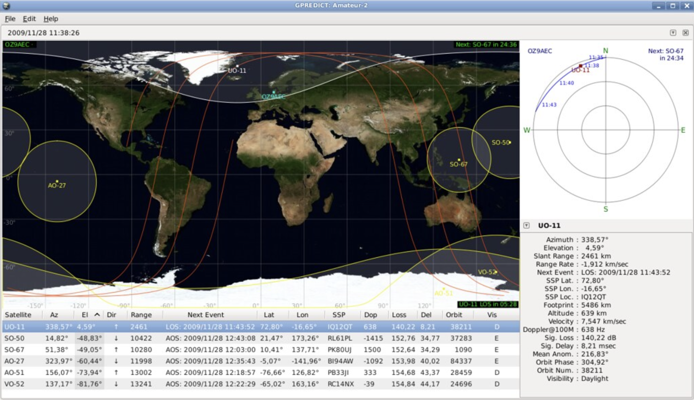
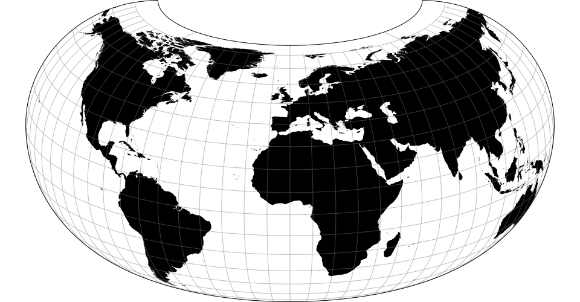
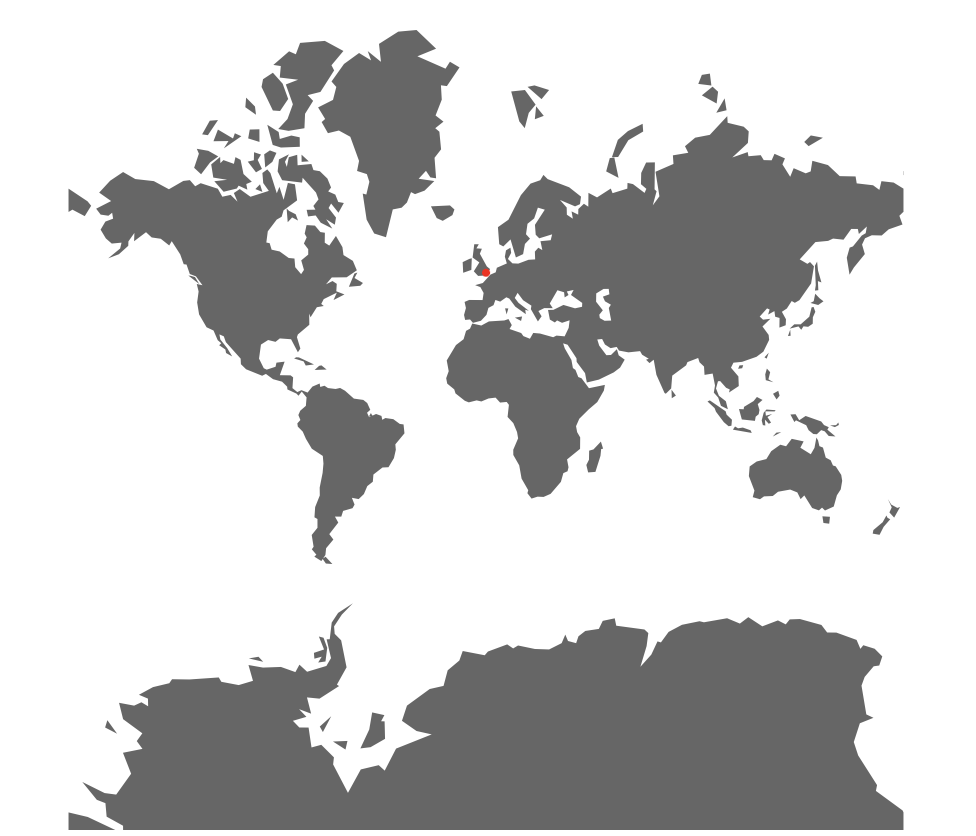
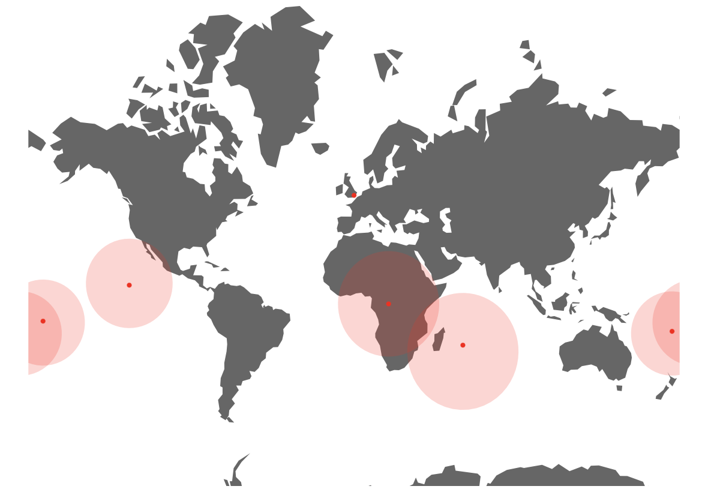
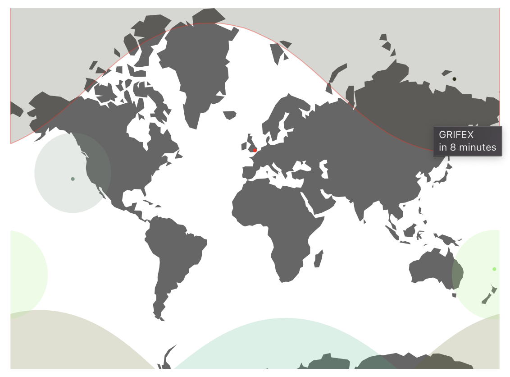
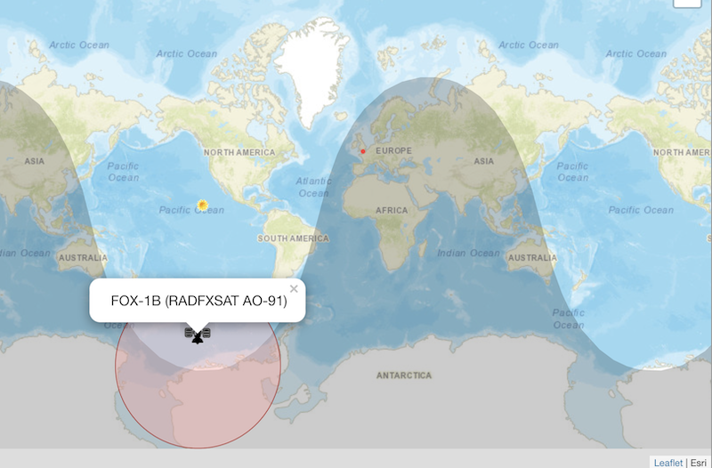

В следующем месяце я планирую поехать на фестиваль [Electromagnetic field](https://www.emfcamp.org). Ну, а чтобы не ехать с пустыми руками, я решил взять с собой [поворотное устройство]() и сделать стенд, на котором будет работать r2cloud. Просто поворачивающейся антенны мне показалось недостаточно, поэтому я придумал дать доступ к r2cloud, где каждый желающий может посмотреть за каким спутником ведётся наблюдение, какие данные получены, какие спутники на подлёте. К сожалению, в r2cloud нет понятия ролей и нельзя создать пользователя с правами "только чтение". Вот тут-то у меня и родилась идея сделать режим презентации.

Этот режим должен работать следующим образом:

 * по-умолчанию должен быть выключен
 * должен включаться в настройках
 * быть доступен без логина и пароля
 * показывать последние 5 наблюдений
 * показывать полную информацию о каждом наблюдении - данные, спектрограмму, TLE
 * показывать следующие 5 запланированных наблюдений
 * показывать текущее положение спутников на карте Земли и область их видимости
 
Первые пару пунктов легко сделать дополнительной настройкой:


Однако, последний пункт - самый сложный. Как отрисовать карту Земли с проекциями всех координат? Как вообще нарисовать карту Земли?

## Анализ требований

При анализе требований я решил пойти с конца. Я точно знаю, что приложение должно уметь работать без интернета, а значит никаких Google Maps, Open Street Map, MapBox и др. Для того, чтобы нарисовать карту Земли, мне достаточно одного самого крупного масштаба. В идеале карта должна быть похожа на [gpredict](http://gpredict.oz9aec.net):



Следующее требование - работа в браузере. [r2cloud-ui](https://github.com/dernasherbrezon/r2cloud-ui) вполне подходит для этого и совсем не хочется создавать отдельное приложение. А значит режим презентации должен быть написан на javascript.

## Выбор технологий

Беглый поиск в Google показал, что проще всего использовать библиотеку [d3](https://d3js.org). В ней есть модуль для работы с ГИС данными - [d3-geo](https://github.com/d3/d3-geo).

```
npm install d3
```

С их помощью можно преобразовывать координаты спутника в координаты точки на карте:

```javascript
const projection = d3.geoMercator().fitExtent( [ [0, 0], [width, height + 120], ], land)
var centerXY = projection([longitudeDeg, latitudeDeg])
```

При этом в d3-geo есть поддержка как стандартных проекций:
 
 * geoMercator
 * geoMiller
 * geoNaturalEarth2

Так и совсем странных:

 * geoAitoff
 * geoArmadillo
 * geoBromley



Я решил не выпендриваться и взял стандартную проекцию - Меркатор. Эта проекция используется в Google Maps и Open Street Map.

Ещё d3 поддерживает [GeoJSON](https://geojson.org) - JSON формат описания географических объектов.

```json
{
  "type": "Feature",
  "geometry": {
    "type": "Point",
    "coordinates": [125.6, 10.1]
  },
  "properties": {
    "name": "Dinagat Islands"
  }
}
```

С его помощью можно описывать границы континентов или государств. Есть [множество](https://github.com/simonepri/geo-maps/blob/master/info/earth-coastlines.md) [сайтов](https://datahub.io/core/geo-countries), где можно бесплатно скачать все береговые линии Земли. Но, зачастую, такие файлы слишком детализированы для моих нужд. Мне же необходимо отобразить все континенты на небольшом изображении 800x600 без возможности увеличения. Можно попробовать использовать менее детализированные GeoJSON файлы, но они содержат дополнительную метаинформацию, которая мне тоже не нужна. На помощь приходит другой формат - [topoJSON](https://github.com/topojson/topojson). Это небольшое расширение GeoJSON, которое позволяет задавать геометрии небольшими сегментами и линиями. Он как раз призван создавать файлы чуть меньшего размера по сравнению с GeoJSON за счёт выкидывания всего ненужного.

```
npm install topojson-client
```

В итоге из достаточно детализированного GeoJSON файла размером 33Мб я смог получить карту размером 16Кб. Да, некоторые острова стали выглядеть очень условно, некоторые детали совсем потерялись, но этого вполне достаточно для нужд проекта:



## Расчёт траекторий спутников

Следующим шагом будет расчёт траекторий спутников. Нужно определить широту, долготу и область видимости спутника. Область видимости - это такая область Земли, в которой можно наблюдать за спутником или получать сигнал. Чем выше находится спутник, тем больше его область видимости.

Тут есть небольшая тонкость. На сервере я рассчитываю положение спутника с помощью библиотеки [orekit](https://www.orekit.org). С её помощью можно рассчитать траектории и передать готовый результат в браузер. Либо передавать с сервера TLE и рассчитывать все координаты на клиентской стороне. У каждого способа есть свои плюсы и минусы.

Расчёт на сервере:

**\+** расчёт будет производить та же библиотека, что и для запуска наблюдений

**\+** расчёт можно закэшировать и считать один раз для нескольких клиентов

**&mdash;** raspberrypi достаточно слабый. Если делать расчёт траекторий каждые 10 секунд, то это может сильно повлиять на декодирование данных и приём сигнала

Расчёт на клиенте:

**\+** браузер возьмёт на себя расчёт траекторий и позволит снизить нагрузку на сервер

**&mdash;** библиотека расчёта будет отличаться от серверной. А это значит, что любая ошибка в расчётах на сервере не сможет быть отловлена на клиенте. И наоборот.

Я решил всё-таки делать расчёт на клиенте, чтобы уменьшить нагрузку на сервер.

Для этого я использовал библиотеку [satellite.js](https://github.com/shashwatak/satellite-js). Она создана на основе [python-sgp4](https://github.com/brandon-rhodes/python-sgp4), которая основана на достаточно старой модели Земли, не поддерживает leap seconds и прочие параметры из справочников. Тем не менее на практике оказалось, что разница совсем небольшая - доли секунды. И для того, чтобы показать спутник на небольшой карте, такой точности вполне достаточно.

```
npm install satellite.js
```

## Реализация

Код, необходимый для инициализации Земли в SVG, я уже привёл выше. К сожалению, Антарктида в проекции Меркатора занимает ну очень много места, а станций слежения там не предвидится. Для того чтобы удалить Антарктиду, я просто расширил SVG на 120 пикселей по высоте и Антарктида перестала помещаться:

```javascript
const projection = d3.geoMercator().fitExtent( [ [0, 0], [width, height + 120], ], land)
```

Далее, координаты спутников рассчитываются следующим образом:

```javascript
var satrec = satellite.twoline2satrec(tle.line2, tle.line3)
var positionAndVelocity = satellite.propagate(satrec, currentDate);
var positionGd    = satellite.eciToGeodetic(positionAndVelocity.position, gmst)
var longitudeDeg = satellite.degreesLong(positionGd.longitude)
var latitudeDeg  = satellite.degreesLat(positionGd.latitude)
var centerXY = projection([longitudeDeg, latitudeDeg])
```

Область видимости спутника - это сферический угол, который определяется высотой спутника и радиусом Земли:

```javascript
var coreAngle = Math.acos(6.378135E3 / (6.378135E3 + positionGd.height)) / 1.74532925E-2
```

Чтобы рассчитать координаты получившегося эллипса, необходимо вспомнить немного [сферической геометрии](https://ru.wikipedia.org/wiki/Сферическая_тригонометрия). Либо использовать ```geoCircle```:

```javascript
var circle = d3.geoCircle().center([longitudeDeg, latitudeDeg]).radius( coreAngle )()
```

Несмотря на то, что метод задания радиуса этого круга называется "радиус", нужно передавать именно угол в градусах.



## UX

Всё самое сложное позади и можно немного "поиграться со шрифтами". А именно - улучшить UX. Во-первых, каждое наблюдение должно отличаться по цвету от всех остальных. Для этого я [откуда-то](https://stackoverflow.com/a/52171480/659097) скопировал функцию вычисления хэша строки:

```javascript
hashcode(str, seed = 0) {
    let h1 = 0xdeadbeef ^ seed;
    let h2 = 0x41c6ce57 ^ seed;
    for (let i = 0, ch; i < str.length; i++) {
        ch = str.charCodeAt(i);
        h1 = Math.imul(h1 ^ ch, 2654435761);
        h2 = Math.imul(h2 ^ ch, 1597334677);
    }
    h1 = Math.imul(h1 ^ (h1>>>16), 2246822507) ^ Math.imul(h2 ^ (h2>>>13), 3266489909);
    h2 = Math.imul(h2 ^ (h2>>>16), 2246822507) ^ Math.imul(h1 ^ (h1>>>13), 3266489909);
    return 4294967296 * (2097151 & h2) + (h1>>>0);
}
```

И на основе хэша вычисляю случайный цвет:

```javascript
getRandomColor(hash) {
  var colour = '#';
  for (var i = 0; i < 3; i++) {
    var value = (hash >> (i * 8)) & 0xFF;
    colour += ('00' + value.toString(16)).substr(-2);
  }
  return colour;
}
```

В качестве строки для хэша я использовал Id наблюдения. Таким образом цвет области видимости спутника всегда будет один и тот же даже после перезагрузки страницы.

Следующим неплохим улучшением будет подсвечивания всей области видимости при наведении курсора. Это можно сделать с помощью javascript, а можно с помощью CSS! Для этого к элементу path нужно добавить CSS класс:

```html
<path class="satelliteCircle">
```

И соответствующий стиль:

```css
.satelliteCircle:hover {
	stroke: rgba(255, 0, 0, 0.4);
}
```

При наведении курсора мыши, вся область будет выделяться полупрозрачной красной линией.

Ещё неплохо было бы добавить название спутника и время до начала наблюдения. Для этого внутрь элемента path необходимо добавить title:

```html
<path class="satelliteCircle" :fill="cur.color" fill-opacity="0.2" :d="cur.path">
	<title>{{ cur.name }}&#xA;<br>{{ cur.timeHint }}</title>
</path>
```

```timeHint``` вычисляется следующим образом:

```javascript
moment(vm.observations[i].start).fromNow()
```

Элементы ```&#xA;<br>``` позволяют сделать подсказку на нескольких строчках. Причём старые браузеры смогут понять тэг ```br```, а новые - спецсимвол ```&#xA;```.  Всё это было благополучно найдено в Google и работает.

После всех манипуляций с vuejs, получилось вот такое SVG изображение, которое обновляется каждые 10 секунд. Особенно впечатляет, как d3-geo обрабатывает области видимости спутников вокруг полюсов:



Полный код можно найти тут: [presentationMode.vue](https://github.com/dernasherbrezon/r2cloud-ui/blob/master/src/components/pages/presentationMode.vue).

Если честно, то мне понравился получившийся результат. Если продраться через многочисленную рекламу самого популярного сайта для отслеживания спутников [n2yo.com](https://www.n2yo.com/), то можно увидеть достаточно посредственную реализацию:

