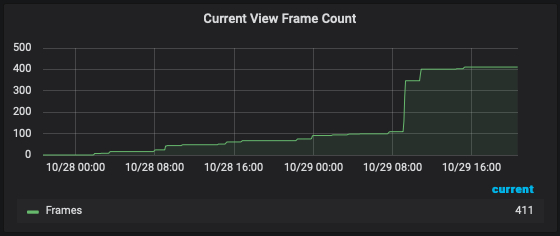
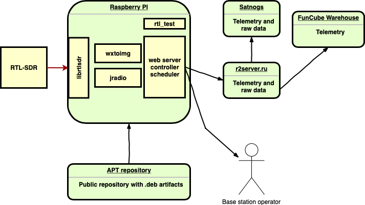
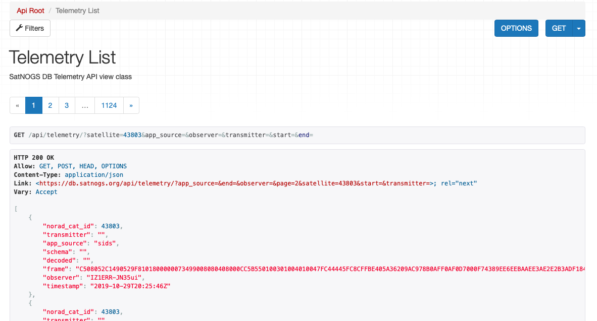
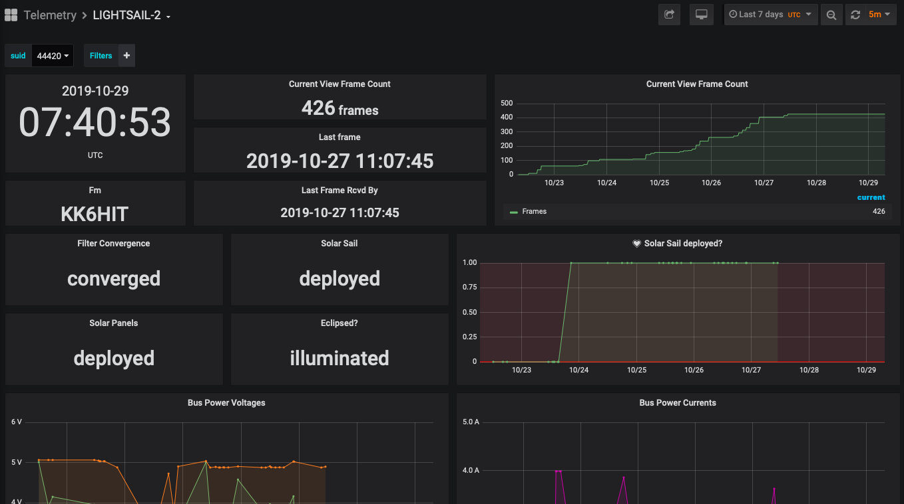
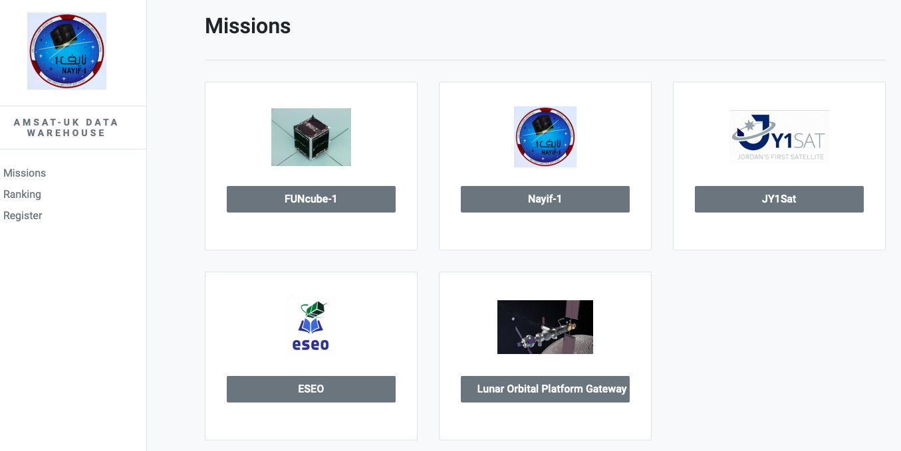
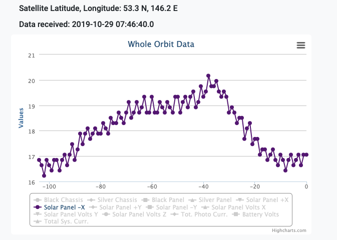

## Вступление

Иногда в разговоре с разными людьми речь заходит о моём хобби. В таком случае я говорю, что слежу за спутниками. Для большинства это объяснение не слишком-то информативно, поэтому оно идеально подходит для того, чтобы продолжить разговор и одновременно возбудить любопытство. Однако, не все могут лично со мной пообщаться, поэтому в этом посте я хотел бы рассказать о том, что такое - следить за спутниками. 

## Телеметрия

Первое, что приходит людям на ум, когда говоришь "следить за спутниками" - это шпионские страсти. Наверное, потому что спутники, благодаря кино, неразрывно связаны со слежением, супер секретными технологиями и пр. Однако, в реальности это совсем не так. Вернее, не совсем так. Конечно, существуют и военные спутники, и спутники-шпионы, но подавляющее количество спутников совсем обычные. Они бывают как коммерческие, за доступ к которым необходимо заплатить, так и научные, доступ к которым сложно получить из-за сложной наземной аппаратуры. Бывают также студенческие - простые с открытым протоколом, доступные для всех.

Когда речь заходит о слежении за спутниками, я прежде всего имею в виду простые спутники с открытым доступом и протоколом. Зачастую авторы этих спутников заинтересованы в том, чтобы как можно больше людей получили доступ. Прежде всего это связано с тем, что спутник пролетает над университетом достаточно быстро - в среднем 10 минут. За это время университетская станция приёма сигнала может получить только небольшое количество информации о спутнике. Но что происходило со спутником в других точках земли? На обратной стороне земли? У полюса? Именно поэтому владельцы небольших спутников поощряют огромную сеть радиолюбителей по всему миру собирать данные и отправлять им по электронной почте (sic!) или через API. Для этих целей радиолюбители устанавливают у себя дома, на крыше, в саду станции приёма сигнала и по интернету передают его назад владельцам спутника.

Какие же данные передаёт спутник? Большинство спутников передают телеметрию. Это сильно-упакованная бинарная структура с информацией о всех (или почти всех) узлах спутника. Она может включать в себя:

 * напряжение и ток солнечных панелей
 * температура процессора, контроллеров, панелей, [статус записи в память](https://github.com/dernasherbrezon/jradio/blob/master/src/main/java/ru/r2cloud/jradio/eseo/Type1.java#L124)
 * показания гироскопов и статус раскрытия солнечного паруса

Телеметрия транслируется со спутника на землю постоянно с небольшим интервалом.

Во многих спутниках установлены экспериментальные компоненты, за которыми необходимо наблюдать. Телеметрия как раз и предоставляет информацию о том, как ведет себя в космосе тот или иной компонент. И чем больше телеметрии собирается, тем более точная информация попадает к производителям. По результатам полученных данных можно делать улучшения и пробовать различные подходы. 

## Сложности

В теории любой желающий может направить антенну на спутник и получить данные. На практике же, получение данных со спутника - это достаточно нетривиальный процесс. Во-первых, каждый спутник передаёт сигнал немного по-разному. Это прежде всего связано с самой конструкцией спутника и его антенны. А поскольку конструкции спутников отличаются, то и способы передачи сигнала разные. Во-вторых, владельцы спутника должны раскрыть формат телеметрии. В противном случае полученные биты так и останутся битами данных, из которых нельзя понять, что они значат.

К счастью, производители всё больше и больше понимают полезность географически распределённой сети приёма сигналов. Это в свою очередь позволяет проектам вроде [gr-satellites](https://github.com/daniestevez/gr-satellites) добавлять поддержку новых спутников и [станциям по всему миру](https://satnogs.org) принимать сигналы.

## Что же делать с телеметрией?

Как я уже говорил выше, телеметрия нужна прежде всего владельцам спутников. Мой проект [r2cloud](https://github.com/dernasherbrezon/r2cloud) как раз позволяет получать информацию со спутников и делать ее доступной для всех. Для этого я интегрировался с проектами [SatNOGS](https://satnogs.org) и [Amsat-UK Data warehouse](http://data.amsat-uk.org/missions). Схема работы выглядит следующим образом:

1. Базовая станция получает сигнал со спутника, демодулирует и декодирует его
2. Если настроена интеграция с [r2server.ru](https://r2server.ru), то данные отсылаются на центральный сервер
3. Далее, с центрального сервера информация может быть отправлена в другие сервисы.

### Satnogs

Проект Satnogs - это глобальная сеть приёма сигналов со спутников. Она позволяет централизованно хранить информацию о наблюдениях, а так же предоставляет API для загрузки данных извне. Этот API позволяет загружать принятую телеметрию по протоколу [SiDS](http://www.pe0sat.vgnet.nl/decoding/tlm-decoding-software/sids/). Я написал [небольшую библиотеку](https://github.com/dernasherbrezon/sids), которая реализует данный протокол и позволяет загружать телеметрию из r2cloud в satnogs.

Satnogs также предоставляет сервис [https://dashboard.satnogs.org](https://dashboard.satnogs.org). В этом сервисе можно создать дашборд на котором можно выводить различные показатели спутника и анализировать данные.

### Amsat-UK Data warehouse

Этот сервис агрегирует информацию со спутников Funcube-1, Nayif-1, Jy1sat, Eseo. Для этого сервиса я также написал [небольшую библиотеку](https://github.com/dernasherbrezon/fcdwClient).

Графики в этом сервисе чуть попроще, тем не менее позволяют делать некоторые выводы о том, как работает спутник.

При желании можно выгрузить все данные и проанализировать локально.

## Нужна помощь

Сообществу крайне необходимо как можно больше станций приема сигнала. И каждый может помочь в этом. Достаточно лишь установить антенну и настроить станцию приёма. Вся станция стоит [не больше 100$](https://github.com/dernasherbrezon/r2cloud/wiki/Bill-of-materials) и состоит из простых и заменяемых компонент. Чем больше станций расположено по всему миру, тем больше информации мы можем узнать о космосе.

