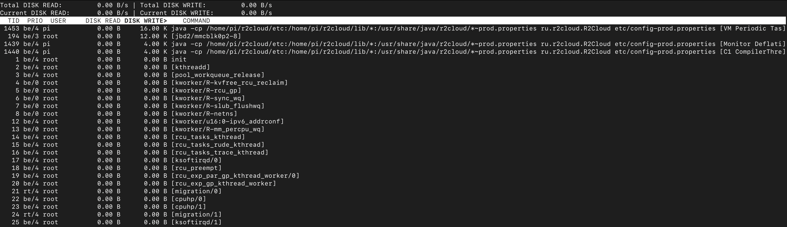
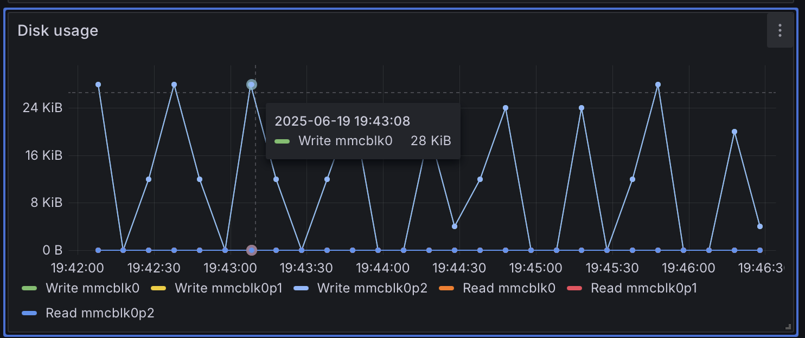
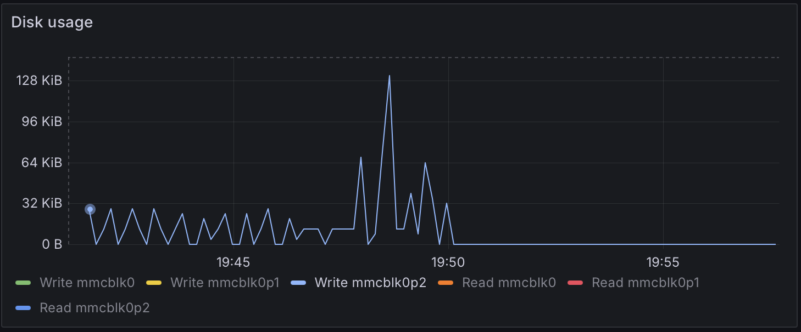

Использование SD-карт в Raspberry PI - достаточно противоречивое решение. С одной стороны, это невероятно удобно: можно легко заменить одну карту на другую, чтобы обновить операционную систему или использовать разные карты для различных приложений. С другой стороны, современные SD-карты имеют ограниченное количество циклов чтения и записи, что уменьшает их срок службы.

В интернете предложено множество способов решения этой проблемы:

 - **Использование [read-only overlay](https://www.dzombak.com/blog/2024/03/running-a-raspberry-pi-with-a-read-only-root-filesystem/) для файловой системы**. Идея заключается в том, что SD-карты гораздо лучше переносят операции чтения, чем записи. Сокращение операций записи может значительно продлить срок службы карты. Однако на практике большинство системных приложений периодически записывают данные на диск, поэтому настройка режима read-only оказывается [трудоёмкой и не всегда надёжной](https://hallard.me/raspberry-pi-read-only/).
 - **Загрузка с внешних носителей или по сети.** Альтернативой SD-карте может быть загрузка с [SSD/NVMe](https://www.raspberrypi.com/documentation/accessories/m2-hat-plus.html#boot-from-nvme), [USB-накопителя](https://pimylifeup.com/raspberry-pi-boot-from-usb/) или даже [по сети](https://blog.hardill.me.uk/2023/08/05/network-booting-rapberry-pi/#:~:text=Options,protocol%2C%20it%20runs%20over%20UDP.). Эти методы снижают нагрузку на SD-карту или полностью исключают её использование.

Однако самый простой способ продлить срок службы SD-карты — минимизировать операции записи или их количество. Чтобы определить, какие процессы активно записывают данные на карту, можно использовать утилиту ```iotop```. Установить её можно с помощью команды:

```bash
sudo apt install iotop
```

И запустить:

```
sudo iotop -a
```

Эта команда отображает объём данных, записанных и прочитанных каждым процессом или потоком.



На скриншоте выше видно, что процесс ```r2cloud``` (java) периодически записывает данные на диск, а поток ядра ```jbd2```, отвечающий за журнал файловой системы ext4, регулярно обновляет этот журнал.
Это привлекло моё внимание, поскольку моё приложение в этот момент не должно было выполнять никаких операций. Построив график активности, я заметил, что какая-то периодическая задача постоянно записывает данные на диск:



```iotop``` не показывает, в какие именно файлы производится запись, поэтому я решил разобраться, за что отвечает поток ```VM Periodic Task```. Оказалось, что это нативный поток JVM, который занимается профилированием работы процесса. Этот профилировщик [включён по умолчанию](https://openjdk.org/groups/hotspot/docs/Serviceability.html#bjvmstat). Для отключения профилировщика можно использовать опцию:

```
-XX:-UsePerfData
```

В результате любая запись на диск моментально пропадёт:



Ещё один эффективный способ уменьшить нагрузку на SD-карту — выделить директорию ```/tmp``` в отдельную файловую систему ```tmpfs```. Эта файловая система хранит данные в оперативной памяти, что исключает запись на SD-карту.