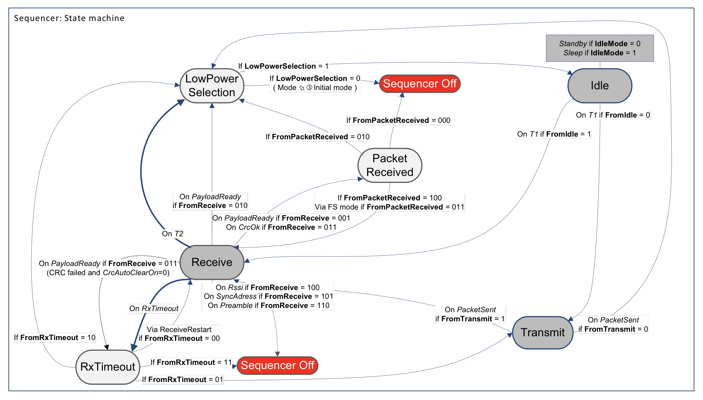
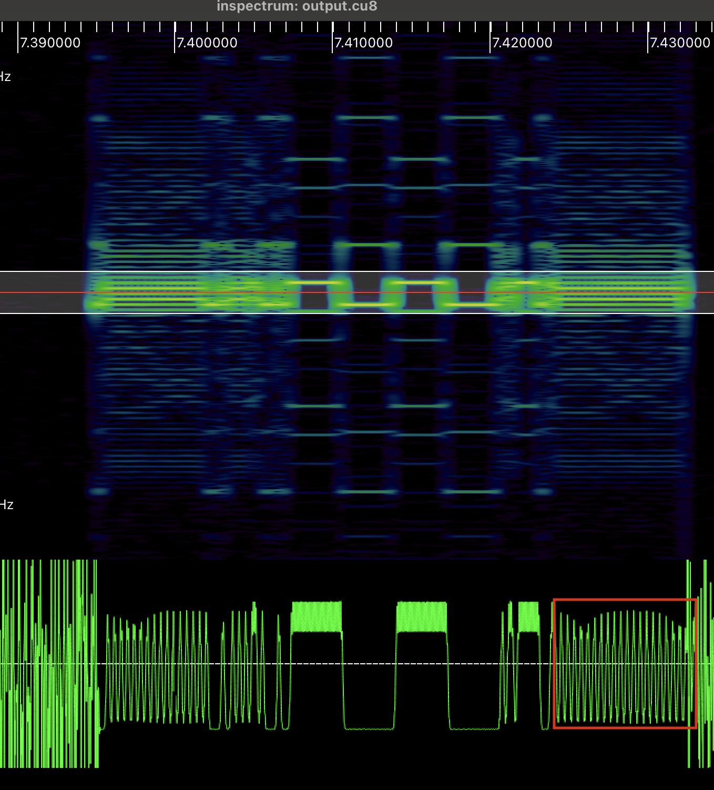
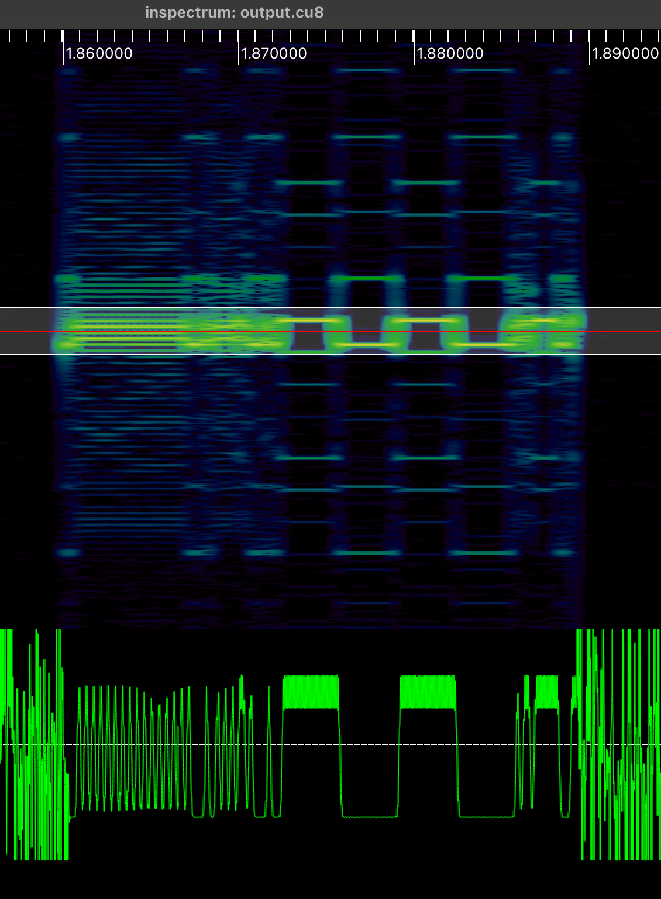

Чип sx127x имеет встроенный конечный автомат для FSK модема. Он содержит несколько заранее заданных состояний и позволяет программировать условия перехода между ними. Сделано это прежде всего для тех режимов, где нужна быстрая скорость реакции, а задержки на передачу данных в процессор и обратно слишком большие. Например, приёмник может проснуться, проверить есть ли синхрослово входящего сообщения и если нет, то заснуть на небольшой промежуток времени. Это позволяет немного съэкономить энергию.



## Практическое применение

В sx127x есть особенность: после того, как данные переданы, чип остаётся в режиме FSTX. Это режим, в котором передатчик генерирует несущую частоту и передаёт её в эфир. Это не очень хорошо по нескольким причинам: во-первых, засоряется эфир. В разных странах есть регуляции радиоэфира, в которых сказано сколько секунд каждый передатчик может передавать данные на каких частотах (duty cycle). Во-вторых, на передачу несущей частоты тратится энергия. 

Именно поэтому, как только сообщение было получено (прерывание PacketSent), [sx127x](https://github.com/dernasherbrezon/sx127x) переключает чип в режим STANDBY:

```c
sx127x_set_opmod(SX127x_MODE_STANDBY, device->active_modem, device);
```

Однако переключение происходит не сразу, а через некоторое время. И всё это время несущая отправляется в эфир. В примере ниже это выделено красным квадратом.



Получается как-то неаккуратненько.

Вместо этого, можно сконфигурировать конечный автомат, который сразу после отправки сообщения будет автоматически переключаться в режим STANDBY.

## Конечный автомат

Работа с ним достаточно простая - нужно записать конфигурацию в определённый регистр и он запустится:

```c
uint8_t value = 0b10010000;
ERROR_CHECK(sx127x_spi_write_register(REG_SEQ_CONFIG1, &value, 1, device->spi_device));
```

В примере выше конфигурация следующая (биты слева направо):

 * 1 - стартует конечный автомат
 * 0 - не используется
 * 0 - режим ожидания - STANDBY
 * 10 - из режима ожидания переходит в режим передачи
 * 0 - из режима LowPower Selection выключает стейт-машину
 * 0 - из режима ожидания переходит в режим передачи
 * 0 - из режима передачи переходит в режим LowPower Selection

Однако, запустив программу в первый раз, у меня ничего не получилось. Оказалось, что конечный автомат проглотил прерывание PacketSent, и оно не отправилось в ESP32. Вместо этого прерывания я решил использовать FifoEmpty. Оно генерируется, когда очередь байт на отправку пуста. Возможно, это не самой лучший способ, но другого прерывания просто нет. А его неплохо было бы иметь если нужно отправить подряд несколько сообщений.

В результате у меня получилось следующее:



Как видно, несущая не отправляется сразу же после сообщения.

## Результаты

Удивительно, как много всего помещается в такой маленький чип как sx127x. В результате мне удалось чуть-чуть ускорить отправку пакетов и съэкономить энергию. 

Теперь вопрос: а сможет ли приёмник получать пакеты так же быстро, как их отправляет передатчик?
 