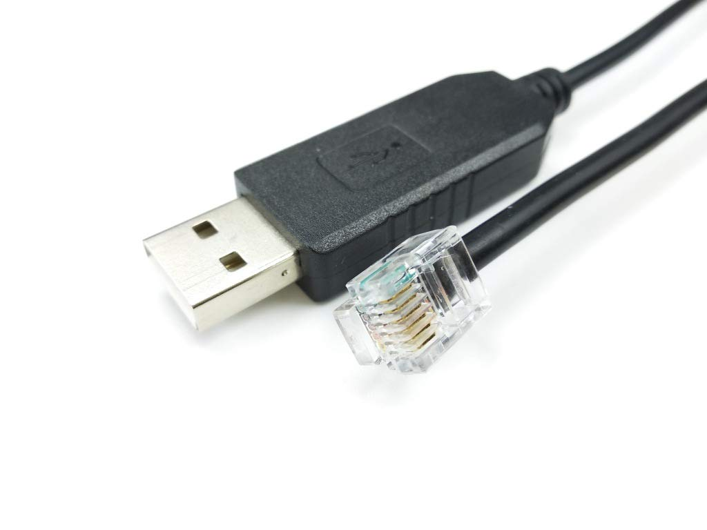
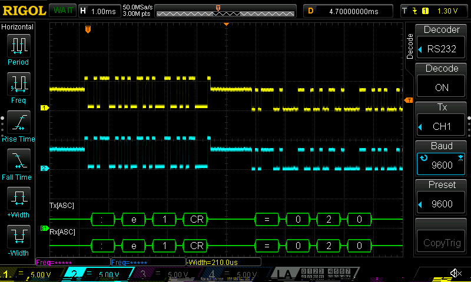

Этим летом мне удалось пару раз выбраться на природу вместе с поворотным устройством [SkyWatcher AllView](http://skywatcher.com/product/allview-mount/). И я в очередной раз убедился, что текущая схема подключения слишком хлопотная и ненадежная: сначала нужно подключить моторы к пульту управления SynScan, а потом отдельным USB кабелем подключить SynScan к Raspberry. При этом все эти USB контакты шатаются, их сдувает ветром, они короткие и их нужно подключать в определённой последовательности. Именно поэтому я решил сделать ещё один заход на прямое подключение к моторам. В прошлый раз я купил не тот провод и спалил плату контроллера. В этот раз я решил сделать всё аккуратно и осторожно. 

## EQDIR

Насколько я понял, моторы всех поворотных устройств SkyWatcher [управляются по протоколу RS232](https://eq-mod.sourceforge.net/eqdirect2.htm). В одних используется разъём RJ11, в других - RJ45. Для RS232 нужно всего три контакта, поэтому нужно быть предельно внимательным какие контакты обжаты в RJ11. Оказывается, умельцы в Интернете уже разобрались и продают эти провода под кодовым названием [EQDIR](https://www.amazon.co.uk/dp/B08DG7KKNV). Они стоят дороже обычных, но зато гарантированно совместимы с моторами SkyWatcher.



Помимо особенного RJ11, со стороны USB разъёма стоит чип FT232. Он отвечает за конвертацию USB протокола в RS232 и работает с уровнями сигнала ±5В. Это важно, потому что 3.3В недостаточно.

## Протокол

После подключения Linux должен определить чип и создать TTY устройство.

```
$ lsusb
Bus 002 Device 001: ID 1d6b:0003 Linux Foundation 3.0 root hub
Bus 001 Device 003: ID 0403:6001 Future Technology Devices International, Ltd FT232 Serial (UART) IC
Bus 001 Device 002: ID 2109:3431 VIA Labs, Inc. Hub
Bus 001 Device 001: ID 1d6b:0002 Linux Foundation 2.0 root hub
```

К нему можно подключиться следующей командой:

```
screen /dev/ttyUSB0 9600
```

Протокол работы с моторами текстовый и его описание можно найти на [официальном сайте](https://inter-static.skywatcher.com/downloads/skywatcher_motor_controller_command_set.pdf).

Например, получить версию прошивки можно следующей командой:

```
:e1\r
=020EA0\r
```

Основных отличий от [протокола SynScan](https://inter-static.skywatcher.com/downloads/synscanserialcommunicationprotocol_version33.pdf) два:

 * Каждый мотор управляется отдельно
 * Позиция задаётся тиками шагового двигателя, а не углами

Несмотря на кажущуюся простоту, детали описаны крайне плохо. Например, совершенно непонятно, что такое CW и CCW. Чем отличается "Coarse GOTO" от "Normal GOTO"? Я попытался задать нужные команды, но моторы двигались очень медленно. Я не стал рисковать, боясь опять спалить контроллер, поэтому решил включить осциллограф и посмотреть какие команды отсылает пульт SynScan.

## Анализ протокола с помощью осциллографа

Обычно для анализа протокола разрезают кабель и параллельно подключают щупы осциллографа. Мне совсем не хотелось портить дорогой кабель, поэтому я решил использовать два [разъёма RJ11](https://thepihut.com/products/rj11-breakout-board).



К одному разъёму подключается SynScan. К другому - [провод RJ11](https://thepihut.com/products/rj11-cable), который уже втыкается в поворотное устройство. Щупы осциллографа подключаются к дорожкам на макетной плате.

Как только всё подключено, нужно выбрать декодирование RS232 и попробовать выполнить любую команду:



На скриншоте выше я запросил версию прошивки первого мотора. Согласно протоколу SynScan - это последовательность байт: ```(byte) 'P', 1, 16, (byte) 254, 0, 0, 0, 2```, которую SynScan, согласно осциллографу, преобразовал в ```:e1\r```.

Кстати, уровни сигнала выглядят крайне необычно для RS232. Оказывается пульт передаёт данные уровнями 0 и 5В, а мотор отвечает 0 и 3.3В.

Итак, схема подключения работает. Можно попробовать по-переключать скорости.

### Обычный GOTO  

SynScan: ```B071C,071C``` 

Мотор №2:

```
:K2\r		// Stop motion
:f2\r		// Inquire status
:j2\r		// Inquire position
:G200\r		// Set motion mode
:S2D75D80\r	// Set GOTO target
:J2\r		// Start motion
```

### Точный GOTO

SynScan: ```b071C7100,071C7100``` 

Мотор №2:

```
:K2\r		// Stop motion
:f2\r		// Inquire status
:j2\r		// Inquire position
:G200\r		// Set motion mode
:S2D95D80\r	// Set GOTO target
:J2\r		// Start motion
```

На самом деле ничем не отличается от "Обычного GOTO", кроме того, что более точные углы конвертируются в более точные шаги двигателя. Непонятно, зачем нужно было делать менее точные команды.

### Фиксированная скорость

Движение в определённую сторону с заданной скоростью. Скорость задаётся фиксированным числом от 1 до 9. Ниже пример для скорости №5.

SynScan: ```'P' 2 16 36 5 0 0 0``` 

Мотор №1:

```
:K1\r		// Stop motion
:f1\r		// Inquire status
:G111\r		// Set motion mode
:I11F0000\r	// Set step period
:J1\r		// Start motion
```

### Заданная скорость

Движение в определённую сторону с заданной скоростью. Скорость задаётся в угловых секундах в секунду. Вот пример запроса для движения со скоростью 150 угловых секунд в секунду в положительную сторону:

SynScan: ```'P' 3 16 6 2 88 0 0``` 

Мотор №1:

```
:K1\r		// Stop motion
:f1\r		// Inquire status
:G110\r		// Set motion mode
:I1C70000\r	// Set step period
:J1\r		// Start motion
```

Получается, чтобы быстро двигать моторы нужно дополнительно слать ":G200\r". Как только я переключил всё обратно на прямое подключение с помощью EQDIR, всё заработало как нужно.

## Hamlib

[r2cloud](https://github.com/dernasherbrezon/r2cloud) не работает напрямую с поворотными устройствами. Вместо этого используется промежуточный сервис [rotctld](https://manpages.ubuntu.com/manpages/trusty/man8/rotctld.8.html)(часть проекта Hamlib), который абстрагирует их за единым API. Соответственно, следующим шагом стало добавление протокола в этот проект.

На удивление весь процесс оказался простым и быстрым. Во-первых, мне удалось без особых проблем скопилировать проект под Mac и протестировать. Во-вторых, в Hamlib есть специальная папка ```rotators```, где лежат реализации протокола для разных поворотных устройств. Достаточно было скопировать любой существующий и переименовать в нужных местах. Из интересного, я добавил кэширование CPR (Counts Per Revolution), чтобы уменьшить количество команд и увеличить скорость работы.

После компиляции подключиться можно следующим образом:

```
./tests/rotctl --model=2801 --rot-file=/dev/cu.usbserial-A10M67FQ
```

После чего, в появившемся терминале можно выполнять команды:

```
Rotator command: \get_info
Info: V020EA0

Rotator command: \get_pos
Azimuth: 0.00
Elevation: 0.00

Rotator command: \set_pos 0.0 0.0
```

Как только я тщательно протестировал код, пришло время создавать [Pull Request](https://github.com/Hamlib/Hamlib/pull/1603). Но и тут я был приятно удивлён: он был смержен буквально на следующий день без единого комментария. Ура!

## Результат

Для финального результата осталось совсем немного:

 * Скомпилировать Hamlib из master бранча на Raspberry PI
 * Создать отдельный сервис в systemd
 * [Привязать устройство к этому сервису]() с помощью правил udev


