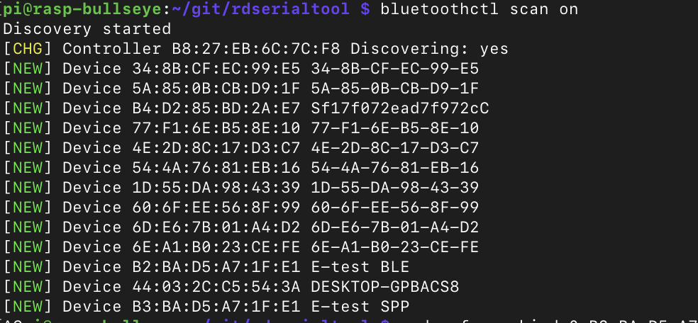

Not long ago, I acquired a USB tester A3-B.


This device allows measuring the current and voltage flowing between the USB input and USB output. One end can be plugged into a charger, the other into a device, and the current consumption can be measured. There are numerous applications for this:

 * Measure current consumption in different modes:
   * Sleep
   * Active work
   * Standby
 * Measure consumption over time. The display can switch to a graphing mode, showing how consumption changes over a period.
 * Measure total consumption over a period.
 * Determine the type of charging: fast, slow.
 * Assess the quality of the charging device. Some devices may be labeled as 10 watts, but they actually deliver only 5 watts.
 
I find this device particularly interesting because it can measure the current consumption of ESP32 and Raspberry Pi. Some of my stations operate on solar panels, and optimizing power consumption is important.

As a developer of r2lora and r2cloud, it's crucial for me to optimize my own code for low power consumption, and a device like this helps with that.

But reading the indicators directly from the screen can be challenging. This is where Bluetooth comes to the rescue.

> Everything becomes better at once if you add Bluetooth.
> 
> Leonard Hofstadter

Through Bluetooth, you can obtain all the parameters displayed on the screen. Since they are in digital form, they can be processed programmatically to create beautiful graphs.

## Bluetooth

[On the product page](https://www.amazon.co.uk/dp/B07DCS11GM), it's stated that A3-B supports Bluetooth and can only be connected to it through an Android app. So data can be available for external applications. Now it remains to understand how.

Here GitHub comes to the rescue. It turns out that enthusiasts have long figured out the protocol and have written a bunch of programs. To start, you need to find the device and pair it:

```bash
bluetoothctl scan on
```

This command will display all nearby Bluetooth devices:



A3-B is identified as 2 devices: E-test BLE and E-test SPP. BLE is [bluetooth low energy](https://en.wikipedia.org/wiki/Bluetooth_Low_Energy) and SPP is [serial port profile](https://en.wikipedia.org/wiki/List_of_Bluetooth_profiles#Serial_Port_Profile_(SPP)). All communication will go through the serial port, so you need to connect to the SPP device.

```bash
sudo rfcomm bind 0 B3:BA:D5:A7:1F:E1 2
```

This command will create the device ```/dev/rfcomm0```, bind the Bluetooth device to it, and select port number 2. The port number is crucial. The device provides several ports by default, but only port 2 can be used to receive data. It's possible that the other ports are used for device reprogramming.

You can check the connection using the [rdserialtool](https://github.com/rfinnie/rdserialtool) project:

```bash
./rdserialtool  --debug --device um24c --serial-device /dev/rfcomm0
```

If the connection is successful, the console will display the following:

```
2022-01-06 14:29:21,918 INFO: rdserialtool 0.2.1
2022-01-06 14:29:21,918 INFO: Copyright (C) 2019 Ryan Finnie
2022-01-06 14:29:21,919 INFO: 
2022-01-06 14:29:21,919 INFO: Connecting to UM24C /dev/rfcomm0
2022-01-06 14:29:21,919 DEBUG: Serial: Connecting to /dev/rfcomm0
2022-01-06 14:29:21,920 INFO: Connection established
2022-01-06 14:29:21,921 INFO: 
2022-01-06 14:29:22,221 DEBUG: Serial: SEND begin (b'\xf0')
2022-01-06 14:29:22,222 DEBUG: Serial: SEND end (1 bytes)
2022-01-06 14:29:22,222 DEBUG: Serial: RECV begin
2022-01-06 14:29:26,688 DEBUG: Serial: RECV end (b'\tc\x01\xf6\x002\x00\x00\x00\xfb\x00\x18\x00K\x00\x00\x00\x00\x01\x93\x00\x00\x07\xe0\x00\x00\x00\x00\x00\x00\x00\x00\x00\x00\x00\x00\x00\x00\x00\x00\x00\x00\x00\x00\x00\x00\x00\x00\x00\x00\x00\x00\x00\x00\x00\x00\x00\x00\x00\x00\x00\x00\x00\x00\x00\x00\x00\x00\x00\x00\x00\x00\x00\x00\x00\x00\x00\x00\x00\x00\x00\x00\x00\x00\x00\x00\x00\x00\x00\x00\x00\x00\x00\x00\x00\x00\x012\x00\x00\x00\x00\x00\x00\x01\x93\x00\x00\x07\xe0\x00\x03\x00\x003\xb8\x00\x01\x00\x03\x00\x05\x00\x00\x03\xec\x00\x00\xff\xf1')
2022-01-06 14:29:26,690 DEBUG: Start: 0x0963, end: 0xfff1
2022-01-06 14:29:26,692 DEBUG: DUMP: b'\tc\x01\xf5\x002\x00\x00\x00\xfb\x00\x18\x00K\x00\x00\x00\x00\x01\x93\x00\x00\x07\xe0\x00\x00\x00\x00\x00\x00\x00\x00\x00\x00\x00\x00\x00\x00\x00\x00\x00\x00\x00\x00\x00\x00\x00\x00\x00\x00\x00\x00\x00\x00\x00\x00\x00\x00\x00\x00\x00\x00\x00\x00\x00\x00\x00\x00\x00\x00\x00\x00\x00\x00\x00\x00\x00\x00\x00\x00\x00\x00\x00\x00\x00\x00\x00\x00\x00\x00\x00\x00\x00\x00\x00\x00\x012\x00\x00\x00\x00\x00\x00\x01\x93\x00\x00\x07\xe0\x00\x03\x00\x003\xb8\x00\x01\x00\x03\x00\x05\x00\x00\x03\xec\x00\x00\xff\xf1'
USB:  5.02V,  0.050A,  0.251W,  100.4Ω
Data:  3.06V(+),  0.00V(-), charging mode: Unknown / Normal
Recording (on) :    0.403Ah,    2.016Wh,  13240 sec at >= 0.03A
Data groups:
    *0:    0.403Ah,    2.016Wh       5:    0.000Ah,    0.000Wh
     1:    0.000Ah,    0.000Wh       6:    0.000Ah,    0.000Wh
     2:    0.000Ah,    0.000Wh       7:    0.000Ah,    0.000Wh
     3:    0.000Ah,    0.000Wh       8:    0.000Ah,    0.000Wh
     4:    0.000Ah,    0.000Wh       9:    0.000Ah,    0.000Wh
UM24C, temperature:  24C ( 75F)
Screen: 0/6, brightness: 5/5, timeout: 3 min
Collection time: 2022-01-06 14:29:26.689485
```

Indeed, this project outputs either too much data or data in JSON format. Therefore, I opted for another project - [um25c-client](https://github.com/davatorium/um25c-client). It connects to the device and outputs the current voltage and current value every second. These data can be conveniently imported into .csv and analyzed.

## Analysis of Everything Around

Most devices connect via USB, so you can measure literally everything! I started with fairly benign things. The [Razer Naga X](https://www.razer.com/gaming-mice/razer-naga-x/RZ01-03590100-R3U1) mouse has an average consumption of about 110mA:



Raspberry Pi 3b has an average standby consumption of 300mA.



Next, a comparison of the power consumption of [r2lora](https://github.com/dernasherbrezon/r2lora) and [tinyGS](http://tinygs.com). projects. Both run on the same [TTGO LoRa32](http://www.lilygo.cn/prod_view.aspx?TypeId=50060&Id=1326&FId=t3:50060:3) board:



The r2lora project is much simpler than tinyGS, hence lower energy consumption. I also opted for a simple UI with a single screen, no clock, etc. If you set the tinyGS screen brightness to 0, you get the following values:



It helped, but not much. The average consumption is around 100mA.



Loading new firmware consumes about 30mA. Funny.



By the way, during the initial WiFi connection, the current consumption increases to ~150mA, for both r2lora and tinyGS. As soon as the IP address is obtained, the consumption sharply returns to normal.

I also measured the power consumption during LoRa signal reception. It either does not change or changes within the range of measurement error.

And here's an interesting energy consumption graph when connecting ESP32 to Raspberry Pi via USB:



Immediately upon connection, the consumption jumps sharply to 500mA. Then there is the connection of ESP32 to the WiFi access point, and then normal operation. At the same time, the voltage from 5.140V jumps to 5.160V and normalizes at 5.140V.

## Conclusions
  
A3-B allows not only theorizing about power consumption but also capturing consumption over time and making various conclusions based on actual data.