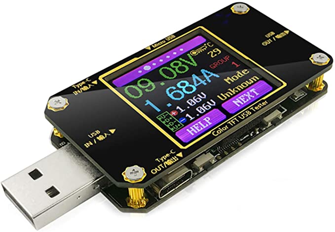

Совсем недавно я приобрёл [USB тестер A3-B]().



Это устройство позволяет измерять ток и напряжение, протекающее между USB-входом и USB-выходом. Одним концом можно воткнуть в зарядное устройство, другим в устройство и измерять ток потребления. Применений этому можно найти уйму:

 * измерять потребление тока в разных режимах:
   * сна
   * активной работы
   * простоя
 * измерять потребление во времени. Дисплей умеет переключаться в режим построения графика и показывать, как меняется потребление в течении некоторого времени.
 * измерять общее потребление за промежуток времени.
 * определять тип зарядки: быстрая, медленная.
 * определять качество зарядного устройства. На некоторых устройствах может быть написано 10Ватт, но при этом они фактически выдают 5Ватт.
 
Мне такое устройство прежде всего интересно тем, что может измерять потребление тока ESP32 и Raspberry PI. Некоторые мои станции работают от солнечных панелей и оптимизация потребления тока - вполне насущная проблема. 

Ещё, как разработчику r2lora и r2cloud, мне важно оптимизировать свой собственный код на низкое потребление электричества. И такое устройство как раз помогает в этом.

Но сами по себе показатели сложно считывать с экрана. И вот тут на помощь приходит bluetooth.

> Всё сразу становится лучше, если к этому добавить bluetooth.
> 
> Леонард Хофстедтер

Через bluetooth можно получить все параметры, которые отображаются на экране. А так как они в цифровом виде, то их можно программно обработать и построить красивые графики.

## Bluetooth

[На карточке товара](https://www.amazon.co.uk/dp/B07DCS11GM) написано, что A3-B поддерживает bluetooth и подключится к нему можно только из-под приложения на android. То есть теоретически данные получить всё же можно. Осталось понять как.

И тут на помощь приходит github. Оказывается, умельцы уже давно разобрались в протоколе и смогли написать кучу программ. Для начала нужно найти устройство и привязать его:

```bash
bluetoothctl scan on
```

Эта команда выдаст всевозможные bluetooth устройства в округе:


A3-B опознаётся как 2 устройства: E-test BLE и E-test SPP. BLE - это [bluetooth low energy](https://ru.wikipedia.org/wiki/Bluetooth_с_низким_энергопотреблением). SPP - это профиль [serial port profile](https://en.wikipedia.org/wiki/List_of_Bluetooth_profiles#Serial_Port_Profile_(SPP)). Вся коммуникация будет идти через serial port, поэтому нужно подключатся к SPP устройству.

```bash
sudo rfcomm bind 0 B3:BA:D5:A7:1F:E1 2
```

Эта команда создаст устройство ```/dev/rfcomm0```, привяжет к нему bluetooth устройство и выберет порт номер 2. Номер порта - это очень важно. Устройство по-умолчанию предоставляет несколько портов. Но только по порту 2 можно получать данные. Вполне возможно остальные порты используются для перепрошивки устройства.

Проверить соединение можно с помощью проекта [rdserialtool](https://github.com/rfinnie/rdserialtool):

```bash
./rdserialtool  --debug --device um24c --serial-device /dev/rfcomm0
```

Если подключение прошло успешно, то в консоли будет следующее:

```
2022-01-06 14:29:21,918 INFO: rdserialtool 0.2.1
2022-01-06 14:29:21,918 INFO: Copyright (C) 2019 Ryan Finnie
2022-01-06 14:29:21,919 INFO: 
2022-01-06 14:29:21,919 INFO: Connecting to UM24C /dev/rfcomm0
2022-01-06 14:29:21,919 DEBUG: Serial: Connecting to /dev/rfcomm0
2022-01-06 14:29:21,920 INFO: Connection established
2022-01-06 14:29:21,921 INFO: 
2022-01-06 14:29:22,221 DEBUG: Serial: SEND begin (b'\xf0')
2022-01-06 14:29:22,222 DEBUG: Serial: SEND end (1 bytes)
2022-01-06 14:29:22,222 DEBUG: Serial: RECV begin
2022-01-06 14:29:26,688 DEBUG: Serial: RECV end (b'\tc\x01\xf6\x002\x00\x00\x00\xfb\x00\x18\x00K\x00\x00\x00\x00\x01\x93\x00\x00\x07\xe0\x00\x00\x00\x00\x00\x00\x00\x00\x00\x00\x00\x00\x00\x00\x00\x00\x00\x00\x00\x00\x00\x00\x00\x00\x00\x00\x00\x00\x00\x00\x00\x00\x00\x00\x00\x00\x00\x00\x00\x00\x00\x00\x00\x00\x00\x00\x00\x00\x00\x00\x00\x00\x00\x00\x00\x00\x00\x00\x00\x00\x00\x00\x00\x00\x00\x00\x00\x00\x00\x00\x00\x00\x012\x00\x00\x00\x00\x00\x00\x01\x93\x00\x00\x07\xe0\x00\x03\x00\x003\xb8\x00\x01\x00\x03\x00\x05\x00\x00\x03\xec\x00\x00\xff\xf1')
2022-01-06 14:29:26,690 DEBUG: Start: 0x0963, end: 0xfff1
2022-01-06 14:29:26,692 DEBUG: DUMP: b'\tc\x01\xf5\x002\x00\x00\x00\xfb\x00\x18\x00K\x00\x00\x00\x00\x01\x93\x00\x00\x07\xe0\x00\x00\x00\x00\x00\x00\x00\x00\x00\x00\x00\x00\x00\x00\x00\x00\x00\x00\x00\x00\x00\x00\x00\x00\x00\x00\x00\x00\x00\x00\x00\x00\x00\x00\x00\x00\x00\x00\x00\x00\x00\x00\x00\x00\x00\x00\x00\x00\x00\x00\x00\x00\x00\x00\x00\x00\x00\x00\x00\x00\x00\x00\x00\x00\x00\x00\x00\x00\x00\x00\x00\x00\x012\x00\x00\x00\x00\x00\x00\x01\x93\x00\x00\x07\xe0\x00\x03\x00\x003\xb8\x00\x01\x00\x03\x00\x05\x00\x00\x03\xec\x00\x00\xff\xf1'
USB:  5.02V,  0.050A,  0.251W,  100.4Ω
Data:  3.06V(+),  0.00V(-), charging mode: Unknown / Normal
Recording (on) :    0.403Ah,    2.016Wh,  13240 sec at >= 0.03A
Data groups:
    *0:    0.403Ah,    2.016Wh       5:    0.000Ah,    0.000Wh
     1:    0.000Ah,    0.000Wh       6:    0.000Ah,    0.000Wh
     2:    0.000Ah,    0.000Wh       7:    0.000Ah,    0.000Wh
     3:    0.000Ah,    0.000Wh       8:    0.000Ah,    0.000Wh
     4:    0.000Ah,    0.000Wh       9:    0.000Ah,    0.000Wh
UM24C, temperature:  24C ( 75F)
Screen: 0/6, brightness: 5/5, timeout: 3 min
Collection time: 2022-01-06 14:29:26.689485
```

Правда, этот проект выводит либо слишком много данных, либо данные в формате json. Поэтому я взял другой проект - [um25c-client](https://github.com/davatorium/um25c-client). Он подключается к устройству и каждую секунду выводит текущее значение напряжения и тока. Эти данные очень удобно импортировать в .csv и анализировать.

## Анализ всего вокруг

Большинство устройств подключается по USB, поэтому можно померить буквально весь мир! Я начал с достаточно безобидных вещей. Мышка [Razer Naga X](https://www.razer.com/gaming-mice/razer-naga-x/RZ01-03590100-R3U1). Среднее потребление около 110мА:



Raspberry PI 3b. Среднее потребление в режиме ожидания 300мА.



Далее, сравнение потребления проекта [r2lora](https://github.com/dernasherbrezon/r2lora) и [tinyGS](http://tinygs.com). Оба работают на одной и той же плате [TTGO LoRa32]():



Проект r2lora значительно проще, чем tinyGS, поэтому и потребление энергии меньше. Ещё я отказался от сложного UI с несколькими экранами, часами и пр. Если сделать яркость экрана tinyGS равной 0, то получатся следующие значения:



Помогло, но не сильно. Среднее потребление около 100мА.



Загрузка новой прошивки потребляет около 30мА. Забавно.



Кстати, во время первоначального соединения по WiFi потребление тока вырастает до ~150мА. Причём как для r2lora, так и tinyGS. Как только IP адрес получен, то потребление резко возвращается к нормальному.

Ещё я померил потребление в режиме приёма сигнала по протоколу LoRa. Оно совсем не меняется, либо меняется в рамках погрешности.

А вот, кстати, интересный график потребления энергии во время подключения ESP32 к Raspberry PI по USB:



Сразу при подключении потребление резко подскакивает до 500мА. Потом идёт подключение ESP32 к WiFi точке доступа, а потом нормальная работа. При этом напряжение с 5.140В подскакивает до 5.160В и нормализируется до 5.140В.

## Выводы
  
A3-B позволяет не только теоретизировать о потреблении энергии, но и запечатлеть потребление во времени и делать различные выводы на основе фактических данных.