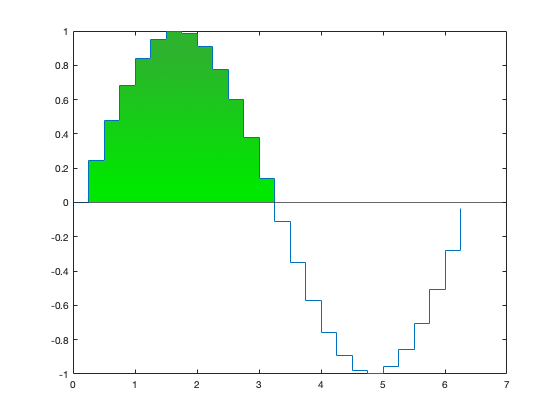
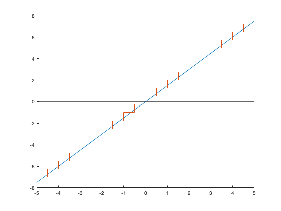
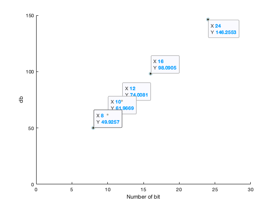

# Введение

Если открыть спецификацию на любой rtl-sdr приемник, то можно увидеть следующую характеристику: АЦП - 8 бит. Почему эта характеристика важна? Почему о ней пишут и что она значит? Я решил разобраться и провёл небольшое расследование.

# SQNR

АЦП преобразует сигнал из аналогового вида в цифровой. Это преобразование по своей сути всегда неточное. Дело в том, что аналоговый сигнал непрерывный, а цифровой - набор отсчетов. Процесс преобразования сигнала называется квантированием. При этом часть информации теряется, а значит, в терминах обработки сигнала появляется шум. Этот шум называется шумом квантования. Обычно правда используют другой параметр - отношение сигнала к шуму квантирования (SQNR).

$$
SQNR = 20\log\_{10}(\dfrac{V\_{rms}}{V\_{e}})
$$

где \\(V\_{rms}\\) - это средне квадратичное сигнала (синусоиды),
\\(V\_{e}\\) - это средне квадратичное ошибки квантирования.

В общем случае среднее квадратичное (RMS) это:

$$
V\_{rms} = {\sqrt{{\dfrac{V\_1^2 + V\_2^2 ... V\_N^2 }{N}}}}
$$

Средне-квадратичные синусоиды лучше представить графически:

Поскольку верхняя часть равна нижней, то значение RMS не зависит от того, как много половинок проинтегрировано. Поэтому достаточно проинтегрировать только зеленую часть. RMS синусоиды вычисляются следующим образом:

$$
V\_{rms} = {\sqrt{\dfrac{1}{T}\int\_{0}^{T}x^2(t)dt}}
$$

Где \\(x^2(t)\\) - это уравнение синусоиды. 

Уравнение в данном случае лучше записать в следующем виде:

$$
\begin{align}
x(t) = x\_{peak}sin(t\dfrac{2\pi}{T}), \newline
V\_{rms} = {\sqrt{\dfrac{x\_{peak}^2}{T}\int\_{0}^{T}\dfrac{1}{2}(1-cos(2\dfrac{2\pi}{T}t)dt}} \newline
= {\sqrt{\dfrac{x\_{peak}^2}{2T}(T - sin(\dfrac{4\pi}{T}t)\dfrac{T}{4\pi}\Big|_0^T)}} \newline
= {\sqrt{\dfrac{x\_{peak}^2}{2T}(T - \dfrac{T}{4\pi}(sin(4\pi) - sin(0))}} \newline
= \dfrac{x\_{peak}}{\sqrt{2}}
\end{align}
$$

Теперь нужно найти \\(x\_{peak}\\). Его можно выразить следующим образом:

$$
x\_{peak} = \dfrac{q2^n}{2}
$$

Где n - это количество битов АЦП, q - разница уровня между двумя соседними битами. Если подставить в формулу, то получится следующее:

$$
V\_{rms} = \dfrac{q2^n}{2\sqrt{2}}
$$

Теперь необходимо найти \\(V\_{e}\\). Как доказал [Bennett](http://oldweb.mit.bme.hu/books/quantization/papers/Bennett.pdf), ошибка описывается пилообразной волной. Она получается из следующего графика:

Где синий график - это аналоговый сигнал, а красный - это цифровой.

Если вычесть один из другого, то как раз получится пилообразная волна:

Этот график описывается формулой:

$$
e(t) = st, \dfrac{-q}{2s} < t < \dfrac{q}{2s}
$$

Для линейного графика RMS будет выглядеть следующим образом:

$$
\begin{align}
V\_{e} = \sqrt{\dfrac{s}{q}\int\_{-q/2s}^{q/2s}(st)^2dt} \newline
= \dfrac{q}{\sqrt{12}}
\end{align}
$$

Теперь если подставить все значения в формулу:

$$
\begin{align}
SQNR = 20\log\_{10}(\dfrac{V\_{rms}}{V\_{e}}) \newline
= 20\log\_{10}(\dfrac{q2^n / 2\sqrt{2}}{q / \sqrt{12}}) \newline
= 20\log\_{10}(2^n\sqrt{\dfrac{3}{2}})
\end{align}
$$

После этого можно построить график зависимости SQNR от числа битов:

# Выводы

Из этого графика можно сделать интересные выводы. Например, динамический диапазон rtl-sdr не может быть больше 50db. Это очень важно применительно к измерению качества фильтров. Например, большинство FM фильтров имеют коэффициент ослабления около 60db. А это значит что с помощью rtl-sdr нельзя будет измерить такие фильтры.

