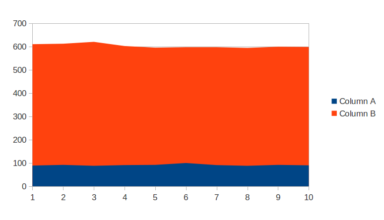

Есть такая задача: отфильтровать строки в множестве файлов. Вариантов решения я вижу несколько:

  * ReplaceAll. String.replaceAll("pattern","$1" + 1);
  * Pattern. Pattern p = Pattern.compile("pattern"); and etc.
  * Ручной способ через indexOf и substring
  
Первый способ можно сразу отбросить так как он медленный: на каждый файл будет компилироваться pattern. На следующих двух можно остановиться поподробнее.

У меня было чувство, что ручной способ всегда быстрее, хоть и немного дольше в реализации. Я написал небольшой тест, чтобы проверить насколько быстрее. Результат графически изображён ниже:

Тест запускал фильтрацию одного и того же файла 10к раз. Размер файла - 4286 символов. Время выполнения абсолютное и указано в миллисекундах.

Столбец А: время выполнения фильтрации с помощью ручного способа

Столбец В: время выполнения фильтрации с помощью pattern'а

**Вывод 1**: ручная фильтрация на порядок быстрее фильтрации с помощью pattern. Если не нужно производить более сложных подстановок, то ручной способ значительно лучше. 

**Вывод 2**: при линейном увеличении размера файла, время фильтрации возрастает линейно для обоих способов.