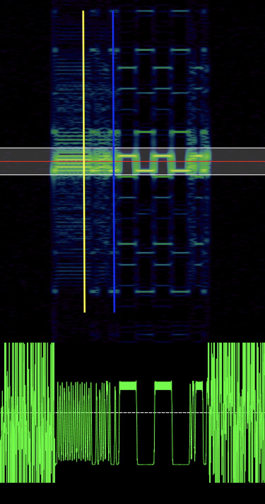

RSSI (received signal strength indicator) - это показатель уровня принимаемого сигнала. Для простоты - это те самые деления Вашего телефона, которые показывают уровень сигнала сети. Чем меньше, тем хуже и медленнее передаются данные. Этот показатель рассчитывается почти в каждом приёмнике и чипы sx127x не исключение. Но, так же как и во всех других приёмниках, этот показатель рассчитывается очень приближённо, и есть ненулевая вероятность получить совершенно случайные значения.

RSSI измеряется как логарифм отношения мощности принимаемого сигнала к 1мВт. При этом 0dBm - это идеальный уровень сигнала, а, примерно, -100dBm - это самый плохой уровень сигнала. На практике, RSSI может зависить от всего:

 * от калибровки на заводе
 * от периодической внутренней калибровки чипа
 * от производителя
 * от температуры
 * от антенны
 * от окружающей среды
 * от драйвера

Обычно весь поддерживаемый интервал разделяют на 3-4 больших участка и крупными мазками говорят, что от -85 до -70 уровень сигнала хороший.

Чипы серии sx127x могут принимать сигналы от -127dBm до 0dBm. Но эти цифры, скорее всего, получены в лаборатории и принять сигнал с RSSI -126dBm на практике вряд ли удастся.

Тем не менее, неплохо было бы хоть как-то сравнивать разные сигналы, и поэтому [мой драйвер для работы с sx127x](https://github.com/dernasherbrezon/sx127x) позволяет получить RSSI.

В документации к чипу и в стандарте IEEE 802.11 его рекомендуется измерять во время получении преамбулы. На скриншоте внизу примерное время отмечено вертикальной жёлтой линией:

Чип sx127x позволяет отловить это время. Для этого он генерирует прерывание PreambleDetect, которое можно обработать на пине DIO4. Однако, в [TTGO lora32 v2.1](https://www.lilygo.cc/products/lora3) и [Heltec lora32 v2](https://heltec.org/project/wifi-lora-32-v3/) пин DIO4 не подключён, вместо этого мой код пытается отловить прерывание SyncAddress, которое приходит на пин DIO2. На скриншоте вверху - это вертикальная синяя линия.

Чтобы хоть как-то сравнить результаты между собой, я сделал несколько замеров для разных прерываний и получил следующий график:



В этом графике прекрасно буквально всё. 

Во-первых, если измерять RSSI сразу же после получения пакета (прерывание PayloadReady), то значения будут сильно скакать от -90dBm до -50dBm. Нижняя граница - это уровень шума приёмника, сообщение уже было получено и, конечно же, уровень сигнала минимальный. Но если сразу же идёт следующее сообщение, то уровень будет -50dBm. Именно поэтому измерять RSSI после приёма пакета - неправильно.

Во-вторых, разница между PreambleDetect и SyncAddress объясняется тем, что PreambleDetect был получен совсем другой антенной, другим LoRa чипом и вообще с помощью Raspberry PI! Видимо, его антенна лучше резонирует на частоте 437Мгц и показывает более высокий уровень.

В-третьих, Raspberry PI, и Linux в частности, не успевают обрабатывать прерывания! Из-за этого уровень PreambleDetect может сэмплироваться в момент приёма самого сообщения, а не в момент получения преамбулы.

Однако в целом я доволен своей реализацией:

 * Уровень сигнала стабильный на протяжении многих тестов
 * Не зависит от длины сообщения
 * И не зависит от данных внутри сообщения
