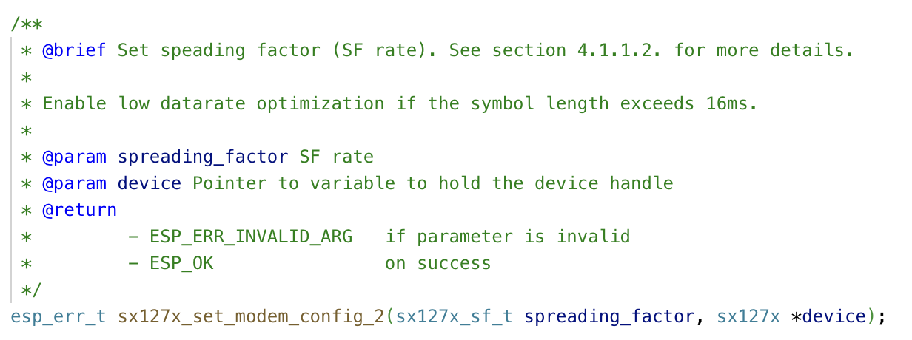

Один из фундаментальных вопросов, на который каждый программист должен периодически отвечать - "стоит ли взять готовую библиотеку или написать свою?". Однозначно ответить на этот вопрос раз и навсегда не получится. Надо каждый раз садится и разбираться в каждом конкретном случае. Вот и мне недавно выпал этот случай.

В [прошлом посте]() я писал как уменьшил потребление тока LoRa до 16мА. Однако, для этого мне пришлось модифицировать уже существующую библиотеку [arduino-LoRa](https://github.com/sandeepmistry/arduino-LoRa). Для того, чтобы провести эксперимент и проверить теорию, этого вполне достаточно, но для полноценного инженерного решения нужно что-то более основательное.

И тут возникает тот самый вопрос: стоит ли взять готовую библиотеку или написать свою? 

## Существующие библиотеки

Я проверил: [arduino-LoRa](https://github.com/sandeepmistry/arduino-LoRa), [RadioLib](https://github.com/jgromes/RadioLib), [sx127x by fifteenhex](https://github.com/fifteenhex/sx127x), [sx127x by morransmith](https://github.com/morransmith/sx127x), [esp32-lora-library](https://github.com/Inteform/esp32-lora-library), [esp-idf-sx127x](https://github.com/nopnop2002/esp-idf-sx127x) и оказалось, что ни одна из них не удовлетворяет моим требованиям! Все они подразумевают, что в начале работы с модулем, его нужно перевести в режим сна и обратно в режим ожидания. Это сбросит все данные, которые до этого лежали в FIFO буфере. Но при загрузке из режима глубокого сна этот буфер содержит принятое сообщение! Прежде, чем бросаться писать свою собственную библиотеку я мог бы сделать pull request с тем, что мне нужно. Но и тут я не уверен в результате: моё изменение слишком низкоуровневое и противоречит концепции многих библиотек.

Вообще просмотрев существующие библиотеки для arduino и ESP32, мне показалось, что их написали любители, которые плохо разбираются в программировании. Взять, например, [arduino-LoRa](https://github.com/sandeepmistry/arduino-LoRa). Библиотека, в которой нет ни одной строчки комментария, имеет 1300+ звёзд на Github и де-факто является стандартной библиотекой для работы с LoRa. Помимо этого, в ней смешана инициализация SPI, работа с отдельными пинами и, собственно, логика управления чипом sx127x. Удивительно, но только один метод из более чем 30, возвращает код ошибки. Остальные возвращают void.

В этом плане [RadioLib](https://github.com/jgromes/RadioLib) написана чуть лучше. В ней есть отдельная сущность Module, которая абстрагирует работу с SPI. Однако, делает это не до конца.

```c++
int16_t SX127x::begin(uint8_t chipVersion, uint8_t syncWord, uint16_t preambleLength) {
  // set module properties
  _mod->init(RADIOLIB_USE_SPI);
  Module::pinMode(_mod->getIrq(), INPUT);
  Module::pinMode(_mod->getGpio(), INPUT);
  ...
}
```

Метод ```pinMode``` - не является частью протокола SPI и зачем он был добавлен в ```Module``` остаётся загадкой. Вообще, управление пинами - не является частью спецификации чипа sx127x и, соответственно, не должно быть внутри библиотеки.

Помимо этого, RadioLib - крайне запутанная библиотека. Несмотря на то, что есть физическая абстракция SPI интерфейса под названием ```Module```, в ней так же есть отдельная сущность ```PhysicalLayer```. Вся эта иерархия классов в RadioLib явно переусложнена. Например, вот так выглядит наследование:

```
PhysicalLayer -> SX127x -> SX1278 -> SX1276
```

Из этого следует, что при инициализации нужно знать модель чипа и в зависимости от неё создавать класс SX1278 или SX1276.

Всего этого оказалось достаточно, чтобы начать разрабатывать свою библиотеку. И не зря, ибо вскрылось множество откровенно странных вещей во многих реализациях.

## sx127x

Если честно, то я не сразу придумал название библиотеки, зато с самого начала знал, как она должна работать:

 * Библиотека должна переводить документацию на чип в C код. Она не должна строить никаких предположений о том, как её будут использовать и в каком порядке вызывать методы. При таком подходе работа с ней будет чуть более многословной, зато функции можно будет комбинировать как нужно и вызывать хоть из отдельных потоков, хоть из тасков. В моём случае я смогу инициализировать доступ к чипу не перетирая данные при выходе из глубокого сна.
 * Библиотека должны быть написана на С и быть документированной. Желательно с отсылками в документацию на чип. Из С++ вызвать С не проблема, а вот из С вызывать С++ очень сложно. Да и С мне нравится больше.
 * Библиотека не должна зависить от других библиотек. SPI интерфейс есть в стандартной библиотеке ESP, а это единственное, что должно быть нужно.

В результате у меня всё получилось:

[https://github.com/dernasherbrezon/sx127x](https://github.com/dernasherbrezon/sx127x)

## Детали реализации

Когда я только начал работать над библиотекой, я лишь в общих чертах представлял работу чипа. Если вкратце, то нужно инициализировать SPI устройство и через SPI установить нужные регистры. Этих регистров очень много и в зависимости от режима работы (LoRa или FSK) одни и те же регистры значат разное. Однако, по мере работы над библиотекой и чтением документации я узнавал всё больше и всё больше удивлялся насколько стандартные библиотеки непродуманы.

### Header mode

Оказывается, в протоколе LoRa есть такое понятие как "явный заголовок" и "неявный заголовок". "Явный заголовок" - это режим работы, при котором в каждое сообщение отправляемое в сеть добавляется заголовок. Приёмник в свою очередь получает такой заголовок и понимает параметры сообщения:

 * длина сообщения
 * используется контрольная сумма или нет
 * параметры для FEC декодирования



Получается на приёмнике эти параметры конфигурировать не надо!

В режиме неявного заголовка он не передаётся и подразумевается, что передатчик и приёмник заранее довогорились о параметрах и передавать их не нужно. Зачем же нужен такой режим? Ну во-первых, для того, чтобы быстрее передать сообщение. В некоторых странах есть ограничение на время в течении которого можно передавать сигнал в ISM band (частоты на которых обычно работает LoRa). Чем быстрее сообщение передастся, тем больше данных можно передать за единицу времени. Во-вторых, передавая быстро сообщение, можно экономить энергию.

В sx127x сделана явная поддержка обоих режимов:

```c
/**
 * @brief Set implicit header.
 *
 * sx127x can send packets for explicit header or without it (implicit). In implicit mode receiver should be configured with pre-defined values using this function.
 * In explicit mode, all information is sent in the header. Thus no configuration needed.
 *
 * @param header Pre-defined packet information. If NULL, then assume explicit header in RX mode. For TX explicit mode please use sx127x_set_tx_explcit_header function.
 * @param device Pointer to variable to hold the device handle
 * @return
 *         - ESP_ERR_INVALID_ARG   if parameter is invalid
 *         - ESP_OK                on success
 */
esp_err_t sx127x_set_implicit_header(sx127x_implicit_header_t *header, sx127x *device);
```

### TX power

В LoRa чипах конфигурирование мощности передатчика достаточно запутанное. В чипе есть два пина, к которым может подключаться антенна:

 * RFO
 * PA_BOOST



Через RFO можно добится усиление мощности в 15dbm, а через PA_BOOST - 20dbm. При этом в официальной документации рекомендуют ограничивать максимальное потребление тока для разного уровня усиления. Я долго пытался понять зачем это нужно и придумал следующее объяснение. Усилитель мощности потребляет ток, чтобы входящий сигнал увеличить в Х раз. Мощность исходящего сигнала зависит не только от тока и напряжения, но и от сопротивления. Теперь можно представить ситуацию при которой антенна, импеданс которой 50 Ом, заржавела. Или контакт между антенной и чипом заржавел. Или подключили антенну на 75 Ом. Тогда, для того, чтобы получить те же самые 20dbm при том же напряжении 3.3В нужно подать гораздо больший ток. Если потребление тока не ограничивать, то вся система станет потреблять больше энергии в лучшем случае. А в худшем, чип или контакты могут перегореть. В библиотеке sx127x при конфигурировании мощности усилителя одновременно ограничивается максимальное потребление тока. Тем не менее потребление тока можно переопределить с помощью специального метода:

```c
/**
 * @brief Configure overload current protection (OCP) for PA.
 *
 * @param onoff Enable or disable OCP
 * @param milliamps Maximum current in milliamps
 * @param device Pointer to variable to hold the device handle
 * @return
 *         - ESP_ERR_INVALID_ARG   if parameter is invalid
 *         - ESP_OK                on success
 */
esp_err_t sx127x_set_ocp(sx127x_ocp_t onoff, uint8_t milliamps, sx127x *device);
```

### Обработка прерываний

Обработка прерываний, как оказалось, одна из самых сложных концепций, которая реализована из рук вон плохо исключительно во всех библиотеках. Кроме sx127x. LoRa чип очень активно использует прерывания. Когда чип получает сообщение, то генерируется прерывание. Когда сообщение отправлено, то тоже генерируется прерывание. Когда frequency hopping требует переключения частоты, то тоже генерируется прерывание. Вообще в LoRa чипах около 12-ти типов прерываний. Для того, чтобы получать эти прерывания, отдельные пины чипа должны быть подключены в процессору.

В большинстве библиотек механизм прерываний спрятан внутри библиотеки. Это крайне плохой дизайн по нескольким причинам:

 * Нет способа обрабатывать прерывания асинхронно с помощью тасков FreeRTOS. Обычно реализация выглядит так:
 
```c++
start = Module::micros();
while(!Module::digitalRead(_mod->getIrq())) {
  Module::yield();
  if(Module::micros() - start > timeout) {
    clearIRQFlags();
    return(ERR_TX_TIMEOUT);
  }
}
```

SPI шина постоянно загружена поллингом, процессор работает на максимальной скорости и потребляет энергию, все остальные задачи заблокированы. В коде выше по сути даже и не обрабатывается прерывание, а просто читается регистр, чтобы понять завершилась ли передача данных.

 * Получается сильно связанный код между логикой работы чипа и обработкой прерываний в конкретном фреймворке. Причём в arduino-LoRa callback функция вызывается в ISR. Если функция будет долго работать или выводить в Serial, то приложение упадёт.
 
В sx127x я решил убрать любое упоминание прерываний, ISR и задач FreeRTOS. Для того, чтобы сконфигурировать прерывание от чипа библиотека не нужна. Достаточно написать:

```c
ESP_ERROR_CHECK(gpio_isr_handler_add((gpio_num_t)DIO0, handle_interrupt_fromisr, (void *)device));
```

Как будет реализован обработчик прерывания должно решать преложение. Это может быть тот же самый бесконечный цикл. Или отдельный таск в FreeRTOS. Или что-нибудь ещё. Главное, чтобы в этом цикле вызывалась функция ```sx127x_handle_interrupt``` - именно она обработает регистр прерываний, поймёт какое именно прерывание произошло и вызовет соответствующий callback.

### Обработка ошибок

Отправка или получение данных через SPI может закончится ошибкой. Это либо таймаут, либо неправильный аргумент при формировании сообщения, либо что-то ещё. При работе с LoRa чипом почти каждый метод - это отправка и получение небольших сообщений через SPI. Вот и получается, что каждый метод в теории может вернуть ошибку.

Поскольку моя библиотека написана на С, то я решил ничего не придумывать, а сделать общепризнанную обработку ошибок через возвращаемые коды. Именно поэтому почти каждая функция возвращает значение ```esp_err_t```. А если функция должна вернуть значение, то оно возвращается через параметр-указатель.

Как это не приходится признавать, но обработка ошибок всегда увеличивает размер кода и уменьшает читаемость. Единственное, что тут можно сделать - это попытаться смягчить боль. Например, делать обработку ошибок единообразной.

```c
esp_err_t code = sx127x_set_bandwidth(bw, device);
if (code != ESP_OK) {
  return code;
}
code = sx127x_set_implicit_header(NULL, device);
if (code != ESP_OK) {
  return code;
}
```

### Документация

Я заметил одну странную особенность: написание документации способствует написанию лучшего кода. Именно во время написания документации ко всем функциям я начал понимать, где функция лишняя, где наоборот нужно добавить параметров, где нет единообразия, а где нужно всё переделать. Оказалось это упраженение помогает взглянуть на проект издалека и понять, что можно улучшить.

Я прочитал много кода из стандартной библиотеки ESP и считаю, что она имеет очень хорошую документацию. А поскольку моя библиотека поддерживается только ESP, то было вполне логично оформить документацию в том же стиле.



### Дистрибуция

Библиотека, которую сложно подключить, никому не нужна. Именно поэтому стоит задуматься и над тем, как другие разработчики будут её использовать.

С этим у меня возникли определённые сложности. Дело в том, что до этого я имел дело только с PlatformIO. А там библиотека для ESP могла легко зависить от Arduino API. В теории с этим нет проблем, так как espressif выпустил слой совместимости между ESP и Arduino, но всё это выглядит неаккуратно.

В итоге я переписал библиотеку следующим образом:

 * она не зависит от Arduino API
 * примеры использования зависят только от ESP API
 * структура кода соответствует [ESP component](https://docs.espressif.com/projects/esp-idf/en/latest/esp32/api-guides/build-system.html#example-project)

В итоге её можно использовать либо как компонент в esp-idf, либо как обычную библиотеку из PlatformIO registry:

[https://registry.platformio.org/libraries/dernasherbrezon/sx127x](https://registry.platformio.org/libraries/dernasherbrezon/sx127x)

## Планы

Удивительно, но факт: после всей той работы, что я проделал, библиотеку есть куда улучшать.

Во-первых, можно добавить поддержку FSK и OOK модуляций. Правда, они значительно усложняют работу с чипом. Я пока не придумал как на уровне API сделать удобной работу в разных режимах.

Во-вторых, можно добавить поддержку других типов прерываний. У меня есть только платы TTGO и Heltec, поэтому я могу протестировать только прерывания на пине DIO0, но если купить отдельный модуль, то можно использовать все пины и все типы прерываний. Вот будет потеха.

В-третьих, можно абстрагировать работу с SPI в отдельный файл. Это позволит использовать библиотеку и с RaspberryPI, и с Arduino, и с любым другим чипом. Для этого нужно было бы всего лишь имплементировать SPI конкретной платформы.
